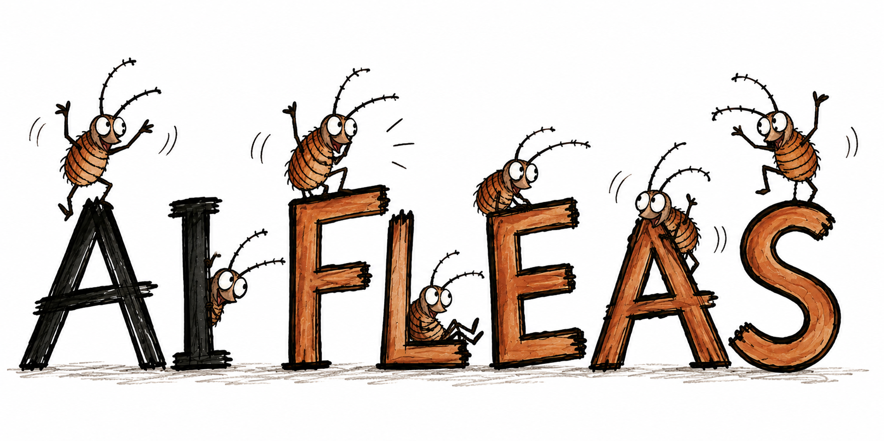

# AI Fleas

  

**A public window into how I am building and using AI systems in real work.**

This collection covers agents, workflows, reusable commands, profiles, local models, governance, automation and experiments. For someone exploring my work, it is a quick way to see the areas of AI engineering I am actively working with rather than just a list of technologies on a profile.

  

### [Why AI Fleas?](notes/2026-09-04-why-ai-fleas.md)

There is a story behind the name — and, somehow, whatever the original subject is, the conversation eventually gets back to AI.

## What is inside

The project brings together the pieces I use to think about and organize AI-assisted work. The diagram below gives the high-level picture before getting into the individual commands, workflows, roles and runtime concepts.

### For people who already build this stuff

**This is not another AI agent framework.** Agents, tools, workflows, MCP and many of the individual ideas here already exist in excellent systems, and that is expected.

What is public here is a deliberately selected **slice of a larger working system**: reusable patterns, architectural decisions, rules, commands, workflows, experiments, benchmarks and some of the reasoning behind them. It is the visible tip rather than the complete implementation.

**Do I actually use this? Yes.** The public material is derived from patterns and pieces I use in my private working environment. The private version has the additional runtime, UI, launcher integration, project-specific configuration, memory, local-model workers, integrations and other bells and whistles needed for day-to-day use.

The purpose of this repository is therefore not to claim that every building block is new. It is to make some of the work and thinking visible, provide useful pieces where they can stand on their own, and create a concrete starting point for conversations, collaboration and new opportunities.

## Public collection

The main repository contains **AI Commands** and **AI Workflows** directly. **AI Profile** remains a separate example repository because profiles are configuration rather than part of the reusable command/workflow implementation.

This repository also contains shared reference material that does not belong to one implementation project, including **[local model and hardware benchmarks](benchmarks/local-models/README.md)**.

## AI Workflow Suite vocabulary

These are the main building blocks used across the public collection.

| Term | Simple meaning | Reference |
| --- | --- | --- |
| **Command** | A reusable executable AI capability with a defined contract, inputs and outputs. | [AI Commands](ai-commands/) |
| **Workflow** | A reusable process for a kind of work. It defines roles, rules, collaboration and capabilities. | [AI Workflows](ai-workflows/) |
| **Flow / route** | The path work follows inside a workflow. | [AI Workflows](ai-workflows/) |
| **Role** | A reusable behavioral contract describing responsibilities, boundaries and lifecycle. | [Common roles](ai-workflows/_common/roles/) |
| **Agent** | A runtime participant that realizes a role with concrete configuration and identity. | [AI Workflows](ai-workflows/) |
| **Profile** | Personal or organization-specific configuration that activates workflows and supplies runtime policy. | [AI Profile](https://github.com/starodubtsevconsulting/ai-profile) |
| **Provider** | A concrete implementation behind a generic capability. | [AI Commands](ai-commands/) |

A useful mental model is:

`Profile -> Workflow -> Agents/Roles -> Flow -> Commands -> Providers -> Result`

## AI vocabulary

| Term | Simple meaning |
| --- | --- |
| **Agent** | A running AI participant with a model, context, rules and capabilities. |
| **Roster** | The current list of active agent instances. |
| **Harness** | Runtime machinery around a model: agent loop, sessions, tools, files, terminal, plugins, sub-agents, computer use, etc. |
| **Token** | A small piece of text a language model reads or produces. |
| **Context** | Information currently supplied to the model for a request/session. |
| **Context window** | Maximum amount of tokenized context a model can work with at once. |
| **Prompt** | An instruction or request given to the model. |
| **Tool / tool call** | A capability an agent can invoke outside its generated text. |
| **Memory** | Information preserved so it can be retrieved beyond immediate context. |
| **MCP** | Model Context Protocol: a common interface for exposing tools/resources to AI applications. |
| **Model** | The trained neural network doing language/reasoning work. |
| **Inference** | Running a trained model to process input and generate an answer/action. |
| **Quantization** | Storing model parameters with fewer bits so the model needs less memory. |

### Common harnesses

| Harness | What it is |
| --- | --- |
| Codex | OpenAI agent/coding environment |
| Claude Code | Anthropic agentic coding environment |
| Pi | Extensible agent harness / coding-agent toolkit |
| Hermes Agent | General-purpose extensible agent from Nous Research |

## Projects

### [AI Commands](ai-commands/)

Pluggable executable skills that combine AI-readable Markdown contracts with optional scripts, supporting code, configuration boundaries, reports, and command-owned visual tools.

### [AI Workflows](ai-workflows/)

Reusable business and work processes that coordinate commands and define the agent roles, rules, and collaboration needed to complete a workflow.

### [AI Profile](https://github.com/starodubtsevconsulting/ai-profile)

A sanitized example of personal or organization-specific context that activates workflows, configures commands, binds projects and supplies runtime preferences.

## Current status

AI Commands and AI Workflows live in this monorepo. AI Profile remains separate. Additional pieces are published when suitable for public use.