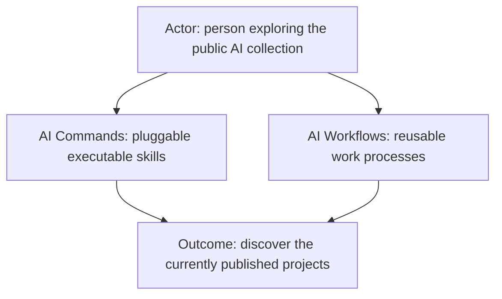
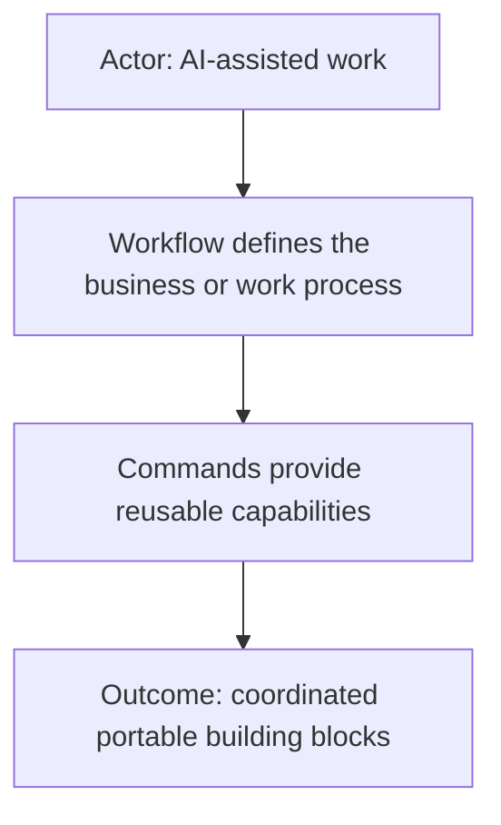
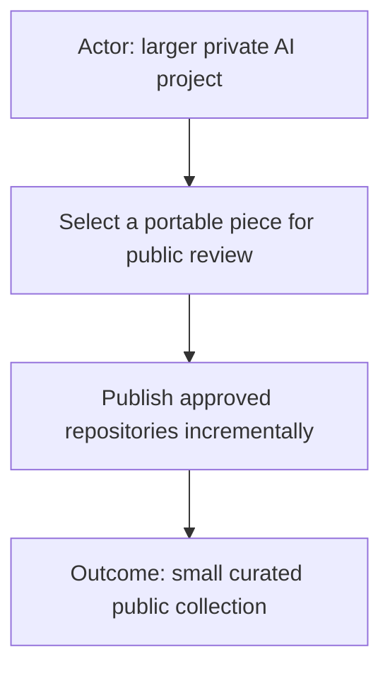

# AI

Public entry point for reusable AI-assisted work projects from Starodubtsev
Consulting.

## Repositories

### [AI Commands](https://github.com/starodubtsevconsulting/ai-commands)

Pluggable executable skills that combine AI-readable Markdown contracts with
optional scripts, supporting code, configuration boundaries, reports, and
command-owned visual tools.

### [AI Workflows](https://github.com/starodubtsevconsulting/ai-workflows)

The future public catalog for reusable business and work processes that
coordinate commands. It is currently a README-only TODO placeholder.

## Current status

Only the repositories listed above are currently published as part of this
collection. Additional commands, workflows, profiles, runtimes, and integrations
remain outside the public collection unless they receive a separate explicit
review.
