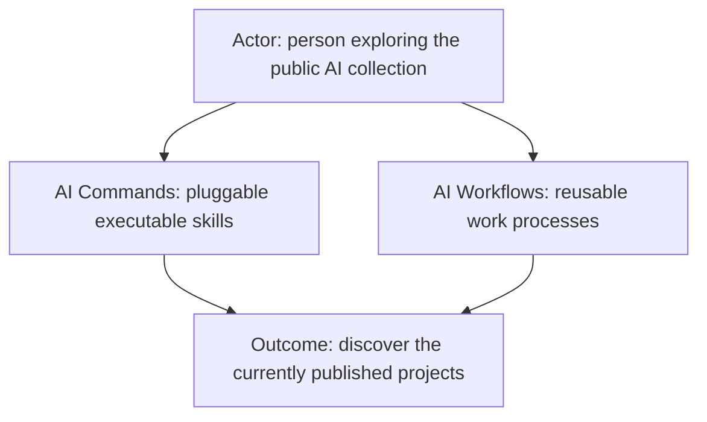
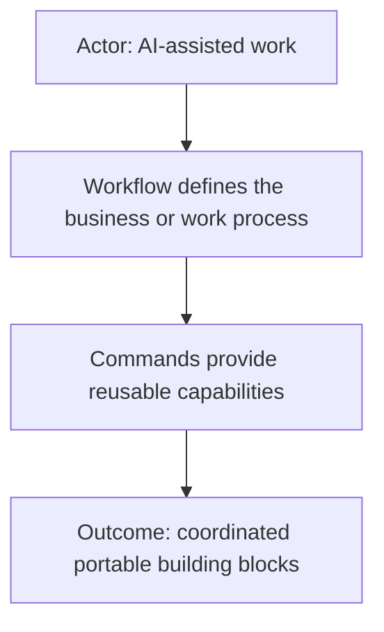
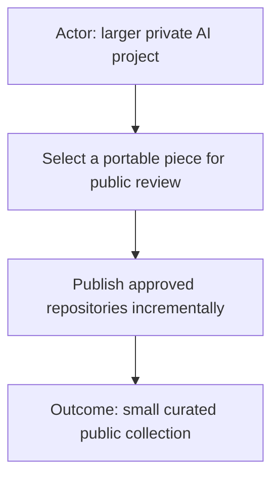

# AI

This is the umbrella repository for useful public pieces of the **AI Workflow Suite** and related AI work from Starodubtsev Consulting. The projects are kept in separate repositories so each piece can evolve and be used independently, while this repository provides a simple entry point to understand how they fit together.

The public collection currently includes **AI Commands** and **AI Workflows**, with additional useful pieces published as they become ready. Feel free to explore, contribute, or ask questions.

This umbrella repository also contains shared AI reference material that does not belong to one specific implementation project, including **[local model and hardware benchmarks](benchmarks/local-models/README.md)**.

Public entry point for reusable AI-assisted work projects from Starodubtsev
Consulting.

## Repositories

### [AI Commands](https://github.com/starodubtsevconsulting/ai-commands)

Pluggable executable skills that combine AI-readable Markdown contracts with
optional scripts, supporting code, configuration boundaries, reports, and
command-owned visual tools.

### [AI Workflows](https://github.com/starodubtsevconsulting/ai-workflows)

The future public catalog for reusable business and work processes that
coordinate commands. It is currently a README-only TODO placeholder.

## Current status

Only the repositories listed above are currently published as part of this
collection. Additional commands, workflows, profiles, runtimes, and integrations
remain outside the public collection unless they receive a separate explicit
review.
