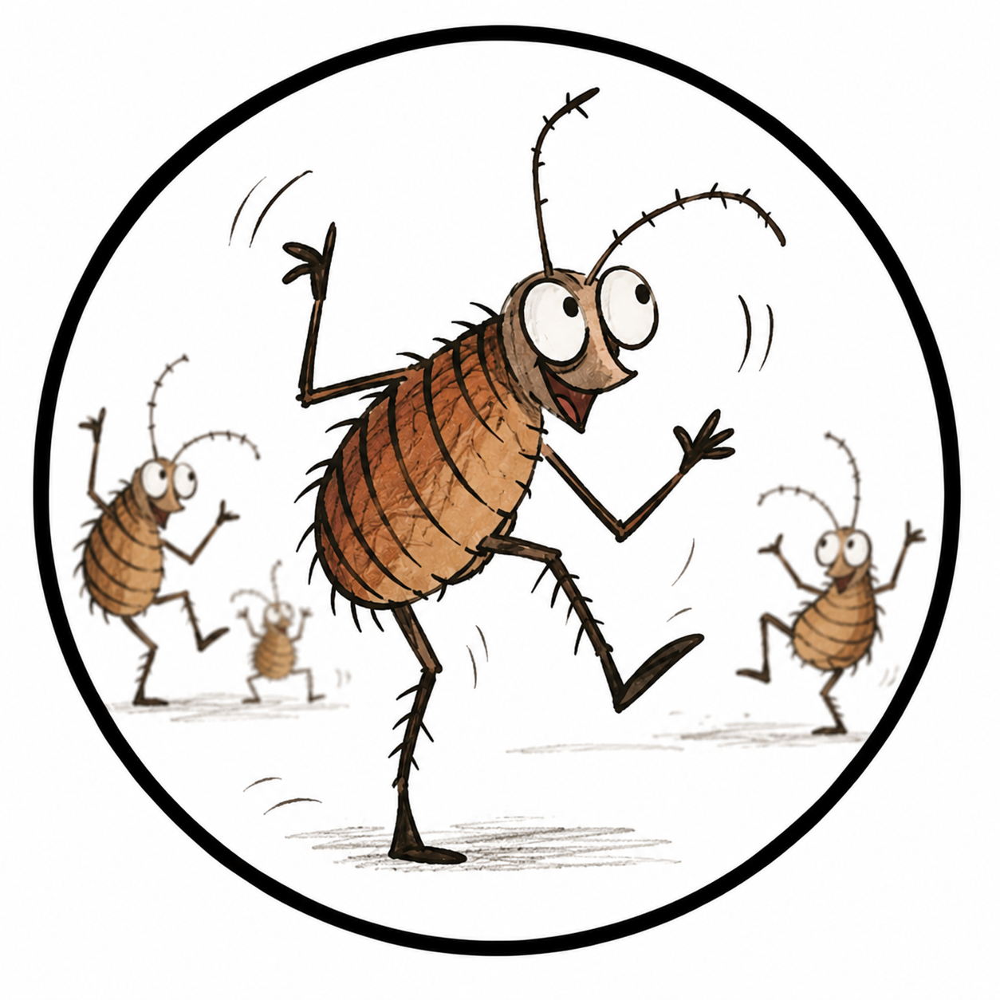
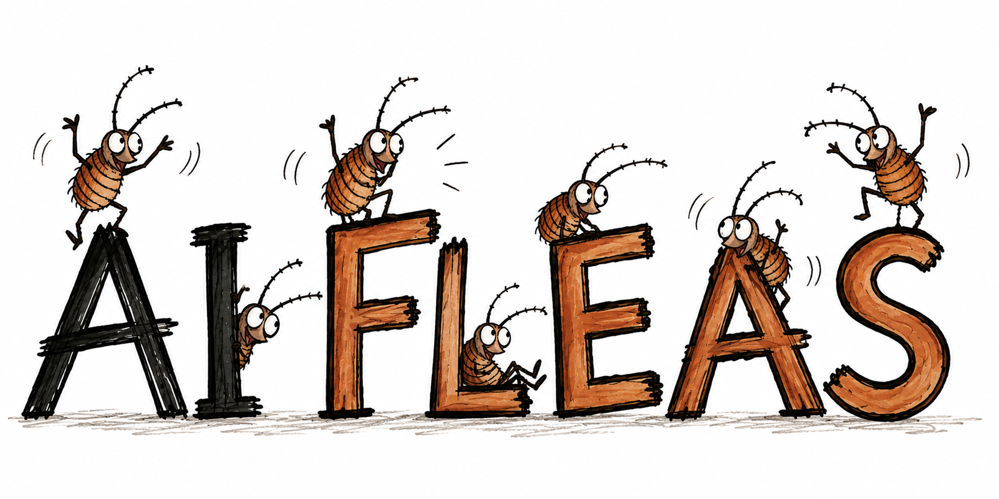
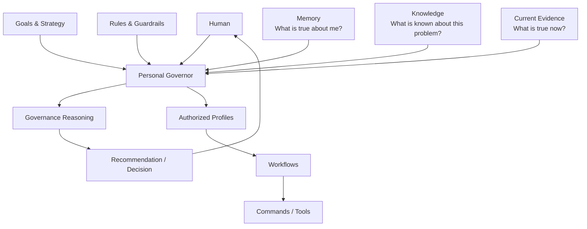
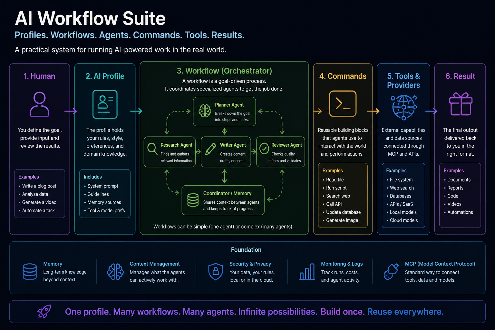

# AI Fleas

  

## Why AI Fleas?

I remembered an old anecdote about a student preparing for a zoology exam. He had learned only one subject well: **fleas**.

Asked about a dog, he quickly got to its fur — and then to fleas. Asked about another animal, somehow the answer again ended up with fleas. Even when asked about a fish, he found a way back to fleas.

It feels a little like conversations today. It doesn't seem to matter much what people do — software, sales, art, finance, education. Sooner or later, somehow, everyone starts talking about AI.

**AI has become our fleas.**

Some may also hear **AI Fleas** as **AI fleets** — many AIs working together. That fits rather well too. [The original note about the name.](notes/2026-09-04-why-ai-fleas.md)

  

## What is inside

AI Fleas separates persistent governance from the workflows and capabilities that perform work:

- **[Personal Governor](ai-workflows/_common/roles/personal-governor.md)** — persistent human-scoped governance across goals, rules, memory, knowledge, current evidence, profiles, workflows and capacity. It decides what deserves attention and keeps work aligned over time; it is not another workflow.
- **[Profile](https://github.com/starodubtsevconsulting/ai-profile)** — the context/configuration boundary for a person, organization or client. A governed human may participate in several profiles.
- **[Workflows](ai-workflows/)** — reusable ways of doing a kind of work, including roles, operating rules and collaboration.
- **[Commands](ai-commands/)** — bounded reusable executable capabilities that workflows can call.

Roles, agents, models and platform adapters realize these concepts at runtime. The portable definitions can be adapted to ChatGPT/Codex, Claude Code, Hermes, local models and other harnesses.

### Personal Governor

The Personal Governor is the continuity layer above individual workflows. It combines human-owned direction with durable context, external knowledge and current evidence before making governance recommendations.

```mermaid
flowchart TD
    U[Human] --> G[Personal Governor]
    Goals[Goals & Strategy] --> G
    Rules[Rules & Guardrails] --> G
    Memory[Memory<br/>What is true about me?] --> G
    Knowledge[Knowledge<br/>What is known about this problem?] --> G
    Evidence[Current Evidence<br/>What is true now?] --> G
    G --> Reasoning[Governance Reasoning]
    Reasoning --> Decision[Recommendation / Decision]
    Decision --> U
    G --> Profiles[Authorized Profiles]
    Profiles --> Workflows[Workflows]
    Workflows --> Commands[Commands / Tools]
```

`Goals + Rules + Memory + Knowledge + Current Evidence → Reasoning → Governance`

**Memory and Knowledge are deliberately different.** Memory preserves personal/project history and decisions; Knowledge supplies curated external expertise. The public contract does not require a particular database, retrieval engine or AI platform.

The existing workflow-suite diagram remains useful for the execution layer:

## How it can be useful

The main idea is to keep **your way of working separate from the AI platform that happens to run it**.

A workflow might be software development, internal financial insight, running a YouTube channel, writing a book, blogging, multimedia work, or something entirely your own. You can reuse and extend the public definitions while keeping your profile, projects and private context to yourself.

Platforms will come and go. You may use ChatGPT today, Claude tomorrow, Hermes or a local model for another task. Your **profiles, workflows, commands and way of working can remain yours**. That portability is one of the main reasons for this project.

## How do I start?

### Start with ChatGPT/Codex on macOS

Open the cloned repository, Control-click **`Install AI Fleas.command`**, and choose **Open**.

That installs AI Fleas GPT and adds **AI Fleas GPT** to your Dock. Afterward, clicking that launcher is the easiest way
to start AI Fleas on the GPT/Codex platform. It asks for the exact human profile ID in a macOS dialog, prefilled
from an existing receipt when available. It opens that human's verified Personal Governor; if none is ready, it
tries to initialize one in a fresh projectless task. If that exact ID does not yet exist, it creates a minimal private human
profile with local Markdown memory and no workflow access before initializing the Governor. It never reopens an
archived Governor or creates a second active one.

On first use, the GPT adapter stores a new human profile in a private directory under the user's home folder.
An explicit location override is optional; see the [GPT Agents guide](platforms/gpt-agents/).

See the [GPT Agents guide](platforms/gpt-agents/) for Personal Governor setup and terminal commands.

### Configure your AI team

After the platform is running, add the context and workflow you want it to use:

1. **Create a [Profile](https://github.com/starodubtsevconsulting/ai-profile).** Start from the example and adapt it to yourself, your organization or a client.
2. **Choose a [Workflow](ai-workflows/).** Pick the kind of work you want to do, or create your own.
3. **Ask it to initialize the workflow for your project.** The AI can use the mappings and rules in these definitions to create the appropriate team for that platform.

`Personal Governor → Profile → Workflow → Roles/Agents → Commands/Tools → Result`

### What happens during initialization?

The selected workflow defines the roles, team structure, rules and Commands needed for the work. Those definitions are mapped onto the concrete Agents supported by your chosen platform and connected to the project configured through your Profile.

AI Fleas deliberately calls its reusable executable capabilities **Commands**. Platforms such as ChatGPT/Codex, Claude Code or Hermes may already have their own concept of **skills**. Keeping the names separate allows AI Fleas Commands and platform-native Skills to be mixed without confusing the two concepts.

For more advanced setups, the same definitions can be adapted to Hermes, locally hosted models or custom runtimes. The harness changes; the Profile, Workflows, Roles, Commands, mappings and operating rules remain the common layer.

### For people who already build this stuff

**This is not another AI agent framework.** Agents, tools, workflows, MCP and many of the individual ideas here already exist in excellent systems, and that is expected.

What is public here is a deliberately selected **slice of a larger working system**: reusable patterns, architectural decisions, rules, commands, workflows, experiments, benchmarks and some of the reasoning behind them. It is the visible tip rather than the complete implementation.

**Do I actually use this? Yes.** What is published here is not a separate demo version. I use these workflows, roles, commands and conventions as an extension of my own proprietary AI platform.

That platform provides the runtime around them: managing agents and workflows, connecting them to my projects and **day-to-day tasks**, coordinating execution, memory, local-model workers, integrations, UI and other operational pieces. AI Fleas contains the reusable and portable layer that can also stand on its own outside that platform.

The public repository is therefore a deliberately selected **slice of a larger working system** rather than the complete implementation. The purpose is not to claim that every building block is new, but to make useful pieces and the thinking behind them visible, reusable and open to experimentation.

## Public collection

The main repository contains **AI Commands** and **AI Workflows** directly. **AI Profile** remains a separate example repository because profiles are configuration rather than part of the reusable command/workflow implementation.

This repository also contains shared reference material that does not belong to one implementation project, including **[local model and hardware benchmarks](notes/benchmarks/local-models/README.md)**. The proposed first-class **[Models](models/README.md)** module describes model education, communication and evidence in a reusable form.

## AI Workflow Suite vocabulary

These are the main building blocks used across the public collection.

| Term | Simple meaning | Reference |
| --- | --- | --- |
| **Personal Governor** | Persistent human-scoped governance across goals, memory, knowledge, evidence, capacity and authorized workflows. | [Governor role](ai-workflows/_common/roles/personal-governor.md) |
| **Knowledge** | Curated external expertise retrieved when materially relevant; distinct from personal/project Memory. | [Governor role](ai-workflows/_common/roles/personal-governor.md) |
| **Command** | A reusable executable AI capability with a defined contract, inputs and outputs. | [AI Commands](ai-commands/) |
| **Workflow** | A reusable process for a kind of work. It defines roles, rules, collaboration and capabilities. | [AI Workflows](ai-workflows/) |
| **Flow / route** | The path work follows inside a workflow. | [AI Workflows](ai-workflows/) |
| **Role** | A reusable behavioral contract describing responsibilities, boundaries and lifecycle. | [Common roles](ai-workflows/_common/roles/) |
| **Agent** | A runtime participant that realizes a role with concrete configuration and identity. | [AI Workflows](ai-workflows/) |
| **Profile** | Personal or organization-specific configuration that activates workflows and supplies runtime policy. | [AI Profile](https://github.com/starodubtsevconsulting/ai-profile) |
| **AI Provider** | An AI/inference service through which an agent accesses a model, such as a remote provider or locally hosted endpoint. | [Workflow agent contract](ai-workflows/dev/agents.yml) |
| **Model** | The learned intelligence available to an agent, independent of the role it performs or the deployment that runs it. | [Models](models/README.md) |
| **Education Profile** | A structured description of the model's conceptual world, communication language, demonstrated capability, limits and unknowns. | [Model education](models/README.md#education-profile) |
| **Deployment** | A concrete model representation plus runtime, context/configuration and hardware. | [Models](models/README.md#model-versus-deployment) |

A useful mental model is:

`Personal Governor -> Profile -> Workflow -> Role -> Agent -> Model -> Deployment -> Commands/Tools -> Result`

## AI vocabulary

| Term | Simple meaning |
| --- | --- |
| **Agent** | A running AI participant with a model, context, rules and capabilities. |
| **Roster** | The current list of active agent instances. |
| **Harness** | Runtime machinery around a model: agent loop, sessions, tools, files, terminal, plugins, sub-agents, computer use, etc. |
| **Token** | A small piece of text a language model reads or produces. |
| **Context** | Information currently supplied to the model for a request/session. |
| **Context window** | Maximum amount of tokenized context a model can work with at once. |
| **Prompt** | An instruction or request given to the model. |
| **Tool / tool call** | A capability an agent can invoke outside its generated text. |
| **Memory** | Information preserved so it can be retrieved beyond immediate context. |
| **MCP** | Model Context Protocol: a common interface for exposing tools/resources to AI applications. |
| **Model** | The trained neural network doing language/reasoning work. |
| **Education** | The conceptual knowledge/language a model was trained toward and has demonstrated in work. |
| **Declared education** | What upstream documentation says the model was designed or trained for. |
| **Observed education / capability** | What controlled work and independent verification show the model can actually do. |
| **Education Profile** | Human- and agent-readable model knowledge used by a delegator to decide what can be said directly and what needs translation. |
| **Education Profile Extraction** | Iterative process that refines a draft model résumé using controlled work, evidence and contradictions; see the [Education Profile Extractor](models/education-profile-extractor/). |
| **Conceptual language** | Vocabulary and abstractions the model can operationalize without additional teaching. |
| **Translation boundary** | Where unfamiliar domain concepts should be translated into the model's conceptual language before delegation. |
| **Domain Context Handoff** | A handoff technique that teaches the smallest relevant unfamiliar domain model before assigning the task. |
| **Deployment** | A particular model representation, runtime, context/configuration and hardware combination. |
| **Inference** | Running a trained model to process input and generate an answer/action. |
| **Quantization** | Storing model parameters with fewer bits so the model needs less memory. |

### Common harnesses

| Harness | What it is |
| --- | --- |
| Codex | OpenAI agent/coding environment |
| Claude Code | Anthropic agentic coding environment |
| Pi | Extensible agent harness / coding-agent toolkit |
| Hermes Agent | General-purpose extensible agent from Nous Research |

## Projects

### [AI Commands](ai-commands/)

Pluggable executable capabilities that combine AI-readable Markdown contracts with optional scripts, supporting code, configuration boundaries, reports, and command-owned visual tools.

### [AI Workflows](ai-workflows/)

Reusable business and work processes that coordinate commands and define the agent roles, rules, and collaboration needed to complete a workflow.

### [AI Profile](https://github.com/starodubtsevconsulting/ai-profile)

A sanitized example of personal or organization-specific context that activates workflows, configures commands, binds projects and supplies runtime preferences.

## Current status

AI Commands and AI Workflows live in this monorepo. AI Profile remains separate. Additional pieces are published when suitable for public use.
