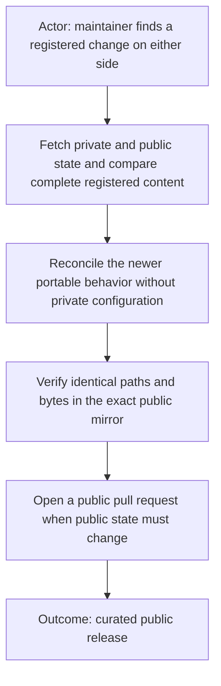
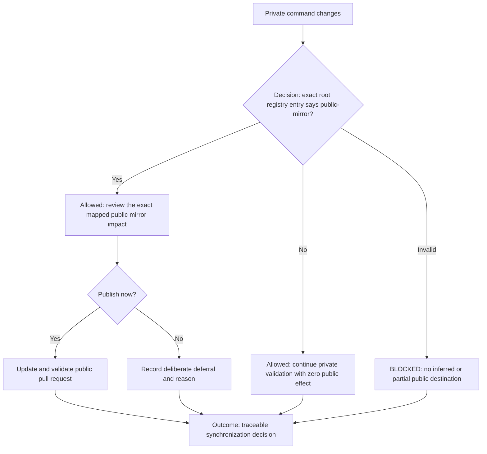
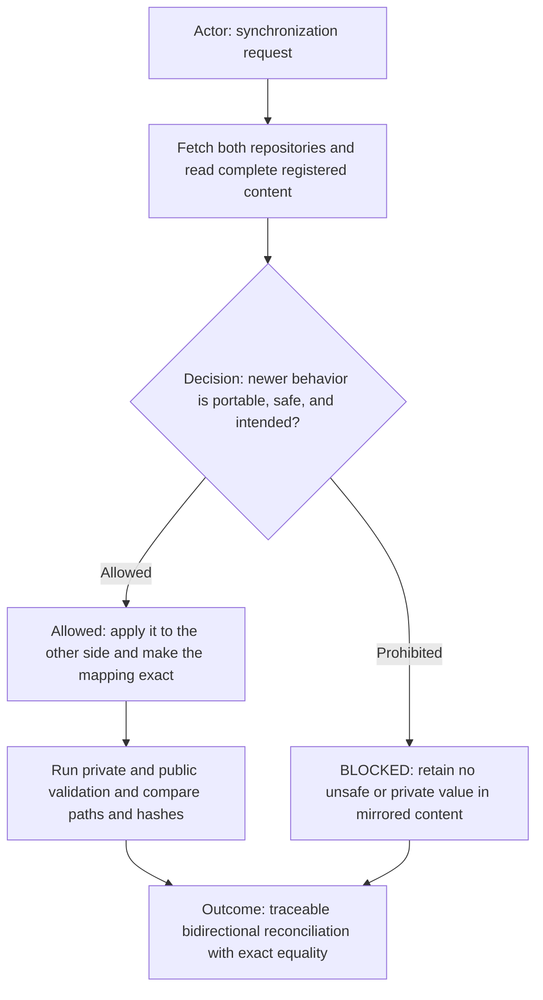
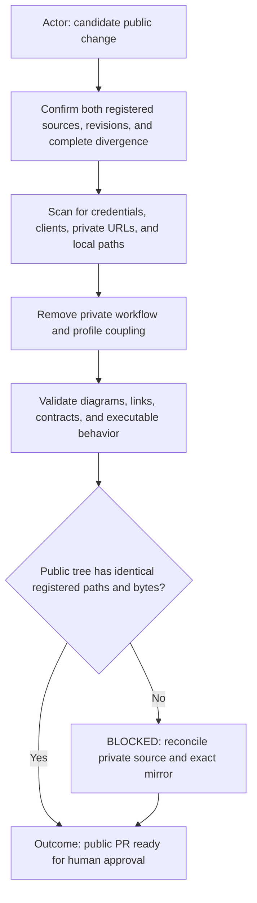
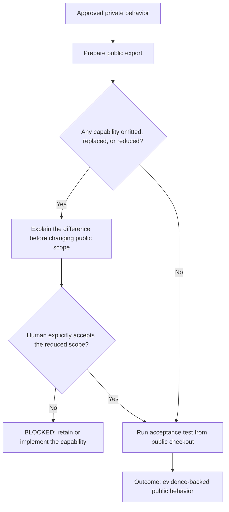
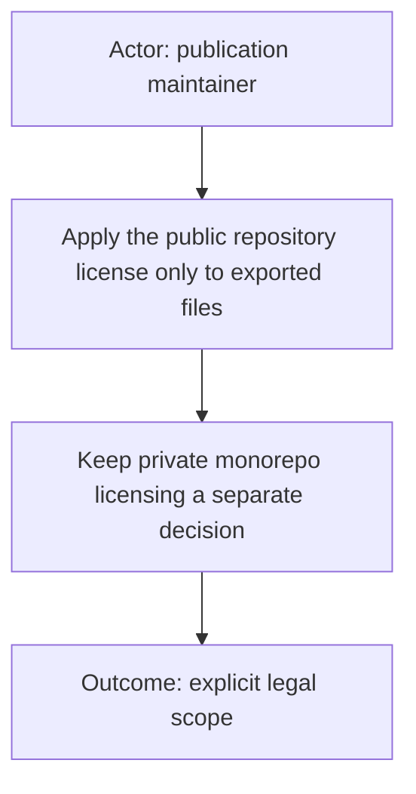

# Publishing AI Commands

Each registered command source and public target form one converged exact mirror. Either side may contain the newer
portable improvement before reconciliation; neither side is automatically preferred by location or timestamp. Every
registered path and byte must match after review. Organization, client,
profile, credential, machine-path, and private-integration values belong outside registered sources in profile-owned or
private adapter configuration.

## Central public-mirror registry

The root [`../ai-publication.yml`](../ai-publication.yml) file is the single private publication registry for commands and
workflows. Each `public-mirror` entry names one canonical private source, one exact public repository, and one public path.
A source may be one file or one folder. A folder entry without `include` maps every descendant. When `include` is present,
the manifest members—not the folder's other descendants—are the complete registered artifact boundary. Include paths are
relative, unique, normalized, non-traversing, non-symlink files. Every member must exist on both sides with identical path,
mode, and bytes, and the public target must contain no file outside the manifest.

Before committing or pushing a change inside a registered command source,
record one outcome: `PUBLIC_SYNC_UPDATED`, `PUBLIC_SYNC_NOT_APPLICABLE`, or
`PUBLIC_SYNC_DEFERRED: <reason>`. A deferral must be deliberate; silence is not
a synchronization decision.

Do not copy the private registry or maintenance outcome into the public command. Public documentation describes the
released package; the registry coordinates both sides of that release. An absent, malformed,
duplicate, overlapping, or destination-mismatched entry is `BLOCKED_PUBLIC_SYNC_SCOPE` and authorizes no public effect.

## Bidirectional reconciliation

A public-side improvement made outside the workflow is valid input, not an automatic violation. Fetch both sides, review
the semantic difference, retain the intended portable behavior, and apply it to the other side. Conflicting edits require
an explicit resolution; modification time or repository location never decides. A need for narrower public wording proves
that private-only configuration is incorrectly located inside the registered source; move it to a profile or unregistered
adapter before synchronization. Completion requires identical registered inventories, modes, and bytes. For a
manifest-selected folder, inventory means the exact `include` set; private descendants outside that set remain
unregistered and must not appear in the public target.

## Publication gate

Before opening or updating a public pull request:

- identify one private counterpart for every public file and one public counterpart for every registered private file;
- fetch both sides and review every semantic difference before choosing the reconciled content;
- exclude credentials, ignored configuration, client identifiers, private
  repositories, absolute local paths, and workflow-only material;
- preserve visual-first documentation and command structure;
- run the relevant private tests plus public link and portability checks;
- record the public branch, commit, and pull request for review;
- never merge or publish merely because synchronization is mechanically clean.

## No silent capability reduction

Do not silently remove, defer, replace, or describe away behavior expected from
the private command. Before changing public scope, identify the exact capability,
explain why it cannot be exported as-is, and obtain explicit human agreement.

Every public executable capability claim must have repeatable validation from
the public checkout—not only a private test or byte comparison. A public release
is ready only when its supported acceptance scenario produces the expected
human-visible artifact using the files that will actually be published. Record
untested platforms and optional enhancements honestly; do not claim universal
compatibility that the available evidence cannot establish.

## Legal boundary

The public repository may license its mirrored artifacts under MIT. Reconciling public
documentation into the private package does not apply that public
license to the entire private monorepo.
