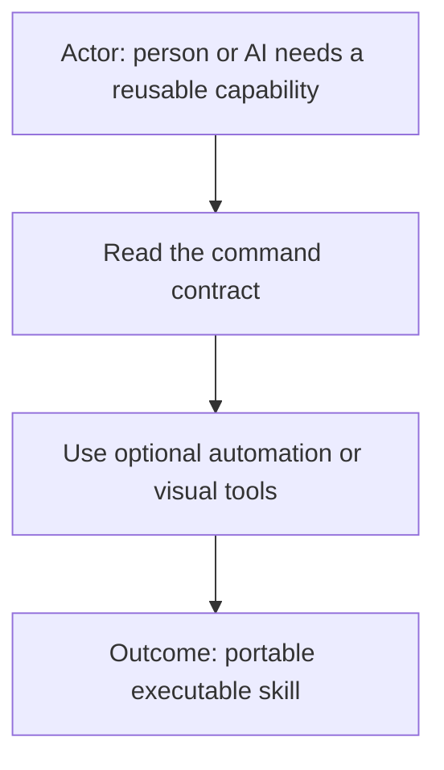
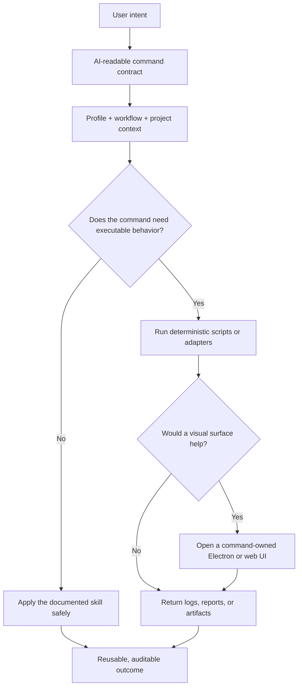
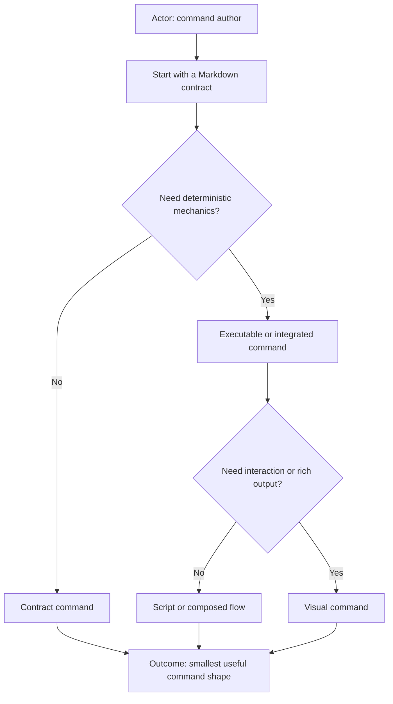
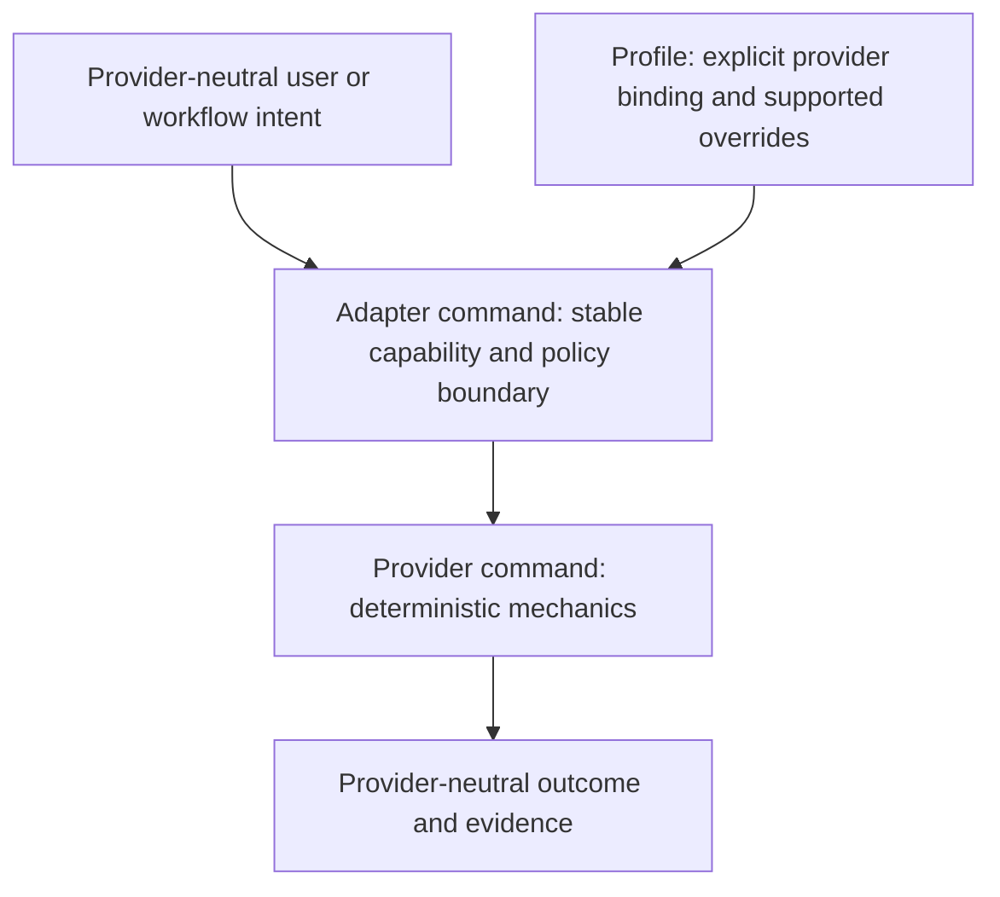
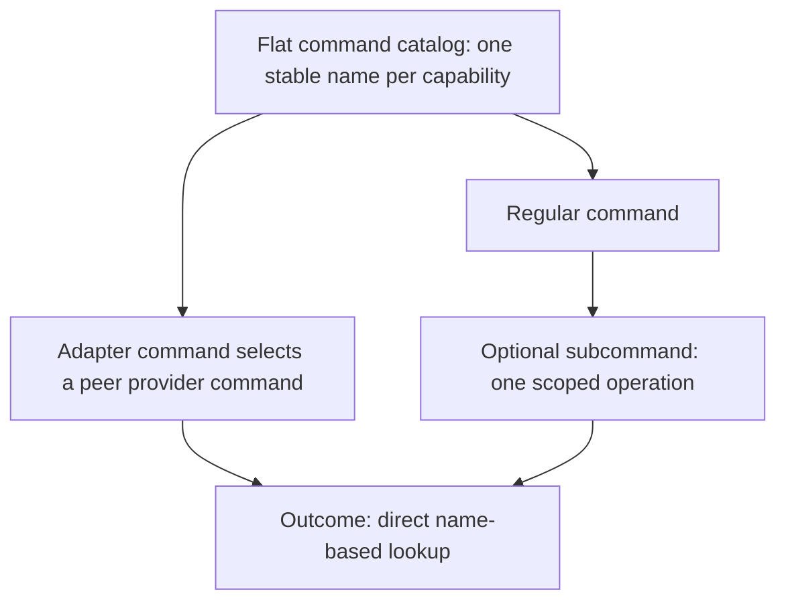

# AI Commands

**Pluggable executable skills for AI-assisted work.**

AI Commands combine human-readable guidance with optional deterministic
automation and visual tools. A command may be as small as one Markdown contract
or as capable as a self-contained feature application with scripts, tests,
reports, and an Electron or browser-based interface.

We call them **commands** because “skill” describes only part of the idea. They
can teach an AI how to perform a task, but they can also execute repeatable work,
validate the environment, produce evidence, and offer a purpose-built UI.

## What is an AI Command?

The Markdown contract remains the source of truth. Executables and interfaces
make appropriate parts deterministic or easier to use; they do not silently
replace the command’s declared behavior and safety boundaries.

## Command shapes

- **Contract** — Markdown guidance for reasoning, policy, routing, review, or
  coordination.
- **Executable** — a contract plus scripts for repeatable validation,
  transformation, setup, or reporting.
- **Adapter** — a stable provider-neutral command that resolves one registered
  provider command, such as `source-control` selecting `git`,
  `ticket-tracker` selecting a tracker provider, or `calendar` selecting a calendar provider.
- **Provider implementation** — deterministic mechanics for one external
  provider; it cannot select itself or own profile policy.
- **Visual** — a command-owned Electron or web UI for controls, previews,
  progress, file selection, or rich reports.
- **Flow** — composition of other commands into a multi-step, evidence-producing
  outcome.

A command can grow from one shape into another without changing its public
identity or forcing every installation to use the optional pieces.

## Adapter commands

An adapter command presents one stable capability while allowing a profile to
select an established provider implementation. The adapter owns intent,
authorization, provider resolution, policy interpretation, and the shape of the
result. The provider command owns only provider-specific mechanics.

Current adapter commands include:

| Adapter command                                              | Provider commands                                   | Capability                         |
| ------------------------------------------------------------ | --------------------------------------------------- | ---------------------------------- |
| [`source-control`](source-control/source-control.command.md) | [`git`](git/git.command.md)                         | Repository inspection and mutation |
| [`ticket-tracker`](ticket-tracker/ticket-tracker.command.md) | registered tracker providers                       | Ticket lifecycle                   |
| [`calendar`](calendar/calendar.command.md)                   | registered calendar providers                      | Calendar events and availability   |
| [`logs`](logs/logs.command.md)                               | [`datadog`](datadog/datadog.command.md)             | Log search, retrieval, and tailing |

Adapters must fail closed when a profile binding is missing, ambiguous,
disabled, or inconsistent. They must not infer a provider from URLs, installed
executables, repository contents, company names, or conversation history.

### Flat discovery and subcommands

Keep command discovery flat. Provider implementations remain peer commands in the same catalog; adapter commands reference them instead of nesting provider packages inside adapter folders. A regular command may expose subcommands when they are true operations of that command rather than alternate providers.
