# AI Commands

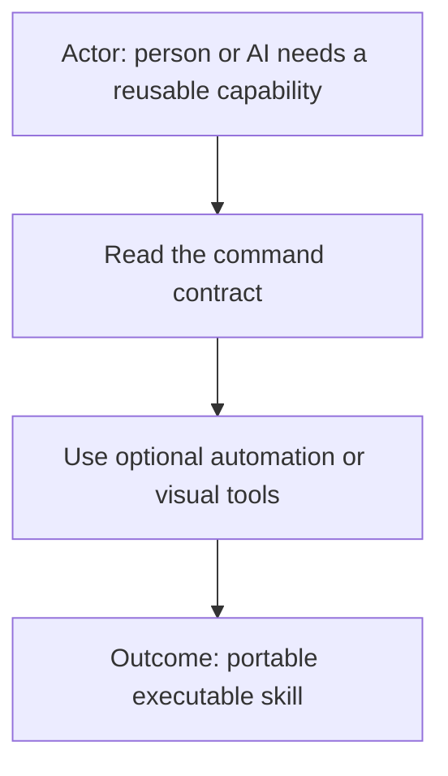

**Pluggable executable skills for AI-assisted work.**

AI Commands combine human-readable guidance with optional deterministic
automation and visual tools. A command may be as small as one Markdown contract
or as capable as a self-contained feature application with scripts, tests,
reports, and an Electron or browser-based interface.

We call them **commands** because “skill” describes only part of the idea. They
can teach an AI how to perform a task, but they can also execute repeatable work,
validate the environment, produce evidence, and offer a purpose-built UI.

## What is an AI Command?

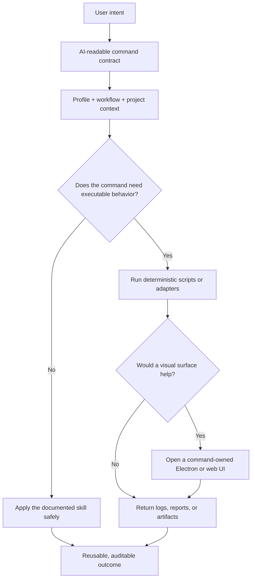

The Markdown contract remains the source of truth. Executables and interfaces
make appropriate parts deterministic or easier to use; they do not silently
replace the command’s declared behavior and safety boundaries.

## Command shapes

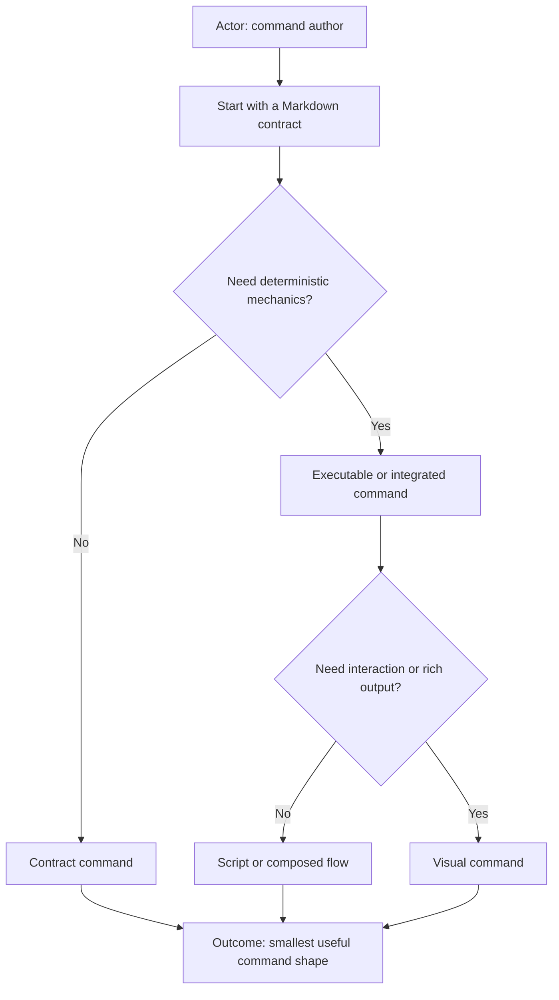

- **Contract** — Markdown guidance for reasoning, policy, routing, review, or
  coordination.
- **Executable** — a contract plus scripts for repeatable validation,
  transformation, setup, or reporting.
- **Adapter** — a stable provider-neutral command that resolves one registered
  provider command, such as `source-control` selecting `git` or
  `ticket-tracker` selecting `jira`.
- **Provider implementation** — deterministic mechanics for one external
  provider; it cannot select itself or own profile policy.
- **Visual** — a command-owned Electron or web UI for controls, previews,
  progress, file selection, or rich reports.
- **Flow** — composition of other commands into a multi-step, evidence-producing
  outcome.

A command can grow from one shape into another without changing its public
identity or forcing every installation to use the optional pieces.

## Adapter commands

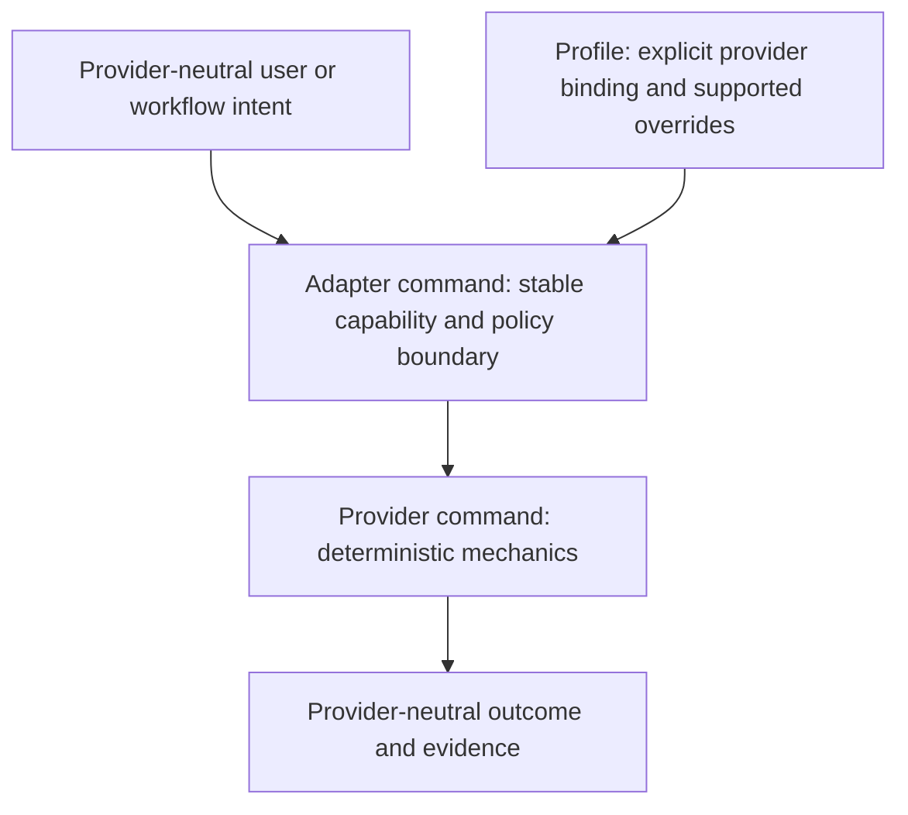

An adapter command presents one stable capability while allowing a profile to
select an established provider implementation. The adapter owns intent,
authorization, provider resolution, policy interpretation, and the shape of the
result. The provider command owns only provider-specific mechanics.

Current adapter commands include:

| Adapter command                                              | Provider commands                                   | Capability                         |
| ------------------------------------------------------------ | --------------------------------------------------- | ---------------------------------- |
| [`source-control`](source-control/source-control.command.md) | [`git`](git/git.command.md)                         | Repository inspection and mutation |
| [`ticket-tracker`](ticket-tracker/ticket-tracker.command.md) | [`jira`](jira/jira.command.md) and registered peers | Ticket lifecycle                   |
| [`logs`](logs/logs.command.md)                               | [`datadog`](datadog/datadog.command.md)             | Log search, retrieval, and tailing |

Adapters must fail closed when a profile binding is missing, ambiguous,
disabled, or inconsistent. They must not infer a provider from URLs, installed
executables, repository contents, company names, or conversation history.

### Flat discovery and subcommands

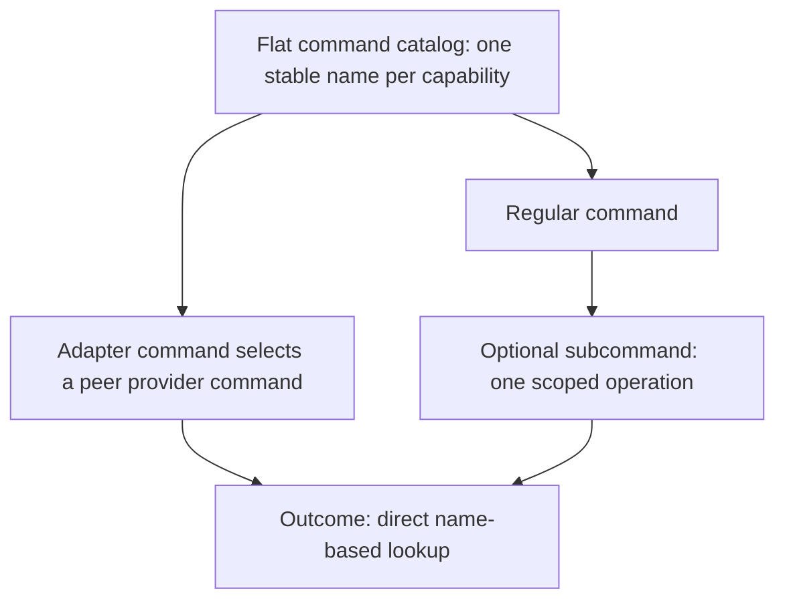

Keep command definitions at the catalog's top level whenever practical. An
adapter and its provider implementations remain peer commands—for example,
`source-control` and `git`—rather than becoming a nested command tree. This
keeps discovery, registry validation, links, and name-based lookup simple.

A **subcommand** is different: it is a bounded operation exposed by one command,
such as `discussion lookup-conversation`. It shares the parent command's
identity and contract. A provider implementation has its own command identity
and is selected by an adapter through validated profile configuration. Internal
scripts and code may still use subfolders when that improves implementation
cohesion; those folders do not change the flat public command namespace.

## Portable structure

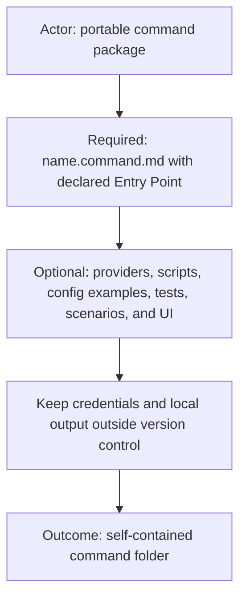

Every command requires both `<name>.command.md` and
`<name>.command.example.config`. Other files are optional and should be added
only when the command needs them.

Catalog maintenance is developer tooling, not a public command. Deterministic
create/update/rename/delete support and authoring templates live under
`tooling/command-catalog/` and do not receive an execution route or workflow
command ID.

Profile activation is runtime infrastructure, not a public command. Guards,
activation, and the profile-aware command runner live under `_runtime/profile/`
and likewise have no execution route or workflow command ID. The leading
underscore marks `_runtime/` as catalog-internal support infrastructure and
keeps it out of public command discovery.

Inside the required contract, the first four `##` sections are `Purpose`,
`Inputs`, `Outputs`, and `Entry Point`, in that order. The interface sections
use the canonical tables documented in [`commands.md`](commands.md). A missing side is represented
by an explicit `None` row; it is never left implicit.

```text
<name>/
├── README.md                    # concise human overview
├── <name>.command.md            # required contract; agent entry point when no executable exists
├── spec.md                      # optional normative behavior specification
├── <name>.command.sh            # optional executable entry point
├── <name>.command.mjs           # optional Node executable entry point
├── <name>.command.example.config # required committed safe override template
├── <name>.command.test.sh       # optional executable contract test
├── <name>.scenario.md           # optional agent-run live acceptance scenario
├── feature.yml                  # optional visual-feature metadata
├── app.sh                       # optional launcher owned by this command
├── launcher/                    # optional command-owned Electron or browser UI
├── adapters/                    # optional internal provider/source mechanics
├── test/                        # optional contract and executable tests
└── reports/                     # optional local output; normally ignored
```

These names are canonical, not illustrative alternatives. Use `spec.md` rather
than `<name>.spec.md`; use `<name>.scenario.md` rather than
`<name>.test-scenarios.md`; and keep the `.command` segment in executable,
test, and example-configuration filenames. Helper files may use descriptive
names, but they are private implementation details and must not look like
separate public commands.

The committed `.command.example.config` file is documentation, not runtime
configuration. It lists only supported command value overrides with fictional,
non-secret values. If a command currently exposes no value overrides, the file
states that explicitly. To configure a command, copy the template into the
selected profile, set the operational values there, and reference that copy
through `commands[].config`. After profile and workflow activation, the host
passes the resolved profile-owned copy as `AI_COMMAND_CONFIG_PATH`. Commands
must never load the committed catalog example as a fallback.

`.config` is the single command-configuration suffix. Do not introduce
`.command.example.conf`, `.command.example.yml`, or
`.command.example.yaml` alternatives.

Provider support is optional. When a command exposes a provider-neutral
capability, its contract adds a `## Providers` or `## Provider implementations`
section after the required interface sections. That section names every allowed
capability ID, links its registered provider command, states the execution
route, and defines fail-closed resolution. Provider implementations remain peer
command bundles in the flat catalog—for example, `logs` selects `datadog`—and
are activated only by validated profile or workflow configuration. A command
that has no interchangeable provider does not need this section.

The `adapters/` directory is only for private implementation helpers owned by
one command, such as source-format parsing. It does not register provider IDs
or replace peer provider command contracts.

Every command declares at least one entry point in its `## Entry Point` table.
Prefer a shell entry point for deterministic mechanics; use a Node entry point
when appropriate. A command-owned `app.sh` may be an additional or primary
manual entry point when the user performs the workflow through an Electron or
browser UI. Reasoning-only commands and provider-neutral adapters may use their
AI-readable `.command.md` contract as the entry point instead of shipping a
meaningless wrapper executable.

All entry points are profile-aware. Before loading a contract, running a script,
or opening a command UI, the host activates one exact profile and workflow,
verifies that the workflow allows the command, resolves `AI_COMMANDS_ROOT`, and
supplies any profile-owned configuration through `AI_COMMAND_CONFIG_PATH`.

A command-owned launcher is allowed only as a self-contained implementation
surface for that command. It is distinct from the AI Fleas Platform launcher:
the public command catalog must not define, configure, or depend on that private
host lifecycle. Electron is therefore an implementation option inside a command
bundle, not a reusable command or platform selection by itself.

Local credentials and environment-specific configuration must never be
committed. Publish example configuration with placeholders and keep actual
values in ignored, provider-appropriate local storage.

Executable tests and live scenarios serve different purposes. Automated tests
verify scripts and code deterministically. A `<name>.scenario.md` file guides a
human-facing agent through the command as a user would experience it, including
prerequisite discovery, authorized installation, execution, visual inspection,
and evidence-backed completion. A scenario must be safe to rerun, declare any
external effects, and never treat a passing script test as proof that the full
human-visible experience works.

## Design principles

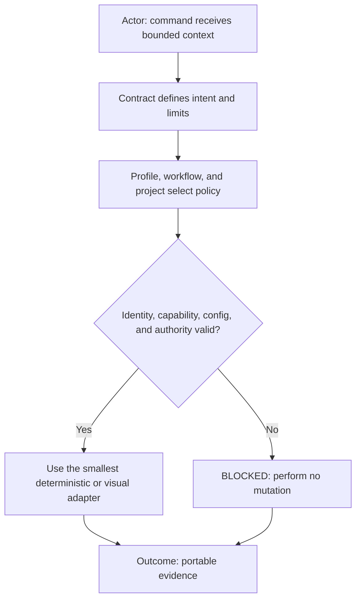

- **Contract first.** Natural-language intent, inputs, boundaries, and expected
  evidence are readable before execution.
- **Deterministic where practical.** Scripts own repeatable mechanics,
  dependency checks, validation, and artifact production.
- **Context bound.** Profile, workflow, and project coordinates select policy
  and configuration without hardcoding a client into a portable command.
- **Fail closed.** Missing identity, capability, configuration, authorization,
  or route evidence blocks mutation.
- **UI optional.** Electron and web surfaces are adapters over the command, not
  a requirement for headless use.
- **Portable core, local integration.** Public commands stay reusable while
  private workflows and profiles extend them externally.

## Published commands

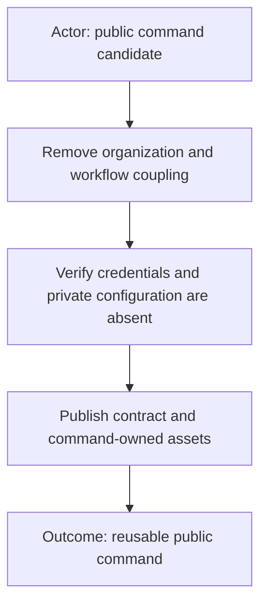

### [`show-context`](show-context/README.md)

Generic human-facing context presentation for reports, code review,
investigation, handoff, and other composed flows. It provides a visual-first
contract and report template plus a private executable renderer.

### [`doc`](doc/doc.command.md)

Reusable documentation fixture composition, project-readiness checks, and
independent principles for diagrams, project context, top-of-file source
documentation, and same-basename runnable-file companions.

More commands will be published one at a time after their organization-specific
assumptions, credentials, and workflow coupling have been removed.

## Related repositories

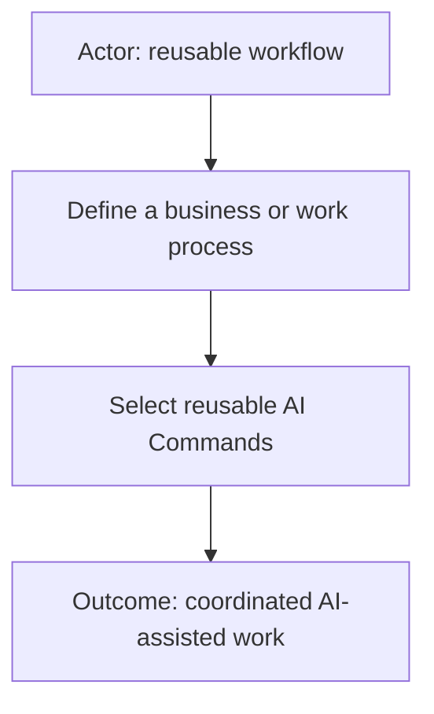

[AI Workflows](../ai-workflows/README.md) is the public catalog for reusable processes that coordinate commands. It is
published in this repository alongside AI Commands so their portable contracts can evolve and be validated together.

## Creating and managing commands

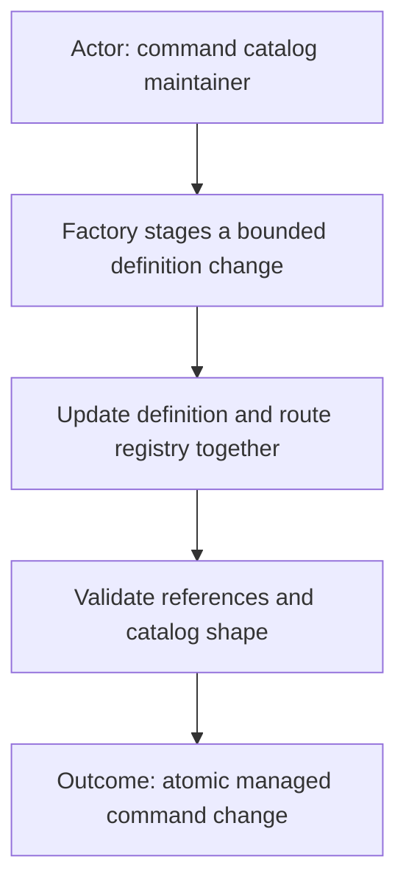

The private catalog conventions, command structure, visual-first documentation
rules, configuration boundaries, and runtime integration remain in
[`commands.md`](commands.md). Public extraction rules are maintained separately
in [`PUBLISHING.md`](PUBLISHING.md).

Command catalogs benefit from a small factory that creates, updates, renames,
and removes definitions together with their execution-route registry. The
factory should treat route names as opaque identifiers: workflows and external
policy decide what a route means and whether it is authorized.

The portable factory and registry package are being prepared separately. Until
they are published here, contributors should preserve the structure above and
review command additions as complete, self-contained changes.

## Repository boundary

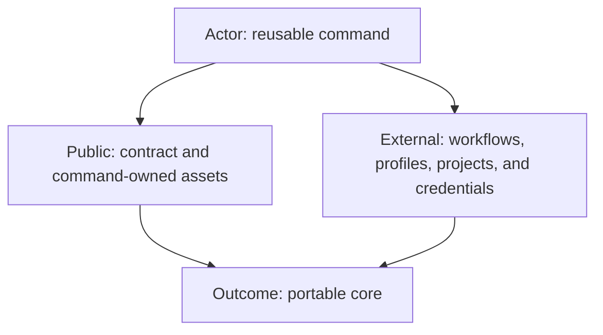

This repository contains reusable command contracts and their command-owned
assets. Workflow definitions, organization profiles, project bindings,
credentials, and private configuration belong outside it. They may reference
and extend these commands without being included in this repository.

## Private canonical extensions

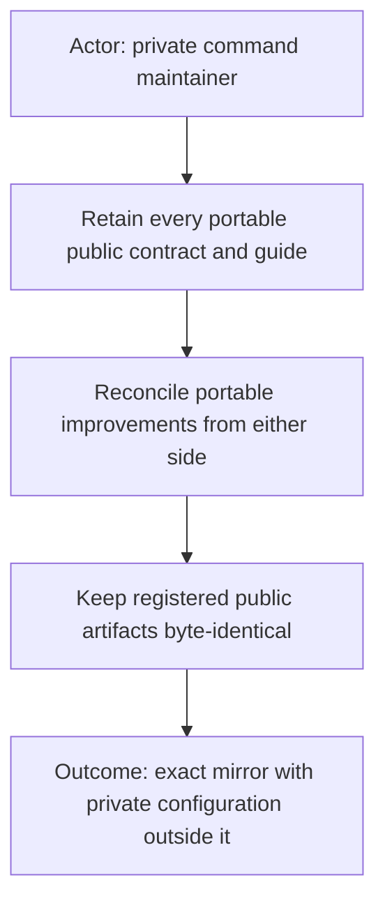

This package contains the private catalog and runtime conventions in [`commands.md`](commands.md). Registered public
artifacts follow [`PUBLISHING.md`](PUBLISHING.md): portable improvements may originate on either side, but reconciliation
must make every registered path byte-identical and keep private configuration outside the mirror. The public MIT license does
not license this private monorepo.
