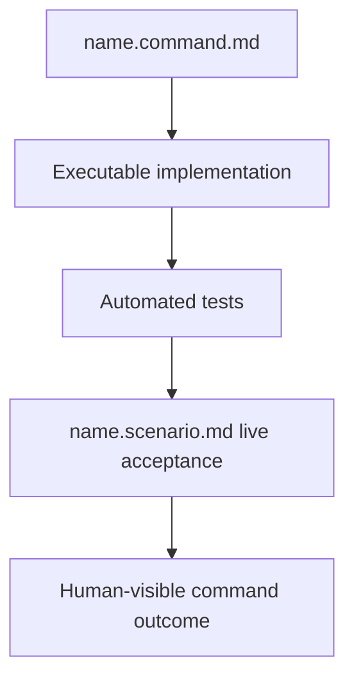

# Command Management

Use this command for every managed-bundle command create, update, rename, move,
or delete request. Do not manually change a command definition together with
`execution-routes.tsv`; invoke the bounded helper so registry and references
cannot drift.

The CRUD helper treats execution routes as opaque normalized identifiers. It
validates registry shape and safe token syntax only. It does not know which
consumers exist, what an identifier means, or whether a route is appropriate.
External configuration and policy own route interpretation and authorization.

## Command verification layers

A managed command may include `<name>.scenario.md` as its agent-run live
acceptance scenario. Automated tests validate deterministic implementation
details; the scenario validates the complete command experience in realistic
conditions. It should tell the executing agent how to establish a clean,
disposable starting state, discover missing prerequisites, request authority
before installation or other external effects, run the documented entry point,
inspect human-visible output, and report evidence.

Scenarios must be repeatable and profile-agnostic. They must identify cleanup,
network, UI, installation, credential, and mutation boundaries explicitly. A
scenario failure is evidence to diagnose the command or its documentation; the
agent must not weaken acceptance criteria merely to make the scenario pass.

## Usage

Run `./command/command.command.sh <operation> [options]` from the selected
`ai_commands_root`, or pass `--commands-root <root>` explicitly.

Operations: `list`, `show --path <relative.command.md>`, `check`, `create`,
`update`, `rename`, and `delete`. `create`, `update`, `rename`, and `delete`
support `--dry-run`. `delete` additionally requires `--yes`.

For create/update, provide `--path`, `--route`, and, for `mixed`, any explicit
portion mappings (`--reasoning`, `--implementation`, `--execution`,
`--ui-acceptance`). `--content-file` replaces content only when supplied.
Rename requires `--path` and `--new-path`; it updates exact managed-bundle path
references and blocks on ambiguous old command-name references. Delete blocks
when references remain. Every mutation is preflighted in a temporary copy,
validated with `validate-execution-routes.sh`, then applied with scoped backup
and rollback.
