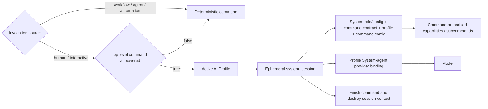

## Commands Folder — Specification

### Resolving the command catalog

The selected AI Profile is authoritative for the command catalog. Profile activation resolves `AI_COMMANDS_ROOT` and profile-owned command configuration. Every command execution is profile-aware.

Reusable command directories must not contain populated operational configuration. Secret-bearing and organization-specific overrides belong in the selected profile's ignored local configuration and are exposed as `AI_COMMAND_CONFIG_PATH`.

`ai-commands/_runtime/` is reserved internal infrastructure, not a public command bundle.

### Structure

Each top-level public command has a command contract and adjacent metadata manifest.

- `<command-name>/<command-name>.command.md` — required command contract.
- `<command-name>/<command-name>.command.yml` — required lightweight command metadata for the top-level command.
- `<command-name>/<command-name>.command.example.config` — required safe configuration template.
- Profile-owned configuration — optional operational values and credential references.
- `<command-name>.command.sh` / `.mjs` — optional deterministic executable.
- `spec.md` — optional detailed normative behavior.
- `<command-name>.command.test.*` — optional deterministic test.
- `<command-name>.scenario.md` — optional live acceptance scenario.
- `PLAN.md` — optional human/AI execution-flow contract for a complex multi-step command.
- `logs/` — optional command-owned runtime transcripts; always local and Git-ignored.
- `feature.yml` / `app.sh` — optional command-owned visual application.

A command bundle may contain subcommands. Subcommands execute under the parent command's contract and do not declare their own `ai.powered` metadata unless they are promoted to independent top-level commands.

Every top-level public command MUST have an adjacent `<command-name>.command.yml` with an explicit AI-powered flag. The canonical minimum is:

```yaml
ai:
  powered: false
```

`false` is the default for the catalog. Existing and newly created commands remain deterministic unless a human intentionally changes that command's metadata/contract to `true` and defines the AI-powered behavior. Hosts MUST fail validation for a top-level public command whose adjacent manifest is missing or whose `ai.powered` value is absent/non-boolean; they must not infer `true` from model availability.

### AI-powered commands

`ai.powered` controls only human-initiated interactive command execution, such as a person invoking the command from a terminal or equivalent manual command surface. It does not change how workflow agents, managers, coders, command runners, schedulers, or other automation invoke commands.

AI-powered execution is an interactive mode of the same command, not a separate permanent role or replacement command.

```yaml
ai:
  powered: true
```

For a manual interactive invocation:

- when `ai.powered: false`, the Command Runner invokes the deterministic executable/UI path normally;
- when `ai.powered: true`, the host creates a fresh ephemeral command AI session initialized from the active AI Profile's System role/configuration for the selected platform.

The ephemeral session is System-scoped for authority and configuration, but it is NOT the persistent System agent conversation. It must not read, append to, or retain the persistent System agent's conversational context unless a command contract explicitly authorizes a narrowly scoped persisted artifact.

The temporary identity should make the relationship obvious: use `system-<command>` as the readable base name and append a runtime-unique suffix when needed, for example `system-install-<session-id>`. This is a temporary session name, not another persistent System identity.

By default, the temporary session uses the same System role/configuration and `system_agent` provider/model binding as the active profile/platform System agent. The provider may still be local or remote.

The session lifetime follows the interactive command, not a fixed duration. It is destroyed when the command completes, fails terminally, is cancelled, or the terminal/session exits. A short inactivity timeout may exist only as abandoned-session cleanup. Destroying the session discards its conversational context; only command-authorized durable artifacts or machine changes survive.

For an agent-, workflow-, scheduler-, or automation-initiated invocation, the command ALWAYS executes through its deterministic path. The caller must not activate the command's AI interaction mode, even when the command declares `ai.powered: true`.



This prevents recursive or competing agent orchestration. A workflow agent that already owns reasoning for a workflow calls commands as deterministic capabilities; it must not cause the command to create another reasoning layer merely because `ai.powered` is enabled for humans.

The persistent System agent remains profile-aware and platform-specific: there is exactly one active System agent per `(profile, platform)` binding. AI-powered command sessions reuse its role/configuration model and provider binding, but do not reuse its conversation history or become additional persistent System identities.

Whether inference is local or remote is an implementation detail of the profile binding and does not change command-session authority.

AI-powered command execution is not implemented yet. Until that runtime exists, if a human manually invokes a top-level command whose `ai.powered` is `true`, the interactive runner MUST stop before deterministic execution and report clearly that AI-powered command support is not implemented yet. It MUST NOT silently ignore the flag or fall back to ordinary interactive execution. Non-interactive workflow/agent/automation invocation continues to use the deterministic command path.

For a manual AI-powered invocation, the ephemeral System-scoped session acts only inside the selected command's scope. It may reason, explain, ask questions, guide interactively, handle errors/recovery, and invoke only the deterministic mechanics, subcommands, and external effects authorized by that command contract.

AI-powered mode MUST NOT expand command authority or permanently expand System authority. The command contract remains the authorization boundary for the invocation. Model reasoning cannot create permissions, bypass confirmations, broaden external effects, access unrelated capabilities, or reinterpret prohibited behavior as allowed.

Commands do not hard-code Hermes, provider, or model details. The selected platform realizes the System role/configuration used to initialize the ephemeral command session, and the session resolves the profile's configured `system_agent` provider/model binding. Hermes is currently the default local platform/harness assumption, but the command contract remains platform-independent.

A command may also use direct provider inference for narrow deterministic operations explicitly defined by that command. That is separate from `ai.powered`, which refers to the manual ephemeral AI interaction layer.

```text
human + ai.powered=false -> deterministic command
human + ai.powered=true  -> ephemeral system-<command> session -> command scope -> deterministic mechanics/subcommands -> destroy context
workflow/agent/automation -> deterministic command
```

### Command App Launchers (`app.sh`)

A command may provide an optional `app.sh` visual surface. UI and CLI remain adapters over the same command contract and authority boundary.

### Platform vs Workflow Commands

Platform commands are workflow-independent utilities; workflow commands belong to a bounded context and may know workflow-specific concepts. Do not force one universal command when domains differ.

### Command Documentation Convention (`*.command.md`)

Every top-level command documentation file must contain `## Purpose`, `## Inputs`, `## Outputs`, and `## Entry Point` in that order, followed by a mandatory `## Supported Prompts` section before behavior/implementation detail.

Every top-level command contract has an adjacent `<command-name>.command.yml` AI execution declaration. Commands with `ai.powered: false` remain deterministic for manual invocation. Commands changed to `ai.powered: true` are considered declared for future human-facing ephemeral System-scoped execution. This metadata never changes workflow/agent/automation invocation into AI-powered execution.

Subcommand contracts may exist inside a bundle but inherit the parent command's authority envelope. They do not independently select AI execution.

### Optional Execution Plan (`PLAN.md`)

`PLAN.md` is optional. It is not a second command contract, usage guide, or a
requirement for every command or every AI-powered command. Add it when the work
itself is a consequential multi-step flow whose ordering, checkpoints, recovery,
or human visibility benefits from a shared execution map—for example installation,
migration, deployment, or staged reconciliation.

The adjacent `*.command.md` remains authoritative for purpose, inputs, outputs,
entry points, authority, and supported prompts. `PLAN.md` describes what happens
during execution so a human and an AI collaborator can follow the same flow.

When present:

- the adjacent command contract MUST link to `PLAN.md` and explain its role;
- each step MUST have a unique stable marker in the form
  `<!-- PLAN_STEP: COMMAND-01 -->`;
- steps MUST describe observable outcomes, prerequisites, safety boundaries, and
  relevant resume/recovery behavior rather than duplicate CLI usage;
- an executable command that maps directly to the plan MUST emit the same step
  IDs while running and MUST include a deterministic synchronization check;
- implementation and plan changes MUST be updated together; execution MUST stop
  or validation MUST fail when declared step mappings drift.

Commands that are simple, atomic, primarily descriptive, or adequately explained
by their command contract SHOULD omit `PLAN.md`.

### Command-Owned Runtime Logs (`logs/`)

When a command produces execution logs, they MUST live in a `logs/` directory
inside the command folder that owns the execution. They must not be placed in a
profile, another command's folder, or a shared repository-level runtime directory.

Command-owned logs are operational artifacts and MUST remain outside Git. A
human-facing invocation SHOULD print the exact log path before meaningful work and
SHOULD stream the same progress to both the terminal and log. Logs MUST use
restrictive permissions when they may contain machine, profile, path, or diagnostic
details, and MUST NOT capture passwords, tokens, private keys, or other secrets.

Subcommands with independent multi-step execution may own their own nested
`logs/` directory. A parent router's own logs remain in the parent command folder.

### Command Resolution

The host resolves the top-level command and the invocation source.

- Human/manual interactive invocation: read the top-level manifest and select deterministic versus ephemeral System-scoped interactive execution.
- Workflow/agent/scheduler/automation invocation: execute the deterministic command path regardless of `ai.powered`.

Profile policy may disable AI execution but MUST NOT turn a command whose catalog flag is `false` into an AI-powered command without an explicitly governed command metadata change.

### Workflow Integration

Commands accept workflow-provided input, produce workflow-consumable output, and respect workflow/project scope. Workflow agents use commands as deterministic capabilities. They do not inherit or trigger the human-facing `ai.powered` interaction layer.

### AI provider relationship

AI providers belong to the active profile. Provider selection supplies inference only; it does not grant capabilities. Human-facing AI-powered command sessions use the provider/model bound to the active profile/platform System configuration. The provider may be local or remote; command authority remains defined by the command contract.
