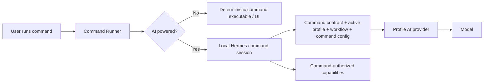

## Commands Folder — Specification

### Resolving the command catalog

The selected AI Profile is authoritative for the command catalog. Profile activation resolves its `ai_commands_root` setting and exports the absolute path as `AI_COMMANDS_ROOT`. Runtime instructions and cross-command calls must therefore use `${AI_COMMANDS_ROOT}/<command-name>/...`; they must not assume that the catalog is named `commands`, lives beside the active project, or belongs to a particular host platform.

Scripts distributed inside this repository may remain directly runnable before profile activation. Such scripts must derive a fallback from their own location. An explicitly supplied `AI_COMMANDS_ROOT` always wins. Paths under a profile's own command configuration are profile-relative configuration, not command-catalog paths.

Reusable command directories must not contain populated operational configuration. Secret-bearing and organization-specific command overrides belong in the selected profile's ignored local configuration. Hosts pass the resolved file path to executables as `AI_COMMAND_CONFIG_PATH`.

Every command execution is profile-aware. Before invoking an executable or AI-powered command session, the launcher/host must activate one exact profile and workflow, verify that the workflow allows the command, resolve `AI_COMMANDS_ROOT`, and expose the command's profile-owned configuration when configured.

`ai-commands/_runtime/` is reserved internal infrastructure, not a command bundle.

### Structure

Each public command lives under `ai-commands/<command-name>/`.

- `<command-name>.command.md` — required command contract.
- `<command-name>.command.example.config` — required safe configuration template.
- Profile-owned configuration — optional operational values and credential references.
- `<command-name>.command.sh` / `.mjs` — optional deterministic executable.
- `spec.md` — optional detailed normative behavior.
- `<command-name>.command.test.*` — optional deterministic test.
- `<command-name>.scenario.md` — optional live acceptance scenario.
- `feature.yml` / `app.sh` — optional command-owned visual application.

The command contract remains authoritative regardless of execution mode.

### AI-powered commands

A command may declare that it supports AI-powered execution. AI-powered execution is an execution mode of the same command, not a separate agent role and not a replacement command.

The command metadata/contract may expose an `ai.powered` capability that can be enabled or disabled by the command/profile policy. Conceptually:

```yaml
ai:
  powered: true
```

When AI-powered mode is off, the Command Runner invokes the command's deterministic executable/UI path normally.

When AI-powered mode is on, invoking the command opens an interactive command-scoped AI terminal/chat session using the locally running Hermes harness by default:



The AI-powered command session is temporary and scoped to that command invocation. Hermes loads the command contract, active profile/workflow context, resolved command configuration, and only the capabilities the command is authorized to use. The model may reason, explain, ask questions, guide the user interactively, and invoke allowed command mechanics through the harness.

AI-powered mode MUST NOT expand command authority. The command contract remains the authorization boundary. Hermes/model reasoning cannot create new permissions, bypass required confirmations, broaden external effects, access unrelated profile/workflow capabilities, or reinterpret prohibited behavior as allowed.

The default harness assumption is a locally running Hermes installation. Commands should not hard-code Hermes-specific provider/model details; Hermes resolves the active profile's configured AI provider/model. Future harnesses may be supported later without changing the command authority model.

A command may also use direct provider inference without an agentic harness for narrow operations such as classification or summarization. Agentic/interactive command behavior uses the harness path:

```text
simple inference: command -> profile provider -> model
AI-powered command: command -> Hermes -> profile provider -> model
```

If AI-powered mode is enabled but the required harness/provider/model is unavailable, the command MUST explain the missing dependency and either offer its deterministic mode when supported or fail with an explicit unavailable state. It MUST NOT silently execute with different authority or an unconfigured external provider.

### Command App Launchers (`app.sh`)

A command may provide an optional `app.sh` as its visual tool surface. The command documentation remains authoritative. UI and CLI are adapters over the same command contract and authority boundary.

### Platform vs Workflow Commands

Not every command should be globally reusable. Platform commands are workflow-independent utilities; workflow commands belong to a bounded context and may know workflow-specific concepts. Do not force one universal command when domains differ.

### Command Documentation Convention (`*.command.md`)

Every command documentation file must contain `## Purpose`, `## Inputs`, `## Outputs`, and `## Entry Point` in that order, followed by a mandatory `## Supported Prompts` section before behavior/implementation detail.

For AI-powered commands, the contract must additionally document:

- whether AI-powered mode is supported and its default state;
- deterministic fallback availability;
- the interactive outcome owned by the AI session;
- capabilities/tools the session may invoke;
- confirmations/external effects that remain human-authorized;
- behavior when Hermes or the configured profile AI provider is unavailable.

AI-powered mode does not remove the requirement for deterministic tests where deterministic mechanics exist.

### Command Resolution

User input is interpreted through the selected workflow and evaluated against available commands. If a match is found, the corresponding command is executed within workflow/profile context. The host chooses deterministic versus AI-powered execution according to the command declaration, active profile policy, explicit invocation flags, and required authorization.

### Workflow Integration

Commands accept workflow-provided input, produce workflow-consumable output, respect workflow/project scope, and retain the same authority regardless of whether execution is deterministic, visual, or AI-powered.

### AI provider relationship

AI providers belong to the active profile. A command may consume the profile's default command provider or another provider allowed by command/profile policy. Provider selection supplies inference only; it does not grant capabilities.

The profile-local provider is intended to make AI-powered commands available without an external cloud dependency. The current default architecture assumes local Hermes as the harness and a profile-local `llama-server`/model as its inference provider, while profiles may also expose dedicated remote providers for heavier workloads.
