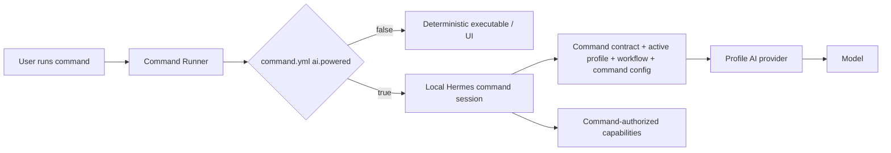

## Commands Folder — Specification

### Resolving the command catalog

The selected AI Profile is authoritative for the command catalog. Profile activation resolves `AI_COMMANDS_ROOT` and profile-owned command configuration. Every command execution is profile-aware, whether deterministic or AI-powered.

Reusable command directories must not contain populated operational configuration. Secret-bearing and organization-specific overrides belong in the selected profile's ignored local configuration and are exposed as `AI_COMMAND_CONFIG_PATH`.

`ai-commands/_runtime/` is reserved internal infrastructure, not a public command bundle.

### Structure

Each public command lives under `ai-commands/<command-name>/`.

- `<command-name>.command.md` — required command contract.
- `<command-name>.command.example.config` — required safe configuration template.
- `command.yml` — required lightweight command metadata.
- Profile-owned configuration — optional operational values and credential references.
- `<command-name>.command.sh` / `.mjs` — optional deterministic executable.
- `spec.md` — optional detailed normative behavior.
- `<command-name>.command.test.*` — optional deterministic test.
- `<command-name>.scenario.md` — optional live acceptance scenario.
- `feature.yml` / `app.sh` — optional command-owned visual application.

Every public command MUST have `command.yml` with an explicit AI-powered flag. The canonical minimum is:

```yaml
ai:
  powered: false
```

`false` is the default for the catalog. Existing and newly created commands remain deterministic unless a human intentionally changes the command metadata/contract to `true` and defines the AI-powered behavior. Hosts MUST fail validation for a public command whose `command.yml` is missing or whose `ai.powered` value is absent/non-boolean; they must not infer `true` from model availability.

### AI-powered commands

AI-powered execution is an execution mode of the same command, not a separate role or replacement command.

```yaml
ai:
  powered: true
```

When `ai.powered: false`, the Command Runner invokes the deterministic executable/UI path normally.

When `ai.powered: true`, invoking the command opens an interactive command-scoped AI terminal/chat session using the locally running Hermes harness by default:



The AI-powered session is temporary and scoped to that command invocation. Hermes loads the command contract, active profile/workflow context, resolved command configuration, and only capabilities the command is authorized to use. The model may reason, explain, ask questions, guide interactively, and invoke allowed mechanics.

AI-powered mode MUST NOT expand command authority. The command contract remains the authorization boundary. Hermes/model reasoning cannot create permissions, bypass confirmations, broaden external effects, access unrelated capabilities, or reinterpret prohibited behavior as allowed.

The default harness assumption is locally running Hermes. Commands do not hard-code Hermes provider/model details; Hermes resolves the active profile's configured AI provider/model.

A command may also use direct provider inference for narrow deterministic operations. Agentic/interactive behavior uses the harness path:

```text
simple inference: command -> profile provider -> model
AI-powered command: command -> Hermes -> profile provider -> model
```

If `ai.powered: true` but the harness/provider/model is unavailable, the command explains the missing dependency and either offers deterministic fallback when explicitly supported or fails with an explicit unavailable state.

### Command App Launchers (`app.sh`)

A command may provide an optional `app.sh` visual surface. UI and CLI remain adapters over the same command contract and authority boundary.

### Platform vs Workflow Commands

Platform commands are workflow-independent utilities; workflow commands belong to a bounded context and may know workflow-specific concepts. Do not force one universal command when domains differ.

### Command Documentation Convention (`*.command.md`)

Every command documentation file must contain `## Purpose`, `## Inputs`, `## Outputs`, and `## Entry Point` in that order, followed by a mandatory `## Supported Prompts` section before behavior/implementation detail.

Every command contract must acknowledge its `command.yml` AI execution declaration. Commands with `ai.powered: false` need only state that execution is deterministic by default. Commands with `ai.powered: true` additionally document deterministic fallback, interactive outcome, allowed capabilities/tools, confirmations/external effects, and unavailable-Hermes/provider behavior.

### Command Resolution

User input is interpreted through the selected workflow and evaluated against available commands. The host reads the command's explicit `command.yml` flag and chooses deterministic versus AI-powered execution accordingly. Profile policy may disable AI execution but MUST NOT turn a command whose catalog flag is `false` into an AI-powered command without an explicitly governed command metadata change.

### Workflow Integration

Commands accept workflow-provided input, produce workflow-consumable output, respect workflow/project scope, and retain the same authority regardless of execution adapter.

### AI provider relationship

AI providers belong to the active profile. Provider selection supplies inference only; it does not grant capabilities. The current default architecture assumes local Hermes as the harness and a profile-local `llama-server`/model as its inference provider, with optional dedicated remote providers for heavier workloads.
