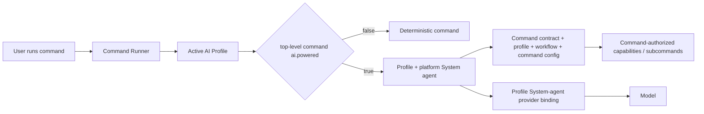

## Commands Folder — Specification

### Resolving the command catalog

The selected AI Profile is authoritative for the command catalog. Profile activation resolves `AI_COMMANDS_ROOT` and profile-owned command configuration. Every command execution is profile-aware, whether deterministic or AI-powered.

Reusable command directories must not contain populated operational configuration. Secret-bearing and organization-specific overrides belong in the selected profile's ignored local configuration and are exposed as `AI_COMMAND_CONFIG_PATH`.

`ai-commands/_runtime/` is reserved internal infrastructure, not a public command bundle.

### Structure

Each top-level public command has a command contract and adjacent metadata manifest.

- `<command-name>/<command-name>.command.md` — required command contract.
- `<command-name>/<command-name>.command.yml` — required lightweight command metadata for the top-level command.
- `<command-name>/<command-name>.command.example.config` — required safe configuration template.
- Profile-owned configuration — optional operational values and credential references.
- `<command-name>.command.sh` / `.mjs` — optional deterministic executable.
- `spec.md` — optional detailed normative behavior.
- `<command-name>.command.test.*` — optional deterministic test.
- `<command-name>.scenario.md` — optional live acceptance scenario.
- `feature.yml` / `app.sh` — optional command-owned visual application.

A command bundle may contain subcommands. Subcommands execute under the parent command's contract and AI execution mode and do not declare their own `ai.powered` metadata unless they are promoted to independent top-level commands.

Every top-level public command MUST have an adjacent `<command-name>.command.yml` with an explicit AI-powered flag. The canonical minimum is:

```yaml
ai:
  powered: false
```

`false` is the default for the catalog. Existing and newly created commands remain deterministic unless a human intentionally changes that command's metadata/contract to `true` and defines the AI-powered behavior. Hosts MUST fail validation for a top-level public command whose adjacent manifest is missing or whose `ai.powered` value is absent/non-boolean; they must not infer `true` from model availability.

### AI-powered commands

AI-powered execution is an execution mode of the same command, not a separate role or replacement command.

```yaml
ai:
  powered: true
```

When `ai.powered: false`, the Command Runner invokes the deterministic executable/UI path normally.

When `ai.powered: true`, the command delegates its interactive AI execution to the active AI Profile's System agent for the selected platform:



The System agent is profile-aware and platform-specific: there is exactly one active System agent per `(profile, platform)` binding. Whether its inference provider is local or remote is an implementation detail of the profile binding and does not change its identity or authority.

AI-powered command execution is not implemented yet. Until that runtime exists, if a top-level command is changed to `ai.powered: true`, the runner MUST stop before deterministic execution and report clearly that AI-powered command support is not implemented yet. It MUST NOT silently ignore the flag or fall back to ordinary execution.

For an AI-powered invocation, the System agent acts only inside the selected command's scope. It may reason, explain, ask questions, guide interactively, and invoke only the deterministic mechanics, subcommands, and external effects authorized by that command contract.

AI-powered mode MUST NOT expand command authority or permanently expand System authority. The command contract remains the authorization boundary for the invocation. System/model reasoning cannot create permissions, bypass confirmations, broaden external effects, access unrelated capabilities, or reinterpret prohibited behavior as allowed.

Commands do not hard-code Hermes, provider, or model details. The selected platform realizes the profile's System agent, and that System agent resolves the profile's configured `system_agent` provider/model binding. Hermes is currently the default local platform/harness assumption, but the command contract remains platform-independent.

A command may also use direct provider inference for narrow deterministic operations. Agentic/interactive behavior uses the System-agent path:

```text
simple inference: command -> profile provider -> model
AI-powered command: command -> active profile/platform System agent -> command scope -> deterministic mechanics/subcommands
```

### Command App Launchers (`app.sh`)

A command may provide an optional `app.sh` visual surface. UI and CLI remain adapters over the same command contract and authority boundary.

### Platform vs Workflow Commands

Platform commands are workflow-independent utilities; workflow commands belong to a bounded context and may know workflow-specific concepts. Do not force one universal command when domains differ.

### Command Documentation Convention (`*.command.md`)

Every top-level command documentation file must contain `## Purpose`, `## Inputs`, `## Outputs`, and `## Entry Point` in that order, followed by a mandatory `## Supported Prompts` section before behavior/implementation detail.

Every top-level command contract has an adjacent `<command-name>.command.yml` AI execution declaration. Commands with `ai.powered: false` remain deterministic. Commands changed to `ai.powered: true` are considered declared for future System-agent execution and, until support lands, must stop with the explicit unsupported message.

Subcommand contracts may exist inside a bundle but inherit the parent command's execution mode and authority envelope. They do not independently select AI execution.

### Command Resolution

User input is interpreted through the selected workflow and evaluated against available commands. The host resolves the top-level command first, reads that command's manifest, then either executes it deterministically or delegates the invocation to the active profile/platform System agent. Profile policy may disable AI execution but MUST NOT turn a command whose catalog flag is `false` into an AI-powered command without an explicitly governed command metadata change.

### Workflow Integration

Commands accept workflow-provided input, produce workflow-consumable output, respect workflow/project scope, and retain the same authority regardless of execution adapter.

### AI provider relationship

AI providers belong to the active profile. Provider selection supplies inference only; it does not grant capabilities. AI-powered commands use the provider/model bound to the active profile/platform System agent. The provider may be local or remote; command authority remains defined by the command contract.
