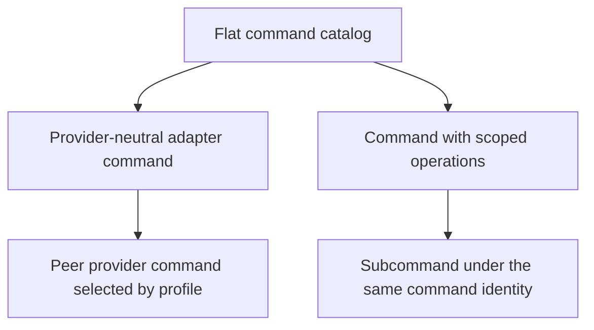
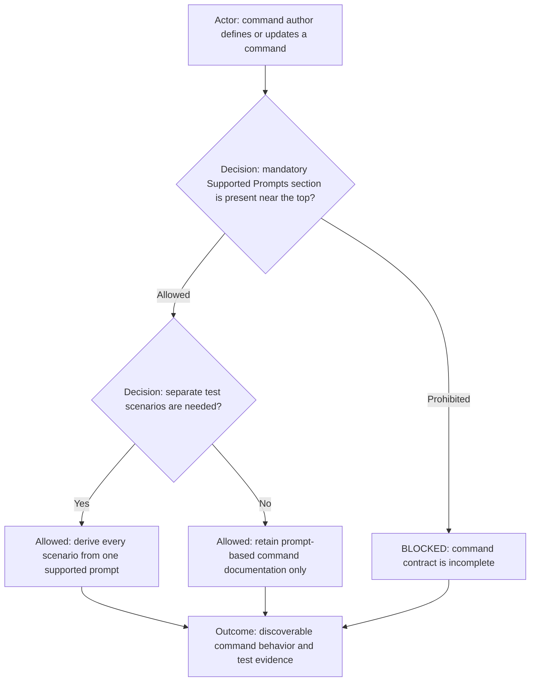

## Commands Folder — Specification

### Structure

Each command lives under `commands/<command-name>/` and follows:

- `<command-name>.command.md` — **required**
  Defines purpose, usage, inputs/outputs, and behavior.

- `<command-name>.command.config` — optional
  User configuration (gitignored).

- `<command-name>.command-default.config` — optional
  Tracked defaults loaded before example and user config.

- `<command-name>.command.example.config` — optional
  Template for user config. When no defaults exist and no user config is present,
  the command may prompt to create a user config from this file.

- `<command-name>.command.sh` — optional
  Main executable script.

- Additional scripts allowed:
  `<command-name>-*.command.sh`
  Example: `sms.command-twilio.setup.sh`

- Provider/source adapters are allowed when one command needs source-specific parsing.
  Prefer `<command-name>-<provider>-<source>-adapter.command.sh` for shell entrypoints.
  Example: `statements-rbc-statement-adapter.command.sh`

- `commands/dependencies.txt` — optional
  Shared Python package requirements for command scripts. Command shell entrypoints that run Python should create/use
the shared `commands/.venv/` and install these dependencies before running Python helpers.

- `commands/<command-name>/dependencies.txt` — optional
  Command-specific Python package additions. Use only when a command needs packages that should not be part of the
shared command environment.

- `commands/<command-name>/feature.yml` — optional
  Lightweight feature-app metadata for command-owned visual tools. When present, `launch: app.sh` declares the
executable launch entry point so the main launcher does not have to guess. This is metadata, not a plugin framework.

- `commands/.venv/` — optional and gitignored
  Shared Python virtual environment for command scripts. Do not rely on globally installed Python packages when command
dependencies are declared.

Only the `.md` file is mandatory.

### Flat Catalog, Adapter Commands, and Subcommands



Prefer a flat public command namespace because direct command names are easier
to discover, search, register, link, and validate. Adapter commands such as
`source-control` and `ticket-tracker` remain top-level peers of provider
commands such as `git` and `jira`; the adapter relationship does not require
directory nesting.

Subcommands are a separate concept. A subcommand is a scoped operation that
shares one parent command's identity, contract, authorization boundary, and
configuration—for example, `discussion lookup-conversation`. Use a subcommand
when the operation is part of the same capability, not to model interchangeable
providers. Implementation-only folders remain allowed and do not create new
public command names.

### Command App Launchers (`app.sh`)

A command may provide an optional `app.sh` next to its `*.command.md` and `*.command.sh`. This is the command's visual
tool surface: a small, command-owned UI that can be launched directly from the main AI Electron app while preserving
workflow context.

Use an app launcher when a command benefits from interactive controls, previews, progress streaming, file picking, or
richer visual feedback than a terminal-only script can provide. The launcher is part of the command ecosystem, not a
separate product app. It should be convenient to open from the main AI Electron app and also runnable directly from the
command folder:

```bash
./app.sh
```

Launcher expectations:

- Keep the command documentation source of truth in `<command-name>.command.md`; document the UI launcher there when one exists.
- Keep the launcher self-contained under `commands/<command-name>/` or clearly command-owned subfolders such as `launcher/`.
- Accept launch context from the main AI Electron app when provided, so the UI opens with the selected profile,
workflow, project, scope, paths, output destination, and breadcrumb already applied.
- Do not require manual user preparation after a normal `git pull`. If dependencies are missing, the launcher should
either bootstrap them safely or fail with a clear, actionable message.
- If bootstrapping Node dependencies, distinguish fresh clone setup from repair of an existing install. Fresh clones
may use clean install behavior; launches from an already-running Electron app must not delete or recreate repo-level
`node_modules` in a way that can break the parent app.
- Test launcher startup decisions with non-destructive dry-run coverage where possible, especially for fresh-machine
and partial-install edge cases.
- Treat the UI as independent from the main AI app: it should be runnable with `./app.sh` for local use, while still
integrating cleanly when opened from the main app.
- When creating a new command, consider whether it needs a visual app surface in addition to terminal/script behavior.

Self-contained feature app direction:

- Treat command app launchers as independent feature applications, not implementation details of the main launcher.
- The main launcher discovers and launches feature apps; it should not own feature-specific dialogs when a
command-owned app can own that workflow.
- Feature apps own startup, UI, lifecycle, shutdown, validation, and business flow.
- Feature apps should call their shared TypeScript domain code directly for ordinary application logic.
- Backend APIs are optional and should be introduced only for a real runtime need such as shared services, remote
execution, WebSocket sessions, or long-running orchestration.
- Keep CLI and UI as equal adapters over the same shared domain implementation.
- Use the Video Handwriting launcher as the current reference pattern: command-owned `app.sh`, command-owned UI under
`launcher/`, direct standalone execution, and main launcher integration through the command app button.
- Add `feature.yml` for feature applications so the launch entry point is explicit, for example `id`, `name`,
`workflow`, and `launch: app.sh`.

---

### Platform vs Workflow Commands

Not every command should be globally reusable.

- Platform commands are workflow-independent utilities, such as search, git helpers, Markdown formatting, file
utilities, image optimization, and generic validators.
- Workflow commands belong to a bounded context and are allowed to know workflow-specific concepts.

Examples:

- Multimedia `create-project` may know lyrics, release type, cover mode, thumbnail mode, and scene structure.
- Development `create-project` may know modules, packages, libraries, and release builds.
- Accounting `create-quarter` may know statements, tax reports, quarters, and business folders.

Do not force one universal command when the domains are different. The launcher, command discovery, and `app.sh`
lifecycle are generic; workflow command domain logic is not required to be generic.

### Command Documentation Convention (`*.command.md`)



Every command documentation file must contain a `## Supported Prompts` section near the top, after any title and tags
and before behavior or implementation detail. It declares the natural-language prompts the command accepts and the
expected result for each prompt. A command with no safe supported prompt is `BLOCKED` until its prompt contract is
defined.

A command may add a separate `<command-name>.test-scenarios.md` file for repeatable command testing. Each scenario must
name the supported prompt it exercises, use only that prompt's declared scope and expected result, and state its setup,
steps, expected evidence, and prohibited effects. A scenario must not invent a new prompt, broaden file or workspace
scope, or treat an unavailable optional UI route as a successful visible interaction. The command documentation links to
its separate scenario file when one exists.

For new commands and when updating existing command docs, include:

- `## Tags` — searchable hashtags for command discovery / grep-based lookup
  - example: `#coding #ddd #tdd #code-style #oop`
  - use stable topic tags (avoid one-off wording)
- Prefer adding tags near the top of the file so `rg` lookup and quick scanning work well
- Optional: `## Model Recommendations` when command quality depends on model choice
  - include task-specific guidance (for example: writing command should prefer writing-capable models; coding-focused
models may be a poor fit for creative writing)
  - include a `validated on YYYY-MM-DD` date
  - include `subject to change` wording and provider reference links for revalidation

`## Tags` is strongly recommended for all command docs and should be treated as the default documentation style.

---

## Command Index

- `show` — display file/content in the Central Dialog via `ui:show`
- `show-context` — render files, URLs, local paths, and `--see` drops into browser-visible context
- `taxes` — summarize configured accounting tax reports and optionally open the result through `show-context`
- `statements` — scan accounting statement PDFs for tax-payment candidates and source evidence
- `acc-report` — inspect, create, and validate accounting report folders under reports/[year]/[business]/[quarter]/in|out|statements
- `code-review` — structured code review focused on critical risk and coverage
- `sdd` — spec-driven development (English-first behavior spec -> code -> verification)
- `session` — create/open/list/close the current AI work session (aliases: `work session`, `session flow`; includes
todo gate, close marker, terminal agent reset)
- `backlog` — manage repo-backed backlog files under `session-root/<work-profile>/backlog/`, pick one into the active
session, sync a story to a GitHub issue, and compile to active `plan.md`
- `writing` — produce writing drafts by type (blog/story/essay) using selected narrative approaches
- `tts` — synthesize speech from text/script via the Whisper TTS pipeline
- `audio-report` — alias of `tts` used when the workflow or user expects spoken progress/final reporting
- `note` — create/update/link/retag Smart Notes in Obsidian-compatible Markdown with retrieval-first tag rules
- `multi-media` — multimedia assistant command with subcommands for YouTube, Suno, and blogging policies/templates/checklists
- `youtube` — CRUD/scaffolding command for YouTube channel, playlist, and episode filesystem structures under the multimedia root
- `lyrics-timestamp` — map lyrics plus audio into timestamped JSON/SRT timing artifacts for renderers and subtitle workflows
- `voice-report` — short-lived spoken completion summaries via the shared Whisper TTS stack

---

### Command Resolution

- User input from `ai-session` (see `AGENTS.md`) is interpreted via the selected workflow (`workflows.md`).
- Every verb-like query must be evaluated against available commands in `commands/`.
- If a match is found, the corresponding command is executed within the workflow context.
- When the active project is resolved through the project registry and its `project.yml` declares `project_rule_paths`,
those repo-local rule files must be read before substantive work and treated as mandatory alongside workflow and
command rules.

---

### Workflow Integration

- Commands are executed by workflows and must:
  - Accept workflow-provided input
  - Produce output consumable by the workflow
  - Respect working directories and reporting expectations defined by the workflow

### Command Python Dependencies

- Keep common Python command packages in `commands/dependencies.txt`.
- Command shell entrypoints that run Python should bootstrap the shared `commands/.venv/` before invoking Python helpers.
- Run command Python helpers through `commands/.venv/bin/python`, not through the global `python3`, when dependency files exist.
- A command may add `commands/<command-name>/dependencies.txt` for command-specific extras, but shared dependencies
should be preferred when multiple commands can reasonably use them.
- The command entrypoint may auto-create `.venv/` and install or refresh dependencies when dependency files change.
- Do not assume globally installed Python packages are available when command dependency files exist.
- OS-level tools such as `ffmpeg`, `tesseract`, or `jq` are not Python dependencies; commands should check for them
explicitly and print a clear install hint when they are missing.

---

### Dialog Command Convention

- `commands/dialog/` handles Q/A logging.
- If user input contains `??`:
  - Route to `dialog` command
  - Append entry to:
    `commands/dialog/log/<project-name>/<task-name>/*-dialog.md`
  - Logs are gitignored

---

### Policies

- Commands must load and follow policies defined by the active workflow.
- Commands must also honor project-local rule files declared by the active project's registry metadata (for example
`project_rule_paths` in `commands/projects/registry/<project-id>/project.yml`).
- Workflow policies override local command behavior when applicable.

---

### Shared Scripts

- Common setup script:
  `command-config.setup.sh`
- Should be reused by all commands where applicable.

---

### Policies:

No default workflow policies are enforced.
