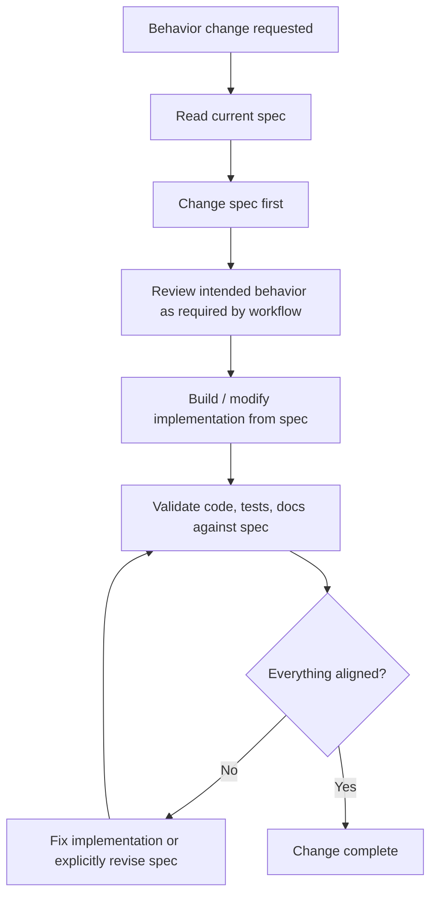
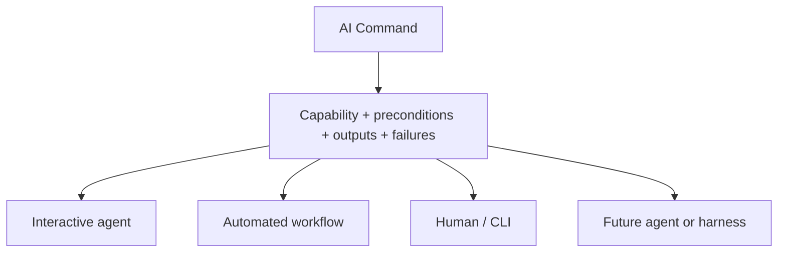
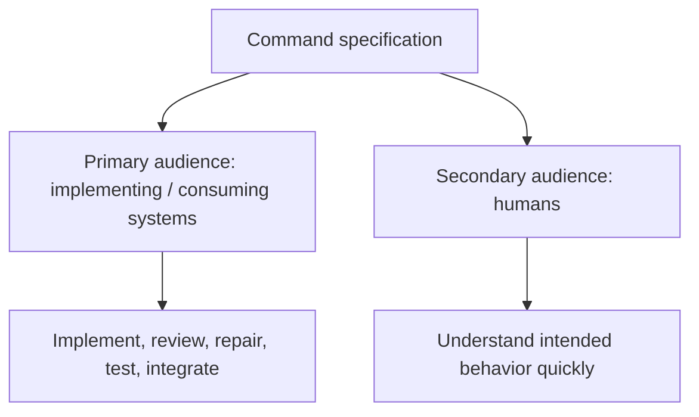
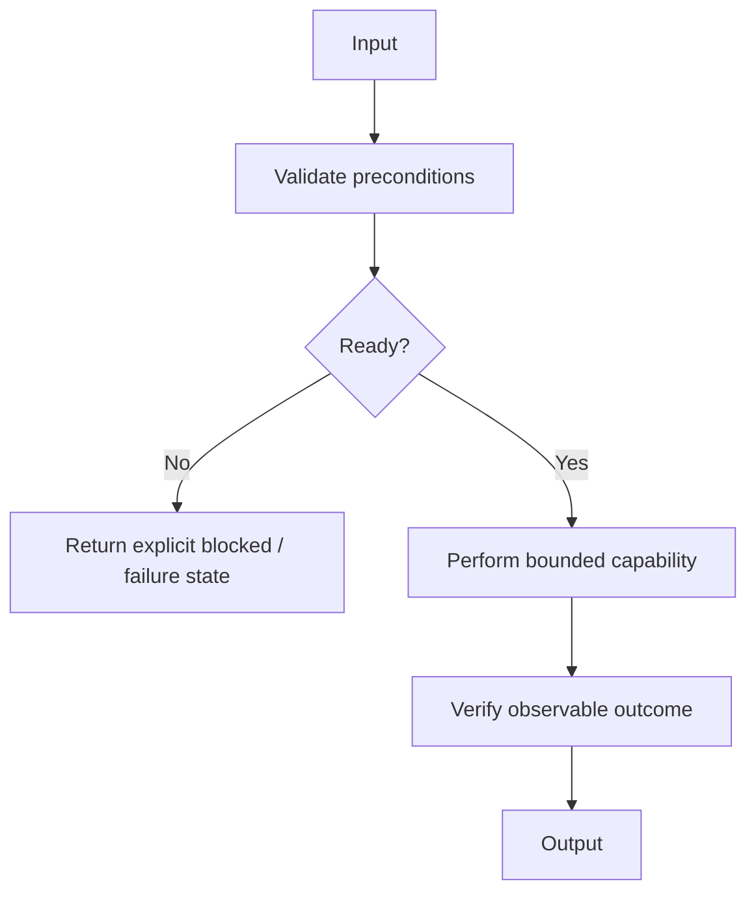

# <Command Name> — Specification

**Status: DRAFT**

This is the normative behavioral specification for the command. It is the source from which behavior is built, changed,
reviewed, and validated. Keep it continuously synchronized with the intended behavior.

## Spec-driven development rule



This repository follows **spec-driven development (SDD)** for command behavior. A behavior change must be represented
in the specification before implementation is changed. The specification describes how the command is supposed to work
now; Git history preserves previous behavior.

## Agent-agnostic contract



Commands are **agent-agnostic by default**. A command does not know which model, agent, workflow, harness, UI, or
orchestration system will consume it. Specifications describe the capability rather than prescribe how a particular
agent should reason or converse.

The consuming workflow/agent decides how to resolve blocked states: interact with a human, invoke another command, stop
a pipeline, retry later, or use another valid mechanism.

## Suggested agent profile

Every command specification should provide a **suggested agent capability profile**. This is guidance for workflows and
launchers selecting an appropriate agent; it does not couple the command to a particular model.

Use capability-oriented metadata rather than model names, parameter counts, or a made-up numeric intelligence score.

Recommended shape:

```yaml
agent_requirements:
  reasoning: low | medium | high
  autonomy: low | medium | high
  tool_use: optional | required
  human_interaction: optional | required
  capabilities:
    - <specific capability>
```

Interpretation:

- `reasoning` — complexity of interpretation, planning, recovery, and decisions expected from the consuming agent.
- `autonomy` — how much multi-step orchestration the consumer is expected to perform without a workflow spelling out every action.
- `tool_use` — whether execution requires an agent capable of invoking external tools/commands.
- `human_interaction` — whether successful orchestration may require obtaining information, authorization, or physical
actions from a human.
- `capabilities` — concrete requirements such as `shell`, `web-access`, `structured-failure-handling`,
`human-authorization`, or `physical-device-coordination`.

The profile is **suggested**, not an execution guarantee. A workflow may choose a different agent if it can satisfy the
command contract. Do not infer capability solely from model parameter count.

## Audience and reading model



The primary machine audience includes agents and systems implementing, reviewing, testing, or consuming the command.
The secondary audience is a human reviewing it. A human should understand the complete idea from the first screen
without needing to read the detailed machine-facing specification.

## Style and attitude

Write the specification as an executable behavioral contract, not an essay, tutorial, implementation diary, marketing
document, or prompt for one particular agent.

- Lead with one compact **At a glance** Mermaid diagram.
- Immediately summarize **Input**, **Output**, **Execution**, **Critical boundary**, and **Suggested agent profile**.
- Use precise `must`, `must not`, and `should` language.
- Prefer diagrams for flows, states, interactions, and boundaries.
- Express dependencies as preconditions and missing dependencies as explicit blocked/failure states.
- Express human authorization as a required boundary without assuming how the consumer obtains it.
- Describe intended behavior independently of current implementation and consuming agent.
- Separate authoritative sources from community/context sources.
- Define success through observable evidence.

## At a glance



**Input:** <required input/context>

**Output:** <observable result>

**Execution:** <how the capability achieves the result>

**Critical boundary:** <authorization, trust, destructive action, external effect, or `None`>

**Suggested agent profile:** <reasoning/autonomy/tool/human-interaction requirements>

## Scope

Define current behavior and explicit non-goals.

## Preconditions and dependencies

Define required/optional inputs, environment assumptions, connected resources, dependencies, authorization
requirements, and explicit blocked states when prerequisites are absent.

## Behavior

Define the command's behavior, decisions, states, and observable transitions without assuming a specific orchestrator.

## States and failures

List meaningful execution, blocked, failure, and completion states. Prefer stable machine-readable identifiers where useful.

## Safety invariants

Define authorization boundaries, prohibited behavior, trust boundaries, validation requirements, and fail-safe behavior.

## External sources / dependencies

Define authoritative sources, APIs, tools, protocols, and fallbacks.

## Completion criteria

Define observable evidence required before reporting success.

## Future scope

Record likely extensions without silently making them part of the current contract.
