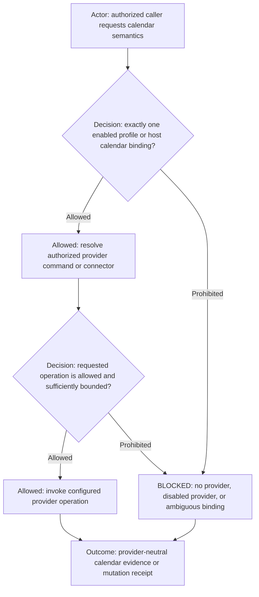

# calendar

## Purpose

Use `calendar` to perform provider-neutral calendar reads and explicitly authorized calendar mutations.

The command represents calendar semantics, not a specific calendar product. A selected AI Profile resolves the concrete provider command and provider-specific settings.

## Inputs

| Input | Required | Source | Description |
|---|---|---|---|
| Active AI Profile | Yes | Host activation | Authorizes the command and resolves profile-owned configuration. |
| Command-specific input | Yes | User, role, workflow, profile, or source artifact | Calendar intent, time range, event context, and requested operation. |

## Outputs

| Output | Destination | Description |
|---|---|---|
| Calendar result | Caller or authorized external system | Provider-neutral event/free-busy data or verified mutation receipt. |

Command kind: `adapter`.

Adapter layer: `provider-neutral`.

## Entry point

| Entry point | Type | Profile-aware invocation |
|---|---|---|
| `calendar/calendar.command.md` | AI-readable contract | The initialized caller loads this contract after the host activates the selected profile and resolves profile-owned command configuration. |

Committed configuration template: `calendar/calendar.command.example.config`. Copy it into the selected profile, set only supported values, reference the copied file through `commands[].config`, and let the host expose it as `AI_COMMAND_CONFIG_PATH`. The committed example is documentation and must never be used as operational configuration.

## Operational skill

For calendar agenda, availability, conflict, planning-reconciliation, or event-mutation requests, read and follow the
[Calendar operations skill](skills/calendar-operations/SKILL.md). It owns provider/tool selection, structured-provider
preference, unavailable-provider behavior, idempotent mutation, and verification. Role-specific policies such as
Personal Governor calendar governance continue to own the meaning and authority of the requested calendar change.

## Provider-neutral resolution

Callers request semantics such as event search, agenda, free/busy, create, update, or delete. They must not choose a provider by brand name unless the surrounding configuration task is explicitly about provider setup.

The effective provider binding may come from an explicit profile command override or an authorized host connected-app
binding. The result must identify exactly one provider/account context and remain inspectable. The selected profile owns
calendar constraints, default calendar intent, timezone, supported operation names, and command-specific overrides;
the host connector may own runtime provider/account identity and authentication. Provider commands/connectors own
mechanical interaction with their service or local implementation.

A provider may be Google Calendar, Microsoft/Outlook, CalDAV, a local/private calendar service, or another registered implementation. Adding a provider does not change this portable command contract.

## Authorization

Read access and mutation access are separate. A configured provider does not by itself authorize event creation, update, deletion, invitation, RSVP, or other external effects.

Mutations require the caller's existing authority plus any explicit human-authorization gates required by the surrounding role/workflow. Missing or ambiguous authority is `BLOCKED`.

## Configuration boundary

This reusable command contains no real account identifiers, calendar IDs, endpoints, organization values, credentials, or provider-specific defaults.

Operational policy values belong to the selected AI Profile and its normal command-override scopes. A host connector may
supply provider/account identity when the profile deliberately leaves those runtime-bound. Credentials remain local
according to profile credential rules.
