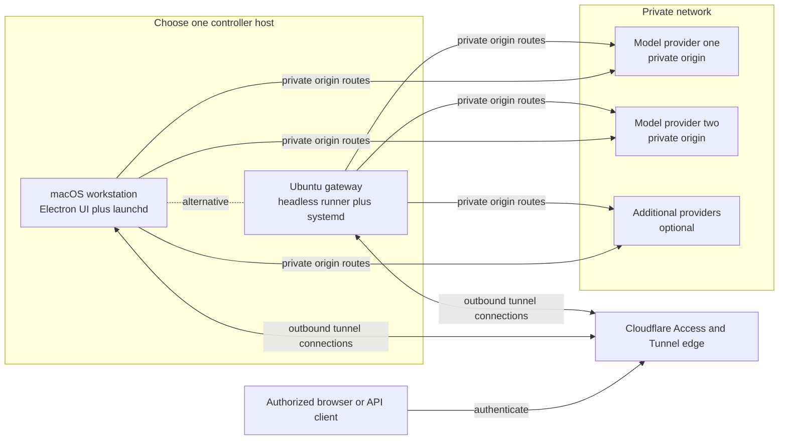
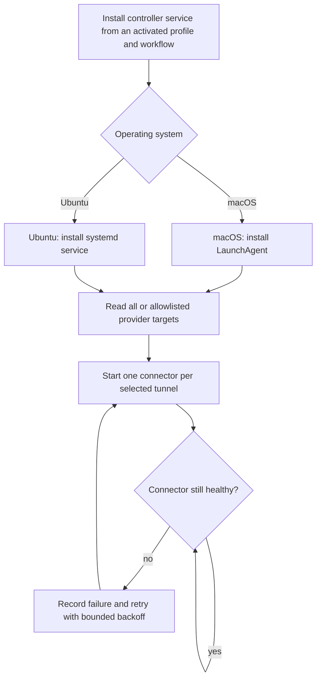
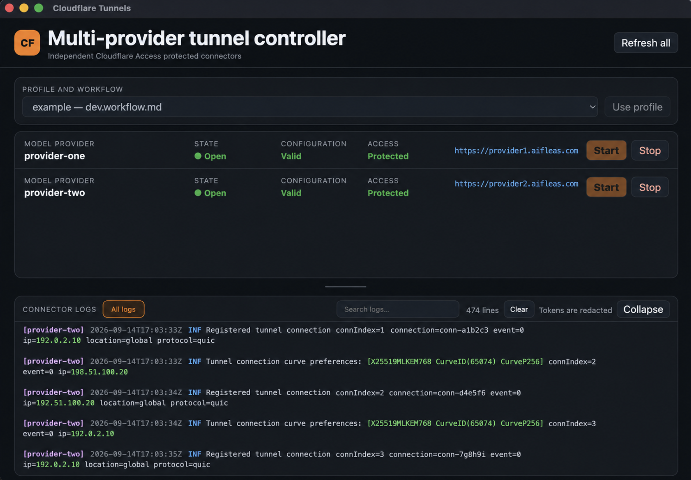

# Cloudflare

## Purpose

`cloudflare` publishes an explicitly configured private HTTP service through a remotely managed Cloudflare Tunnel and
verifies that Cloudflare Access protects the public hostname. It is intended for small trusted-user surfaces such as a
local model Web UI and its OpenAI-compatible API.

The command never creates a router port-forward, exposes an origin address publicly, or stores Cloudflare credentials in
the repository. Account IDs, hostnames, origins, allowed identities, tunnel names, and secret-environment-variable names
belong to the selected operational profile.

Execution route: `command-runner`.

## Inputs

| Input | Required | Source | Description |
|---|---|---|---|
| Active AI Profile and workflow | Yes | Host activation | Authorizes execution and resolves profile-owned configuration. |
| Operation | Yes | User or workflow | One of the bounded operations documented below. |
| Cloudflare configuration | Yes | Selected profile | Public hostname, private origin, tunnel name, exact allowed identities, and secret references. |

## Outputs

| Output | Destination | Description |
|---|---|---|
| Validation or verification result | Caller | Redacted configuration, token, tunnel, service, or Access-gate status. |
| Tunnel process or service | Selected connector host | Outbound Cloudflare Tunnel connector, only for an explicitly selected run/install operation. |

## Entry Point

| Entry point | Type | Profile-aware invocation |
|---|---|---|
| `cloudflare/cloudflare.command.sh` | Shell executable | Activate the selected profile and workflow, then invoke through the profile-aware command runner. |

The host must pass the selected profile's configuration as `AI_COMMAND_CONFIG_PATH` (or
`CLOUDFLARE_COMMAND_CONF`). The command refuses implicit configuration discovery.

Every invocation is profile-aware: the host must verify that the active workflow allows this command, resolve
`AI_COMMANDS_ROOT`, and provide profile-owned configuration before this entry point is used.

Committed configuration template: `cloudflare/cloudflare.command.example.config`. Copy it into the selected profile, set
only supported command value overrides, reference the copied file through `commands[].config`, and let the host expose it
as `AI_COMMAND_CONFIG_PATH`. The committed example is documentation and must never be used as operational configuration.

## Operations

| Operation | Effect |
|---|---|
| `validate` | Validate configuration and secret references without network access or mutation. |
| `token-check` | Verify the configured Cloudflare API token using Cloudflare's read-only token endpoint. |
| `create-tunnel --apply --token-output ABSOLUTE_PATH` | Create a remotely managed tunnel, attach ingress, create its proxied DNS CNAME, and save the returned connector token mode `0600`. |
| `install-connector --apply` | Delegate idempotent `cloudflared` package installation to `install/cloudflare` without reading tunnel credentials or starting a connector. |
| `run-tunnel` | Run `cloudflared` in the foreground using the remotely managed tunnel token. |
| `install-service --apply` | Install the remotely managed tunnel as an operating-system service. This is an explicit host mutation. |
| `verify-access` | Make an unauthenticated request and require a Cloudflare Access login redirect. |
| `ui` | Open the Electron tunnel controller for status, Access verification, logs, and app-owned start/stop actions. |

## Configuration contract

Copy `cloudflare/cloudflare.command.example.config` into the selected profile and reference it through
`commands[].config`. Set the operational values there, but keep tokens in a secret store or process environment.

`CLOUDFLARE_ALLOWED_EMAILS` is advisory configuration used to document the exact allowlist that must exist in the
Cloudflare Access policy. The command rejects `*`, `everyone`, `any`, and empty allowlists. Access application and policy
creation remain a Cloudflare dashboard/API administration step; `verify-access` proves the resulting public boundary
before the URL is handed to another person.

`create-tunnel` requires a scoped API token with Cloudflare Tunnel Write and DNS Write for the configured account and
zone. The account and zone IDs are non-secret but remain profile-owned operational identifiers. Use the least-privilege
token scope; a Global API Key is not supported.

## Security boundary

- The origin must use `http` or `https` and resolve to a loopback, RFC1918 IPv4, `.internal`, `.local`, or `.localhost`
  host. Public origins fail closed.
- The public URL must be HTTPS and must not contain credentials, query parameters, or fragments.
- Tunnel and API tokens are loaded through configured environment-variable names and are never printed. The tunnel token
  may alternatively use a profile-owned absolute `CLOUDFLARE_TUNNEL_TOKEN_FILE` with mode `0600`, allowing UI and service
  launches without placing the token in a desktop process environment. API tokens remain environment-only.
- `create-tunnel` requires an explicit absolute, nonexistent token-output path. It never overwrites a credential file and
  retains the token for recovery if a later ingress or DNS step fails.
- The Access policy must allow exact approved identities and deny unauthenticated traffic. OTP must never be enabled with
  an unrestricted email rule.
- Programmatic clients must use a separately scoped Access service token. Its Client ID and Client Secret are consumer
  credentials; they are not the provisioning API token, tunnel connector token, or model API key. Store their values
  only in the consuming runtime's secret environment and commit only the environment-variable names.
- `verify-access` does not follow redirects or authenticate; it only proves that an unauthenticated request reaches the
  Access login boundary.
- This command does not configure NAT, firewall rules, Cloudflare bypass rules, or public tunnels without Access.
- The Electron renderer never receives or reads API or tunnel tokens. Connector execution remains in the isolated main
  process, logs are redacted, and the Stop action can terminate only a connector started by that UI process.
- `run-tunnel` uses an atomic per-tunnel runtime lock and refuses to start while another `cloudflared` process is active.
  Stale locks are recovered only when their recorded process no longer exists. Signals are forwarded to the connector and
  the lock is removed on exit, preventing accidental duplicate connectors from concurrent terminals or UI windows.

## Deployment architecture

The controller is portable between macOS and Ubuntu. It may run on a workstation or on a dedicated gateway; it does not
need to run on either model-provider host. Every tunnel has an independent public hostname and forwards only to its
configured private origin.



The OS-specific supervisor owns controller availability; the shared profile and workflow own which provider tunnels
exist and which ones start automatically.



## Tunnel controller UI



Run `cloudflare.command.sh ui` from an activated profile and workflow. The launcher follows the same
`app.sh → Electron main/preload → launcher/panel` structure as the Lyrics Timestamp and Handwriting Effect commands.
On first use it installs the pinned command-local Electron dependency with `npm ci` when no compatible host Electron
runtime is supplied through `CLOUDFLARE_ELECTRON_BIN`.

The **Profile and workflow** selector discovers local profiles whose manifest both binds the `cloudflare` command and
explicitly allows it in the listed workflow. Choose a pair and click **Use profile**. The controller clears stale direct
configuration overrides and re-runs the standard command guard for the selected profile and workflow on every
operation; the selector itself does not grant authority. Profile switching is disabled while this window owns a running
connector. Stop that connector before switching so it cannot be accidentally carried across profiles.
The selector and **Model provider** status card also show the workflow's `local_ai.provider` binding, making the provider
resolved by the workflow explicit. Displaying a provider does not invent a tunnel for it: each additional provider still
requires its own profile-owned Cloudflare target before its connector can be managed.

For multiple servers, set `CLOUDFLARE_SERVER_TARGETS` in the profile-owned command configuration to comma-separated
`provider-id=safe/relative-target.env` entries. Each target file contains that server's public URL, private origin,
tunnel name, token reference, account/zone IDs, and approved identities. The controller renders every configured target
as a compact row in a scrollable list with independent Start and Stop controls and a directly clickable public URL.
Different tunnel names may run concurrently; the atomic
runtime lock still refuses a second connector for the same tunnel. Closing the controller stops only connectors started
by that window.
The connector log is a bottom split panel. It can collapse to a compact footer, expands to roughly half the window by
default, and has a draggable horizontal divider so the provider list and logs can be resized independently. Selecting a
server row filters the log stream to that tunnel. Vertically centered tabs show **All logs** and, when selected, only
the current provider; this remains usable when the workflow contains many providers without creating a long tab strip.
Connector output uses dependency-free semantic highlighting for provider tags, timestamps, severity levels, and IP
addresses. Log text is HTML-escaped before highlighting, and existing secret redaction remains in force.
The search field filters the retained output inside the current provider scope. Pressing Escape clears the
query. The controller retains at most 10,000 log chunks by default. Set `CLOUDFLARE_UI_LOG_LIMIT` to a positive integer
to change the limit (capped at 1,000,000). Retention duration depends on log volume, so 10,000 chunks does not guarantee
exactly one day. The header reports displayed and total retained line counts. Connector output and lifecycle events are
also persisted to `~/Library/Logs/AI Fleas/cloudflare-tunnels.log` on macOS (or `CLOUDFLARE_UI_LOG_DIR` when explicitly
configured), with secret redaction and line-based rotation at the same configured limit. Historical lines are restored
when the UI starts. **Clear** empties only the visible buffer; it does not stop connectors or delete the audit log.

If a UI-managed connector exits unexpectedly, the controller records the exit reason and reconnects automatically with
exponential backoff from one second up to 30 seconds. An intentional **Stop** or application quit cancels reconnection.
This protects against transient network and `cloudflared` failures; keeping the controller itself alive across terminal
session loss or crashes requires an operating-system supervisor such as a macOS LaunchAgent. A supervised launch may set
`CLOUDFLARE_UI_AUTOSTART=all` or a comma-separated provider-ID list; only targets configured in the selected authorized
profile/workflow are started.

Run `cloudflare.command.sh install-controller-service --apply` from the activated profile and workflow to install the
native always-on controller. The installer detects the operating system:

- On macOS it installs a per-user LaunchAgent with `RunAtLoad=true` and `KeepAlive=true`. The Electron controller starts
  hidden in the menu bar at login, auto-starts the selected provider tunnels, and reopens when its menu-bar icon is used.
  Under supervision, **Quit** causes a restart; intentionally taking it offline requires unloading the LaunchAgent.
- On Ubuntu it installs a system-level `systemd` unit, starts at boot after networking is ready, and runs the connector
  manager headlessly with `Restart=always`. No graphical session or Electron runtime is required. The optional UI may be
  launched separately and reports these connectors as externally managed.

Both variants pin the currently activated profile and workflow and default to all configured server targets. Set
`CLOUDFLARE_UI_AUTOSTART` to `all` or a comma-separated provider-ID allowlist before installation. Re-run the install
command after moving the repository/profile or changing that selection. Tokens are never copied into the supervisor
definition: use profile-owned `CLOUDFLARE_TUNNEL_TOKEN_FILE` paths with mode `0600` for unattended startup.

An Ubuntu gateway can host every tunnel while the model providers remain on other private-network machines. Configure
each server target's `CLOUDFLARE_ORIGIN_URL` with that server's reachable private IP and port. The gateway must be
able to reach each origin, and firewall rules should permit the model port only from the gateway. A tunnel does not need
to run on the model host itself.

The controller displays configuration validity, installed connector version, whether the tunnel is closed, managed by
this app, or running externally, the unauthenticated Access-gate result, the public URL, and redacted connector logs.

Closing the controller window hides it to the system tray or macOS menu bar and leaves UI-managed connectors running.
Click the tray icon or choose **Show Cloudflare Tunnels** to restore the window. Choose **Quit Cloudflare Tunnels** from
the tray menu to stop connectors managed by the app and exit completely. On macOS the menu-bar item is labeled **CF**
so it remains visible even when template-icon rendering differs between OS versions.
**Start connector** runs `run-tunnel` with the activated profile environment. **Stop connector** is enabled only for the
child process started by the same window; an externally detected connector is intentionally read-only.
If more than one connector process is detected despite the command lock, the UI displays a red **Conflict** state and
disables both lifecycle buttons until the duplicate processes are resolved outside the app.

To acceptance-test the controller, first stop any externally managed test connector. Select **Refresh** and require
**Connector → Closed** with Start enabled and Stop disabled. Select **Start connector**, require **Open · managed here**
with Stop enabled, and verify both `/` and `/v1/models` redirect to Cloudflare Access. Select **Stop connector**, require
**Closed** and no `cloudflared` process, then select **Start connector** once more and repeat the public-boundary check so
the test finishes with the service online.

## Operator runbook

Follow this sequence exactly. An agent may navigate and prepare Cloudflare forms, but the human must confirm immediately
before the final action that creates an API token. Never copy a token into AI chat, a ticket, a committed file, or command
arguments that will be retained in shell history.

### 1. Create the least-privilege API token

1. Sign in to the Cloudflare dashboard and open **My Profile → API Tokens**.
2. Select **Create Token**.
3. Under **Custom token**, select **Get started**. Do not reuse an unrelated infrastructure token or the Global API Key.
4. Give the token a purpose-specific name, such as `Private AI tunnel provisioning`.
5. Add exactly these permission rows:
   - **Account → Cloudflare Tunnel → Edit**
   - **Zone → DNS → Edit**
6. Under **Account Resources**, choose **Include** and the exact account that owns the zone.
7. Under **Zone Resources**, choose **Include → Specific zone** and the exact intended domain.
8. Leave client-IP filtering empty unless the provisioning machine has a known static public address. An optional expiry is
   recommended for a one-time setup token.
9. Select **Continue to summary** and verify the summary contains both scoped permissions and no additional resources.
10. Immediately before **Create Token**, obtain the human's confirmation because this creates a persistent credential.
11. After creation, copy the token once into a trusted password manager or secret store. Do not expose it to the agent.

Load the token into the current terminal without echoing it or adding it to shell history:

```sh
read -s "CLOUDFLARE_API_TOKEN_VALUE?Cloudflare API token: "
echo
export CLOUDFLARE_API_TOKEN_VALUE
```

The operational profile's `CLOUDFLARE_API_TOKEN_ENV` must name `CLOUDFLARE_API_TOKEN_VALUE` or the corresponding
profile-specific environment variable. The name belongs in the profile; the token value does not.

### 2. Get the Account ID and Zone ID from the UI

1. From the Cloudflare dashboard home, open the exact domain that will host the tunnel, such as the domain containing the
   intended public subdomain.
2. Open the domain's **Overview** page.
3. Scroll to the **API** section near the bottom of the Overview page.
4. Copy **Zone ID** into the profile-owned `CLOUDFLARE_ZONE_ID` setting.
5. Copy **Account ID** into the profile-owned `CLOUDFLARE_ACCOUNT_ID` setting.
6. Verify both values are 32-character hexadecimal identifiers and that the Overview page names the expected domain and
   account before saving them.

The Account ID identifies the Cloudflare account and is used for tunnel operations. The Zone ID identifies one DNS zone
and is used when creating the public hostname's DNS record. They are not interchangeable, and neither value is an API or
tunnel token. These identifiers may be stored in the selected operational profile, but reusable command examples must
remain fictional.

### 3. Complete and validate profile configuration

Populate the profile-owned command override with the HTTPS public origin, private origin, tunnel name, account ID, zone
ID, exact approved email addresses, and secret environment-variable names. Account and zone IDs are identifiers rather
than credentials, but they remain operational profile data.

Run:

```sh
cloudflare.command.sh validate
cloudflare.command.sh token-check
```

Do not continue unless local validation succeeds and Cloudflare reports the API token active.

### 4. Create the remotely managed tunnel

Before creation, inspect the Cloudflare account for both the configured tunnel name and the intended public hostname.
If either already belongs to the intended deployment, reuse and verify that tunnel instead of invoking `create-tunnel`
again. A second invocation is not a repair operation and must not create a duplicate tunnel or competing DNS record.

Choose a credential path outside every repository, create its parent directory mode `0700`, and invoke:

```sh
cloudflare.command.sh create-tunnel \
  --apply \
  --token-output /absolute/private/path/tunnel-token
```

The operation creates the tunnel, attaches the configured hostname and origin plus a mandatory `http_status:404`
catch-all, creates the proxied CNAME, and saves the returned connector token mode `0600`. If ingress or DNS creation fails
after tunnel creation, retain the token file and use the reported tunnel identity for recovery; do not blindly rerun and
create duplicates.

### 5. Protect the hostname before starting the connector

In Cloudflare Zero Trust:

1. Open the account's **Cloudflare One** dashboard. In the current dashboard navigation, expand **Access controls** and
   select **Applications**. Older saved URLs such as `/one/access/apps` may show “We could not find that page”; use the
   live sidebar link, whose current route is `/one/access-controls/apps`.
2. If Cloudflare redirects to Zero Trust onboarding, review the available plans. For a small trusted-user or home-lab
   deployment, the displayed **Zero Trust Free** plan may be sufficient; verify its current price, seat limit, retention,
   and included Access features in the live UI. Do not assume historical plan terms.
3. Selecting a plan activates a subscription on the Cloudflare account, including when the displayed price is zero. An
   agent must stop immediately before **Select plan** and obtain the human's explicit confirmation.
4. Complete any remaining account/team onboarding fields without broadening the requested scope. Stop for human input if
   Cloudflare requires billing information, organization policy choices, or terms the human has not approved.
5. On first activation, note the generated **Team name**, confirm the displayed plan is the intended plan, and return to
   **Access controls → Applications**.
6. Select **Create new application**.
7. In **Add an application**, keep **Self-hosted and private** selected, choose **Public DNS**, then select **Continue with
   Self-hosted and private**.
8. Under **Destinations → Public hostnames**, either select the zone and enter the subdomain in the formatted fields or
   select **Switch to custom input** and enter the exact hostname. Do not include `https://`, a trailing slash, or a port.
9. Leave **Path** empty when both the Web UI `/` and API `/v1` must be protected. A path-limited application can
   accidentally leave another route unprotected.
10. Under **Details**, enter a descriptive application name. Keep browser-rendered RDP, SSH, and VNC disabled for an HTTP
    AI service.
11. Under **Access policies**, select **Create new policy**.
12. In the policy dialog, set **Include → Selector** to **Emails** (not **Emails ending in** and not **Everyone**), enter
    one exact identity from `CLOUDFLARE_ALLOWED_EMAILS`, give the policy a descriptive name, and keep **Action → Allow**.
    Add further exact approved addresses as additional email values or explicitly reviewed include rules.
13. Leave optional JIT, RDP clipboard, and unrelated connection settings at their defaults unless the deployment requires
    them. Do not broaden access while configuring unrelated options.
14. Enable an approved identity provider or Cloudflare One-time PIN. Use the human-access procedure below to choose and
    configure the login method. With One-time PIN, access is still restricted by the policy's exact-email rule;
    possession of an arbitrary email address must not be sufficient.
15. Review the preview before saving. It must show the intended exact hostname, an **Allow** policy, and only approved
    identity sources.
16. Immediately before selecting **Save policy**, obtain human confirmation because this changes who can reach the
    service. After the policy is attached, obtain confirmation immediately before the final **Create** action that creates
    the Access application.
17. Never use `Everyone`, an unrestricted email domain, a wildcard destination, or One-time PIN without an exact identity
    restriction.
18. After creation, return to **Access controls → Applications** and require the application table to show the intended
    application name, exact destination, attached policy, and **Self-hosted** type. Open the attached policy and verify
    every approved address appears as **Include → Emails → exact address**. Treat a success notification alone as
    insufficient verification.

Do not start the connector before this policy exists. DNS and an active connector without Access would publish the origin
to unauthenticated Internet users.

### 6. Configure human browser access

Cloudflare Access supports two useful human login methods for this deployment. Both identify the user; the application's
exact-email Allow policy still decides whether that identity may reach the protected Web UI.

| Method | User experience | Cloud configuration |
|---|---|---|
| One-time PIN | Enter an approved email address, then enter the emailed code. | Enable Cloudflare One-time PIN. No external OAuth credential is required. |
| Google | Select a Google account and approve the basic profile/email request. | Create a Google OAuth web client and add Google as a Cloudflare identity provider. A Google Workspace subscription is not required. |

Prefer Google for regular users who already use Google accounts. Keep One-time PIN as a simple fallback when appropriate.
Neither method replaces the Access Allow policy, and neither is suitable for Hermes or another unattended client.

To add Google login:

1. In Google Cloud, create or select a dedicated project for the Cloudflare Access integration.
2. Configure **Google Auth Platform** with a descriptive app name, support/contact email, and **External** audience when
   approved users may have ordinary Google accounts outside one Google Workspace organization.
3. Create an OAuth client of type **Web application**.
4. Set **Authorized JavaScript origins** to the Cloudflare Access team domain:

   ```text
   https://<team-name>.cloudflareaccess.com
   ```

5. Set **Authorized redirect URIs** to the Access callback:

   ```text
   https://<team-name>.cloudflareaccess.com/cdn-cgi/access/callback
   ```

6. Immediately store the generated Client ID and Client Secret in an approved secret store. The Client Secret is a
   persistent credential: do not place it in the AI Profile, repository, chat, ticket, screenshot, or shell history.
7. In Cloudflare Zero Trust, open **Integrations -> Identity providers**, add **Google**, and enter the OAuth Client ID and
   Client Secret. Obtain human confirmation immediately before creating the OAuth client and before saving the secret in
   Cloudflare when those actions were not already approved as one explicit setup operation.
8. Select **Test** beside Google and complete a login. Require Cloudflare to report that the connection works and show the
   expected email identity.
9. Confirm the protected Access application accepts the Google identity provider. When the application is configured to
   accept all available identity providers, Google is included automatically; otherwise add it explicitly.
10. Test an approved email and an unapproved email in separate private browser sessions. Google authentication succeeding
    does not prove authorization—the unapproved identity must still be denied by the application's exact-email policy.

The AI Profile does not store Google OAuth credentials. Its human-access contract is the exact allowlist in
`CLOUDFLARE_ALLOWED_EMAILS`, plus the hostname/tunnel configuration described below. Identity-provider credentials live
only in Cloudflare and the provider's credential store.

### 7. Add machine-to-machine access for Hermes

Browser users authenticate through an approved identity provider or One-time PIN. Hermes cannot complete that
interactive email/browser flow, so give it a Cloudflare Access service token when it must use the protected remote
hostname.

Keep the resource model machine-oriented:

```text
AI provider machine
  -> one profile-owned provider ID
  -> one Cloudflare tunnel target and public hostname
  -> one Access application protecting that hostname
  -> one or more explicitly authorized client service tokens
  -> any models advertised by that provider endpoint
```

Do not create a tunnel or service token per model. Models can change while the serving computer, endpoint, and access
boundary remain stable. Prefer one tunnel target per independently operated provider computer so it can be started,
stopped, diagnosed, and authorized without affecting another provider.

Use descriptive names derived from the profile, calling client, and destination provider machine:

| Object | Recommended pattern | Example |
|---|---|---|
| Provider ID | `<machine>-model-provider` | `asus-gx10-model-provider` |
| Tunnel | `<profile>-<machine>-model-provider` | `example-asus-gx10-model-provider` |
| Access application | `<profile>-<machine>-model-access` | `example-asus-gx10-model-access` |
| Service token | `<profile>-<client>-to-<machine>` | `example-hermes-laptop-to-gx10` |

Avoid names such as `model-1`, `model-2`, or `remote-model-access-2`; they do not identify the credential owner or
destination. A second client gets its own token. An unused or superseded token should be clearly marked and then revoked
after confirming it has no consumers.

In Cloudflare Zero Trust:

1. Open **Access controls → Service credentials → Service Tokens** and select **Create Service Token**.
2. Enter a descriptive client-to-provider name and choose the shortest practical expiration. Creation produces a
   persistent credential, so obtain explicit human confirmation immediately before the final create action.
3. Store the displayed Client ID and Client Secret immediately in an approved local secret store. Cloudflare displays
   the secret only at creation; never paste either value into chat, tickets, logs, or committed files.
4. Open **Access controls → Applications**, select the exact provider application, and add a separate policy for the
   service token. Use the service-authentication action and include only the exact named service token. Do not replace or
   broaden the existing human email policy.
5. Review the application destination and policy summary, then obtain explicit confirmation before saving the access
   change.

Expose the two values to the Hermes initialization process through profile-specific environment variables. The public
profile shows the committed shape:

```yaml
endpoint:
  default: local
  connections:
    local:
      url: http://192.0.2.32:8000/v1
    remote:
      url: https://model-box.example.com/v1
      headers:
        CF-Access-Client-Id:
          environment_variable: EXAMPLE_CF_ACCESS_CLIENT_ID
        CF-Access-Client-Secret:
          environment_variable: EXAMPLE_CF_ACCESS_CLIENT_SECRET
```

The YAML contains only secret references. The actual values belong in the selected profile's ignored local environment.
Initialize the remote Hermes instance with the named connection, for example:

```sh
hermes-agents.command.sh initialize \
  --work-profile example \
  --workflow dev \
  --instance 2 \
  --connection remote
```

Require three pieces of evidence before declaring this route ready:

1. preflight successfully retrieves `/v1/models` through the protected hostname;
2. the generated Hermes profile records the HTTPS remote base URL and only the expected header names;
3. a harmless chat completion succeeds and its redacted Hermes log names the same remote base URL and concrete model.

A successful chat by itself proves only that some endpoint answered. A Cloudflare login redirect or HTML `302` from an
auxiliary request means that request did not authenticate consistently; verify service-token header propagation for
every request path, including title generation, model listing, and chat completion.

### 8. Run, verify, and install

Run `cloudflare.command.sh install-connector --apply`. The connection command delegates physical package installation to
the separately registered `install/cloudflare` command and then returns without starting a connector. The operation is
idempotent when `cloudflared` is already on `PATH`. On Homebrew-based macOS hosts the installer uses
`brew install cloudflared`. Do not use a generic `brew services start cloudflared` invocation for a remotely managed
tunnel because the connector must run with this tunnel's saved token.

Load the saved connector token into the environment variable named by `CLOUDFLARE_TUNNEL_TOKEN_ENV`, or configure the
profile-owned absolute mode-`0600` token path as `CLOUDFLARE_TUNNEL_TOKEN_FILE`. Then run
`cloudflare.command.sh run-tunnel` in the foreground for the first test. In another activated terminal, run
`cloudflare.command.sh verify-access`. It must observe a Cloudflare Access login redirect while unauthenticated.

For the first verification, check both the root URL and a representative API route such as `/v1/models`. Both should
return an HTTP redirect to the configured `.cloudflareaccess.com` hostname. Record status codes and the redirect host,
but do not retain the full signed login URL in logs or tickets.

After that gate passes, test one approved and one unapproved identity. Stop the foreground connector and install it
persistently only with an explicit authorized invocation:

```sh
cloudflare.command.sh install-service --apply
```

Do not share the tunnel connector token with API consumers. Use the service-token procedure above for programmatic
`/v1` clients.

### 9. Diagnose the first public request

Before the connector starts, requesting the public hostname can return Cloudflare **Error 1033** or HTTP `530`. This is
expected when DNS points at the tunnel but no healthy `cloudflared` connector is attached; it does not prove that the
origin or Access policy is broken. Confirm the private origin separately, then start the connector only after the Access
application and policy exist.

After the connector starts:

1. An unauthenticated browser request must redirect to the account's `.cloudflareaccess.com` login flow. Receiving the AI
   Web UI directly is a security failure; stop the connector and correct Access before proceeding.
2. Open the exact public HTTPS URL in a private browser window so no existing Cloudflare session can mask the test.
3. Enter one exact approved email, request the One-time PIN or continue through the configured identity provider, and
   complete the challenge. Never share the PIN with an agent or place it in terminal history.
4. Confirm the Web UI loads after authentication and perform one harmless model-list or UI-health action. Do not begin a
   costly inference test until the access boundary is confirmed.
5. Open a second private session and test an unapproved email. It must be denied and must never reach the Web UI.
6. Confirm the API route is protected too. An unauthenticated request to `/v1/models` must redirect or return an Access
   denial, never the origin's model response. A minimal terminal check is:

   ```sh
   curl --silent --show-error --output /dev/null --dump-header - https://ai.example.invalid/v1/models
   ```

   Require an HTTP redirect and a `Location` host ending in `.cloudflareaccess.com`; do not retain the full signed login
   URL in logs.
7. Review Cloudflare Access logs for the successful approved login and the denied unapproved attempt.

## Example

```sh
AI_COMMAND_CONFIG_PATH=/path/to/profile/commands-config/cloudflare/config.env \
  cloudflare.command.sh validate

AI_COMMAND_CONFIG_PATH=/path/to/profile/commands-config/cloudflare/config.env \
  cloudflare.command.sh verify-access
```
