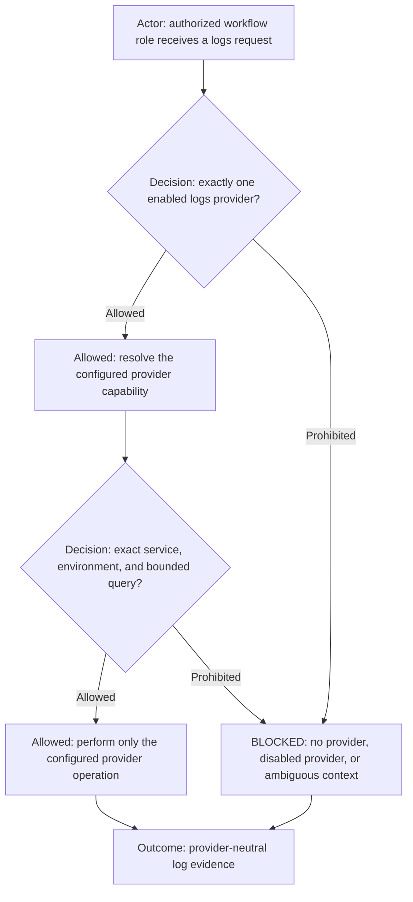

# logs

## Purpose

Use `logs` to perform provider-neutral log search, filtering, retrieval, streaming, and evidence collection for an exact
service and environment.

## Inputs

| Input | Required | Source | Description |
|---|---|---|---|
| Active AI Profile and workflow | Yes | Host activation | Authorizes the command and resolves profile-owned configuration. |
| Log request | Yes | User, workflow, profile, or source artifact | Exact service, environment, time range, query or filters, requested mode, and profile-selected provider binding. |

## Outputs

| Output | Destination | Description |
|---|---|---|
| Log evidence | Caller or configured artifact path | Provider-neutral matching entries, bounded stream evidence, query reference, or explicit no-results result. |

Execution route: `mixed`.

Command kind: `adapter`.

Adapter layer: `provider-neutral`.

## Entry Point

| Entry point | Type | Profile-aware invocation |
|---|---|---|
| `logs/logs.command.md` | AI-readable contract | The initialized workflow role loads this contract after the host activates the selected profile and workflow. |

Every invocation is profile-aware: the host must verify that the active workflow allows this command, resolve `AI_COMMANDS_ROOT`, and provide any profile-owned configuration before this entry point is used.

Committed configuration template: `logs/logs.command.example.config`. Copy it into the selected profile, set only supported command value overrides, reference the copied file through `commands[].config`, and let the host expose it as `AI_COMMAND_CONFIG_PATH`. The committed example is documentation and must never be used as operational configuration.

## Provider-neutral resolution

`logs` is the provider-neutral route for historical search, filtered retrieval, bounded live tail, error-only
inspection, correlation lookup, and log evidence collection. It resolves the provider only from the active workflow's
validated logs context: `logs.provider`, `logs.capability`, and `logs.disabledProviders`.

The request must identify the project, exact service and environment, bounded operation, and a finite time range or an
explicitly bounded live-tail duration. Optional filters may include severity, correlation or trace ID, host, container,
and free-text query. The authorizing workflow role rejects a missing, disabled, ambiguous, or foreign-provider route. Callers must not choose a
provider by naming a product in an otherwise provider-neutral request.

## Provider implementations

After resolving `logs.capability`, load only its registered provider command from the selected `ai_commands_root`.
Provider commands own authentication, query syntax, pagination, transport, browser or API mechanics, and provider-native
result parsing. `logs` and the authorizing workflow role retain intent, authorization, scope, redaction requirements, result limits, and evidence
interpretation.

The active profile/project configuration is the canonical source for provider account/site identity, service and
environment mappings, permitted operations, registered command binding, and supported override keys. Provider commands
must not hardcode an organization's endpoints, identifiers, credentials, or log policy, and must never select themselves
from URL shape, repository contents, company name, current directory, or remembered context.

| Configured capability | Provider command contract | Route |
|---|---|---|
| `datadog` | [`datadog/datadog.command.md`](../datadog/datadog.command.md) | Authorizing workflow role resolves intent; Command Runner executes. |

Adding CloudWatch, Splunk, Elasticsearch, or another provider requires its own registered command contract and an explicit
adapter row here. It does not change the provider-neutral `logs` contract.

## Operations and safety

Supported neutral operations are `search`, `read`, `tail`, `errors`, and `correlate`. A provider binding may support only
a subset; unsupported operations are `BLOCKED` rather than silently translated into a different action.

Log access is read-only. The command must bound result count, time range, and live-tail duration; minimize retrieved data;
redact secrets and sensitive values from returned evidence; and avoid persisting raw logs unless an authorized artifact
destination is explicit. It must not delete logs, change retention, modify indexes or pipelines, create monitors, or alter
provider configuration. Those are separate capabilities.

An unknown, disabled, unavailable, or multiply resolved capability is `BLOCKED`. This command grants no generic shell,
browser, source-editing, deployment, monitoring-configuration, or Command Runner authority.
