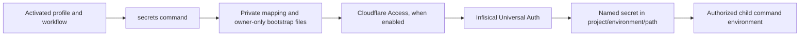
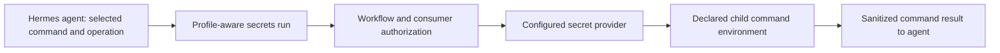

# Secrets command

## Purpose

`secrets` is the provider-neutral AI Fleas capability for inspecting configured secret metadata and resolving credential values required by commands and runtimes at execution time.

The command defines a thin adapter over a configured secret-management backend. Workflows and consuming commands depend on this contract rather than directly depending on Infisical, Vault/OpenBao, an OS keychain, or another implementation.

Execution route: `command-runner`.

The command implements the first provider adapter for Infisical. The profile owns all deployment-specific mapping and
bootstrap paths. The command validates that mapping, authenticates a machine identity, and injects declared values into
an authorized child command. It does not return secret values to the caller.

## Inputs

| Input | Required | Source | Description |
|---|---|---|---|
| Selected profile and workflow | Yes | Trusted activation | Authorizes the capability and resolves its private configuration. |
| Logical secret and consuming command | Yes | Bounded execution request | Identifies the approved backend mapping and child-process destination. |
| Provider configuration | Yes | Profile-owned configuration | Endpoint, project/environment, identity and direct bootstrap references. |

## Outputs

| Output | Destination | Description |
|---|---|---|
| Capability/configuration disposition | Caller | Sanitized validation or connection status; no resolved credentials. |
| Configured secret structure | Caller | Logical names, backend path/key, environment, and consumer-to-variable mappings; no values or bootstrap details. |
| Resolved environment | Authorized child process only | Explicitly mapped values for one profile-authorized command. |

## Entry Point

| Entry point | Type | Profile-aware invocation |
|---|---|---|
| `secrets/secrets.command.sh` | Shell executable | `validate` checks the activated profile configuration, `inspect` prints metadata, `status` authenticates, and `run <consumer> -- <arguments>` injects declared values into an authorized child command. |

Every invocation is profile-aware: verify the active workflow permits `secrets`, resolve `AI_COMMANDS_ROOT`, and load only
its private `AI_COMMAND_CONFIG_PATH`. Committed configuration template: `secrets/secrets.command.example.config`.
Copy that fictional template into the selected profile and bind it through `commands[].config`.

The template maps each logical secret to one Infisical project, environment, path, and key. It maps only declared values
to a consuming command's child-process environment. Universal Auth bootstrap credentials come from a protected local file,
not secret-adapter references, preventing recursive resolution. A logical `ref` is a selector, not a backend lookup by
itself. Missing mappings, credentials, access or authorization block execution.

The profile activation guard must select a profile and workflow that permit `secrets`. `run` additionally requires the
consumer to be bound by that profile and permitted by the same workflow. Its executable must match the declared command
ID and remain inside the activated `AI_COMMANDS_ROOT`. The consumer receives its own profile-owned command configuration
through `AI_COMMAND_CONFIG_PATH`.

`inspect` uses the same activated profile-owned configuration and prints deterministic JSON. It reads no bootstrap file,
does not authenticate to or query the provider, and never resolves secret values. It reports the selected provider and
environment, logical names and their configured backend path/key, and each consumer's environment-variable mapping.
It omits the endpoint, project ID, machine identity, bootstrap paths, and executable paths. With `provider: none`, it
returns empty secret and consumer lists. Provider-side creation, rotation, and expiry timestamps are not present in the
profile configuration, so `inspect` does not claim to report live lifecycle state.

The protected Universal Auth file contains `INFISICAL_CLIENT_ID` and `INFISICAL_CLIENT_SECRET`. When Cloudflare Access
protects the endpoint, a second protected file contains `CF_ACCESS_CLIENT_ID` and `CF_ACCESS_CLIENT_SECRET`. Each file
must be a regular, owner-owned, owner-only file, not a symlink. The Access service token must be allowed by a Service Auth
policy restricted to the Infisical application. These bootstrap credentials remain outside the secret store because the
store cannot retrieve the credentials needed to reach itself. Infisical issues the short-lived API access token after
Universal Auth login. See [Infisical Universal Auth](https://infisical.com/docs/documentation/platform/identities/universal-auth)
and [Cloudflare Service Auth](https://developers.cloudflare.com/cloudflare-one/access-controls/policies/common-policies/).



The private mapping names the Infisical project and environment; it does not contain secret values. For each consumer,
`command_injection` names an allowed command executable and the environment variables it receives. A runtime on another
machine needs its own bootstrap identity and Access credential; copying a profile mapping alone does not give it access.
The Infisical server's own encryption, database and tunnel bootstrap credentials stay outside this resolver.

## Secret references and naming

Profiles and reusable configuration must refer to credentials explicitly with the canonical annotation
`${secret:<logical-name>}`. A field is not treated as secret merely because its name contains `password`, `token`, `key`,
or a similar word. Explicit annotation makes secret use reviewable and prevents accidental implicit resolution.

Logical names use this canonical shape:

```text
<scope>.<environment>.<service>.<credential>
```

Use lowercase ASCII letters, digits and hyphens inside each segment, with dots only as segment separators. Names should
identify the owner/use of the credential rather than its current storage location. Examples:

```text
${secret:example.prod.database.password}
${secret:example.prod.mail.api-token}
${secret:infrastructure.prod.cloudflare.api-token}
${secret:multimedia.prod.voice-provider.api-key}
```

`scope` identifies the bounded project/product/infrastructure area. `environment` distinguishes contexts such as `dev`
and `prod` as defined by the selected profile. `service` identifies the consuming or external service, and `credential`
identifies the credential's role. Do not use generic logical names such as `api-token`, `password`, `database.password`,
or `prod.key`.
Do not encode the provider name, Infisical project ID, physical host, backend path, current secret value, username/email,
or other deployment detail into the logical name unless that concept is genuinely part of the credential's stable
business identity.

Example profile configuration may therefore contain:

```yaml
database:
  password: "${secret:example.prod.database.password}"
cloudflare:
  api_token: "${secret:infrastructure.prod.cloudflare.api-token}"
```

The profile-owned `secrets` configuration maps those stable logical names to provider-specific locations:

```text
${secret:example.prod.database.password}
                 |
                 v
          connect/secrets
                 |
                 v
       configured provider mapping
                 |
                 v
 Infisical project/environment/path/key
```

The logical reference is therefore independent of Infisical. Replacing the backend with another provider changes the
private mapping/adapter, not every workflow and application configuration that consumes the logical secret.

### Collision and alias policy

A logical secret name must resolve to exactly one mapping in the activated profile. Duplicate definitions, multiple
provider mappings for the same logical name, malformed references, unknown logical names, and ambiguous aliases must fail
validation. Resolution must never select the first match, search neighboring scopes, infer an environment, or fall back to
a similarly named environment variable.

This implementation does not support aliases. A rename updates the logical reference and private mapping deliberately.

Logical-name uniqueness is required within the activated profile. Different profiles may intentionally use the same
logical name because profile activation establishes a separate configuration boundary. Within one profile, environment
is part of the name specifically so that `dev` and `prod` credentials cannot collide.

### Resolution and storage rules

- Commit logical `${secret:...}` references, never resolved values.
- Resolve only after profile/workflow authorization and immediately before the authorized execution needs the value.
- Inject a resolved value only into the bounded child process or equivalent provider-supported runtime channel.
- Never substitute a resolved value back into a profile/configuration file.
- Never include resolved values in human-facing stdout, receipts, prompts, Governor memory, durable agent context, screenshots, test fixtures, telemetry, or ordinary logs. Hermes's internal command source is a narrow exception: it requires `KEY=VALUE` data on a captured process pipe during a profile backend start; that pipe is not a user-facing output stream.
- Do not cache resolved values on disk merely to improve convenience. Provider-supported short-lived runtime caching may be used only when explicitly designed and bounded.
- Keep bootstrap credentials separate from ordinary logical secret references so resolving the secret store does not recursively require the secret store.
- Give each machine/runtime identity only the backend secrets it needs. Sharing one universal machine identity defeats the purpose of central secret management.
- Prefer rotation/revocation at the backend while preserving the logical reference, so consumers do not change when a credential value changes.

## Profile boundary

A profile selects the provider and contains only non-secret configuration and logical secret references. The public example profile uses fictional values. Real profile names, domains, hosts, machine identities, service mappings, project/environment names, and other private deployment details belong in the user's private profile/configuration repository, not in the public AI Fleas contract.

The profile-owned `commands[].config` file is the single provider selection point. `provider: infisical` selects the implemented remote adapter. A profile that does not use a secret service may select `provider: none` with no other fields:

```yaml
provider: none
```

With `none`, `validate` succeeds, while `status` and `run` fail with `PROVIDER_DISABLED` before authentication or child execution. Do not declare `${secret:...}` consumers in a workflow using `none`; it never falls back to local environment variables or another store. If the profile does not need the `secrets` capability at all, it may instead omit its command binding. There is no second provider setting in the top-level profile because that could conflict with `commands[].config`.

Actual credential values belong only in the configured secret backend. They must not be committed to Git, written to Governor memory, embedded in diagrams, or printed to logs.

## Initial provider

The first implemented provider is self-hosted Infisical. This is an implementation choice, not part of the portable command contract.

Conceptually:

```text
workflow / command / agent
          |
          | logical secret name
          v
       secrets
          |
          | configured provider adapter
          v
      Infisical
          |
          v
 value returned only to the authorized execution
```

A deployment may host Infisical on an always-on private infrastructure machine and expose it to authorized remote clients through a secure private/tunnel path. Public documentation must use fictional/non-routable names and domains; deployment-specific topology belongs to the private profile.

## Operations

The portable surface remains small:

- inject a named secret into an authorized consuming command's child process;
- validate provider connectivity/authentication without printing secret values;
- report capability/provider health without exposing credentials.

Provider administration, installation, backup, recovery, identity provisioning, and rotation are infrastructure/provider concerns rather than reasons for workflows to depend directly on a vendor.

Before moving a credential from a private profile into a provider, the operator must identify the current value and consumers, choose an encrypted backup destination and recovery-key custody, and verify that the backup can be read. Import the value into the selected project and environment, then test retrieval through the intended machine identity and an authorized consumer. Remove the old local value only after that consumer passes and rollback remains possible. A local profile snapshot does not replace a recoverable backup of the provider's database and encryption keys.

There is no stdout `get` operation. `validate` checks configuration only; `status` verifies machine authentication;
`run` also verifies that the requested secret exists and the identity may read it. A successful `status` does not prove
that every mapped secret exists. A child command can itself print its environment, so only trusted, profile-authorized
consumers should receive values.
The internal `hermes-env hermes-agents <profile-id>` operation exists solely for Hermes's native command secret source. It requires the exact profile, workflow, and consumer binding, emits only that consumer's mapped environment assignments to Hermes's captured startup pipe, and must not be run as an interactive credential lookup.

## Agent use

An agent knows the selected command ID and operation, not a credential value. When a selected command needs a secret,
the agent reads that command's contract and this contract, verifies that both `secrets` and the consumer are allowed by
its activated workflow, and invokes `secrets run <consumer> -- <operation>` through the profile-aware command runner.
The runner fetches only the consumer's declared logical secrets and starts only its declared executable. The agent uses
the child's sanitized result; it must not request a raw value, run `hermes-env` interactively, copy a bootstrap file, or
place a credential in a prompt, shell argument, report, or memory. If the provider or binding is absent, the action is
blocked rather than retried with a local credential.

This is separate from Hermes's model-provider authentication. Hermes's built-in command secret source loads only the
`hermes-agents` consumer's model connection values when that bot starts. It does not make other command credentials
available to the agent. An extra Hermes secret-source plugin is not a prerequisite for AI Fleas command consumers;
their prerequisite is the selected `secrets` command, a profile-authorized consumer mapping, and a working runtime
with its own provider bootstrap. An integration that cannot run as a bounded AI Fleas consumer needs its own reviewed
adapter before agent use, not a generic secret-reading tool.



The host and tool execution boundary matters: a Hermes agent with unrestricted local terminal or file access may be
able to inspect its own process environment or owner-readable bootstrap files. Agent instructions alone do not prevent
that. Strong isolation requires a constrained tool/runtime identity that cannot access those files or process variables;
the `secrets run` contract limits normal command delivery but does not claim to sandbox a hostile agent.
When starting a consumer, the runner removes inherited configured secret variables and provider bootstrap variables
from that child, then injects only the selected consumer's resolved mapping.

The command needs Node.js with the repository's pinned dependencies installed (`npm ci`). A missing dependency blocks
execution. The command does not create an Infisical project, machine identity, Access policy, or secret. Administrators
provision those separately and bind their non-secret IDs and paths in the private profile.

## Runtime policy

- resolve values only when execution requires them;
- grant least privilege to each machine/runtime/agent identity;
- support unattended identities for explicitly authorized 24/7 agents;
- never place resolved values in prompts, durable agent context, memory, source control, reports, or ordinary logs;
- fail closed when provider authentication or authorization is unavailable;
- keep provider selection replaceable through profile configuration.

## FAQ

### How do I move an existing or new secret into the provider?

The `secrets` runner reads and injects values; it does not create or import them. A provider administrator enters the value through the provider's approved UI, CLI, or API. For the current Infisical adapter, open **Secrets Management → project → environment → folder → Add Secret**. Set the secret's key to the private mapping's `backend.key`, enter its value in the provider, and use the folder named by `backend.path`. Then:

1. For an existing local credential, make an encrypted, access-controlled backup and verify that it can be recovered. Keep the current source in place during cutover. For a new credential, create it directly in the provider.
2. Give the runtime's machine identity read access only to the required project and secret. Keep its Universal Auth bootstrap and any Cloudflare Access bootstrap in separate owner-only files outside Git.
3. In the private profile's `secrets` command config, map a stable `${secret:<logical-name>}` to the provider path and key. Map that logical name to the environment variable expected by one declared consumer. Bind both `secrets` and that consumer in the selected workflow. Put no credential value in these files.
4. With that profile and workflow activated, run `secrets validate` to check the mapping, `secrets inspect` to review names and routes, and `secrets status` to check provider authentication. These checks do not prove the consumer can use the value.
5. Run a bounded, read-only consumer operation through `secrets run <consumer> -- <operation>`; for example, `secrets run lodgify -- connection-test`. This fetches the mapped value at execution time and injects it only into the authorized child process. Confirm the operation succeeds and its output and logs contain no value.
6. Once the everyday command path uses the provider successfully, remove the old local value assignment. Keep the encrypted backup according to the owner's recovery policy. Record any planned rotation as a separate follow-up; importing a value does not rotate it.

If the profile selects `provider: none`, `status` and `run` are disabled. Select and configure a supported provider before a secret-dependent consumer can run through this capability.

### How do I rotate a credential without interrupting a consumer?

Rotation is separate from importing an existing value. Record the issuer, authorized consumers, recovery owner, and a verified encrypted backup before changing a live credential. Keep the old credential valid while a replacement is staged. Put the replacement in the same logical secret mapping, then run the ordinary authorized, read-only consumer path with the selected profile and workflow. Confirm its sanitized result and check output, logs, and agent context for disclosure. Revoke the old credential at its issuer only after the replacement succeeds; repeat the ordinary check after revocation. Finally remove old local assignments and stale persisted copies, while retaining the encrypted backup under the owner's recovery policy. Never put either value in a ticket, prompt, shell argument, or test fixture.

Cloudflare Access and Infisical Universal Auth are bootstrap credentials, so rotate them in stages. Create a replacement with the same narrow access, write it to a new owner-only local file, select that file in the private profile, and verify `secrets status` plus one authorized consumer. Revoke the old bootstrap only after that path succeeds, then repeat the check. Rotate the Access credential and the Infisical identity credential separately so a failed stage has an unambiguous recovery path. Do not widen an Access policy or machine identity merely to make a test pass.

If a stage fails, restore the last known working private file reference while its old credential remains valid, diagnose the failed gate, and retry the replacement. If the old credential has already been revoked, recover through the provider or issuer's administrator path and the verified encrypted backup; do not silently fall back to an untracked local value. A provider outage must fail closed for dependent commands.

### How are dev and production separated?

Use distinct logical names, provider environments, machine identities, Cloudflare Access service credentials, and bootstrap files. A successful dev check does not authorize production adoption. Provision and verify production independently, with its own least-privilege grants and recovery custody; never point production consumers at the dev environment or reuse the dev machine identity.

### Should Git credentials be injected by this command?

Decide from the selected profile's real Git authentication path. A working Git credential helper or GitHub CLI keyring path does not need a parallel `secrets` mapping. Add one only for a bounded consumer that actually requires runtime injection, with a reviewed authorization boundary and tests. Do not export a broad Git token to an agent merely because other integrations use the secret service.

### Why not use environment-variable names as the logical secret names?

Environment variables are an injection mechanism, not a durable identity for a credential. Different consumers may need
the same logical secret under different environment-variable names, and environment names tend to expose implementation
details. The logical name remains stable while the consuming-command mapping decides the final environment-variable name.

### How are collisions prevented?

The full `<scope>.<environment>.<service>.<credential>` name is the identity. Within an activated profile it may have only
one mapping. Duplicate, ambiguous, wildcard, or inferred mappings fail closed. `dev` and `prod` are different names rather
than two values selected implicitly from context.

### What happens if the backend changes from Infisical?

The logical `${secret:...}` references remain unchanged. Only the private provider configuration and adapter mapping change.
This is the reason workflows should depend on `connect/secrets`, not on Infisical paths or APIs directly.

### What if a profile has no secret service?

Select the exact `provider: none` configuration or omit the `secrets` binding when no command needs it. `none` is an explicit disabled state, not a plaintext local-secret provider. A command that needs `${secret:...}` must remain blocked until a supported provider and its mapping are configured.

### Why does the secret store itself still need a credential?

Authentication cannot be eliminated; it can be reduced and scoped. A machine keeps a bootstrap identity credential that
proves who it is to the provider. That identity is then authorized only for the logical secrets required by that runtime.
Bootstrap credentials are not resolved through `${secret:...}` because doing so would create a recursive dependency.

### Should several machines share one bootstrap credential?

No by default. Independent machine/runtime identities allow least privilege, auditing, and revocation of one compromised
client without replacing every other client's access. An unattended 24/7 agent should have its own narrowly scoped
identity rather than inheriting a human administrator credential.

### Where should actual secret values appear?

Only in the configured secret backend and transiently in the authorized runtime that needs them. Profiles, Git, Governor
memory, agent prompts, documentation, receipts, and logs contain logical references or redacted metadata, not values.

## Example configuration

See [secrets.command.example.config](secrets.command.example.config) for the command template and
[the fictional profile example](../../../ai-profile/example/commands-config/secrets/config.example.yml) for a profile-owned copy.

## Installation

Installation of the initial backend belongs to [install/infisical](../../install/infisical/infisical.command.md).
That package documents target qualification, persistence, restart policies, health verification, backup/recovery,
HTTPS and optional SMTP, with fictional examples. It provisions a new package-owned stack and refuses automatic adoption
of an existing manual deployment. Installation and secret retrieval are separate capabilities.
