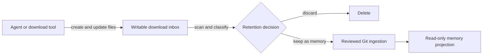

# Use Synology as a download destination

Use a separate writable share when an agent or download tool needs to save files directly. Downloads do not require Git
history: the share is an inbox, not authoritative memory. Give it a dedicated non-admin identity, explicit retention
rules, and no access to memory or unrelated shares.



## Profile contract

```yaml
usage: inbox
access: read-write
mutation: direct
```

Do not map an inbox to a source-control repository. If a downloaded artifact becomes durable knowledge, move it through
the repository's normal review or ingestion process. Configure quotas and expiry where practical so failed downloads or
unattended agents cannot consume unbounded storage.

## Acceptance evidence

- The dedicated identity can create, read, update, and delete one harmless probe in the download share.
- The identity cannot access any memory or unrelated share.
- The profile records the share purpose and retention rule without storing credentials.
- The credential is injected from the approved secret store only when the consuming command runs.

