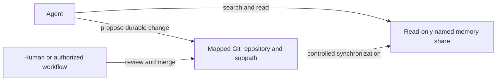

# Use Synology as persistent agent memory

Use a named Synology share as a stable retrieval surface for information an agent may search, list, and read. The
dedicated identity is read-only. Every memory share has exactly one source-control mapping: repository, branch, and
optional relative subpath. Durable additions and corrections go through that mapping, where they retain review history
and rollback. After an authorized merge, a controlled publisher updates the physical Synology folder.



## Mapping granularity

A mapping is required per share; a separate repository is optional. Map several shares to different subpaths of one
repository when they have the same owners, reviewers, visibility, and delivery policy. Use separate repositories when
those boundaries differ or when one share must be independently cloned, revoked, archived, or restored.

| Synology share | Git mapping | Appropriate when |
| --- | --- | --- |
| One share → one repository root | `knowledge` → `/` | The share is an independent product or access boundary. |
| Several shares → repository subpaths | `knowledge` → `articles/`, `projects/` | The folders share governance and release together. |
| One share → repository subpath | `private-memory` → `incorporated/` | The repository also contains content not exposed by this identity. |

The publisher, rather than an agent SMB session, owns the write credential. It checks out the merged revision into a
staging area, validates it, and then publishes only the mapped repository path into the target share. Do not expose a
`.git` directory through SMB and do not run a pull directly inside the served folder. A failed validation or publish
must leave the last good projection available.

## Profile contract

```yaml
usage: memory
access: read-only
mutation: source-control
repository:
  id: example-memory
  branch: main
  subpath: documents/example
  delivery: on-merge
  publisher_checkout: TODO_PUBLISHER_GIT_CHECKOUT
```

The repository ID is logical and does not expose the machine hosting the repository. An agent must not edit the mounted
memory projection directly even when a local operating-system session accidentally makes it writable.
An unresolved publisher location uses an explicit `TODO_*` placeholder and prevents claiming that publication is live.

## Acceptance evidence

- The Team Folder appears by name in Synology Drive and maps to the recorded local projection.
- The dedicated identity can list, search, and read the named share.
- A write probe through that identity fails.
- The configured repository and subpath represent the same content boundary.
- A reviewed repository change reaches the projection through the controlled synchronization route.
- A failed publish preserves the last successfully published projection.
- The identity cannot access an unrelated share.
