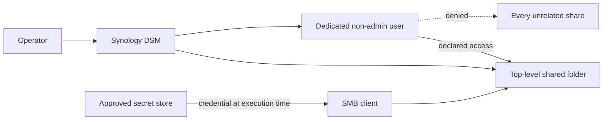
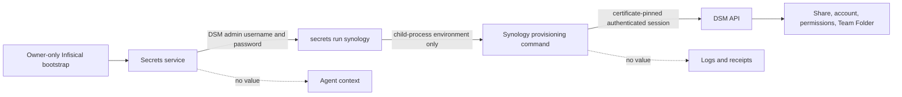

# Provision a named agent share

Create one human-readable top-level share with a dedicated non-admin login, an explicit access mode, and profile-owned
secret references. DSM permissions apply to shared folders; a nested directory or Finder favorite is not an independent
security boundary.

## Provisioning routes

Use either route against the same profile-owned mapping contract:

- **DSM UI route:** the currently verified operator procedure. Use it when the DSM API driver is unavailable or has not
  been verified against the selected DSM version.
- **DSM API route:** `api catalog`, `api status`, and `share apply` pin the configured DSM certificate, receive the DSM
  administrator only through `secrets run`, and always log out. For an existing share and Team Folder, `share apply`
  creates or reuses its dedicated account, reconciles the declared permission, stores the generated credential directly
  in the declared secret keys, verifies permission, and emits value-free evidence. Missing shares or Team Folders block
  for the separately reviewed migration or enablement step.

The verified DSM installation exposes `SYNO.Core.Share`, `SYNO.Core.Share.Permission`, `SYNO.Core.User`, and
`SYNO.SynologyDrive.TeamFolders`. Synology's supported API flow is capability discovery, login, authenticated requests,
and logout. The profile must bind `SYNOLOGY_ADMIN_USERNAME` and `SYNOLOGY_ADMIN_PASSWORD` in its approved secrets
backend before the authenticated readback or future mutation route can run.

Neither route moves existing data as part of share creation. Migration is a separate, reversible operation.

## Administrative bootstrap and generated credentials

Programmatic provisioning requires a DSM account authorized to create shared folders, local users, permissions, and
Team Folders. Prefer a dedicated provisioning administrator over a person's ordinary DSM login. Keep its unique login
in the approved secrets service and inject it only into the bounded provisioning process. It is a bootstrap credential:
the command cannot create DSM resources without an already authorized DSM identity.

The DSM administrator values are ordinary managed secrets. The local owner-only Infisical Universal Auth and optional
Access files are the unavoidable bootstrap that allows the runtime to retrieve them. The secrets runner removes those
bootstrap values before launching the Synology child and injects only `SYNOLOGY_ADMIN_USERNAME` and
`SYNOLOGY_ADMIN_PASSWORD`. The command uses them to create a short-lived DSM session, retains neither value, and logs
out in a `finally` path.

The consumer account is different. Its account name comes from the private profile, while `share apply` generates a
unique password with the operating system's cryptographic random source. The password exists only in process memory and
is delivered directly to DSM and to a separately authorized secret-store writer. It must never appear in command-line
arguments, standard output, logs, temporary files, receipts, Git, or agent context.

The provisioning machine identity needs secret write access, while the runtime consumer still receives only its own
share credential. Prefer a key-scoped custom role when available; the verified self-hosted Free deployment uses the
built-in project Member role because Viewer cannot write and custom roles are unavailable. The sequence is:

1. authenticate to DSM with the injected provisioning administrator;
2. generate the consumer password in memory;
3. create the disabled-by-default or otherwise non-usable consumer identity and reconcile its exact boundaries;
4. write the declared username and password keys through the narrow secret writer;
5. resolve the new credential through the ordinary read-only consumer route and prove positive and negative access;
6. enable or retain the consumer identity only after verification;
7. erase in-memory references and emit a value-free receipt.

For a newly created account, failure to store or verify the credential deletes or disables that account before logout.
For rotation, keep the previous credential valid until the replacement is stored and verified; revoke the old value only
after the new consumer route succeeds.

## DSM UI procedure

1. **Discover and protect.** Discover the NAS, identify the exact source, and confirm snapshot or backup coverage before
   any migration.
2. **Create the shared folder.** In **Control Panel > Shared Folder**, create the configured top-level name. Select the
   configured volume, keep the Recycle Bin enabled, do not restrict the folder to administrators, and enable data
   checksum when the workload supports it. Do not enable encryption or WriteOnce unless the profile explicitly requires
   them.
3. **Enable the Team Folder.** In **Synology Drive Admin Console > Team Folder**, refresh, select the share, and enable
   it. Apply the configured version policy; the verified SC memory shares retain eight versions and rotate versions
   older than 30 days.
4. **Create a dedicated identity.** In **Control Panel > User & Group > User**, create the configured non-admin account.
   A human enters and confirms its unique password directly in DSM. Join only the system `users` group.
5. **Constrain folder access.** Grant the dedicated identity **Read Only** on its one memory share and **No Access** on
   every unrelated share, including `homes`. Accept the DSM notice explaining that the account will not have a personal
   home folder.
6. **Constrain application access.** Allow **Synology Drive** only. Explicitly deny AFP, DSM, FTP, File Station, SFTP,
   Synology Photos, SMB, Universal Search, and rsync. Keep default quotas and transfer limits unless the profile declares
   narrower values. Review the confirmation page before creating the account.
7. **Store the credential.** Save the configured username and password under the profile's declared secret references in
   the approved secret store. Never copy either value into Git, command output, screenshots, or agent text.
8. **Project or migrate data.** Configure the declared download-only Synology Drive projection. For existing data, copy
   first, compare counts and a bounded sample of sizes or hashes, and retain the old source for rollback. Do not delete or
   move the source during provisioning.
9. **Verify and record.** With cached personal credentials cleared, prove that the dedicated identity can read its share,
   cannot write to it, and cannot access an unrelated share. Record a value-free receipt containing the share, account,
   Team Folder/version state, access mode, application boundary, verification time, and result.

## Verified UI evidence

Two operator-owned memory shares were verified during UI provisioning. Exact share names, account names, source paths,
and credential references remain in the private profile. Credential-store, client projection, and positive/negative
access checks remain separate acceptance steps.

| Identity purpose | Allowed Team Folder | Folder access | Application access |
| --- | --- | --- | --- |
| Writing-memory reader | Dedicated writing-memory folder | Read only; all other shares denied | Synology Drive only |
| Financial-memory reader | Dedicated financial-memory folder | Read only; all other shares denied | Synology Drive only |

For remote clients, follow the [private-tunnel access scenario](private-tunnel.md). Use the NAS private DNS name, keep
service ports private, and do not switch this managed route to Synology QuickConnect.

## Credential rotation and revocation

Generate the replacement in the approved secret store, update DSM and the mapped secret during one maintenance window,
clear cached SMB sessions, and repeat positive and negative access checks. Revoke by disabling the dedicated user first;
preserving or deleting data is a separate decision.
