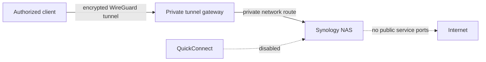

# Access Synology through a private tunnel

This scenario is optional. Use it only when a client must reach Synology outside the trusted LAN and cannot rely on a
local synchronized projection. The recommended trust-minimizing setup is a
self-managed WireGuard tunnel between authorized clients and the network containing the NAS. Keep QuickConnect disabled
and do not publish DSM, SMB, SSH, or Synology Drive ports to the internet.

## Recommended properties

- Terminate the tunnel on a maintained gateway rather than exposing the NAS directly.
- Route only the NAS address and required private subnets.
- Give each client its own revocable tunnel identity.
- Use private DNS for a stable NAS hostname; do not persist changing LAN addresses in agent configuration.
- Restrict DSM administration separately from SMB memory access.
- Keep share-level Synology credentials in the approved secret service even though transport is encrypted.
- Record tunnel configuration, key owner, recovery procedure, and last verification without committing private keys.

A managed overlay network may be selected deliberately when its operational benefits are accepted. Reusing an already
trusted Cloudflare control plane can avoid introducing QuickConnect as a second provider. In that case, select
`cloudflare-private-network`, link the `cloudflare` command, and require WARP/private-network routing. The existing public
hostname/Access tunnel route alone cannot carry a normal SMB mount.

## Acceptance evidence

- QuickConnect is disabled for the managed route.
- DSM, SMB, SSH, and Synology Drive are not reachable from the public internet.
- An authorized tunnel client reaches the NAS by its private hostname.
- A client without an active tunnel cannot reach it.
- Revoking one client identity does not interrupt other authorized clients.
