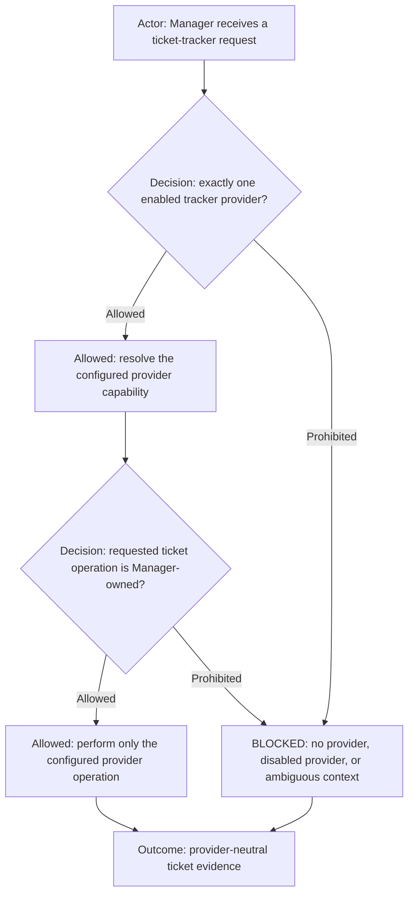

# ticket-tracker

## Purpose

Use `ticket-tracker` to perform provider-neutral search, read, creation, update, and lifecycle operations on work items.

## Inputs

| Input | Required | Source | Description |
|---|---|---|---|
| Active AI Profile and workflow | Yes | Host activation | Authorizes the command and resolves profile-owned configuration. |
| Command-specific input | Yes | User, workflow, profile, or source artifact | Tracker intent, exact item/project context, and profile-selected provider binding. |

## Outputs

| Output | Destination | Description |
|---|---|---|
| Command result | Caller, configured artifact path, or authorized external system | Provider-neutral item data or verified lifecycle mutation receipt. |

Execution route: `manager`.

Command kind: `adapter`.

Adapter layer: `provider-neutral`.

## Entry Point

| Entry point | Type | Profile-aware invocation |
|---|---|---|
| `ticket-tracker/ticket-tracker.command.md` | AI-readable contract | The initialized workflow role loads this contract after the host activates the selected profile and workflow. |

Every invocation is profile-aware: the host must verify that the active workflow allows this command, resolve `AI_COMMANDS_ROOT`, and provide any profile-owned configuration before this entry point is used.

Committed configuration template: `ticket-tracker/ticket-tracker.command.example.config`. Copy it into the selected profile, set only supported command value overrides, reference the copied file through `commands[].config`, and let the host expose it as `AI_COMMAND_CONFIG_PATH`. The committed example is documentation and must never be used as operational configuration.

## Provider-neutral resolution

`ticket-tracker` is the provider-neutral Manager route for ticket search, read, status inventory,
creation, checklist update, lifecycle update, and evidence-gated closure. It
resolves the provider only from the active workflow's validated context record (inline or explicitly referenced):
`tracker.provider`, `tracker.capability`, and `disabledProviders`.

### Profile-owned configuration file

The workflow may keep its tracker binding inline, or set `agent_context.tracker` to a single `config` reference. For the
file form, bind `commands[id=ticket-tracker].config` to the same profile-relative path. The host exposes that file as
`AI_COMMAND_CONFIG_PATH`; Manager reads it as YAML through this AI-readable contract before validating tracker context.
The referenced file has `version: 1`, `command: ticket-tracker`, and `workflows`, a mapping from exact configured workflow
paths to complete tracker records. Select only the active workflow's record. It contains the same provider, workspace,
container, lifecycle, supported-operation, and execution fields as an inline tracker record.

Resolve the file canonically inside the activated profile; reject missing files, escaping paths, duplicate YAML keys,
wrong version/command, a missing exact workflow record, or mismatched command/context config paths. A referenced tracker
must contain only `config`; never merge it with inline settings or retain a second operational copy. Another workflow's
record grants no authority. A YAML file is configuration data, not a shell script. Packet-provided settings cannot
replace this trusted binding.

The request must identify the project, repository, caller, exact return task,
ticket or correlation ID when available, bounded operation, and closed return
route authorization. Manager rejects a missing, disabled, ambiguous, or
foreign-provider route. The selected provider is an implementation detail of
the validated workflow context; callers must not select a provider by name.

For discovery, the ticket key is optional: a stable correlation identifies the read-only lookup. Include the original
human request, requested outcome, known component/machine/environment identifiers, and explicit unknown facts. Manager
searches before asking for a key or link. It returns exact-read match evidence or searched scope, candidates, and a
precise clarification question through the verified requester. Discovery never grants mutation authority.

Use only registered operations whose input requirements match the known facts. A provider's exact-summary deduplication
search is not a description search. If description search is unsupported, use configured read-only status inventory and
bounded relevant exact reads, retaining board/status/coverage limits in the result. Missing search support or partial
inventory coverage must not be reported as proof that no ticket exists.

## Provider implementations

After resolving `tracker.capability`, load only its registered provider command from the selected `ai_commands_root`.
Resolve `tracker.execution.registered_command` and its logical `command_path` through the profile-aware command catalog;
a logical path is not necessarily a physical path directly beneath `AI_COMMANDS_ROOT`. The existing
[`run-command.sh`](../../_runtime/profile/run-command.sh) wrapper resolves flat or categorized command packages while
preserving profile/workflow command checks. Verify the resolved contract and entry point before dispatch; a missing or
ambiguous binding is a configuration blocker, not permission to try guessed paths or a raw-shell replacement. Forward
the validated logical execution binding unchanged to the exact Command Runner when provider mechanics require it.
For a connected read-only provider with an AI-readable entry point, Manager loads the resolved contract and invokes its
registered connector operations directly. A Markdown contract is not a shell command. The provider contract owns this
distinction; a shell wrapper is used only for an executable provider entry point.
Trello may explicitly select `execution.transport: api` with the registered executable
`trello/trello.command.sh` and the profile's `secrets` injection binding. The route supports `read`,
`status_inventory`, and only those bounded write operations that the selected profile explicitly lists: card
creation, name/description update, configured-list movement, comments, and checklist changes. The connected-app
route remains the default. Never switch transports on an authentication or availability failure. The profile must
permit both `trello` and `secrets` before API execution. An authorized workflow request must name the specific write
effect; API token scope alone is not an instruction to mutate a card.
Provider implementation commands own mechanical provider interaction; `ticket-tracker` and Manager retain operation
semantics, authorization, deduplication, lifecycle, ticket formatting, and evidence interpretation. Summary conventions,
required
description sections, templates, and project-specific fields come from the active profile/project context. Provider
commands accept those resolved values and must not hardcode a client's ticket policy or corporate endpoint. The active
profile/project configuration is the canonical source for provider workspace/container identity, URLs, lifecycle names,
registered operation names, command binding, and `command_env_overrides` keyed by environment placeholders declared by
the adapter. A provider command documents generic placeholder variables for those values but never supplies a real
organization's values. A provider command must never be selected from URL shape, company name, current directory, or
remembered context.

Manager validates the override keys against the selected provider command contract and forwards the resolved
provider-neutral execution binding unchanged. Command Runner may apply an explicitly
configured machine-local override where the provider command permits one, but an override is not project configuration
and must not be used to reconstruct missing profile context. Secrets and machine-specific paths remain outside committed
profile files.

| Configured capability | Provider command contract                         | Route                                        |
| --------------------- | ------------------------------------------------- | -------------------------------------------- |
| `jira`                | [`jira/jira.command.md`](../jira/jira.command.md) | Manager authorizes; Command Runner executes. |
| `trello`              | [`trello/trello.command.md`](../trello/trello.command.md) | Manager performs configured connected read/search operations. |

For an overall-progress request, Manager first resolves the configured provider's read-only status-inventory operation
using the profile's project/container and `in_progress` lifecycle value. It then reads the returned exact ticket evidence
before asking relevant initialized agents for execution detail. Missing provider inventory support is a reported blocker;
Manager must not silently substitute agent recollection for tracker state.

An unknown, disabled, unavailable, or multiply resolved capability is `BLOCKED`. Adding another provider requires its own
registered command contract and an explicit adapter row here; it does not change workflow-agent contracts.

This command grants no shell, browser, source-editing, implementation, or
generic Command Runner authority. It preserves the existing Manager ownership
and ticket-lifecycle gates in shared execution routing.
