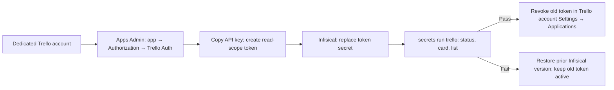

# Trello read-only discovery acceptance

Use an explicitly selected profile/workflow and its authorized workspace and board. Select a human-supplied description
of an existing card; never hardcode an organization's board or card in this public scenario.

1. Verify the profile permits `ticket-tracker` and `trello`, selects Trello, and resolves the registered provider contract.
   For a referenced tracker, verify the command and workflow config paths resolve to the same profile-owned YAML file,
   select the exact active workflow record, and reject a missing, foreign, duplicate, or mixed inline/file binding.
2. Verify the connected read/search capabilities and exact workspace/board/list bindings. Do not use Jira or guessed
   shell paths when the Trello connector is unavailable.
3. Search for the supplied distinguishing terms, scoping both workspace and board; record queries and pagination.
4. Exact-read relevant candidates and compare the outcome and known target facts. Reject a foreign-board result.
5. Verify the human-facing workflow role automatically asks Manager without requiring a card number first; Manager
   returns exact evidence or a precise clarification question through the original correlation and return route.
6. Check status inventory against the configured list identifier, preserving pagination/coverage limits.
7. Confirm no tracker or machine mutation occurred. Report passed checks, evidence, and any untested live-agent gate.

An ambiguous result requires a specific question; incomplete search coverage never proves a card does not exist.
Direct provider-read success does not by itself prove that running workflow agents loaded the corrected binding.

## Unattended API acceptance

For an operational tracker route, the profile must explicitly select `execution.transport: api`. Before activation,
the same direct command checks may run in an isolated checkout containing the proposed executable, while the live
tracker binding stays on its existing route. This requires a dedicated Trello account whose accessible boards are
limited to the intended board, a profile-owned API config, and `secrets run trello` with Infisical-backed
`TRELLO_API_KEY` and `TRELLO_API_TOKEN` injection. The connected Trello app is not used by these checks.

1. Run `secrets validate` and `secrets inspect` under the selected profile and workflow. Inspect names and mappings only;
   do not reveal values.
2. Run `secrets run trello -- status`. Expect `{ "status": "authenticated" }` without account or credential details.
3. Run `secrets run trello -- read <card URL>` for an existing card on the configured board. Verify its returned card
   identity and list. Run `secrets run trello -- list <configured state>` and verify the same card appears when applicable.
4. Test a known foreign-board card only when one is available without broadening the account. It must be blocked.
   Check that errors and command output contain no key, token, Authorization header, or credential-bearing URL.
5. Record the test time, profile/workflow, command result, and token expiry date without recording credential values.

## Trello Auth token renewal

Trello Auth supports `1hour`, `1day`, `30days`, and `never` expiration values; it does **not** offer 90 days. A
30-day token needs renewal before expiry. If the operator chooses `never` to avoid monthly outages, set a separate
90-day rotation reminder and revoke each superseded token after the replacement passes acceptance. The dedicated
account must remain limited to the intended board: a Trello token can read every board that account can access now or
later. The command's board check limits its output but is not a provider-side permission boundary.



1. Sign in at [Trello](https://trello.com/) as the dedicated account and confirm the account email in the avatar menu.
   At **Boards**, verify that only the intended operational board is accessible. The account may own an empty Workspace
   solely to manage its API app; do not add it to the operational board's Workspace for app creation.
2. Open [Apps Admin](https://trello.com/apps/admin), select the existing API-only app, then **Authorization → Trello
   Auth**. Copy its API key if needed. The API secret is for OAuth 1 and is not used by this route. Do not publish the
   app or add collaborators. Do **not** use the page's default **Token** link: it requests `read,write,account` with
   `expiration=never`.
3. In a browser address bar, construct the authorization URL below with that app's API key. Choose `30days` for an
   expiring token or `never` only with an explicit rotation reminder. Keep `scope=read` and confirm the consent screen
   names the dedicated account, says it cannot create/update cards, and shows the intended lifetime. Click **Allow**.

   ```text
   https://trello.com/1/authorize?expiration=30days&scope=read&response_type=token&key=<API_KEY>
   ```

4. Copy the resulting user token directly to the approved secret store, not to chat, a ticket, Git, or a log. In the
   selected profile's Infisical project, environment, and configured path, update the existing mapped token key.
   Leave the old Trello token valid during verification. Never store the
   API secret in place of the user token.
5. Repeat the API acceptance checks above. If they fail, restore the previous secret version in Infisical and retest
   before investigating. If they pass, open the dedicated account's [Trello Settings](https://trello.com/u/my/account),
   find **Applications**, and revoke only the superseded grant. Verify the replacement still passes `status`.
6. Record the new expiry or next rotation date in the operator's reminder system and keep the credential value out of
   task notes. If a token is exposed, revoke it immediately, then issue and validate a replacement.

See [Trello's authorization guide](https://developer.atlassian.com/cloud/trello/guides/rest-api/authorization/) and
[token revocation guide](https://support.atlassian.com/trello/docs/revoking-a-trello-token/) for provider controls.
