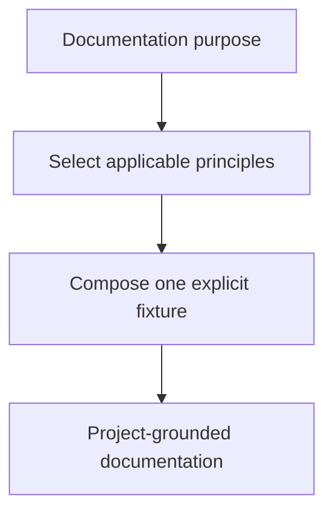

# Documentation Command



The `doc` command provides a portable documentation contract, a deterministic project-readiness check, and five
independent reusable principles:

- Included Rules for explicit transitive rule dependencies.
- Diagram First for meaningful flows, decisions, relationships, and state.
- Project Documentation Context for repository-grounded location and conventions.
- Development Top-of-File Documentation for source and runtime behavior.
- Companion File Documentation for directly invoked scripts and utilities.

## Quick check

```bash
./doc.command.sh --check --project-dir /path/to/project
```

The check is read-only. It reports whether the project directory and `README.md` are available and which conventional
documentation roots exist. It never creates or modifies project documentation.

## Files

- [`doc.command.md`](doc.command.md) — AI-readable contract and principle catalog.
- `doc.command.sh` — deterministic readiness check.
- `doc.command.test.sh` — portable command and contract validation.
- `principles/` — canonical independent documentation principles.

Profile-specific routing, client configuration, credentials, and private workflow roles are intentionally excluded.
