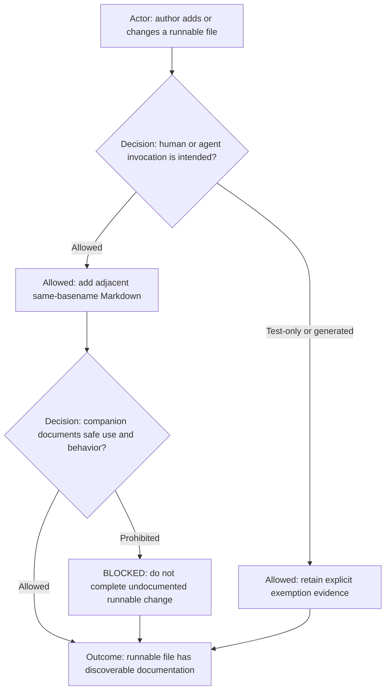

# Companion File Documentation Principle

The diagram classifies a changed runnable file by whether people or agents are intended to invoke it. Intended use requires
an adjacent same-basename Markdown companion and verification of its usage contract. A clearly test-only or generated file
may be exempt with evidence. The outcome is a runnable artifact with discoverable guidance or an explicit exemption.

## Rules

- Select this principle for standalone runnable shell, Python, Node, or other script-like files intended for human or
  agent invocation.
- Place the companion Markdown beside the runnable file and use the same basename. For example,
  `scripts/refresh-cache.sh` requires `scripts/refresh-cache.md`; `python.command.sh` is documented by
  `python.command.md`.
- The companion explains purpose, supported invocation and arguments, prerequisites, side effects, outputs or evidence,
  validation, and known failure or safety conditions.
- Keep the runnable file authoritative for exact implementation and the companion authoritative for how to invoke and
  understand it. Do not duplicate the entire implementation in Markdown.
- Test fixtures, generated files, and files provably not intended for direct invocation are exempt only when their
  location, generator, or adjacent documentation makes that status explicit.
- When the companion changes a command's public contract, retain the command documentation convention and update its
  supported prompts and validation evidence as applicable.

## Tags

#documentation #companion-file #scripts #shell #python #runnable
