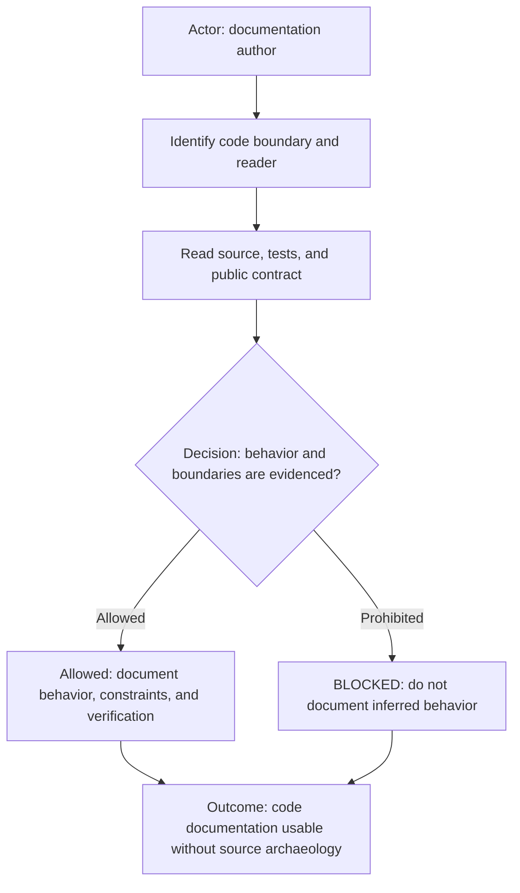

# Development Top-of-File Documentation Principle

The diagram has the author identify the code boundary and intended reader, then ground the document in source, tests, and
the public contract. Evidence permits an explanation of behavior and constraints; missing evidence blocks speculation.
The outcome is concise documentation that lets a reader understand the code without reconstructing its purpose unaided.

## Rules

- Select this principle when documentation explains source modules, libraries, APIs, configuration, data flow, or runtime
  behavior.
- Use one repository-idiomatic documentation header at the top of the file. It states the file's responsibility, intended
  consumers or collaborators, observable behavior, and material constraints or failure conditions.
- Do not add class-level, method-level, or function-level documentation by default. Add lower-level commentary only when
  the project convention or an explicit packet requires it to explain a non-obvious public contract or safety boundary.
- Keep the top-of-file explanation style-neutral. For a domain-driven design file, explain its domain responsibility and
  boundary; for a functional file, explain the function set's shared purpose and effects; otherwise follow the project's
  established terminology without inventing a new architecture style.
- Link to or name the source and tests that ground the document. Source remains authoritative for implementation detail;
  documentation must not duplicate an entire implementation or drift into a second source of truth.
- Explain concepts and behavior before detailed API or configuration reference. Use diagrams when a flow, relationship,
  state transition, ownership boundary, or decision is material.
- Do not infer behavior from names, paths, generated output, or stale notes. Missing code, test, or contract evidence is
  `BLOCKED` until the responsible owner supplies it.
- Keep the header useful to its stated reader: include examples, configuration snippets, or extra failure guidance only
  when they change correct usage or understanding.

## Tags

#documentation #code #api #configuration #behavior #verification
