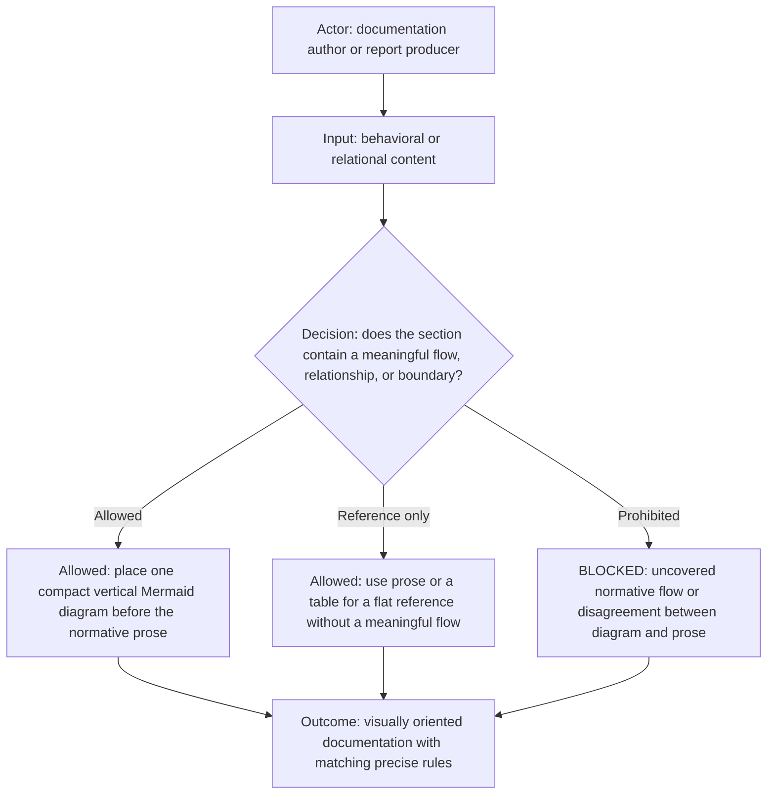
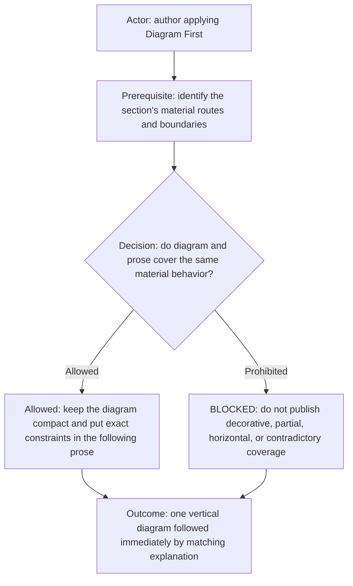
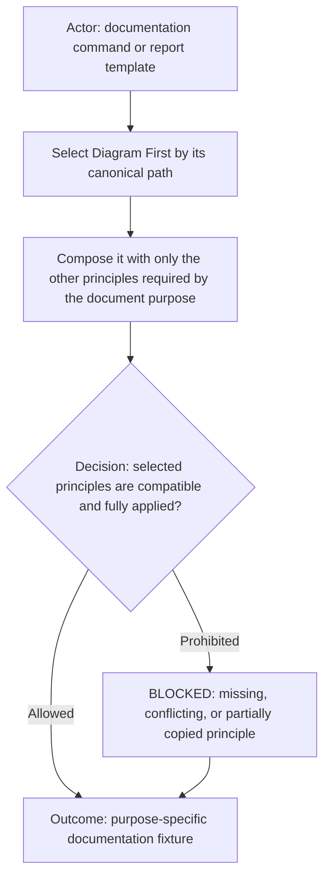

# Diagram First Principle

## Included rules

| Included rule | Required application |
| --- | --- |
| [Included Rules Principle](included-rules-principle.md) | Load and apply its explicit, transitive, fail-closed dependency semantics before this principle. |
| Complete included-rule context | A missing, unreadable, partial, conflicting, remembered, or locally copied substitute is `BLOCKED_INCLUDED_RULE_CONTEXT`. |

## Applicability

This reusable documentation principle makes behavior and boundaries visible before their detailed explanation. A command,
workflow, report template, or documentation fixture selects it when the documented subject contains a meaningful flow,
relationship, state transition, decision, ownership boundary, or allowed and prohibited route.

## Rules

- Place the diagram before the prose it governs.
- Mermaid flow diagrams declare exactly `flowchart TD`.
- Show the actor or subject, prerequisite or input, decision where applicable, allowed route, prohibited or failure route,
  and terminal outcome.
- Keep the diagram small enough to orient the reader. Put exact constraints, evidence, and edge cases in the matching prose.
- For every newly created or modified diagram, the first following prose block must explicitly explain its actor, material
  nodes or states, decision branches, and terminal outcome; a generic heading or unrelated summary is insufficient.
- Treat the diagram as normative documentation, not decoration. Every material diagram route must be supported by prose,
  and every material prose route or boundary must appear in the diagram.
- A diagram/prose mismatch or an uncovered behavioral section is a documentation defect and blocks validation.
- Do not force a flowchart onto a glossary, flat reference list, field catalog, or other content without a meaningful flow or
  relationship. Use prose or a table for that content.
- A section consisting only of a flat reference table does not require a diagram to explain the table. The exemption ends
  when the section adds a behavioral flow, decision, state transition, ownership boundary, allowed route, or prohibited
  route outside the table; that behavior requires the normal diagram-first coverage.
- Do not use parentheses in Mermaid node labels because they can cause rendering failures.

## Fixture use

Select this principle by referencing this file. Do not copy a shortened local version into another command or role contract.
The composing fixture may add stricter purpose-specific requirements, but it must not weaken or contradict this principle.

## Tags

#documentation #principle #diagram-first #mermaid #template #fixture
