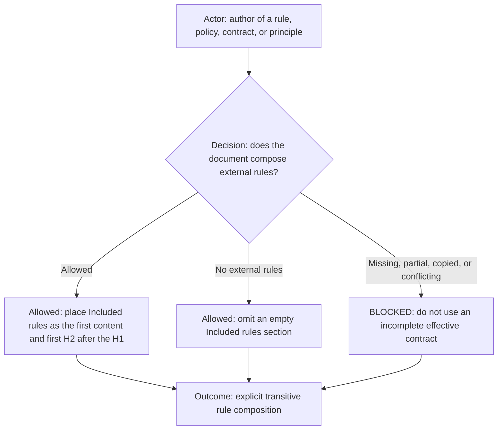
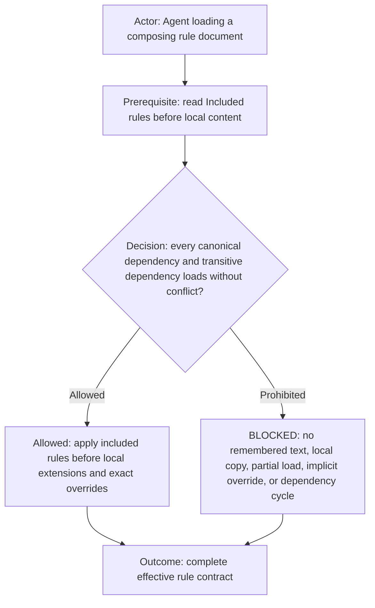

# Included Rules Principle

This principle makes external rule dependencies explicit and loadable. It applies to a rule, policy, contract, or
principle that includes one or more external rules. A document with no external rule dependency does not add an empty
section.

## Rules

- `## Included rules` is the first content and first H2 immediately after the H1.
- Use a flat table with one canonical link per included rule and its required application.
- The included-rules table is a reference catalog and does not require a diagram merely to explain the table.
- Load included rules transitively before interpreting or applying local content.
- Local rules may narrow or explicitly extend an included rule. An override must name the exact replaced rule; implicit
  replacement, conflict, dependency cycles, unreadable sources, partial loads, remembered text, and copied substitutes
  are `BLOCKED_INCLUDED_RULE_CONTEXT`.
- A document with no external included rules does not add an empty `Included rules` section.

## Tags

#documentation #principle #included-rules #composition #dependencies #template
