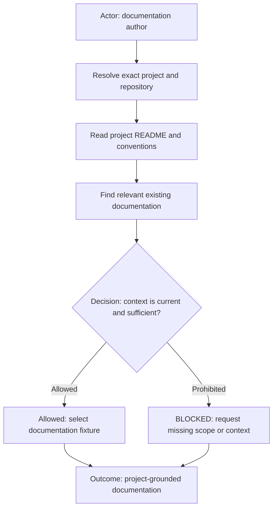

# Project Documentation Context Principle

The diagram starts with the author resolving the exact project and repository, then reading that project's README before
discovering the relevant existing documentation. Sufficient current context permits fixture selection and composition;
missing, stale, or ambiguous context blocks the work. The outcome is documentation grounded in project conventions.

## Rules

- Read the resolved project's `README.md` before deciding documentation location, terminology, scope, or validation.
- Locate existing related documentation before creating a new file. `docs/`, `documentation/`, and project-specific
  locations are discovery inputs, not interchangeable inferred authority.
- Keep feature documentation in the project-owned location and use the project's existing naming convention. Where no
  convention exists, name feature documents `*-feature.md` and pair supporting documents with the same feature prefix.
- Write a done-state narrative instead of a change log, ticket placeholder, TODO list, or speculative plan.
- Use stable topic tags when they improve discovery. Do not add Jira or tracker references unless the selected fixture
  explicitly requires them.
- If relevant context is missing after the README and existing documentation review, ask the human before authoring.

## Tags

#documentation #project-context #readme #conventions
