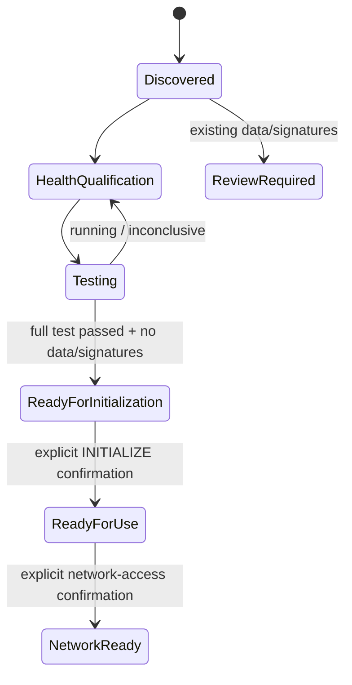

# AI Fleas storage lifecycle

`storage-health` is a guided Linux storage lifecycle for discovering, qualifying, preparing, and exposing storage for AI workloads.

It is read-only by default. Destructive initialization and network configuration are explicit later steps with confirmation.

## Flow

```mermaid
flowchart TD
    A[Attach storage] --> B[1. Full AI storage assessment]
    B --> C[2. Check physical health]
    C --> D[3. Run full disk health test]
    D --> E[5. Disk test status / history]
    E --> F{Full test passed?}
    F -->|No / still running| E
    F -->|Yes| G[6. Inspect filesystem / signatures]
    G --> H{Existing data or signatures?}
    H -->|Yes| I[Review before initialization]
    H -->|No| J[7. Qualify storage for AI use]
    J --> K[READY FOR INITIALIZATION]
    K --> L[8. Initialize storage for AI use]
    L --> M[GPT + ext4 + UUID mount]
    M --> N[/srv/ai-storage]
    N --> O[READY FOR USE]
    O --> P[9. Configure network access]
    P --> Q[SMB + LAN firewall + .local discovery]
    Q --> R[NETWORK ACCESS READY]
```

Options 4 (inventory) and 5 (test status/history) can be used at any time for observation.

## Why the flow is ordered this way

Each step answers a different question. Skipping steps can turn a storage setup into data loss, unreliable agent state, or an infrastructure problem that is difficult to diagnose later.

| Step | Question | Why it matters | What can go wrong if skipped |
| --- | --- | --- | --- |
| Discover / inventory | What physical disks are actually attached? | Device names such as `/dev/sda` can change. Model, serial, size and transport provide stronger identity. | The wrong disk can be tested or initialized. |
| Physical health | Does the drive currently show warning signs? | Fast health evidence catches obvious failures before investing time in setup. | A visibly unhealthy disk can be promoted into service. |
| Full disk health test | Can the drive complete its own extended physical self-test? | A multi-hour test exercises substantially more of the device than a quick status query. | A disk can look healthy at a glance while containing problems that appear only during a full test. |
| Test status/history | Did the long test actually finish, and what did it report? | Starting a test is not the same as passing one. | A running, interrupted or failed test can be mistaken for successful qualification. |
| Filesystem/signature inspection | Is there existing data or storage metadata? | A disk that looks unused may still contain a filesystem, partition metadata or data worth preserving. | Initialization can destroy data. |
| AI suitability | What kind of work is this medium good at? | Healthy storage is not automatically appropriate for every workload. | A slow HDD can be used for latency-sensitive inference/build workloads and make the system feel broken. |
| Initialization | How should an approved blank disk become usable storage? | Creates a predictable filesystem, stable UUID mount and standard directory structure. | Ad-hoc mounts and device paths become fragile after reboot or device-order changes. |
| Network access | Which parts should humans reach over the LAN? | Separates internal runtime state from human-facing artifacts and applies different permissions. | Agent memory/runtime data can be accidentally modified, or SMB can be exposed more broadly than intended. |

### Healthy does not mean good for everything

The command deliberately separates **physical health** from **workload suitability**.

For example, a rotational HDD can be perfectly healthy and still be a poor choice for active model inference or build/workspace activity because those workloads are sensitive to random-access latency. The same disk can be very useful for archives, documents, artifacts, persistent capacity and cold model storage.

```text
Healthy HDD
├── archive / backup       GOOD
├── documents / artifacts GOOD
├── cold model library    GOOD
├── persistent capacity   GOOD
├── vector/search         CONDITIONAL
├── active inference      POOR
└── builds/workspaces     POOR
```

These classifications are workload guidance, not claims that every HDD or SSD performs identically. Benchmark demanding workloads when performance matters.

### Why the full disk test comes before initialization

Formatting a disk successfully proves very little about its physical condition. Filesystem creation mainly writes metadata; it does not provide the same evidence as a drive-level extended self-test.

The intended sequence is therefore:

```text
physical evidence first
        ↓
confirm there is nothing to preserve
        ↓
decide workload suitability
        ↓
only then modify the disk
```

A successful full disk test is strong positive evidence, not a guarantee that a drive cannot fail later. Important data still needs another copy.

### Why mount by UUID

Linux device names such as `/dev/sda` and `/dev/sdb` describe discovery order, not permanent identity. Adding, removing or reconnecting hardware can change those names.

After initialization the filesystem is therefore mounted by UUID:

```text
fragile:
  /dev/sda1 → /srv/ai-storage

preferred:
  UUID=<filesystem-id> → /srv/ai-storage
```

This keeps the intended filesystem attached to the intended mount point across normal reboots and device-order changes.

### Why one filesystem with role directories

The initial design uses one filesystem and separates workloads by directory rather than creating many partitions.

That keeps capacity flexible: unused space in `archive/` remains available to `artifacts/` or `models/`. The role directories create a logical contract without prematurely fixing capacity boundaries.

If a future workload needs independent quotas, encryption, snapshots, performance characteristics or failure domains, it can move to a dedicated filesystem/device later.

### Why only some directories are network shares

The Mac does not need direct access to everything an agent uses.

```text
Human-facing:
  artifacts/  → read/write
  archive/    → read/write
  models/     → read-only

Internal:
  hermes/     → not shared
  memory/     → not shared
```

`hermes/` and `memory/` may eventually contain runtime state, indexes, coordination data or persistent agent memory. Exposing them as ordinary writable Finder folders would make accidental edits/deletions part of the runtime failure surface.

`models/` is exposed read-only because browsing/copying models from another machine is useful, while accidental modification of model files is generally not.

### Why SMB is LAN-only

SMB is designed here as a local file-sharing protocol, not an internet-facing service.

Option 9:
- configures authenticated Samba access;
- limits TCP 445 through UFW to the recognized LAN when UFW is active;
- does not publish SMB through Cloudflare;
- uses `.local` discovery so clients do not need to bookmark a changing DHCP address.

If remote access is needed later, put the client onto a trusted private network/VPN rather than exposing TCP 445 directly to the public internet.

### Why `.local` instead of bookmarking an IP

DHCP addresses can change. A Finder bookmark such as `smb://10.0.0.26/...` can therefore become stale.

Local discovery provides a stable human-facing identity:

```text
smb://infra-01.local/AI-Artifacts
             ↓
       current LAN IP
             ↓
          Samba
```

The current IP remains useful as a diagnostic fallback, but it is not the primary identity.

## Resulting storage layout

The default initialized filesystem is mounted persistently by UUID at:

```text
/srv/ai-storage/
├── hermes/       internal runtime data
├── memory/       internal agent memory
├── artifacts/    human-facing outputs
├── models/       model library
└── archive/      archive / backup-oriented data
```

The directories are roles on one filesystem; they are not separate physical disks.

## Network view

Option 9 exposes only selected directories over SMB:

```mermaid
flowchart LR
    D[AI storage disk] --> S[/srv/ai-storage]
    S --> H[hermes]
    S --> M[memory]
    S --> A[artifacts]
    S --> L[models]
    S --> R[archive]

    A --> SA[AI-Artifacts SMB share<br/>read/write]
    L --> SL[AI-Models SMB share<br/>read-only]
    R --> SR[AI-Archive SMB share<br/>read/write]

    SA --> MAC[Mac / LAN client]
    SL --> MAC
    SR --> MAC

    H -. not shared .-> X[Internal only]
    M -. not shared .-> X
```

Preferred macOS Finder addresses:

```text
smb://<host>.local/AI-Artifacts
smb://<host>.local/AI-Archive
smb://<host>.local/AI-Models
```

The `.local` hostname is provided through local-network discovery, so clients do not need to bookmark a changing DHCP address. The current LAN IP is printed only as a fallback.

SMB is intended for the local network only. When UFW is active and the LAN can be safely identified, the command permits TCP 445 only from that LAN; it does not intentionally expose SMB through Cloudflare or the public internet.

## Reference deployment: interactive and autonomous Hermes

The storage command is portable and does not require Hermes. One expected AI Fleas deployment, however, uses this storage as durable capacity for an always-on agent node. This is a reference topology, not a requirement of the command.

```mermaid
flowchart TD
    U[Human] --> HM[Hermes on laptop / workstation<br/>interactive]
    SCH[Schedules / recurring jobs] --> HI[Hermes on always-on node<br/>autonomous + service]
    WEB[Websites / products] --> API[Controlled authenticated API]
    API --> HI
    HI --> ROUTE[Capability / model routing]
    ROUTE --> LOCAL[Local models]
    ROUTE --> HOSTED[Hosted models]
    HI --> HS[/hermes/<br/>private runtime + job state]
    HI --> MEM[/memory/<br/>private durable agent data]
    HI --> ART[/artifacts/<br/>finished outputs]
    ART --> SMB[AI-Artifacts SMB share]
    SMB --> U
```

### Different Hermes roles

**Interactive Hermes** on a laptop/workstation is suited to day-to-day human-driven work, development, experiments, manually started workflows, and work requiring frequent human judgment.

**Always-on Hermes** on an infrastructure node is suited to scheduled/recurring agents, overnight or background processing, monitoring, website/product-triggered AI work, and unattended service orchestration.

Do not blindly share one writable Hermes runtime/state directory between the installations. Machine-specific sessions, caches and runtime state should remain owned by the installation that created them.

### Storage boundary

```text
/srv/ai-storage/
├── hermes/       private autonomous-agent runtime/job state
├── memory/       private durable agent data
├── artifacts/    finished human-facing outputs
├── models/       model library
└── archive/      archive/backup-oriented data
```

An autonomous agent can work privately under `hermes/` and publish an accepted deliverable to `artifacts/`. A laptop user can then see that result through `AI-Artifacts` without receiving writable access to the agent's internal state.

### Website/product boundary

Websites and products should not mount agent storage or call model processes directly.

```text
website / product
      ↓
authenticated controlled API
      ↓
always-on Hermes / workflow
      ↓
capability + model routing
      ↓
local or hosted intelligence
      ↓
validated result
      ↓
website / product
```

Authentication, workload policy, model choice, private state, retries, storage permissions and observability stay behind the application boundary rather than exposing the agent runtime to the public web.

### Why this topology is useful

The interactive machine optimizes for human collaboration. The always-on node optimizes for continuity and unattended execution. Shared storage provides durable capacity and a deliberate handoff point between autonomous work and human-visible outputs.

It also gives owned local compute useful work beyond interactive coding: scheduled processing, document work, validation, website requests and other bounded workloads can continue while the human is not actively driving an agent.

## Safety states



Initialization is intentionally gated. A candidate must be a real block disk, show no recognized filesystem/storage signature, and have a retained successful full disk self-test. The command then displays the exact planned changes and requires the literal confirmation `INITIALIZE`.

## Commands

Interactive:

```bash
./storage-health.command.sh
```

Non-interactive/read-oriented actions include:

```text
inspect
filesystem DEVICE|--all
health DEVICE|--all [--json]
ai-report DEVICE|--all [--json]
qualify DEVICE|--all
test DEVICE --short|--long
test-status DEVICE
```

Physical-health evidence is screening, not a guarantee against future disk failure. Important data still requires another copy.
