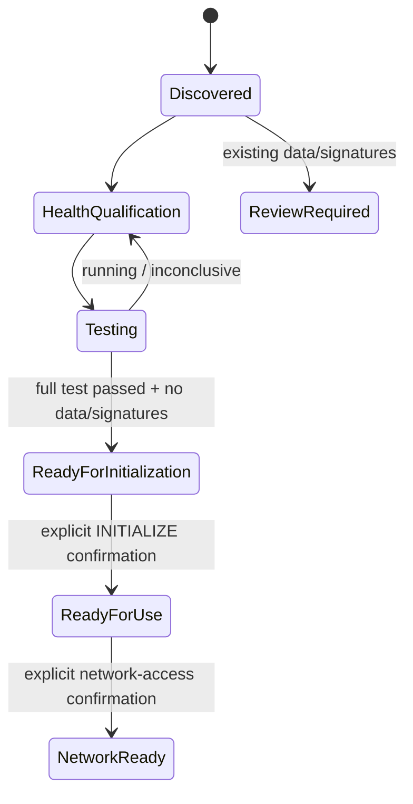

# AI Fleas storage lifecycle

`storage-health` is a guided Linux storage lifecycle for discovering, qualifying, preparing, and exposing storage for AI workloads.

It is read-only by default. Destructive initialization and network configuration are explicit later steps with confirmation.

## Flow

```mermaid
flowchart TD
    A[Attach storage] --> B[1. Full AI storage assessment]
    B --> C[2. Check physical health]
    C --> D[3. Run full disk health test]
    D --> E[5. Disk test status / history]
    E --> F{Full test passed?}
    F -->|No / still running| E
    F -->|Yes| G[6. Inspect filesystem / signatures]
    G --> H{Existing data or signatures?}
    H -->|Yes| I[Review before initialization]
    H -->|No| J[7. Qualify storage for AI use]
    J --> K[READY FOR INITIALIZATION]
    K --> L[8. Initialize storage for AI use]
    L --> M[GPT + ext4 + UUID mount]
    M --> N[/srv/ai-storage]
    N --> O[READY FOR USE]
    O --> P[9. Configure network access]
    P --> Q[SMB + LAN firewall + .local discovery]
    Q --> R[NETWORK ACCESS READY]
```

Options 4 (inventory) and 5 (test status/history) can be used at any time for observation.

## Resulting storage layout

The default initialized filesystem is mounted persistently by UUID at:

```text
/srv/ai-storage/
├── hermes/       internal runtime data
├── memory/       internal agent memory
├── artifacts/    human-facing outputs
├── models/       model library
└── archive/      archive / backup-oriented data
```

The directories are roles on one filesystem; they are not separate physical disks.

## Network view

Option 9 exposes only selected directories over SMB:

```mermaid
flowchart LR
    D[AI storage disk] --> S[/srv/ai-storage]
    S --> H[hermes]
    S --> M[memory]
    S --> A[artifacts]
    S --> L[models]
    S --> R[archive]

    A --> SA[AI-Artifacts SMB share<br/>read/write]
    L --> SL[AI-Models SMB share<br/>read-only]
    R --> SR[AI-Archive SMB share<br/>read/write]

    SA --> MAC[Mac / LAN client]
    SL --> MAC
    SR --> MAC

    H -. not shared .-> X[Internal only]
    M -. not shared .-> X
```

Preferred macOS Finder addresses:

```text
smb://<host>.local/AI-Artifacts
smb://<host>.local/AI-Archive
smb://<host>.local/AI-Models
```

The `.local` hostname is provided through local-network discovery, so clients do not need to bookmark a changing DHCP address. The current LAN IP is printed only as a fallback.

SMB is intended for the local network only. When UFW is active and the LAN can be safely identified, the command permits TCP 445 only from that LAN; it does not intentionally expose SMB through Cloudflare or the public internet.

## Safety states



Initialization is intentionally gated. A candidate must be a real block disk, show no recognized filesystem/storage signature, and have a retained successful full disk self-test. The command then displays the exact planned changes and requires the literal confirmation `INITIALIZE`.

## Commands

Interactive:

```bash
./storage-health.command.sh
```

Non-interactive/read-oriented actions include:

```text
inspect
filesystem DEVICE|--all
health DEVICE|--all [--json]
ai-report DEVICE|--all [--json]
qualify DEVICE|--all
test DEVICE --short|--long
test-status DEVICE
```

Physical-health evidence is screening, not a guarantee against future disk failure. Important data still requires another copy.
