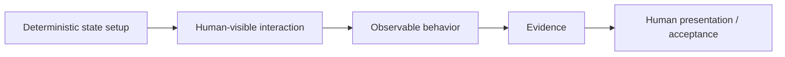

# Demo command specification

## Purpose

A demo is executable evidence plus a human-readable narrative. It should be useful to a human, an AI acceptance runner, and a human presenter without requiring three unrelated test implementations.

## Repository-owned convention

A project may use any configured location. A recommended discoverable convention is:

```text
<project>/
  smoke-tests/
    demo/
      <scenario>-demo/
        scripts/
          common.sh
        01-prepare.sh
        02-change.sh
        ...
        <scenario>-demo.md
```

Numbered helpers establish deterministic state/actions. `common.sh` is scenario-local shared mechanics when credentials, API helpers, environment resolution, state files, or other setup is specific to that demo family. Truly reusable helpers may live at a project/workflow level; do not force scenario-specific behavior into a global command.

The Markdown file is the semantic scenario and may interleave helper execution with human-visible/UI steps.

## Script readability

Executable helpers are not the primary explanation surface, but consequential steps should remain understandable when inspected. Around important requests/mutations, prefer concise comments that answer **What?** and **Why?** rather than narrating shell syntax.

Example:

```sh
# What: create the initial record used by the scenario.
# Why: later steps demonstrate how the visible state changes after an update.
response="$(api POST "/example" "$body")"
```

Do not require comments on every assignment or obvious shell operation.

## Markdown scenario

A scenario should describe intent and observable state rather than brittle implementation coordinates.

Recommended sections:

- Purpose / behavior being demonstrated.
- Preconditions and environment.
- Ordered steps.
- Deterministic helper to run, when applicable.
- UI/human action stated semantically (for example, “open the item details and refresh”), not pixel coordinates.
- Expected observable result.
- Evidence to capture.
- Cleanup/rollback when required.
- Known limitations / safety boundaries.

## Why hybrid instead of one UI technology

The demo contract intentionally does not prescribe Playwright or another DOM automation framework. Deterministic browser tests and human-facing demonstrations overlap, but they are not identical problems.

Use selector-driven/browser test automation when deterministic UI regression is the objective. Use semantic visual/human-style execution when the evidence being demonstrated is the experience a person can observe and the environment supports that execution safely. A project may combine both.

The philosophical boundary is: **automate reproducible mechanics while keeping observable meaning explicit**. The demo artifact should preserve enough narrative that a human can understand and present the result, while AI may carry implementation context that the human should not have to memorize.



## Hybrid execution

The runner may combine:

1. deterministic helpers for fixture/state/API operations;
2. visual/browser/computer-use capabilities for human-visible interaction;
3. observation/evidence capture;
4. explicit human checkpoints for consequential or ambiguous actions.

The command must not assume one UI technology. A platform/profile may bind Playwright, browser automation, computer vision, computer use, or a human operator.

## Modes

The same package supports:

- **AI execution** — agent runs deterministic and visual steps and gathers evidence;
- **human guide** — human follows the Markdown and helpers;
- **acceptance evidence** — machine/human-visible observations demonstrate behavior;
- **presentation backbone** — a human presenter uses the scenario while private presentation/context-rehydration methods may prepare them separately.

The demo command does not expose private presenter augmentation by default.

## Self-improvement boundary

Execution may discover navigation friction, stale helper mechanics, missing prerequisites, or better evidence capture. It may propose or, when explicitly authorized, update mechanical demo instructions.

It must **not silently weaken or rewrite expected business behavior to make a failing demo pass**.

Changes to expected observations/acceptance meaning require the same review authority as the behavior being demonstrated.

## Evidence

A run should produce a compact receipt when practical:

```yaml
scenario: example-demo
status: pass|fail|blocked
steps:
  - id: 01
    status: pass
    evidence: ...
observations: []
failures: []
environment: ...
startedAt: ...
finishedAt: ...
```

Project-specific sensitive output remains in the project/profile boundary.

## Security

- Never commit credentials or resolved secret values into demo packages.
- Resolve secrets through authorized profile/runtime capabilities.
- Production or otherwise consequential mutations require the authority/checkpoints configured by the owning workflow/profile.
- Visual automation does not reduce the required safety level merely because it resembles human clicking.
