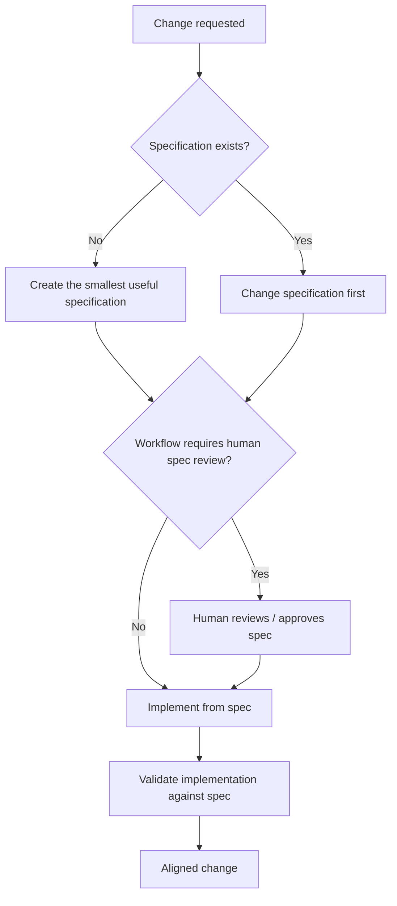

# SDD — Spec-Driven Development

## Purpose

Use `sdd` to drive specification-driven development from an agreed specification through implementation and validation gates.

## Inputs

| Input | Required | Source | Description |
|---|---|---|---|
| Active AI Profile and workflow | Yes | Host activation | Authorizes the command and resolves profile-owned configuration. |
| Command-specific input | Yes | User, workflow, profile, or source artifact | Requested behavior change, authoritative specification, scope, and project context. |

## Outputs

| Output | Destination | Description |
|---|---|---|
| Command result | Caller, configured artifact path, or authorized external system | Synchronized specification, implementation, and validation evidence. |

Use `sdd` whenever behavior is governed by a specification.

## Entry Point

| Entry point | Type | Profile-aware invocation |
|---|---|---|
| `sdd/sdd.command.md` | AI-readable contract | The initialized workflow role loads this contract after the host activates the selected profile and workflow. |

Every invocation is profile-aware: the host must verify that the active workflow allows this command, resolve `AI_COMMANDS_ROOT`, and provide any profile-owned configuration before this entry point is used.

Committed configuration template: `sdd/sdd.command.example.config`. Copy it into the selected profile, set only supported command value overrides, reference the copied file through `commands[].config`, and let the host expose it as `AI_COMMAND_CONFIG_PATH`. The committed example is documentation and must never be used as operational configuration.

## Trigger

A command or component containing a `*.spec.md` file is **automatically SDD-governed**. Agents changing its behavior
must follow this command even when the human does not explicitly say `use SDD`.

Natural-language requests such as `change this behavior`, `add this capability`, `fix this flow`, or `implement this
feature` must first be interpreted against the existing specification when one exists.

## Core rule

**Specification first. Implementation second.**

For a behavior change:

1. Read the current specification and relevant context.
2. Change the specification so it describes the desired behavior.
3. Review the resulting spec for consistency and completeness.
4. If the active workflow requires human specification review, stop and request it before implementation.
5. Implement from the approved/current specification.
6. Update tests and human-facing usage documentation as required.
7. Validate observable implementation behavior against the specification.
8. Do not call the change complete while spec and implementation disagree.

## Human review

Human review of the specification is the normal preferred boundary for meaningful behavior changes, but it is
**workflow-controlled rather than universally mandatory**. A workflow may explicitly allow an agent to update a
specification and implementation in one bounded operation.

When human review is required, the agent should present the changed behavior clearly—preferably with the spec's
overview diagram—and wait before modifying implementation.

## Existing implementation disagreement

If implementation and specification disagree, do not silently modify the specification to describe whatever the code currently does.

Determine which behavior is intended:

- if the specification is still correct, repair implementation to match it;
- if the desired behavior changed, change the specification first and then realign implementation.

## New behavior without a specification

Do not create unnecessary specifications for every file. When a component is intentionally SDD-governed, create the
smallest specification capable of describing its behavior, boundaries, and completion evidence, then implement from it.

## Completion

A behavior change is complete only when the specification, implementation, tests, and relevant human-facing
documentation describe the same current behavior.

## Tags

`#command` `#ai-command` `#sdd` `#spec-driven-development` `#specification` `#development`
