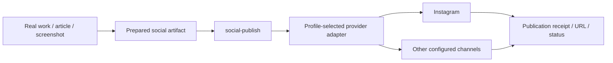

# Social Publish command — design draft

> Status: design only. No provider implementation or publication authority is introduced by this draft.

`social-publish` is the portable distribution boundary for sending an already-prepared social artifact to profile-configured channels.

The command does **not** create a content strategy and does not require the human to use social feeds.

## Proposed interface

```text
social-publish draft <artifact>
social-publish queue <artifact>
social-publish now <artifact>
social-publish status [receipt]
```

Default agent behavior is `draft` or `queue`. `now` requires explicit publication authority from the selected profile/human policy.

## Boundary



The caller should not depend on Buffer, Instagram, TikTok, or another provider. A profile selects provider/account/channel bindings.

See `spec.md`.
