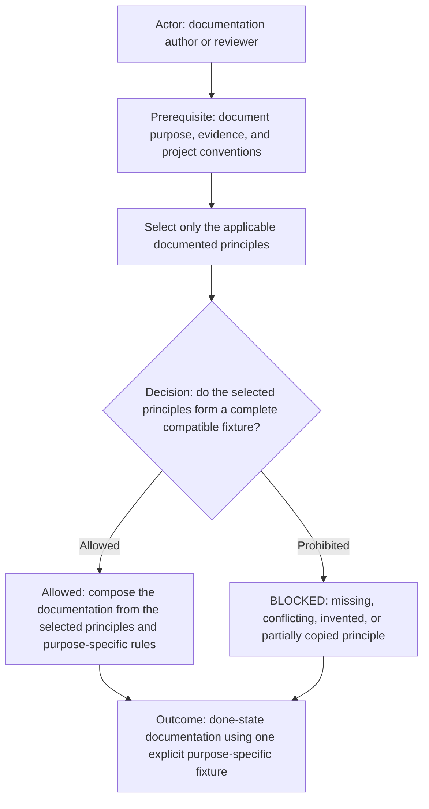
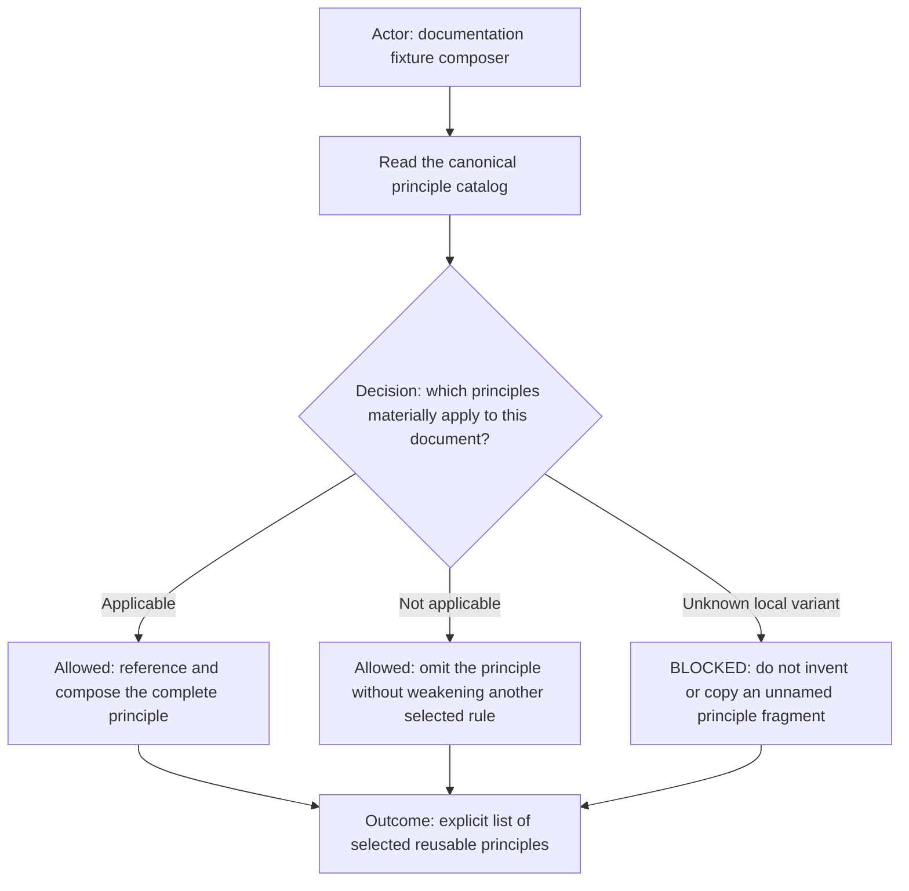
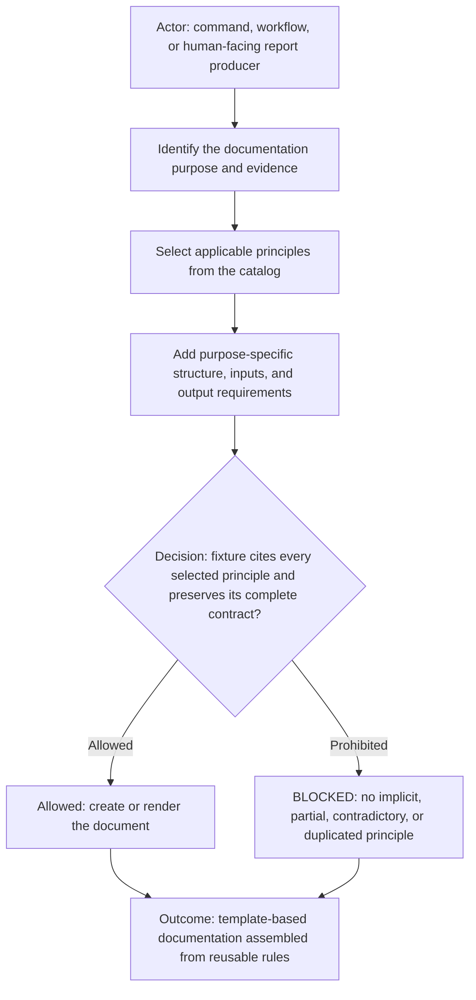
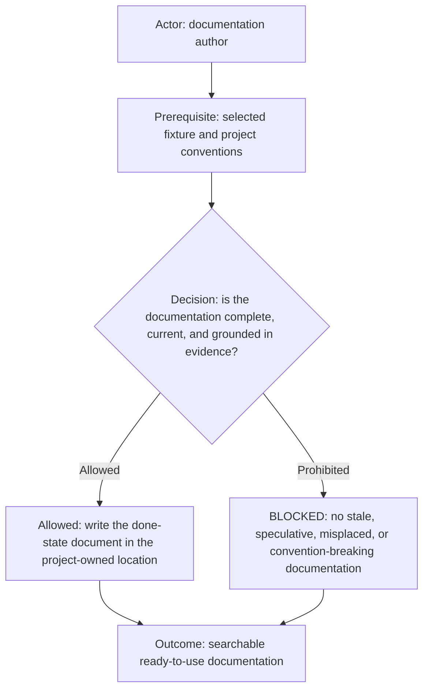

# Documentation Command

The diagram starts with a documentation author or reviewer collecting the document's purpose, evidence, and project
conventions. The selected principles either compose into a complete compatible fixture that produces done-state
documentation, or a missing, conflicting, invented, or partial principle blocks the work. The outcome is one explicit,
purpose-specific fixture rather than a generic rules dump.

The Documentation command composes reusable principles into a purpose-specific documentation fixture. Not every document
uses every principle. The document purpose and evidence determine which cataloged principles apply.

## Tags

#command #ai-command #doc #documentation #docs #markdown

## Supported Prompts

| Prompt                                               | Expected result                                                                     |
| ---------------------------------------------------- | ----------------------------------------------------------------------------------- |
| `Check documentation readiness for <project>`        | Run `doc.command.sh --check` and report the README and documentation-root evidence. |
| `Document <feature or capability> for <project>`     | Select principles and update done-state project documentation.                      |
| `Which documentation fixture applies to <artifact>?` | Name applicable principles and explain omissions.                                   |

## Principle catalog

The diagram has the fixture composer read the catalog, decide whether each principle materially applies, and either select
or omit it. An unknown local variant blocks composition. The outcome is an explicit list of reusable principles, not a
copied or invented rule fragment.

| Principle                             | Select when                                                          | Canonical fixture                                                            |
| ------------------------------------- | -------------------------------------------------------------------- | ---------------------------------------------------------------------------- |
| Included Rules                        | A rule, policy, contract, or principle composes external rules.      | [Included Rules](principles/included-rules-principle.md)                     |
| Diagram First                         | Meaningful flow, relationship, state, decision, ownership, or route. | [Fixture](principles/diagram-first-principle.md)                             |
| Project Context                       | Project documentation is created or updated.                         | [Context](principles/project-documentation-context-principle.md)             |
| Development Top-of-File Documentation | Documentation explains source or runtime behavior.                   | [Top of File](principles/development-top-of-file-documentation-principle.md) |
| Companion Docs                        | Runnable script needs usage guidance.                                | [Companion](principles/companion-file-documentation-principle.md)            |

The catalog is extensible. Add a new principle as one canonical Markdown fixture under `principles/`, then add one catalog
row. A documentation or reporting template references the applicable fixtures instead of duplicating their rules.

## Documentation fixture composition

The diagram begins with the producer identifying purpose and evidence, selecting cataloged principles, and adding only
purpose-specific structure. Verification either confirms every selected principle is cited and preserved before rendering,
or blocks an implicit, contradictory, duplicated, or partial fixture. The outcome is documentation assembled from
reusable rules with its selected sources named.

A fixture is the explicit combination of selected principles plus purpose-specific rules. For example, a modified-rule
report selects Diagram First and adds exact Markdown injection, diff, validation, and human-decision requirements. A code
guide selects Project Documentation Context and Development Top-of-File Documentation, then adds its exact source and audience. A flat field
catalog may omit Diagram First. A runnable utility selects Companion File Documentation and adds its exact invocation
contract. The fixture must name its selected principles so authors and validators resolve the canonical files directly.

Principles are independently selectable, but one principle may explicitly include another through an `Included rules`
table. Such dependencies load transitively and fail closed on a missing source, partial load, cycle, conflict, or implicit
override. The `doc` command or another explicit documentation fixture remains the composition entrypoint. By default, an
agent considers every cataloged principle, selects every applicable and compatible one, follows its declared included
rules, and records why a relevant-looking principle is omitted. It must not blindly apply every principle when an
applicability rule does not match or when the combined fixture would conflict.

## General documentation rules

The diagram starts with the author applying the selected fixture and project conventions, then checks that the document is
complete, current, and evidence-grounded. Passing work is written to the project-owned location; stale, speculative,
misplaced, or convention-breaking content is blocked. The outcome is searchable documentation ready for direct use.

Select [Project Documentation Context](principles/project-documentation-context-principle.md) for every project-owned
document. Select [Development Top-of-File Documentation](principles/development-top-of-file-documentation-principle.md)
when the document explains source,
APIs, configuration, or runtime behavior. Select [Diagram First](principles/diagram-first-principle.md) when its
applicability rule matches. AI command `.command.md` files remain their own documentation source of truth; do not create
separate command documentation unless a command explicitly requires it.

## Execution boundary

The host workflow selects an authorized documentation-capable role. This command defines documentation composition and
readiness; it does not prescribe private role names, infer product semantics, or supply missing project evidence.

## Input

- A supported prompt and exact project directory.
- For `--check`: a readable project directory containing `README.md`.
- For authoring: bounded feature or capability scope, applicable evidence, and project documentation conventions.

## Output

- For `--check`: deterministic `DOC_READINESS` lines for the resolved project, README, documentation roots, status, and
  next action or blocker.
- For authoring: done-state Markdown in the project-owned location, selected principle references, and focused validation
  evidence.
