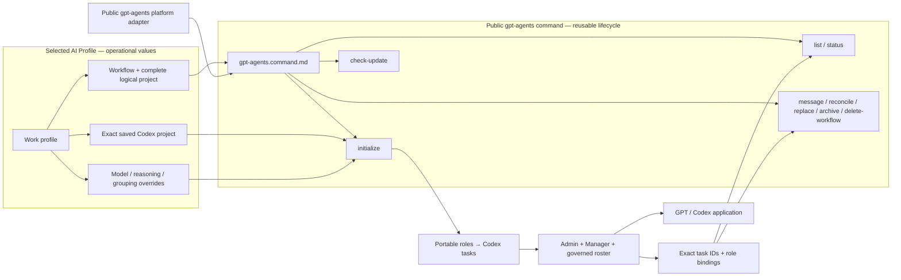

# GPT Agents

## Purpose

Use `gpt-agents` to check for stable application updates, initialize, inspect, reconcile, message, replace, or recoverably archive AI Fleas logical agents realized
as Codex tasks. The command composes the selected profile, portable workflow roster, and public `gpt-agents` platform adapter;
it never infers tasks from titles, recency, or nearby repositories.

Physical GPT/ChatGPT desktop application installation, upgrade, and uninstall belong to the `chatgpt` command
under the `install` command group. This command owns the logical-agent lifecycle after the application is available.

The profile selects operational values, the workflow defines role authority, the platform adapter realizes each role,
and this command owns the repeatable lifecycle transaction. Changing a saved project, model choice, or grouping policy
therefore changes profile configuration rather than the portable workflow roster.

## Inputs

| Input | Required | Source | Description |
|---|---|---|---|
| Active AI Profile | Yes | Host activation | Must select the registered `gpt-agents` agent platform and its public registry. |
| Workflow and complete logical project | Yes | User and profile | Select the portable roster and exact saved Codex project/work target. |
| GPT role overrides | No | Profile-owned `commands[].config` | Override supported model, reasoning, title, or elastic-pool realization values without changing role authority. |
| Grouping policy | No | Profile-owned `commands[].config` | Defines the sidebar section template and deterministic collision suffix policy. |
| Lifecycle subcommand | Yes | User request | One of `check-update`, `initialize`, `list`, `status`, `message`, `reconcile`, `replace`, `archive`, or `delete-workflow`. Human wording such as “delete group” routes to `delete-workflow`. |
| Exact instance identifiers | Conditional | Prior creation receipts | Required for operations on existing tasks; titles are never lifecycle identity. |

## Outputs

| Output | Destination | Description |
|---|---|---|
| Agent-instance receipts | Caller and host-managed binding state | Exact logical-agent, role, task ID, host ID, project ID, sidebar section ID, and creation outcome. |
| Lifecycle result | Caller | Verified status, delivery, replacement, reconciliation, or archival result. |

## Entry Point

| Entry point | Type | Profile-aware invocation |
|---|---|---|
|| `gpt-agents/gpt-agents.command.md` | AI-readable contract | The initialized admin loads this contract and invokes the selected app adapter's exact task lifecycle capabilities. |

Every invocation is profile-aware: the host must activate the selected AI Profile and workflow, verify that `gpt-agents` is
allowed, resolve its platform contract, and bind the exact saved Codex project before any task mutation.

Committed configuration template: `gpt-agents/gpt-agents.command.example.config`. Copy it into the selected profile, set only supported command value overrides, reference the copied file through `commands[].config`, and let the host expose it as `AI_COMMAND_CONFIG_PATH`. The committed example is documentation and must never be used as operational configuration.

## Linked Commands

| Command | Relationship | Use when |
|---|---|---|
| [`chatgpt`](../install/chatgpt/chatgpt.command.md) | Physical application prerequisite | ChatGPT must be inspected, installed, smoke-tested, updated, upgraded, or uninstalled. |
| [`install`](../install/install.command.md) | Parent installation command group | The human asks generically to install or update GPT and the request must be routed to the exact child command. |

The application must be installed and pass its smoke test before agent initialization. Do not substitute the linked
`install/codex` CLI installer.

## Subcommands

| Subcommand | Behavior |
|---|---|
| `check-update` | Read-only query of the GPT/Codex app host's trusted stable update channel. Report the installed and latest stable versions when the host exposes them, recommend an explicit upgrade when newer, or return `GPT_APP_UPDATE_CHECK_UNAVAILABLE` when status cannot be established. Never update automatically. |
| `initialize` | Create the exact requested roster, initialize every role, and record exact task receipts. |
| `list` | Return recorded logical-agent-to-task bindings without inferring unbound tasks. |
| `status` | Verify task existence, project binding, role initialization, and current lifecycle state. |
| `message` | Deliver a prompt to one exact bound task ID. |
| `reconcile` | Create missing instances and report mismatches or duplicates; never silently adopt candidates. |
| `replace` | Create and verify a successor before recoverably archiving its exact predecessor. |
| `archive` | Recoverably archive one exact task ID after confirming its binding. |
| `delete-workflow` | Recoverably archive every exact task bound to one logical project, delete its exact custom sidebar section, and preserve the saved Codex project and repository. |

## Workflow deletion contract

In human-facing requests, **group**, **workflow group**, and **logical project** may describe the same AI Fleas scope.
The adapter must still keep the three concrete identities distinct:

| AI Fleas scope | GPT/Codex App realization | Deleted by `delete-workflow`? |
|---|---|---|
| Logical project, such as `<profile>-<workflow>[-<suffix>]` | Lifecycle scope recorded by AI Fleas | Its active binding is retired and a deletion receipt is retained. |
| Presentation group | Exact custom sidebar section ID | Yes. Delete only the recorded section ID. |
| Runtime project | Exact saved Codex project ID and repository root | No. Preserve both. |

`delete-workflow` performs one guarded transaction:

1. Require explicit deletion intent plus the exact profile, workflow, complete logical-project ID, saved-project ID,
   recorded sidebar-section ID, and complete agent-task receipts.
2. Preflight every receipt and host capability before mutation. Reject a missing, duplicate, foreign, or title-inferred
   binding with zero mutation.
3. Recoverably archive every exact bound agent task. Archive the calling Admin last so it can verify and report the
   transaction; use the host's background self-archive capability when required.
4. Delete the exact recorded custom sidebar section. Never delete, rename, or detach the saved Codex project, checkout,
   repository, or work target.
5. Verify the tasks are archived and the section no longer exists, then retain a tombstone receipt containing the
   logical-project ID, saved-project ID, deleted section ID, archived task IDs, and outcomes.

If the host cannot preflight the complete transaction, return an exact no-mutation failure. A section name, visible
title, sidebar position, or phrase such as `sc-dev` is never sufficient deletion identity.

## Agent realization

`initialize` has the same lifecycle meaning as it does in `hermes-agents`: realize the agents declared for the selected
workflow on the selected platform. GPT App realizes the workflow's complete governed role roster as separate Codex
tasks. Hermes App realizes its declared roles as named profiles collected in a workflow group. The selected platform
adapter—not the shared lifecycle verb—determines the concrete task/profile mapping.

## Initialization contract

1. Require an exact profile, workflow, complete logical-project ID, and work target.
2. Resolve `agent_platform: gpt-agents` through `platforms/registry.yml`; reject any other selected platform.
3. Load the portable workflow agent manifest and the GPT workflow role bindings completely.
4. Resolve one saved Codex project whose configured root is the exact work target.
5. Resolve the profile-configured sidebar section name from the complete logical project. The default is
   `<profile>-<workflow>[-<suffix>]`. Reuse requires its previously recorded section ID; an unrelated name collision
   allocates the next numeric suffix instead of merging teams. The sidebar section never changes the saved-project or
   checkout binding.
6. Join `initializer.agentId` and every portable `agents[].agentId` to exactly one GPT `agents[].role` binding. Reject
   missing, duplicate, or additional roles before creating anything.
7. Bind the authorized calling task as `admin`; do not create a second Admin. If an initialized Manager exists, send it
   one complete lifecycle transaction. If Manager is absent and the human authorized initialization, create and
   canonically initialize exactly one Manager, verify `MANAGER_READY`, then hand it the complete transaction.
8. Resolve runtime values in order: public GPT role-binding defaults, then supported profile-owned `role_overrides`.
   Reject unknown roles, unsupported keys, unavailable models, invalid reasoning levels, and pool values outside the
   portable role's declared bounds.
9. Manager creates exactly one task for each remaining selected role in the saved project's local checkout. Treat `title`
   only as presentation and apply the effective model and reasoning values exactly. Admin must not substitute direct raw
   task creation for this command route.
10. Record every returned task or provisional client ID; wait for provisional creation before dispatch.
11. Move every verified task, including Admin, into the exact resolved sidebar section and record its immutable section ID.
12. Build each initialization message from the portable role definition, team policy, routing and permission policies,
    workflow/project scope, and readiness token. Supply exact peer task-ID bindings only when that role's declared
    communication topology permits peer routing. A direct-human-only role such as Judge receives its own binding and
    governance scope, never a participant-routing roster. Do not replace contracts with a hand-written role summary.
13. Wait for every role's exact readiness token, verify the complete roster, and return exact receipts. Partial
    initialization is an explicit failure state.

For the current Dev roster, an Admin invocation binds Admin, ensures exactly one Manager, and delegates creation of
Designer Reviewer, Judge, Coder, Command Runner, and UI Acceptance Tester to Manager. Changes to that list must come from
the portable workflow manifest and corresponding GPT bindings—not from edits to this command.

## Safety

- Never create a worktree, clone, projectless task, or task in a merely similar project.
- Never use a title as identity or create a duplicate while a candidate may still resolve.
- Never treat a matching sidebar-section name as identity; reuse requires the recorded immutable section ID.
- Never interpret `delete-workflow` as deletion of a saved Codex project, checkout, repository, or work target.
- Never archive a predecessor until its requested replacement is verified.
- Never weaken portable role authority or communication boundaries.
- Never let profile overrides add roles, remove required roles, change readiness tokens or lifecycle authority, or exceed
  workflow-declared elastic-pool limits.
- Never place host task IDs or operational project identifiers in this public command.
- Never infer update status from model availability, documentation dates, or a failed check; only a trusted host update
  channel may establish the installed and latest stable app versions.

## Tags

#command #ai-command #gpt-agents #codex #agents #lifecycle

See [spec.md](spec.md) and the registered [`gpt-agents` platform adapter](../../platforms/gpt-agents/README.md).
