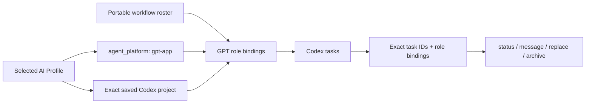

# GPT App

## Purpose

Use `gpt-app` to initialize, inspect, reconcile, message, replace, or recoverably archive AI Fleas logical agents realized
as Codex tasks. The command composes the selected profile, portable workflow roster, and public `gpt-app` platform adapter;
it never infers tasks from titles, recency, or nearby repositories.

## Inputs

| Input | Required | Source | Description |
|---|---|---|---|
| Active AI Profile | Yes | Host activation | Must select the registered `gpt-app` agent platform and its public registry. |
| Workflow and complete logical project | Yes | User and profile | Select the portable roster and exact saved Codex project/work target. |
| GPT role overrides | No | Profile-owned `commands[].config` | Override supported model, reasoning, title, or elastic-pool realization values without changing role authority. |
| Grouping policy | No | Profile-owned `commands[].config` | Defines the sidebar section template and deterministic collision suffix policy. |
| Lifecycle subcommand | Yes | User request | One of `initialize`, `list`, `status`, `message`, `reconcile`, `replace`, or `archive`. |
| Exact instance identifiers | Conditional | Prior creation receipts | Required for operations on existing tasks; titles are never lifecycle identity. |

## Outputs

| Output | Destination | Description |
|---|---|---|
| Agent-instance receipts | Caller and host-managed binding state | Exact logical-agent, role, task ID, host ID, project ID, sidebar section ID, and creation outcome. |
| Lifecycle result | Caller | Verified status, delivery, replacement, reconciliation, or archival result. |

## Entry Point

| Entry point | Type | Profile-aware invocation |
|---|---|---|
| `gpt-app/gpt-app.command.md` | AI-readable contract | The initialized admin loads this contract and invokes the selected app adapter's exact task lifecycle capabilities. |

Every invocation is profile-aware: the host must activate the selected AI Profile and workflow, verify that `gpt-app` is
allowed, resolve its platform contract, and bind the exact saved Codex project before any task mutation.

Committed configuration template: `gpt-app/gpt-app.command.example.config`. Copy it into the selected profile, set only supported command value overrides, reference the copied file through `commands[].config`, and let the host expose it as `AI_COMMAND_CONFIG_PATH`. The committed example is documentation and must never be used as operational configuration.

## Subcommands

| Subcommand | Behavior |
|---|---|
| `initialize` | Create the exact requested roster, initialize every role, and record exact task receipts. |
| `list` | Return recorded logical-agent-to-task bindings without inferring unbound tasks. |
| `status` | Verify task existence, project binding, role initialization, and current lifecycle state. |
| `message` | Deliver a prompt to one exact bound task ID. |
| `reconcile` | Create missing instances and report mismatches or duplicates; never silently adopt candidates. |
| `replace` | Create and verify a successor before recoverably archiving its exact predecessor. |
| `archive` | Recoverably archive one exact task ID after confirming its binding. |

## Initialization contract

1. Require an exact profile, workflow, complete logical-project ID, and work target.
2. Resolve `agent_platform: gpt-app` through `platforms/registry.yml`; reject any other selected platform.
3. Load the portable workflow agent manifest and the GPT workflow role bindings completely.
4. Resolve one saved Codex project whose configured root is the exact work target.
5. Resolve the profile-configured sidebar section name from the complete logical project. The default is
   `<profile>-<workflow>[-<suffix>]`. Reuse requires its previously recorded section ID; an unrelated name collision
   allocates the next numeric suffix instead of merging teams. The sidebar section never changes the saved-project or
   checkout binding.
6. Join `initializer.agentId` and every portable `agents[].agentId` to exactly one GPT `agents[].role` binding. Reject
   missing, duplicate, or additional roles before creating anything.
7. Bind the authorized calling task as `admin`; do not create a second Admin. If an initialized Manager exists, send it
   one complete lifecycle transaction. If Manager is absent and the human authorized initialization, create and
   canonically initialize exactly one Manager, verify `MANAGER_READY`, then hand it the complete transaction.
8. Resolve runtime values in order: public GPT role-binding defaults, then supported profile-owned `role_overrides`.
   Reject unknown roles, unsupported keys, unavailable models, invalid reasoning levels, and pool values outside the
   portable role's declared bounds.
9. Manager creates exactly one task for each remaining selected role in the saved project's local checkout. Treat `title`
   only as presentation and apply the effective model and reasoning values exactly. Admin must not substitute direct raw
   task creation for this command route.
10. Record every returned task or provisional client ID; wait for provisional creation before dispatch.
11. Move every verified task, including Admin, into the exact resolved sidebar section and record its immutable section ID.
12. Build each initialization message from the portable role definition, team policy, routing and permission policies,
    workflow/project scope, and readiness token. Supply exact peer task-ID bindings only when that role's declared
    communication topology permits peer routing. A direct-human-only role such as Judge receives its own binding and
    governance scope, never a participant-routing roster. Do not replace contracts with a hand-written role summary.
13. Wait for every role's exact readiness token, verify the complete roster, and return exact receipts. Partial
    initialization is an explicit failure state.

For the current Dev roster, an Admin invocation binds Admin, ensures exactly one Manager, and delegates creation of
Designer Reviewer, Judge, Coder, Command Runner, and UI Acceptance Tester to Manager. Changes to that list must come from
the portable workflow manifest and corresponding GPT bindings—not from edits to this command.

## Safety

- Never create a worktree, clone, projectless task, or task in a merely similar project.
- Never use a title as identity or create a duplicate while a candidate may still resolve.
- Never treat a matching sidebar-section name as identity; reuse requires the recorded immutable section ID.
- Never archive a predecessor until its requested replacement is verified.
- Never weaken portable role authority or communication boundaries.
- Never let profile overrides add roles, remove required roles, change readiness tokens or lifecycle authority, or exceed
  workflow-declared elastic-pool limits.
- Never place host task IDs or operational project identifiers in this public command.

## Tags

#command #ai-command #gpt-app #codex #agents #lifecycle

See [spec.md](spec.md) and the registered [`gpt-app` platform adapter](../../platforms/gpt-app/README.md).
