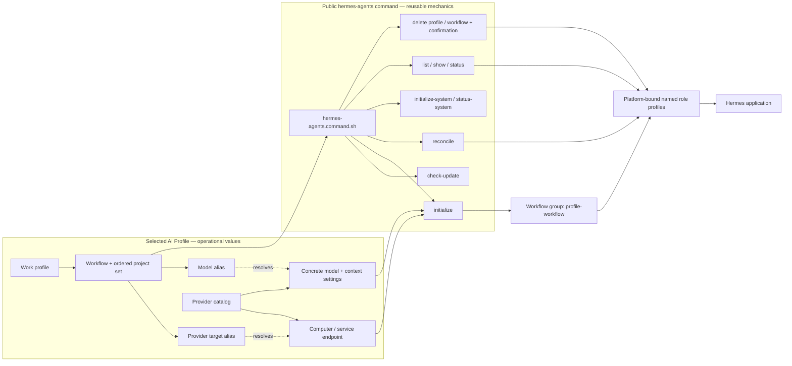

# Hermes Agents

## Purpose

Use `hermes-agents` to create, freshly reinitialize, reconcile, inspect, verify, or explicitly delete profile-scoped Hermes bots. Physical
application installation and upgrades belong to the `hermes` command under the `install` command group.
The command is portable; operational machine, endpoint, model, credential, workflow, and project values come from the
selected AI Profile.



The aliases make the mapping stable: replacing a model box or changing its installed model updates the private catalog
without changing this command, the workflow contract, or the bot lifecycle.

## Inputs

| Input | Required | Source | Description |
|---|---|---|---|
| Active AI Profile and workflow | Yes | Host activation | Authorizes the command and resolves profile-owned configuration. |
| Provider target | Yes | `local_ai.provider` plus the profile-owned provider catalog | Stable alias for the computer, service, or cloud endpoint that runs the model. |
| Model | Yes | `local_ai.model` plus the selected provider's model map | Stable model alias resolved to the provider's concrete model ID and Hermes tuning. |
| Command-specific input | Yes | User, workflow, profile, or source artifact | Active profile, Hermes platform binding, bot scope, and requested lifecycle action. |

## Outputs

| Output | Destination | Description |
|---|---|---|
| Command result | Caller, configured artifact path, or authorized external system | Host-neutral Hermes request/receipt or explicit unsupported-platform result. |

## Entry Point

| Entry point | Type | Profile-aware invocation |
|---|---|---|
| `hermes-agents/hermes-agents.command.sh` | Shell executable | Run through the initialized profile runtime; setup resolves the selected workflow, complete ordered project set, provider target, and model from profile configuration. |

Every invocation is profile-aware: the host must verify that the active workflow allows this command, resolve `AI_COMMANDS_ROOT`, and provide the selected profile root as `AI_PROFILE_ROOT` before this entry point is used.

Committed configuration template: `hermes-agents/hermes-agents.command.example.config`. Copy it into the selected profile, set only supported command value overrides, reference the copied file through `commands[].config`, and let the host expose it as `AI_COMMAND_CONFIG_PATH`. The committed example is documentation and must never be used as operational configuration.

## Linked Commands

| Command | Relationship | Use when |
|---|---|---|
| [`hermes`](../install/hermes/hermes.command.md) | Physical application prerequisite | Hermes must be inspected, installed, smoke-tested, updated, upgraded, or uninstalled. |
| [`install`](../install/install.command.md) | Parent installation command group | The human asks generically to install or update Hermes and the request must be routed to the exact child command. |

Hermes must be installed and pass its smoke test before profile, bot, or workflow-group initialization.

The selected portable workflow manifest at `ai-workflows/<workflow>/agents.yml` is authoritative for Agent names and
portable properties such as `aiProvider` and `flow`. The Hermes adapter realizes that roster as Hermes profiles and a
group chat; it does not maintain a second platform-specific roster or invent generic workers. A workflow entry may
reference a profile-owned `agent_providers_config` file that binds individual Agents or their stable binding names to a
provider alias and model alias from the profile provider catalog.

Hermes role-profile identity is `<profile>-<workflow>-<role-suffix>`. The workflow's complete ordered project set is
the logical group's runtime scope; repository or folder names never become part of stable agent identity. The first
project is primary and becomes Hermes `terminal.cwd`; all later entries remain authorized associated projects and are
written into the generated runtime instructions. `--project` is a compatibility selector that validates membership in
the configured set and never narrows it.

Hermes presents bots and group chats in one flat roster rather than a folder tree. Initialization therefore marks the
individual role profiles hidden in the top-level roster while retaining their group memberships and runtime behavior.
The default Hermes profile is also hidden and unpinned when `HERMES_GROUP_ONLY_NAVIGATION=true` (the default). The
workflow groups become the primary navigation; opening a group exposes its named participating roles. Hermes may still
surface a hidden profile temporarily while it is active or has attention-worthy recent activity.

The profile-owned provider catalog is the target map. Each `providers[]` entry describes one model box or service and its endpoint; each nested `models[]` entry maps a stable model alias to the concrete provider model and optional `hermes` context settings. Adding or replacing a computer therefore changes profile configuration, not this reusable command or its workflows.

## Subcommands

| Subcommand | Purpose |
|---|---|
| `install` | Compatibility delegate to the `install/hermes` command; new callers should invoke that install command directly. |
| `check-update` | Read-only comparison of the installed release, newest stable upstream date tag, and reviewed public installer pin; recommends an explicit upgrade when appropriate. |
| `initialize` | Resolve the selected profile/workflow and complete ordered project set, idempotently create every platform-bound role profile, and realize their profile-workflow Hermes group. |
| `initialize-system [--watch-group ID]... [--every DURATION]` | Create or reconcile one globally visible pinned System profile outside all workflow groups, record its exact binding, and create or reconcile its profile-scoped scheduler. |
| `status-system --work-profile ID` | Verify the exact profile-owned Hermes System receipt. |
| `reinitialize` / `re-init` | After `--confirm-reinitialize`, delete the exact active workflow group and all its role profiles, then create a fresh complete generation from current contracts. Existing conversations and memory for those profiles are removed. |
| `reconcile` | Reapply the resolved role-profile and group configuration while preserving conversations and memory. |
| `configure` / `setup` | Compatibility aliases for `initialize`; new integrations should use `initialize`. |
| `list` | List existing Hermes profiles. |
| `show PROFILE` | Inspect one exact profile. |
| `status PROFILE` | Verify its provider, model endpoint, advertised model, and workspace. |
| `delete PROFILE --confirm-delete` | Delete one exact non-default profile after explicit confirmation. |
| `delete-workflow --work-profile ID [--workflow ID] [--project ID] [--instance SLUG] --confirm-delete` | Resolve the exact workflow roster, remove every declared role profile, and tombstone its Hermes group so it cannot be reconstructed from profile metadata. |

Human wording such as “re-init” or “reinitialize” routes to `reinitialize`, not `initialize` or `reconcile`. The explicit
request supplies replacement intent; the executable still requires `--confirm-reinitialize` before deleting runtime data.
The operation holds a short synchronization barrier between deletion and recreation so a running Hermes Desktop can
retire the old room identity and its conversation log before the same logical group name is created again.

## Agent realization

`initialize` has the same lifecycle meaning as it does in `gpt-agents`: realize the agents declared for the selected
workflow on the selected platform. The realization cardinality differs by platform. Hermes App currently maps the
workflow to one named Hermes profile per configured role plus a profile-workflow group containing that roster.
Each profile receives the same portable Agent instructions, workflow instructions, allowed command catalog, and
complete project scope, plus its own reusable Role contract and assigned flow when declared. Each profile also receives
its independently resolved provider, model, context, and compression settings. `SOUL.md` is only the Hermes runtime delivery surface for that resolved contract;
it is not a second source of initialization truth. GPT App maps the same
workflow governance model to its declared multi-agent roster, such as Admin, Manager, and the five governed Dev roles.
This difference belongs to the platform adapters and must not be hardcoded as a universal agent count in either command.

The integration boundary is:

```text
AI Fleas workflow contract
  -> Hermes platform adapter
  -> Hermes profiles and group metadata
  -> Hermes Desktop-supervised profile backends
  -> configured model provider
```

AI Fleas owns the portable workflow contracts and their translation into Hermes configuration. Hermes owns the desktop
UI, profiles, sessions, backend process lifecycle, and model-provider communication. The adapter does not embed an AI
Fleas runtime inside Hermes and does not directly run the long-lived profile backends.

Workflow initialization writes an exact profile-owned group receipt containing the logical group ID, ordered projects,
realized profile IDs, and readiness. System initialization preserves that receipt, records its own profile and scheduler
identity beside it, and supplies the same registry path to `SOUL.md` and the cron prompt. System remains globally pinned
with `groups: []`; its profile gateway runs as a user login service so scheduling does not depend on an open desktop window.

### Local background processes

`initialize` and `reconcile` create or update Hermes profiles; they do not themselves fork long-running processes. While
Hermes Desktop is open, Hermes may lazily start one local backend for each workflow profile that the UI or an active
session uses. These backends run from the Hermes virtual environment as commands equivalent to:

```text
python -m hermes_cli.main --profile <profile-id> serve --host 127.0.0.1 --port 0
```

Consequently, macOS Activity Monitor may show several generically named `python3` processes after realizing a workflow.
The command line's `--profile` value identifies the owning role, for example `example-dev-coder`; the parent process is
Hermes Desktop. They bind to loopback, are supervised by Hermes Desktop, and may be retired after Hermes considers them
idle. Quitting Hermes Desktop stops Desktop-owned workflow backends. AI Fleas does not rename these processes because
Hermes Desktop owns their launch and process-title behavior.

The System profile is intentionally different. `initialize-system` installs its profile gateway as a user login service
and starts it immediately so scheduled lifecycle checks continue without an open Hermes Desktop window. Use
`status-system` to verify that service. Deleting or reinitializing profiles is a separate, explicit lifecycle operation;
do not terminate individual Python processes as a substitute for those commands.

## Tags

#command #ai-command #hermes #local-ai #profile-management

Define the portable contract for managing Hermes Agent profiles through the public Hermes platform adapter.

## Intent mapping

Use this command for requests to create, inspect, validate, reconfigure, or explicitly delete a Hermes profile. The
active AI profile supplies the workflow, project, provider, model, workspace, and agent-instruction bindings.

## Required behavior

- Resolve every provider, model, workflow, project, and command binding through the selected AI profile.
- Validate the model endpoint and advertised model before creating or changing a profile.
- Generate agent instructions that identify the selected workflow and commands without embedding private configuration.
- Preserve conversations and memory during reconciliation unless the human explicitly requests replacement from scratch.
- Require explicit confirmation and an exact profile identifier before deletion.
- For workflow deletion, resolve the complete profile/workflow/project identity and delete only the adapter-declared roster and its exact group.
- Refuse credentials, private endpoints, machine paths, or organization-specific defaults in this public contract.

## Platform boundary

This public command owns portable Hermes bot-profile lifecycle mechanics. The `install/hermes` command owns physical
Hermes package installation, update, upgrade, and uninstall semantics; this command's legacy `install` verb is a
compatibility delegate. The public Hermes platform
adapter maps logical AI Fleas agents to those profiles. The operational AI Profile owns provider authentication,
endpoints, model mappings, context tuning, and project bindings. A launcher may invoke the command or open the Hermes
application, but it does not own or duplicate these configuration semantics.

## Safety

- Never delete a default or unnamed profile.
- Never infer a private companion platform from nearby directories.
- Never print credentials or persist them in generated instructions.
- Never broaden the selected workflow's command set.

See [spec.md](spec.md) for acceptance requirements.
