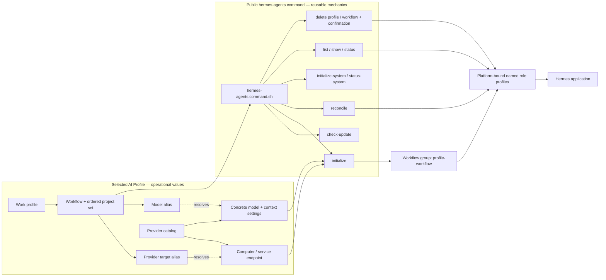
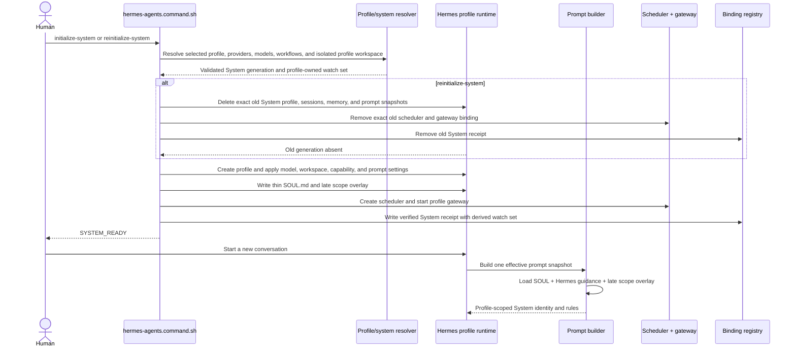

# Hermes Agents

## Purpose

Use `hermes-agents` to create, freshly reinitialize, reconcile, inspect, verify, or explicitly delete profile-scoped Hermes bots. Physical
application installation and upgrades belong to the `hermes` command under the `install` command group.
The command is portable; operational machine, endpoint, model, credential, workflow, and project values come from the
selected AI Profile.



The aliases make the mapping stable: replacing a model box or changing its installed model updates the private catalog
without changing this command, the workflow contract, or the bot lifecycle.

## Inputs

| Input | Required | Source | Description |
|---|---|---|---|
| Active AI Profile and workflow | Yes | Host activation | Authorizes the command and resolves profile-owned configuration. |
| Provider target | Yes | `local_ai.provider` plus the profile-owned provider catalog | Stable alias for the computer, service, or cloud endpoint that runs the model. |
| Model | Yes | `local_ai.model` plus the selected provider's model map | Stable model alias resolved to the provider's concrete model ID and Hermes tuning. |
| Command-specific input | Yes | User, workflow, profile, or source artifact | Active profile, Hermes platform binding, bot scope, and requested lifecycle action. |

## Outputs

| Output | Destination | Description |
|---|---|---|
| Command result | Caller, configured artifact path, or authorized external system | Host-neutral Hermes request/receipt or explicit unsupported-platform result. |

## Entry Point

| Entry point | Type | Profile-aware invocation |
|---|---|---|
| `hermes-agents/hermes-agents.command.sh` | Shell executable | Run through the initialized profile runtime; setup resolves the selected workflow, complete ordered project set, provider target, and model from profile configuration. |

Every invocation is profile-aware: the host must verify that the active workflow allows this command, resolve `AI_COMMANDS_ROOT`, and provide the selected profile root as `AI_PROFILE_ROOT` before this entry point is used.

Committed configuration template: `hermes-agents/hermes-agents.command.example.config`. Copy it into the selected profile, set only supported command value overrides, reference the copied file through `commands[].config`, and let the host expose it as `AI_COMMAND_CONFIG_PATH`. The committed example is documentation and must never be used as operational configuration.

## Linked Commands

| Command | Relationship | Use when |
|---|---|---|
| [`hermes`](../install/hermes/hermes.command.md) | Physical application prerequisite | Hermes must be inspected, installed, smoke-tested, updated, upgraded, or uninstalled. |
| [`install`](../install/install.command.md) | Parent installation command group | The human asks generically to install or update Hermes and the request must be routed to the exact child command. |

Hermes must be installed and pass its smoke test before profile, bot, or workflow-group initialization.

The selected portable workflow manifest at `ai-workflows/<workflow>/agents.yml` is authoritative for Agent names and
portable properties such as `aiProvider` and `flow`. The Hermes adapter realizes that roster as Hermes profiles and a
group chat; it does not maintain a second platform-specific roster or invent generic workers. A workflow entry may
reference a profile-owned `agent_providers_config` file that binds individual Agents or their stable binding names to a
provider alias and model alias from the profile provider catalog.

Hermes role-profile identity is `<profile>-<workflow>-<role-suffix>`. The workflow's complete ordered project set is
the logical group's runtime scope; repository or folder names never become part of stable agent identity. The first
project is primary and becomes Hermes `terminal.cwd`; all later entries remain authorized associated projects and are
written into the generated runtime instructions. `--project` is a compatibility selector that validates membership in
the configured set and never narrows it.

Hermes presents bots and group chats in one flat roster rather than a folder tree. Initialization therefore marks the
individual role profiles hidden in the top-level roster while retaining their group memberships and runtime behavior.
The default Hermes profile is also hidden and unpinned when `HERMES_GROUP_ONLY_NAVIGATION=true` (the default). The
workflow groups become the primary navigation; opening a group exposes its named participating roles. Hermes may still
surface a hidden profile temporarily while it is active or has attention-worthy recent activity.

The profile-owned provider catalog is the target map. Each `providers[]` entry describes one model box or service and its endpoint; each nested `models[]` entry maps a stable model alias to the concrete provider model and optional `hermes` context settings. Adding or replacing a computer therefore changes profile configuration, not this reusable command or its workflows.

## Subcommands

| Subcommand | Purpose |
|---|---|
| `install` | Compatibility delegate to the `install/hermes` command; new callers should invoke that install command directly. |
| `check-update` | Read-only comparison of the installed release, newest stable upstream date tag, and reviewed public installer pin; recommends an explicit upgrade when appropriate. |
| `initialize` | Resolve the selected profile/workflow and complete ordered project set, idempotently create every platform-bound role profile, and realize their profile-workflow Hermes group. |
| `initialize-system [--watch-group ID]... [--every DURATION]` | Create or reconcile one globally visible pinned System profile outside all workflow groups. Without `--watch-group`, its scheduler watches every Hermes workflow declared by the selected work profile; explicit watch groups may select only a narrower subset and cannot name another profile's groups. It then verifies the scheduler and gateway and records the exact binding. |
| `reinitialize-system --confirm-reinitialize [options]` | Preflight the complete System replacement, delete and verify the exact profile-owned System instance, then sequentially create its fresh profile, scheduler, gateway, and receipt. |
| `status-system --work-profile ID` | Verify the exact profile-owned Hermes System receipt. |
| `reinitialize` / `re-init` | After `--confirm-reinitialize`, preflight the complete replacement, delete the exact active workflow group and role profiles only when that preflight succeeds, then create a fresh complete generation. Existing conversations and memory for those profiles are removed. |
| `reconcile` | Reapply the resolved role-profile and group configuration while preserving conversations and memory. |
| `configure` / `setup` | Compatibility aliases for `initialize`; new integrations should use `initialize`. |
| `list` | List existing Hermes profiles. |
| `show PROFILE` | Inspect one exact profile. |
| `status PROFILE` | Verify its provider, model endpoint, advertised model, and workspace. |
| `delete PROFILE --confirm-delete` | Delete one exact non-default profile after explicit confirmation. |
| `delete-workflow --work-profile ID [--workflow ID] [--project ID] [--instance SLUG] --confirm-delete` | Resolve the exact workflow roster, remove every declared role profile, and tombstone its Hermes group so it cannot be reconstructed from profile metadata. |

Human wording such as “re-init” or “reinitialize” routes to `reinitialize`, not `initialize` or `reconcile`. The explicit
request supplies replacement intent; the executable still requires `--confirm-reinitialize` before deleting runtime data.
Replacement preflight happens before deletion. The operation then holds a short synchronization barrier between deletion
and recreation so a running Hermes Desktop can retire the old room identity and its conversation log before the same
logical group name is created again.

### System initialization and prompt realization

Use the System-specific lifecycle commands for the profile-scoped System agent. Do not manually delete only its Hermes
profile: that can leave its scheduler, gateway service, receipt, or cached conversation prompt behind.

```sh
# Create the profile-scoped System agent and watch every workflow declared by this profile.
hermes-agents.command.sh initialize-system --work-profile example

# Inspect the profile, scheduler, gateway, ticker, and receipt as one unit.
hermes-agents.command.sh status-system --work-profile example

# Safely remove the complete old generation and create a fresh one.
hermes-agents.command.sh reinitialize-system --work-profile example --confirm-reinitialize
```

`initialize-system` derives its default watch set from the selected profile. It does not watch workflows belonging to
other profiles. `--watch-group` is only needed to select a narrower subset of the selected profile's workflows.

System prompt realization deliberately has several layers with distinct jobs:

| Layer | Responsibility |
|---|---|
| Canonical System contract | The reusable source of truth for identity, responsibilities, conversational scope, and lifecycle rules. |
| Generated `SOUL.md` | A thin Hermes entry point containing the resolved profile identity, canonical contract reference, binding-registry path, and dynamic watch scope. Hermes loads it automatically. Referenced files are not textually expanded by Hermes. |
| Runtime `agent.system_prompt` | A generated late enforcement overlay for the small set of non-negotiable scope rules. It is derived from the canonical contract and dynamic profile binding; it is not a second policy source. |
| Isolated System workspace | The selected profile root, rather than a workflow repository. This prevents repository coding instructions and project-specific `AGENTS.md` files from changing the System agent's identity. |
| Runtime capability settings | Coding context and unrelated toolsets are disabled so the prompt and available capabilities agree with the lifecycle-monitor role. |
| Binding receipt | The authoritative profile-owned list of workflow groups and agents that System is configured to monitor. A ready receipt is configuration evidence, not proof that every backend is currently running. |
| Conversation prompt snapshot | Hermes constructs and caches the effective prompt when a conversation begins. Changing a source file does not retroactively rewrite an existing conversation's snapshot. |

The late overlay exists because Hermes also supplies its own general runtime guidance. Keeping the full policy in the
canonical contract avoids duplication, while repeating only the mandatory scope boundary late in the effective prompt
makes that boundary reliable for smaller local models.



Use `reconcile` when bindings or generated configuration should be reapplied without losing conversations. Use
`reinitialize-system` when testing a new System identity or prompt behavior, or whenever the old conversation snapshots
must be removed. Starting a new conversation is sufficient to pick up prompt changes only when the installed profile
configuration has already been reconciled and no other part of the generation must be replaced.

## Agent realization

`initialize` has the same lifecycle meaning as it does in `gpt-agents`: realize the agents declared for the selected
workflow on the selected platform. The realization cardinality differs by platform. Hermes App currently maps the
workflow to one named Hermes profile per configured role plus a profile-workflow group containing that roster.
Each profile receives references to the same portable Agent instructions, workflow instructions, allowed command catalog,
and complete project scope, plus references to its own reusable Role contract and assigned flow when declared. Each
profile also receives its independently resolved provider, model, context, and compression settings. `SOUL.md` is a thin
Hermes runtime entry point for those resolved bindings and references; it does not copy the contracts and is not a second
source of initialization truth. GPT App maps the same
workflow governance model to its declared multi-agent roster, such as Admin, Manager, and the five governed Dev roles.
This difference belongs to the platform adapters and must not be hardcoded as a universal agent count in either command.

### Implementation structure

The Hermes adapter separates resolution, validation, orchestration, and mutation so each layer has one responsibility:

| Component | Responsibility |
|---|---|
| `src/resolve-workflow-scope.mjs` | Resolve profile-owned workflow, projects, Agents, providers, models, and flows into a portable roster. |
| `src/resolve-system-scope.mjs` | Resolve one profile-scoped System agent, its provider/model, isolated profile workspace, and allowed workflow watch set. |
| `src/realize-workflow.py` | Parse the complete roster, preflight every Agent, track progress, write the binding receipt, and report the aggregate outcome. |
| `src/validate-profile.py` | Validate one Agent's static contracts, runtime dependencies, endpoint response, and advertised model without mutation. |
| `setup-hermes-profile.sh` | Apply one already-validated Hermes profile and group membership. |
| `src/configure-group.py` | Reconcile Hermes Desktop group metadata and navigation state. |
| `src/write-workflow-receipt.py` | Persist the durable ready receipt only after every declared Agent succeeds. |

The command package keeps human-facing launchers (`*.sh`), contracts, manifests, examples, and documentation at its
root. Implementation modules live under `src/`, and executable verification lives under `tests/`. Root launchers are
stable integration entrypoints; callers do not invoke files in `src/` directly.

Workflow realization is two-phase. Preflight must succeed for the complete roster before mutation begins. A later mutation
failure reports the failed profile and every profile completed in that attempt, and it never writes a ready receipt.

Successful initialization ends with one aggregate record:

```text
HERMES_WORKFLOW_READY: group=<profile-workflow> agents=<count> all_agents_ready=true profiles=<ordered-profile-ids> binding=<receipt-path>
```

This record, plus the durable binding receipt, is the authoritative indication that all workflow Agents were realized.
Individual `Hermes bot ready` messages are progress records and do not by themselves mean the workflow completed.

### Result and failure records

Lifecycle output uses stable prefixes so humans, launchers, and monitors can distinguish progress from completion:

| Prefix | Interpretation |
|---|---|
| `HERMES_CONFIGURATION_ERROR` | A requested provider or model alias is missing; output explains what failed, where to fix it, what was not checked, and confirms that Hermes was unchanged. |
| `HERMES_WORKFLOW_PREFLIGHT` | Validation has started for the stated roster size. |
| `HERMES_MODEL_TARGET_READY` | One resolved provider/model target passed validation. |
| `HERMES_WORKFLOW_READY` | Every Agent succeeded and the durable workflow receipt was written. |
| `HERMES_WORKFLOW_PREFLIGHT_FAILED` | The complete roster was checked, all failed profiles are named, and no workflow profiles were changed. |
| `HERMES_WORKFLOW_PARTIAL_FAILURE` | The message identifies the failed profile and profiles completed before failure; no ready receipt was written. |
| `HERMES_WORKFLOW_RECEIPT_FAILED` | Profiles were configured, but aggregate readiness was not recorded. |
| `SYSTEM_READY` | System profile, scheduler, gateway/ticker, and receipt are verified ready. |

Endpoint failures distinguish DNS resolution, connection, timeout, HTTP response, invalid JSON model-list, and configured
model-not-advertised errors. Configuration errors identify the provider catalog, requested alias, and available aliases.
Target messages include the affected profile, provider, model, and model-list URL but never provider
credentials.

The integration boundary is:

```text
AI Fleas workflow contract
  -> Hermes platform adapter
  -> Hermes profiles and group metadata
  -> Hermes Desktop-supervised profile backends
  -> configured model provider
```

AI Fleas owns the portable workflow contracts and their translation into Hermes configuration. Hermes owns the desktop
UI, profiles, sessions, backend process lifecycle, and model-provider communication. The adapter does not embed an AI
Fleas runtime inside Hermes and does not directly run the long-lived profile backends.

Workflow initialization writes an exact profile-owned group receipt containing the logical group ID, ordered projects,
realized profile IDs, and readiness only after the complete roster succeeds. System initialization preserves that receipt,
verifies its profile, scheduler, gateway, and ticker, then records its own identity beside it. The same registry path is
supplied to `SOUL.md` and the cron prompt. System remains globally pinned with `groups: []`; its profile gateway runs as a
user login service so scheduling does not depend on an open desktop window.

### Local background processes

`initialize` and `reconcile` create or update Hermes profiles; they do not themselves fork long-running processes. While
Hermes Desktop is open, Hermes may lazily start one local backend for each workflow profile that the UI or an active
session uses. These backends run from the Hermes virtual environment as commands equivalent to:

```text
python -m hermes_cli.main --profile <profile-id> serve --host 127.0.0.1 --port 0
```

Consequently, macOS Activity Monitor may show several generically named `python3` processes after realizing a workflow.
The command line's `--profile` value identifies the owning role, for example `example-dev-coder`; the parent process is
Hermes Desktop. They bind to loopback, are supervised by Hermes Desktop, and may be retired after Hermes considers them
idle. Quitting Hermes Desktop stops Desktop-owned workflow backends. AI Fleas does not rename these processes because
Hermes Desktop owns their launch and process-title behavior.

The System profile is intentionally different. `initialize-system` installs its profile gateway as a user login service
and starts it immediately so scheduled lifecycle checks continue without an open Hermes Desktop window. Use
`status-system` to verify that service. Deleting or reinitializing profiles is a separate, explicit lifecycle operation;
do not terminate individual Python processes as a substitute for those commands.

## Tags

#command #ai-command #hermes #local-ai #profile-management

Define the portable contract for managing Hermes Agent profiles through the public Hermes platform adapter.

## Intent mapping

Use this command for requests to create, inspect, validate, reconfigure, or explicitly delete a Hermes profile. The
active AI profile supplies the workflow, project, provider, model, workspace, and agent-instruction bindings.

## Required behavior

- Resolve every provider, model, workflow, project, and command binding through the selected AI profile.
- Validate the model endpoint and advertised model before creating or changing a profile.
- Generate agent instructions that identify the selected workflow and commands without embedding private configuration.
- Preserve conversations and memory during reconciliation unless the human explicitly requests replacement from scratch.
- Require explicit confirmation and an exact profile identifier before deletion.
- For workflow deletion, resolve the complete profile/workflow/project identity and delete only the adapter-declared roster and its exact group.
- Refuse credentials, private endpoints, machine paths, or organization-specific defaults in this public contract.

## Platform boundary

This public command owns portable Hermes bot-profile lifecycle mechanics. The `install/hermes` command owns physical
Hermes package installation, update, upgrade, and uninstall semantics; this command's legacy `install` verb is a
compatibility delegate. The public Hermes platform
adapter maps logical AI Fleas agents to those profiles. The operational AI Profile owns provider authentication,
endpoints, model mappings, context tuning, and project bindings. A launcher may invoke the command or open the Hermes
application, but it does not own or duplicate these configuration semantics.

## Safety

- Never delete a default or unnamed profile.
- Never infer a private companion platform from nearby directories.
- Never print credentials or persist them in generated instructions.
- Never broaden the selected workflow's command set.

See [spec.md](spec.md) for acceptance requirements.
