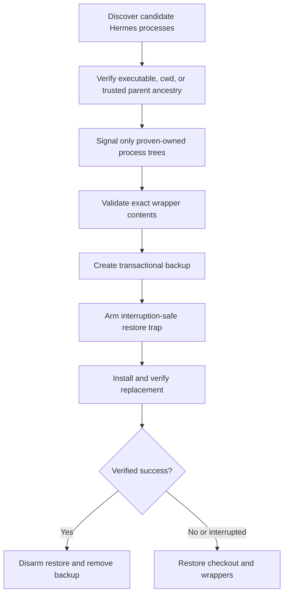

# Hermes developer clean install



`install-hermes.sh` is the developer-only, one-command clean installer for Hermes on macOS Apple Silicon. Run it through the public command with:

```sh
hermes-app/hermes-app.command.sh install
```

Use `--dry-run` to print the proven-owned processes and installer-managed paths that would be affected. Dry-run acquires the same per-user lock and performs the same safety preflight, but it does not signal processes, download an installer, move files, or install anything.

The script accepts only Darwin on arm64 and acquires an atomic per-user lock before work. It treats a process as Hermes-owned only when its executable is inside the verified Hermes checkout, its current working directory is the checkout, it is the exact downloaded installer, or it descends through a trusted parent chain from one of those roots. Descendants are collected through PPID relationships. Proven trees are signalled child-first with `TERM`, given a bounded wait, and escalated to `KILL` only for survivors. A process that merely mentions a Hermes path in its arguments is not owned.

Before mutation, the checkout must resolve to the exact installer-owned root. Git status must contain no modified or unclassified user-created data; exact installer metadata markers are the only allowed exceptions. User configuration, credentials, authentication state, sessions, logs, and other unclassified data outside the installer-owned checkout are never deletion targets.

All three command wrappers—`hermes`, `hermes-agent`, and `hermes-acp`—must be absent or match their complete canonical official content. A symlink, dangling entry, external target, extra command, or wrapper that merely contains expected path fragments fails closed before anything moves.

The verified checkout and wrappers move together into a per-run backup. At that point the restore guard is armed for `EXIT`, `INT`, and `TERM`. Installer failure, interruption, missing wrappers, version mismatch, or commit mismatch restores the exact prior checkout and wrappers. The guard is disarmed and the backup removed only after replacement verification succeeds. If restoration itself fails, the script reports and retains the recoverable backup path.

Installation downloads the official installer into an owned temporary file, then invokes it with commit `fcbd1076a93841fa88855acce810e342a5b78101`, `--skip-setup`, and `--skip-browser`. It never executes an opaque curl pipe. Success requires executable wrappers, `Hermes Agent v0.20.5 (2026.8.19)`, the exact pinned checkout commit, no remaining owned installer processes, lock cleanup, and a browser-tooling status report. If `~/.local/bin` is not on `PATH`, the script prints the required guidance.

Browser tooling is deliberately skipped because it is not required for Stage 2 launcher readiness. The script does not run Hermes setup, authenticate, configure a provider or model, start a session, or implement any Stage 3 terminal, conversation, MCP, tools, or reconnect behavior.

## Configure a profile-backed Hermes bot

After a clean Hermes installation, recreate the profile-backed Desktop bot with:

```sh
AI_CONFIG_PROJECT=/path/to/profile-repository \
  /path/to/ai-fleas/ai-commands/hermes-app/hermes-app.command.sh initialize \
  --work-profile PROFILE --workflow WORKFLOW --project PROJECT
```

The public `hermes` command delegates setup to its colocated `setup-hermes-profile.sh`. It resolves and validates the
profile-selected OpenAI-compatible target, concrete model, context settings, and project workspace before creating or
changing the Hermes profile. Existing profile memory and conversations are preserved on repeat runs. Use the same
command's `list`, `show`, and `status` actions for read-only inspection; its guarded `delete` action
removes exactly one explicitly confirmed non-default profile.
