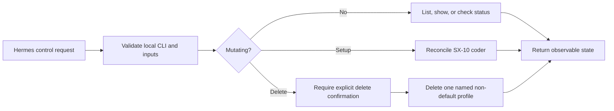

# Hermes — Specification

**Status: ACTIVE**

## At a glance



**Input:** An action (`setup`, `list`, `show`, `status`, or `delete`) and action-specific options. Profile-aware setup also
accepts a work-profile ID, workflow selector, project selector, optional instance suffix, and optional agent-instructions
path override.

**Output:** Verified Hermes profile or model-service state, or a precise failure.

**Execution:** Use the locally installed Hermes CLI. Delegate SX-10 provisioning to the repository-owned setup script.

**Critical boundary:** Profile deletion is destructive and must require `--confirm-delete`. The Hermes `default` profile must never be deleted by this command.

**Suggested agent profile:**

```yaml
agent_requirements:
  reasoning: medium
  autonomy: medium
  tool_use: required
  human_interaction: optional
  capabilities:
    - shell
    - local-service-diagnostics
    - structured-failure-handling
    - destructive-action-validation
```

## Scope

The command manages local Hermes profiles relevant to this repository. It can reconcile the repository's SX-10 coding bot,
inspect profiles, verify a profile's configured model endpoint, and delete one explicitly named profile.

It does not install or uninstall Hermes, edit arbitrary Hermes files directly, manage chats, or delete profiles in bulk.

## Preconditions and dependencies

- `hermes` must resolve from `HERMES_BIN`, `PATH`, or `~/.local/bin/hermes`.
- `setup` resolves its default endpoint, provider model, and workspace from the selected work profile before invoking
  `ai-launcher/scripts/hermes/setup-sx10-coder.sh`.
- The work profile must resolve from `ai-profile/<id>/<id>-work-profile.yml` without escaping `ai-profile/`.
- The workflow must declare `harness: hermes`, a `local_ai.providers_config`, provider alias, model alias, and at least one
  project reference.
- The provider and model aliases must resolve unambiguously through the workflow-selected profile-owned provider catalog.
- The project selector must resolve unambiguously through that workflow's project refs to a project whose `repo_path` is
  an existing absolute directory.
- `agent_instructions_path` is a profile-level concern independent of project `repo_path`. When configured, it must
  resolve to a readable regular file. `--agent-instructions PATH` may explicitly override it.
- `status` requires `curl`, a configured `model.base_url`, and a configured `model.default` for the selected profile.
- Profile identifiers must contain only lowercase letters, digits, hyphens, and underscores.

## Behavior

- `setup --work-profile PROFILE [--workflow WORKFLOW] [--project PROJECT] [options]` must resolve the effective workflow,
  provider, model, and project before invoking the repository-owned setup script. When workflow is omitted, the work
  profile's `default_workflow` is used. When project is omitted, the workflow must contain exactly one project.
- `WORK_PROFILE_ID` may supply the work-profile ID when `--work-profile` is omitted.
- Unless an explicit Hermes `--profile` override is supplied, setup must name the Hermes profile
  `<work-profile>-<workflow>-<project>`. `--instance SLUG` appends `-<slug>` when multiple bots share the same scope.
- Explicit `--workspace`, `--endpoint`, and `--model` setup options may override resolved values for diagnostics or a
  deliberate one-off, but the command must still resolve and record the selected profile scope.
- `setup --profile PROFILE ...` must support creating multiple independent profiles against the same validated model
  service; it must not overwrite or delete another profile.
- The generated SOUL must record the resolved work profile, workflow, project, workspace, and separately resolved agent
  instructions. It must not infer that an `AGENTS.md` exists inside the selected project.
- `list` must return the Hermes CLI profile inventory.
- `show PROFILE` must return Hermes's detailed view of exactly that profile.
- `status [PROFILE]` must read the profile's provider, model, endpoint, and workspace, query `<endpoint>/models`, and fail if the configured model is not advertised.
- `delete PROFILE --confirm-delete` must delete exactly one named profile using the Hermes CLI's non-interactive confirmation.
- `delete` must reject `default`, missing confirmation, unsafe identifiers, and extra arguments before mutation.

## States and failures

- `HERMES_READY`: requested setup or inspection completed and its observable checks passed.
- `HERMES_PROFILE_DELETED`: the exact requested profile was deleted and absence was verified.
- `HERMES_CLI_MISSING`: no executable Hermes CLI could be resolved.
- `HERMES_INVALID_INPUT`: an action, profile, or option is missing or unsafe.
- `HERMES_PROFILE_SCOPE_INVALID`: profile, workflow, provider, model, or project scope cannot be resolved unambiguously.
- `HERMES_DELETE_CONFIRMATION_REQUIRED`: deletion lacks `--confirm-delete`.
- `HERMES_DEFAULT_PROTECTED`: deletion targets the required `default` profile.
- `HERMES_MODEL_UNAVAILABLE`: the endpoint is unreachable or does not advertise the configured model.

## Safety invariants

- Never interpret a wildcard, empty string, display label, or list as a deletion target.
- Never delete `default` or invoke `hermes uninstall`.
- Never print credentials or read API keys for status reporting.
- Use Hermes CLI operations instead of directly removing profile directories or aliases.
- Forward setup options as discrete arguments; do not evaluate constructed shell text.

## Completion criteria

- Read-only actions return the requested live CLI/config state.
- `setup` completes the setup script's configuration readback.
- `status` proves the configured model appears in the live `/models` response.
- `delete` proves the target no longer appears in `hermes profile list`.

## Future scope

Start/stop controls, exports/backups, cron management, and bulk lifecycle operations require separate specified behavior.
