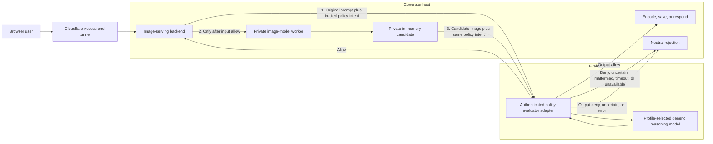
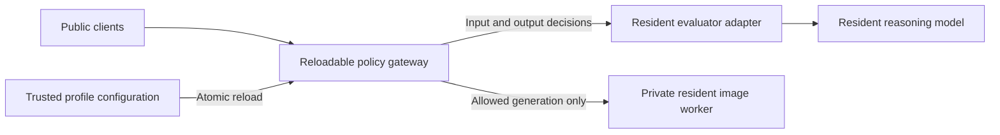

# Install AI Local Provider

## Purpose

Use `install-ai-local-provider` to install an AI Local Provider either on the active profile's local computer or on a dedicated remote AI machine.

The command is interactive and profile-aware. The installed provider belongs to the AI profile and may be consumed by the profile's `(profile, platform)` System agents and by commands that declare optional AI assistance.

Normative behavior is defined by [`install-ai-local-provider.spec.md`](install-ai-local-provider.spec.md).

Generic policy selection and the request-time enforcement architecture are documented in
[`model-prompt-policy.md`](model-prompt-policy.md). This contract applies to text, image, and multimodal model modes; a
model-specific serving implementation is only an adapter to that contract.

**Status: BETA — SSH onboarding, machine qualification, fresh-Ubuntu dependency installation, pinned model/runtime provisioning, service setup, and inference verification are runnable.**

The normative, human-readable execution contract is [`PLAN.md`](PLAN.md). Stable
step IDs are emitted during execution, and automated plan-sync validation prevents
the document and implementation from drifting apart.

Every invocation prints and writes a timestamped, permission-restricted transcript
under `ai-commands/install/ai-local-provider/logs/`. The terminal and log receive the same progress,
so a human or AI collaborator with workspace access can inspect an active or failed
run. Interactive sudo password input is never echoed or logged.

## Inputs

| Input | Required | Source | Description |
|---|---|---|---|
| Active AI Profile and workflow | Yes | Host activation | Authorizes execution and resolves profile-owned machine configuration. |
| Action | No | Human or workflow | `inspect`, `status`, `preflight`, `install`, `model-auth`, `model-status`, `switch`, or `unload`; defaults to `install`. |
| Target | Yes for remote mode | Profile, CLI, or interactive prompt | A configured box ID, SSH alias, or explicit host and SSH user. |
| Model preset | Yes for installation | Profile, CLI, or committed preset default | Reviewed model/runtime definition to validate and provision. |

## Outputs

| Output | Destination | Description |
|---|---|---|
| Connection and machine evidence | Caller or private profile inventory | Structured SSH, identity, OS, architecture, resource, GPU, privilege, and service status. |
| Guided recovery | Caller | Safe host-key, public-key enrollment, configuration, and retry guidance. |
| Provider installation | Selected local or remote machine | Reconciled runtime, model, service, endpoint, and verified inference when supported. |

## Entry Point

| Entry point | Type | Profile-aware invocation |
|---|---|---|
| `install/ai-local-provider/install-ai-local-provider.sh` | Shell executable | Activate the selected profile and workflow, then invoke through the host's profile-aware command runner. |

Every invocation is profile-aware: the host must verify workflow authorization and expose the selected profile-owned
configuration as `AI_COMMAND_CONFIG_PATH`.

Committed configuration template: `install/ai-local-provider/install-ai-local-provider.command.example.config`. Copy it
into the selected profile, set only supported non-secret overrides, reference the copy through `commands[].config`, and let
the host expose it as `AI_COMMAND_CONFIG_PATH`. The committed example is documentation and must never be operational configuration.

## Normal invocation

```text
install-ai-local-provider.sh [inspect|status|preflight|install|model-auth|model-status|switch|unload]
```

Model lifecycle subcommands use the selected box's profile-owned `model_modes` registry:

```text
install-ai-local-provider.sh model-status --box <box>
install-ai-local-provider.sh model-auth --box <box>
install-ai-local-provider.sh switch --box <box> --mode coding
install-ai-local-provider.sh switch --box <box> --mode image
install-ai-local-provider.sh unload --box <box>
```

Policy-aware switching is designed to make the selected profile explicit:

```text
install-ai-local-provider.sh switch --box <box> --mode image --policy education-child
install-ai-local-provider.sh switch --box <box> --mode image --policy unrestricted --acknowledge-unrestricted
```

See [`model-prompt-policy.md`](model-prompt-policy.md) for the composition diagram, request hook, interactive behavior,
automation contract, and limitations. These switches describe the generic contract and are not yet implemented for all
model modes.

## Protected image-service installation and runtime

The image UI is a client; it is not the enforcement boundary and does not call the evaluator directly. Installation of
a protected image mode places the request-time enforcement hook in the image-serving backend on the generator host.
Every browser, API, tunnel, and automated client therefore traverses the same validation path.



The arrows to the evaluator are initiated by the generator-host backend. The browser never receives the evaluator's
private endpoint or credential and cannot address the image worker directly. The same selected policy intent is applied
to input and output decisions.

```text
browser
   |
   v
public access/tunnel
   |
   v
generator host: image-serving backend
   |  1. authenticated semantic input decision
   +---------------------------------------------> evaluator host: policy service -> local reasoning model
   |<--------------------------------------------- allow / deny / uncertain
   |
   |  2. only allow reaches the image model
   v
private in-memory candidate
   |  3. authenticated semantic output decision
   +---------------------------------------------> evaluator host
   |<--------------------------------------------- allow / deny / uncertain
   |
   +-- allow: encode/save/respond
   +-- deny/uncertain/error: discard; never publish
```

The image-serving backend is a managed process on the generator box (for example, a FastAPI/Uvicorn process inside the
profile-selected container, owned by a systemd user service). It, not the web UI or tunnel, calls the evaluator over the
trusted private network. The evaluator exposes only the narrow authenticated decision contract; its underlying model
runtime may remain loopback-only.

The current generic reference implementation is split deliberately:

| Component | Installed responsibility |
|---|---|
| [`serve.py`](../../data/local-image-benchmark/runtime/serve.py) | Generator-host backend: receives client requests, invokes input validation, runs image inference only after `allow`, holds candidates in memory, invokes output validation, and releases only allowed output. |
| [`policy_moderation.py`](../../data/local-image-benchmark/runtime/policy_moderation.py) | Generator-host authenticated decision client and strict response/failure handling. |
| [`ollama_policy_service.py`](../../data/local-image-benchmark/runtime/ollama_policy_service.py) | Evaluator-host narrow decision adapter: validates the request, calls the profile-selected local reasoning model, and returns the versioned decision contract. |
| [`generation_policy.py`](../../data/local-image-benchmark/runtime/generation_policy.py) | Loads the selected policy profile, semantic intent, refusal, and model-steering fields. It contains no mechanical keyword validator. |
| [`local-image-generator@.service`](../../data/local-image-benchmark/assets/systemd/local-image-generator@.service) | Generic generator service template; the private profile supplies the host/model/runtime instance values. |
| [`ai-policy-evaluator.service`](../../data/local-image-benchmark/assets/systemd/ai-policy-evaluator.service) | Generic evaluator service template; the private profile supplies endpoint/model/runtime values. |

### What the validator is

The reference deployment does not use a policy-specific classifier or a separately fine-tuned moderation model. Its
reasoning engine is a generic profile-selected multimodal model served by a local model runtime. The installed
`ollama_policy_service.py` process is nevertheless an important validator adapter rather than a raw model endpoint. It:

- authenticates the generator-host client;
- accepts only the versioned decision-request schema;
- treats policy instructions as trusted and request/candidate content as untrusted;
- asks the generic model to reason about intent in any language and apply the supplied semantic policies;
- constrains output to `allow`, `deny`, or `uncertain` plus known policy IDs;
- validates request IDs and returned policy IDs; and
- normalizes malformed, ambiguous, or inconsistent model output to fail-closed `uncertain` behavior.

There is no separate evaluator service implementation for nudity, profanity, individual languages, or other policy
categories. The workflow-selected policy intent travels in each authenticated decision request. Consequently, the same
running adapter and reasoning model can evaluate a different policy profile on the next request without redeployment.

```text
generator backend
   -> authenticated decision request containing selected policy intent
generic evaluator adapter
   -> constrained reasoning request
profile-selected local reasoning model
   -> candidate structured decision
generic evaluator adapter
   -> validated allow / deny / uncertain
```

### Defaults, switching, and restart boundaries

The portable generic default is `unrestricted` with semantic gates off for backward compatibility. A private workflow
may instead bind a restricted profile with semantic input/output enabled; the current `sc/dev` binding does so. A
restricted policy without semantic input validation is invalid and fails startup.

In the current reference implementation, the image-serving backend reads its policy selection and gate settings from
environment variables at process startup. Because that process also owns the loaded image pipeline, changing those
settings currently restarts the generator process and reloads the heavy image model. This is a current implementation
limitation, not a requirement of semantic validation.

Changing the active policy profile or turning enforcement on/off does **not** inherently require restarting the evaluator.
The evaluator receives policy intent in every request and can remain resident. Restart boundaries are:

| Change | Current required action |
|---|---|
| Different policy profile with the same evaluator | Restart combined generator backend today; evaluator remains running. |
| Restricted ↔ explicitly acknowledged `unrestricted` | Restart combined generator backend today; evaluator remains running. |
| Evaluator model, GPU/CPU allocation, bind address, authentication, or evaluator code | Restart evaluator service. |
| Image model, pipeline, runtime image, or accelerator allocation | Restart image-model worker. |

The desired implementation separates a lightweight policy gateway from the private heavy image worker:



Policy changes would then atomically reload trusted gateway configuration, or restart only that small gateway, without
unloading either model. The public request schema must never expose a per-request bypass. Selecting `unrestricted`
remains a trusted profile/installer operation requiring explicit acknowledgement. This gateway separation is planned
installer/runtime work and is not yet implemented.

### What happens when validation is enabled but the evaluator is unavailable?

The protected service fails closed. There is no automatic fallback to unchecked generation or to `unrestricted`:

| Failure point | Required behavior |
|---|---|
| Evaluator unavailable before input decision | Return a bounded service-unavailable response; do not invoke the image model. |
| Evaluator returns `uncertain`, malformed output, mismatched IDs, or an authentication error | Reject before inference; do not reinterpret the result as `allow`. |
| Evaluator becomes unavailable after input approval but before output approval | The model may have produced a private in-memory candidate, but the backend discards it and returns an error; it is never encoded, saved publicly, or returned. |
| Evaluator recovers | New requests may proceed after dependency health and normal decisions succeed; no image-model reload is inherently required. |

The public page and tunnel can remain reachable during an evaluator outage, but protected generation is unavailable.
The request path already returns HTTP 503 for an unavailable evaluator. Aggregate generator/gateway health should also
probe the lightweight evaluator health endpoint and report a degraded/unavailable dependency so the UI can explain the
problem before accepting a generation request. This dependency-health reporting is an improvement requirement; it does
not replace request-time validation, and a stale positive health result must never authorize inference.

The private profile selects independently:

- generator host, service instance, runtime image, image model, model parameters, and resource limits;
- policy profile and required input/output semantic gates;
- evaluator host, endpoint, evaluator model, timeout, credential-file binding, and runtime allocation.

For a restricted policy, semantic input validation is mandatory. Only `allow` reaches image inference. `deny`,
`uncertain`, timeout, malformed response, authentication failure, or evaluator unavailability fails closed. Output
validation occurs before encoding, saving to a public output directory, or returning candidate bytes.

Installation/reconciliation must configure both sides:

```text
generator host                         evaluator host
------------------------------         --------------------------------
local-image-generator@<mode>           ai-policy-evaluator.service
image-serving backend                  decision-service adapter
profile-rendered environment           profile-selected reasoning model
policy definitions                     private bind address
read-only credential mount             owner-only matching credential
```

The current reference deployment proves this topology, but it was reconciled manually during acceptance. The public
templates and private workflow binding are merged. Automatic profile-to-host reconciliation—reading that binding,
rendering both service configurations, distributing credentials through an authorized secret path, starting in
dependency order, and running the acceptance gates below—remains installer implementation work. Documentation of the
contract must not be interpreted as evidence that this automation already exists.

`switch` first validates the target service in the configured system/user manager. If that mode is already the sole active
and healthy mode, it returns without reloading the model. Otherwise it stops every configured peer service before starting
the requested mode, reports periodic loading progress, waits for its localhost health endpoint, fails early if the target
service enters systemd's failed state, verifies that exactly one mode is active, and attempts to
restore the previously active mode if startup or readiness fails. `unload`
stops all configured model modes while preserving services, configuration, and downloaded model artifacts.

`model-auth` accepts `HF_TOKEN` only through an authorized secrets-adapter child environment, streams it to the selected
machine over SSH standard input, authenticates the configured owner-only Hugging Face cache, and never places the token in
command arguments or logs. Direct invocation without an injected secret fails closed.

API-only model runtimes may use the reusable [local model browser gateway](gateway/README.md). The model remains on a
loopback-only upstream port while the gateway owns the tunnel-facing port, serves a no-cache chat page, and transparently
streams the existing `/v1` API. `GET /gateway-health` proves both the gateway and upstream model are ready. The gateway is
not an authentication boundary; the profile remains responsible for protecting the public origin.

Launching the shell file with no arguments in a terminal opens a deterministic guided menu. It explains the command's
current capabilities, offers first-run preflight, status, installation-plan validation, help or exit, lists machines from
the active profile, and collects a one-run target when the profile has none. This interface does not require AI-powered
execution. A future AI layer orchestrates the same entry point and result states rather than replacing its mechanics.

The command first selects installation mode:

```text
Install AI Local Provider

1. This profile / local computer
2. Dedicated remote machine
3. Exit
```

## Profile-local provider

The first implementation targets macOS, where the active AI profile commonly runs on the user's laptop/desktop.

The profile-local flow:

1. detect macOS and CPU architecture;
2. inspect available memory/resources;
3. present compatible small/fast model presets;
4. install/reuse `llama.cpp` / `llama-server` locally;
5. download/reuse the selected model;
6. configure a localhost-only HTTP provider;
7. configure local autostart/service lifecycle appropriate for macOS;
8. launch the provider;
9. verify HTTP and real inference;
10. register/reconcile the provider in the active profile's `ai_providers` configuration when explicitly authorized.

The default profile-local endpoint is localhost only and is intended as a small, always-available inference capability for System and AI-enabled commands.

## Dedicated remote provider

The remote flow provisions Ubuntu AMD64 over SSH. When profile command configuration contains known boxes, the command lists them plus `Add new machine`.

```text
Available machines:
1. mini-01   192.0.2.41
2. mini-02   192.0.2.42
3. gx10-01   192.0.2.43
4. Add new machine
```

It resolves SSH settings from the active profile, installs the provider under `/opt/ai-local-provider`, downloads/reuses the model, installs/enables systemd, launches the model and verifies real inference.

Before installation it performs conservative system cleanup using Ubuntu's own
temporary-file policy, trims old journals and package caches, and removes stale
partial downloads owned by this command. It does not delete Downloads, user
documents, arbitrary home caches or backups, or unrelated application data.

Selecting a machine applies only to the current invocation. The profile may contain any number of named machines, and the
human can choose a different configured machine or `Add new machine` each time without changing the default.

Before provisioning, the command guides SSH onboarding:

1. resolve or collect the machine's logical ID, host, user, port and key/SSH-alias reference;
2. verify reachability and present an unknown SSH host-key fingerprint for human verification;
3. test non-interactive public-key or SSH-agent authentication;
4. if authorization is missing, show the public key being used and a copyable `ssh-copy-id` command, then let the human retry;
5. verify the remote user, Ubuntu/architecture and required `sudo` access;
6. optionally save only non-secret connection references to the active profile; and
7. continue directly to model selection and installation.

The command never accepts a password override and never asks for a password in AI chat. A one-time SSH or `sudo` password
may be entered only into a trusted, non-echoing interactive terminal prompt. Passwords and private-key contents are never
stored in the profile, command arguments, environment variables, logs or this repository.

## First-run / incomplete configuration

Missing configuration is handled interactively. The command explains what is needed and offers to configure the local provider, add a remote machine, show the relevant profile configuration/example, or exit.

It MUST NOT fail with only a low-level missing-config/path/parser error.

Connection discovery is read-only. Saving a new machine to the profile and provisioning it are separate choices. The human
may use an entered machine once without saving it, and may retry after authorizing a public key without restarting the command.

## Profile AI providers

AI provider definitions belong to the profile, not to individual commands or System instances. A profile can expose providers such as:

```yaml
providers:
  - id: local
    type: local
    endpoint:
      url: http://127.0.0.1:8080/v1

  - id: mini-01
    type: remote
    endpoint:
      url: http://192.0.2.41:8080/v1
```

Consumers bind by provider ID. A System instance may use the profile's `system_agent` provider binding; AI-enabled commands may use the profile's command default or their own allowed provider policy.

Provider selection supplies inference only. It never expands a command's or System agent's authority.

## System cardinality

System remains exactly one active instance per `(profile, platform)` binding. Several profiles may run on one platform, each with an isolated System instance. One profile may also have separate System instances on several platforms.

Those instances may share the same profile-level AI provider without sharing their platform runtime state, watch scope or lifecycle authority.

## Remote box configuration

Remote provisioning details stay in profile-owned command configuration. A profile may define multiple named boxes with host/IP, SSH user, SSH port, SSH key path/reference, optional preset and supported overrides.

Private key contents/passwords MUST NOT be committed. Reference local key paths or supported private credential mechanisms.
An `ssh_alias` from the user's SSH configuration is also supported. Conflicting alias and explicit connection values fail
closed instead of being guessed.

## Resolution order

Values resolve in this order:

1. explicit CLI arguments;
2. selected profile provider/box values;
3. active-profile command defaults;
4. committed preset defaults;
5. interactive prompt for unresolved required values.

The command shows the resolved plan before provisioning and requires confirmation unless an explicitly supported non-interactive authorization mode is used.

## Presets

Presets are committed selectable model/runtime definitions under [`presets/`](presets/). The command presents compatible presets interactively when one is not already resolved. Selecting a preset includes downloading the model when a valid matching artifact is not already installed.

## Completion

Complete only when the selected provider is installed, launched, its model is ready, HTTP responds and real inference succeeds. When profile registration was requested, the profile provider binding must also be reconciled successfully.

## Tags

`#command` `#ai-command` `#install` `#ai` `#local-ai` `#provider` `#macos` `#ubuntu` `#interactive` `#profile-aware` `#system-agent` `#model-preset` `#ssh` `#sdd`
