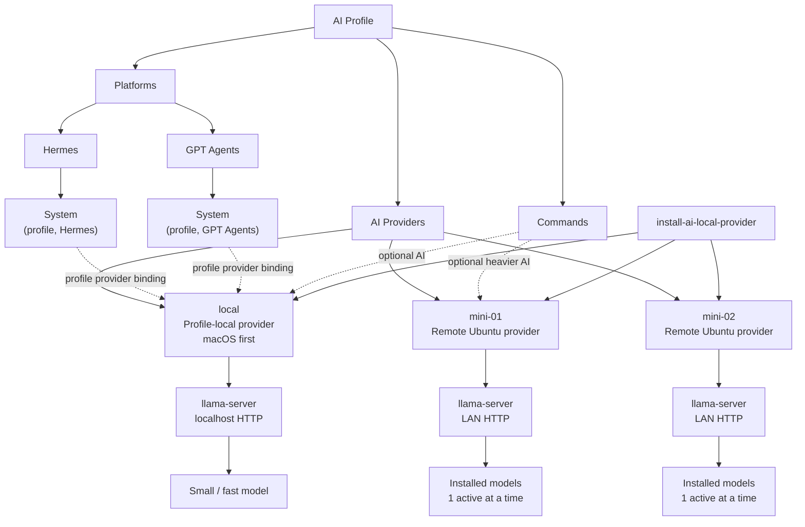

# Install AI Local Provider Specification

## Purpose

`install-ai-local-provider` interactively installs an AI Local Provider either on the active profile's local computer or on a dedicated remote machine.

The provider belongs to the AI profile. Profile consumers such as System agents and optionally AI-powered commands bind to a provider by ID; they do not own or install the provider themselves.

## Architecture



The important boundaries are:

- providers are profile-level capabilities;
- System cardinality is one per `(profile, platform)` binding;
- multiple System instances may share the same profile provider without sharing lifecycle state or authority;
- commands may optionally consume a configured provider;
- provider selection supplies inference only and never expands consumer authority;
- a remote machine may retain multiple models, but its provider runs at most one active model at a time.

## Status

BETA. Remote SSH onboarding, preflight, status, plan validation, and Ubuntu 24.04 provisioning are implemented. The
provisioner installs missing native build dependencies, NVIDIA driver/CUDA toolkit, a revision-pinned llama.cpp runtime,
a checksum-pinned model, an unprivileged systemd service, and verifies health plus real inference. A driver installation that needs a reboot
stops explicitly and resumes safely when the command is rerun.

## Installation modes

Interactive execution is the default behavior. The first choice is:

```text
Install AI Local Provider

1. This profile / local computer
2. Dedicated remote machine
3. Exit
```

The implemented beta may present capability choices before target selection: recommended first-run preflight, provider
status, installation-plan validation, help, or exit. The menu is deterministic and available while `ai.powered` is false.
When AI-powered orchestration is enabled later, it MUST call the same entry point and honor the same result states.

### Profile-local

The first implementation supports macOS. The command detects the Mac architecture/resources, presents compatible small/fast presets, installs/reuses `llama.cpp` and `llama-server`, downloads/reuses the selected model, configures localhost-only HTTP and macOS autostart, launches the model, verifies real inference, and may register/reconcile the provider in the active profile when explicitly authorized.

### Dedicated remote

The first implementation supports Ubuntu 24.04 LTS AMD64/x86_64 over SSH. When profile command configuration contains known boxes, the command presents them plus `Add new machine` and asks only for unresolved values.

The selected box is invocation-scoped. A profile may contain many boxes, and choosing one MUST NOT silently replace the
profile default or change another box. The human may select a different configured box or add a new box on every run.

## Interaction contract

When configuration is absent, empty or incomplete, the command MUST remain useful. It explains what is missing and offers guided next actions: configure the profile-local provider, add a remote machine, show the relevant profile configuration/example, or exit.

The command MUST NOT respond to missing configuration with only a low-level file/path/parser error.

For a remote target, the guided interaction MUST distinguish connection setup from provider installation. Before showing
an installation plan it:

1. lists configured profile boxes with logical ID, host, user and port, plus `Add new machine`;
2. accepts a configured box, an explicit supported override, or interactively collects a new logical ID, host, user and port;
3. checks network reachability and obtains the SSH host-key fingerprint without trusting it silently;
4. asks the human to verify an unknown or changed fingerprint before recording trust;
5. tries non-interactive public-key/agent authentication using the resolved SSH configuration;
6. when authentication is unavailable, explains that a public key must be authorized and offers actionable key-enrollment
   guidance appropriate to the host, then pauses with `SSH_AUTHORIZATION_REQUIRED`;
7. after the human completes enrollment, supports retrying the connection in the same invocation;
8. validates the remote identity, supported OS/architecture and required `sudo` capability;
9. offers to save only the non-secret box configuration to the active profile, with explicit authorization; and
10. continues to preset selection and the installation plan without making the human restart the discovery process.

The interaction SHOULD show the exact public-key file or SSH-agent identity being tested and a copyable enrollment command
such as `ssh-copy-id -i <public-key> -p <port> <user>@<host>`. It MUST NOT ask the human to paste a password into the AI
conversation. Password entry, when required for one-time key enrollment or `sudo`, occurs only in a trusted interactive SSH
or terminal prompt whose input is not echoed, captured, stored or forwarded through command arguments.

An SSH password is bootstrap authentication, not profile configuration. There is no password CLI override, environment
variable, committed example field or persisted command value.

## Profile awareness and multiple boxes

The host activates the selected AI profile/workflow and provides profile-owned command configuration through `AI_COMMAND_CONFIG_PATH` according to the common command contract.

A profile may define multiple named remote boxes with logical name, host/IP, SSH user, SSH port, SSH key path/reference, optional default model preset and supported overrides.

Private key contents/passwords MUST NOT be committed. A profile should reference a local key path, SSH agent/configuration or another supported private credential mechanism.

Each box may use either explicit `host`/`user`/`ssh_port`/`ssh_key` references or an `ssh_alias` resolved by the user's SSH
configuration. The command MUST resolve exactly one connection identity and report conflicting or ambiguous settings rather
than guessing. Machine-specific values remain in the active private profile or user SSH configuration and never become
public AI Fleas examples or runtime state in this repository.

AI provider endpoint/model bindings belong to profile `ai_providers` configuration; SSH provisioning details belong to this command's profile-owned command configuration.

Machine discovery delegates to the reusable `machine-profile` capability and returns `ai-machine-profile.v1` JSON. With explicit
`--save-profile`, the command writes that JSON beneath the selected private profile command configuration and records its
relative `inventory` reference on the selected box. The snapshot contains observed hardware/software facts and timestamp,
never credentials, and is refreshed rather than treated as permanent truth.

## Value resolution

Values resolve with this precedence:

1. explicit CLI arguments;
2. selected profile provider/box values;
3. active-profile command defaults;
4. committed preset defaults;
5. interactive prompt for still-required values.

Before target modification, the command displays the resolved target, connection identity where applicable, model preset and material installation choices and obtains confirmation unless explicitly running in a supported non-interactive authorization mode.

Installation performs only conservative, recreatable cleanup: OS-expired
temporary files, package caches, bounded journal retention, and stale partial
model downloads owned by this command. Personal data, Downloads, arbitrary user
cache or backup directories, and unrelated application data are outside cleanup
scope.

Connection discovery and read-only validation do not authorize profile mutation or remote provisioning. Saving a newly
discovered box and installing the provider are separate confirmation boundaries. A newly entered box may be used once
without being persisted.

## SSH trust and authentication

Remote automation requires non-interactive public-key or SSH-agent authentication after any interactive bootstrap. The
command MUST use normal OpenSSH behavior and MUST NOT implement password injection with `sshpass`, `expect`, command-line
passwords, generated askpass helpers or equivalent mechanisms.

For an unknown host, the command displays the key type and SHA-256 fingerprint and requires human verification before
adding or updating trust. A changed host key blocks with `SSH_HOST_KEY_CHANGED`; it is never accepted automatically.

If a configured private-key reference is unreadable, the command explains which reference failed without printing private
key material and offers to choose another existing identity, use the SSH agent/configured alias, show key-generation and
enrollment guidance, or exit. It does not generate or overwrite a key unless the human explicitly selects that action.

Successful onboarding proves all of the following before installation: the TCP endpoint is reachable, host identity is
trusted, public-key/agent authentication succeeds without prompting, the reported remote user matches the resolved user,
and required privilege escalation is available. The command reports each gate independently and provides a retry action.

## Installed remote component

A dedicated Ubuntu target receives:

```text
/opt/ai-local-provider/
├── runtime/
│   └── llama.cpp/
│       └── bin/
│           └── llama-server
├── models/
│   ├── <model-a>/
│   └── <model-b>/
└── config/
    └── active-model.yml
```

The lifecycle service is `/etc/systemd/system/ai-local-provider.service`; logs use systemd/journald. After provisioning, the install host is not required for normal boot/inference.

## Privilege model

A dedicated remote target assumes an SSH installation user with root or sufficient `sudo` provisioning capability. The inference server MUST NOT run as root; it runs as a dedicated unprivileged service account (default `ai-local-provider`).

The profile-local macOS installation similarly SHOULD run the provider under the logged-in profile user's normal privileges and use elevated privileges only where installation genuinely requires them.

## Deployment model

Each provider server runs **maximum one active model at a time**.

A machine may retain multiple downloaded models. The active model can be unloaded and another installed model selected and loaded. The configured active/default model is loaded on provider startup. Concurrent active models from one provider are out of scope initially.

## Default API and network contract

Profile-local default:

- HTTP;
- localhost only;
- no TLS;
- no API key/authentication.

Dedicated remote default:

- HTTP;
- trusted LAN;
- no TLS;
- no API key/authentication;
- never publicly exposed by default.

Network isolation is the security boundary. Installation MUST NOT create router/NAT port forwarding, public tunnels or other public exposure.

## Model presets

Presets live under `presets/` and are selectable by ID. The command presents compatible presets interactively when one is not already resolved.

Selecting a preset includes downloading actual model weights/artifacts unless a valid matching artifact is already installed. Presets describe/resolves model source/artifact, quantization, context, runtime, supported OS/architecture, memory/disk/GPU requirements and service/API defaults.

Minimum requirement failures block installation; recommendations are advisory. Unresolved required preset values return `PRESET_NOT_READY`.

Capacity assessment MUST use the configured model-storage volume rather than assuming `/`. It reports the exact model
artifact size, currently available space, minimum and recommended headroom, estimated remaining space after installation,
and a separate runtime-root reserve. Upgrades account for retaining the active model until the replacement verifies; the
command recommends another volume or smaller preset before downloading when capacity is insufficient.

## Required behavior

The command MUST:

1. load active-profile configuration when available;
2. select local-profile or dedicated-remote installation mode;
3. resolve/select the target and model preset;
4. resolve remaining values using defined precedence;
5. show the plan and obtain required confirmation;
6. detect/validate platform, architecture and resources before destructive/modifying work;
7. install/reconcile the runtime;
8. download/verify the selected model, reusing valid artifacts;
9. preserve other installed models unless removal is explicitly requested;
10. configure no more than one active model;
11. configure platform-appropriate autostart/lifecycle;
12. launch the provider immediately;
13. wait for model readiness;
14. verify the HTTP endpoint;
15. perform a real minimal inference request;
16. validate a structurally valid non-empty response;
17. reconcile profile provider registration when explicitly authorized;
18. return `SUCCESS` only after all requested verification/registration gates pass.

For remote Ubuntu, the command additionally verifies SSH/sudo, creates/reconciles `/opt/ai-local-provider`, installs the unprivileged service account and systemd service, and exposes the endpoint only to the intended trusted LAN.

## Post-install verification gate

Installation is not complete when files/packages are merely present.

**install provider -> download model -> configure -> launch -> load model -> verify HTTP -> run inference -> validate response -> success**

## Model switching

A machine may retain multiple installed models. Switching means stop/unload current model, select another installed model/preset, update active-model configuration, start/load it and verify HTTP/inference. No more than one model may intentionally be active concurrently.

## Idempotency

Re-running reconciles the target with requested configuration. Valid runtimes/models are reused rather than blindly reinstalled/downloaded.

## Consumer bindings

The profile owns provider definitions and consumer bindings. System is exactly one active instance per `(profile, platform)` binding. Separate System instances may resolve the same profile provider/model while retaining isolated runtime state, watch scope and lifecycle authority.

AI-enabled commands may consume the profile's default command provider or another provider permitted by command/profile policy. AI remains optional where the command contract declares it optional.

## Safety

The command MUST NOT modify unsupported targets, proceed without required remote provisioning privileges, run remote inference as root, proceed when preset minimum requirements fail, expose providers publicly by default, create public tunnels/NAT forwarding, commit/print private credentials, expand consumer authority through provider selection, or report success without endpoint and inference verification.

## Result states

At minimum:

- `SUCCESS`
- `CONFIGURATION_REQUIRED`
- `SSH_UNREACHABLE`
- `SSH_HOST_KEY_VERIFICATION_REQUIRED`
- `SSH_HOST_KEY_CHANGED`
- `SSH_AUTHORIZATION_REQUIRED`
- `SSH_IDENTITY_INVALID`
- `SUDO_AUTHORIZATION_REQUIRED`
- `GPU_CONTAINER_RUNTIME_REQUIRED`
- `INSUFFICIENT_PRIVILEGES`
- `PRESET_NOT_FOUND`
- `PRESET_NOT_READY`
- `REQUIREMENTS_NOT_MET`
- `UNSUPPORTED_OS`
- `UNSUPPORTED_ARCHITECTURE`
- `RUNTIME_INSTALL_FAILED`
- `MODEL_DOWNLOAD_FAILED`
- `MODEL_VERIFICATION_FAILED`
- `SERVICE_FAILED`
- `MODEL_NOT_READY`
- `HTTP_VERIFICATION_FAILED`
- `INFERENCE_VERIFICATION_FAILED`
- `PROFILE_REGISTRATION_FAILED`
- `VERIFICATION_FAILED`
- `CANCELLED`
- `SNAPSHOT_NOT_RUNNABLE`

## Completion

Complete only when the selected provider is installed, its selected model is present/verified and ready, no more than one model is active, lifecycle/autostart is configured, HTTP responds and real inference succeeds. When profile registration was requested, that registration must also be reconciled successfully.
