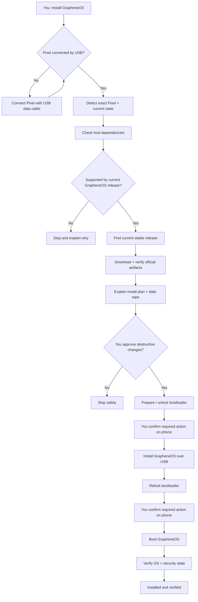
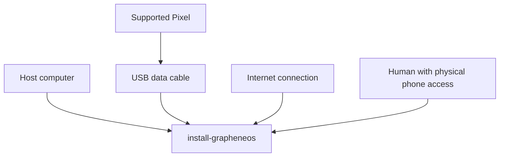
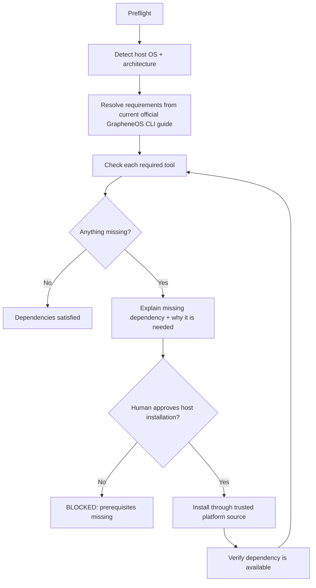
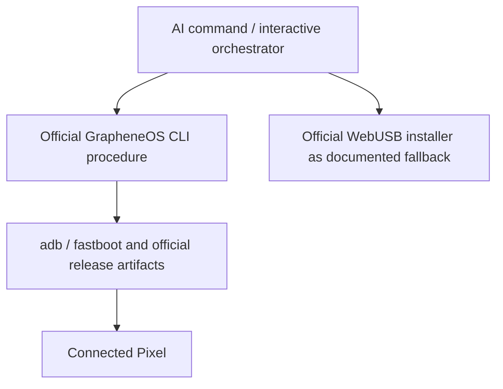
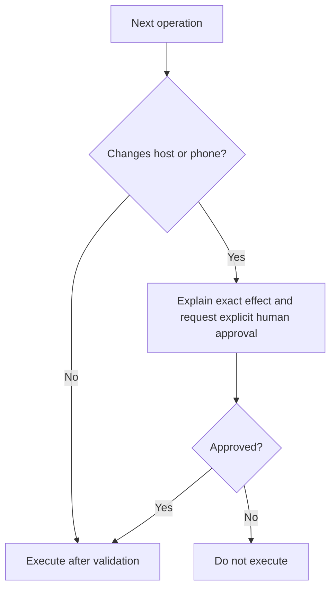
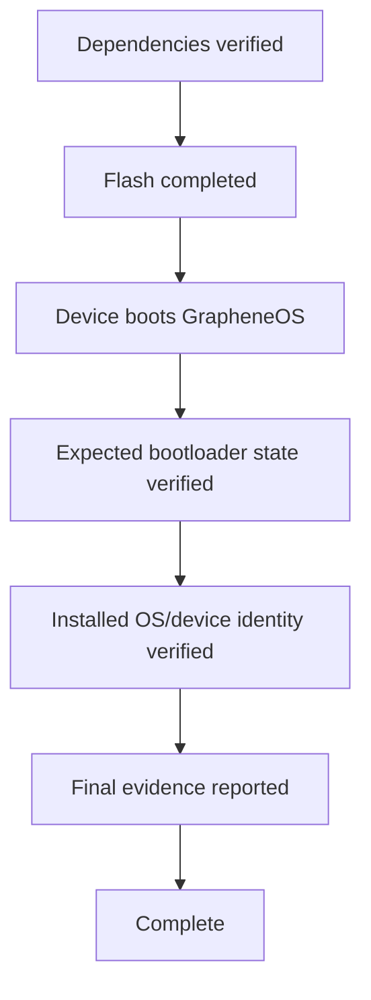

# Install GrapheneOS — Specification

**Status: DRAFT**

This file is the normative behavioral specification for the `install-grapheneos` command. It is primarily for agents
implementing, reviewing, repairing, or extending the command, but it should also let a human understand the complete
behavior at a glance.

## At a glance

**Input:** supported Pixel + USB data cable + host computer + internet + human available for confirmations.

**Output:** verified GrapheneOS installation with the expected locked/security state.

**Execution:** agent orchestrates the official GrapheneOS CLI procedure; the official WebUSB installer is the human-facing fallback.

**Critical boundary:** the agent may automate safe checks and mechanical work, but must stop and obtain explicit human
approval before destructive/security-sensitive operations and must wait for physical confirmations required on the
phone.

Everything below defines this overview precisely enough for an agent to implement and validate it.

## Source of truth

Behavior is specified here before implementation. When code and this specification disagree, follow the repository SDD
command: update intended behavior in the specification first, then realign implementation and tests.

## Scope

Version 1 covers **initial GrapheneOS installation only**. Updating an already-installed GrapheneOS device, ongoing
administration, backup/restore, and general Android management are future capabilities.

## Inputs

Required inputs:

- host computer supported by the implementation;
- direct USB data connection to the Pixel;
- exactly one intended supported Pixel, or explicit disambiguation;
- internet access for current documentation/release retrieval;
- human physically available for phone-side actions and approvals;
- acknowledgement that bootloader unlocking / installation can erase user data.

Bluetooth is not an installation transport for this command.

## Dependencies

Dependencies must be explicit and validated before phone mutation begins.

Known core requirements for the CLI-oriented implementation include:

- a supported bare-metal host operating system and architecture;
- current Android SDK Platform Tools providing `adb` and `fastboot` where required by the current official procedure;
- standard host utilities required by the current GrapheneOS CLI guide for downloading, extracting, hashing/signature
verification, and executing the official factory-image installer;
- sufficient free disk space for release artifacts and extraction;
- working internet access to authoritative GrapheneOS/Android sources;
- a reliable USB data connection.

**Python is not a baseline dependency unless the implementation or current official GrapheneOS procedure actually
requires it.** The agent must not infer that Python is required merely because it could be convenient to implement
orchestration in Python.

Dependency versions and exact utility names that can change over time must be resolved from the current official
GrapheneOS CLI documentation rather than frozen indefinitely in this specification.

The command must not silently install host dependencies. For every missing dependency it must:

1. identify what is missing;
2. explain why it is required;
3. identify the trusted installation source/method appropriate to the host;
4. request human approval before changing the host;
5. install only after approval;
6. verify the dependency after installation before continuing.

Dependency installation itself is not a destructive-phone boundary, but it is an external mutation of the host and
therefore requires explicit approval.

## Execution adapter

The primary agent-oriented implementation uses the official GrapheneOS CLI installation procedure because it is
scriptable and observable. The official WebUSB installer remains a supported human-facing fallback rather than logic
that this project reimplements.

The command must consult current official GrapheneOS documentation at execution/development time rather than freezing
volatile release URLs or device support assumptions into the specification.

## State requirements

The implementation must represent or reconstruct these stages:

1. `waiting-for-device`
2. `device-detected`
3. `dependencies-validating`
4. `awaiting-dependency-install-approval` when needed
5. `dependencies-validated`
6. `device-validated`
7. `release-resolved`
8. `awaiting-destructive-approval`
9. `bootloader-prepared`
10. `release-verified`
11. `flashing`
12. `awaiting-device-confirmation`
13. `bootloader-relocked`
14. `installation-verified`
15. `complete`

A restart should prefer re-detecting real host/device state over trusting stale local state.

## Safety invariants

The command must never guess a device model, flash an image for a different device, use an unverified release artifact,
silently install host dependencies, silently unlock/relock a bootloader, silently cross a data-wipe boundary, bypass
device security protections, or claim success without verification.

## Release resolution

The command must determine the currently supported stable GrapheneOS release appropriate for the detected device from
authoritative GrapheneOS sources. Before flashing, perform the artifact/signature verification required by the current
official GrapheneOS CLI procedure.

## Human interaction contract

Prompts must describe what the user needs to do next, not merely report an error. After each human action, re-detect
actual state before continuing.

Examples:

- `No Android device detected. Connect your Pixel directly with a USB data cable, unlock the screen if needed, then tell me to continue.`
- `Android Platform Tools are required but fastboot is not available. I can install the required package from the
trusted host package/source. Continue?`
- `I detected Pixel <model>. The next stage requires bootloader unlocking and will erase the phone. Continue?`

## Completion criteria

The command is complete only when dependencies are verified and observable evidence confirms the expected GrapheneOS
installation and required bootloader/security state.

## Future scope

Future specifications may add `update`, `inspect`, `privacy-audit`, backup/restore, or broader Android device
administration. They must be added explicitly rather than changing the meaning of this installation specification
implicitly.
