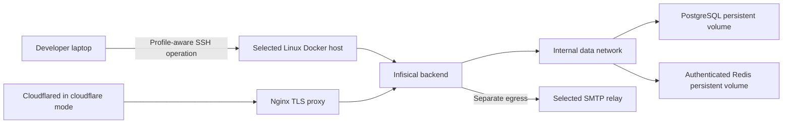
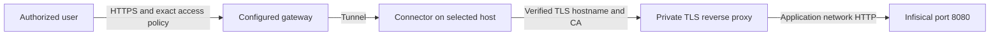

# Infisical

## Purpose

Provision and verify one persistent Infisical Compose project on an explicitly selected Linux Docker host. Core mode owns
the backend, PostgreSQL, and authenticated Redis and makes no remote-access choice. Optional Cloudflare mode is one
supported access pattern: it adds the Nginx TLS proxy and tunnel connector to the same owned project while keeping
account-side DNS, tunnel ingress, and Access policy configuration external. Other access methods require separate
integrations.
Infisical follows its [upstream Docker Compose deployment model](https://infisical.com/docs/self-hosting/deployment-options/docker-compose).
The command owns installation mechanics; secret-reference resolution and application-secret enrollment belong to a
separate runtime/provider capability.

Execution route: `command-runner`.

Command kind: `executable`.

See [spec.md](spec.md) for the requirements, architecture, operation sequences and acceptance criteria needed to
reconstruct this command. The specification keeps private deployment values in profile-owned configuration.

## Inputs

| Input | Required | Source | Description |
|---|---|---|---|
| Profile, workflow and logical project | Yes | Verified host activation | Selects the permitted command and private configuration. |
| Operation and apply flag | Yes | Authorized request | Exact operation; mutations require `--apply`. |
| Deployment configuration | Yes | Profile-owned config.env | SSH target, root, scope, URL, image pins and limits. |
| Access mode and protected origin inputs | For Cloudflare mode | Profile-owned config.env | Selects the five-service topology and exact remote certificate, key, and token files. |
| Optional SMTP reference | No | Profile-owned config.env | Protected remote file; credential values stay on the host. |

## Outputs

| Output | Destination | Description |
|---|---|---|
| Value-free receipt | Caller | Qualification, health, stop or sanitized failure result. |
| Owned persistent stack | Explicitly selected remote host | Protected configuration and persistent volumes for apply operations. |

## Entry Point

| Entry point | Type | Profile-aware invocation |
|---|---|---|
| `install/infisical/infisical.command.sh` | Shell executable | Activate the selected profile/workflow and invoke the operation through its authorized runner. |

Every invocation is profile-aware: the host verifies selected command permission and provides its private configuration.
Committed configuration template: `install/infisical/infisical.command.example.config`. Copy it into a private
`config.env` file and bind it through `commands[].config` as `AI_COMMAND_CONFIG_PATH`.

`install/infisical/infisical.command.sh` is profile-aware. The host activates the selected profile/workflow, verifies that
the workflow permits `infisical`, resolves `AI_COMMANDS_ROOT`, and supplies its profile-owned `AI_COMMAND_CONFIG_PATH`.
The command uses the common guard before any operation, including validation. An unbound command cannot run.

Copy [infisical.command.example.config](infisical.command.example.config) into the selected profile. It is a fictional
literal `config.env` configuration template. Replace the digest placeholders with
approved real image digests; the unchanged template intentionally fails validation.

```yaml
commands:
  - id: infisical
    config: commands-config/infisical/config.env
workflows:
  - path: dev.workflow.md
    commands:
      - infisical
```

This fragment illustrates command activation only; retain the profile's other required workflow/project bindings.
If invoking through the category router, its selected workflow must also permit `install`:

```bash
"${AI_COMMANDS_ROOT}/install/install.sh" infisical status
```

## Operations

| Operation | Effect and verified result |
| --- | --- |
| `validate` | Local input/reference validation; no SSH or network access. |
| `qualify` | Read-only SSH/Linux, Docker/Compose and fresh-install capacity/port checks. No deployment created. |
| `status` | Read-only verification of package ownership, protected files, service health, image pins, listener isolation, and exact read-only connector token/CA mounts. Stopped, missing, or stale services are not reported healthy. |
| `install --apply` | Initial provisioning or idempotent reconciliation of the exact package-owned configuration; pulls pinned images and verifies every selected service. |
| `start --apply` | Starts the verified owned stack and requires all services healthy. |
| `stop --apply` | Stops only the verified stack, verifies termination, and preserves configuration, keys and data volumes. |

```bash
"${AI_COMMANDS_ROOT}/install/infisical/infisical.command.sh" validate
"${AI_COMMANDS_ROOT}/install/infisical/infisical.command.sh" qualify
"${AI_COMMANDS_ROOT}/install/infisical/infisical.command.sh" install --apply
"${AI_COMMANDS_ROOT}/install/infisical/infisical.command.sh" status
```

`--apply` is mandatory for each mutation. Update, image upgrade, adoption, backup export, restore, purge and uninstall
are unsupported operations. Installation does not create the first owner account, import application secrets, install
Docker, publish a hostname, change a firewall, install SMTP, or create Cloudflare account-side resources.

## Configuration and qualification

The primary format is `config.env`: literal `KEY=value` assignments with comments and optional quoting. The file is
parsed as data; it is never sourced or evaluated. Variable expansion, command substitution, backticks, duplicate fields,
unknown keys and multiple unquoted tokens are rejected. Legacy JSON configuration remains supported for compatibility.
The names below describe normalized fields. Their config.env names are:

| Normalized field | config.env name |
|---|---|
| `version`, `command` | `VERSION`, `COMMAND` |
| `ssh_target`, `remote_root`, `project_name`, `site_url` | `SSH_TARGET`, `REMOTE_ROOT`, `PROJECT_NAME`, `SITE_URL` |
| `access_mode` | `ACCESS_MODE` |
| `images.backend`, `images.db`, `images.redis` | `BACKEND_IMAGE`, `POSTGRES_IMAGE`, `REDIS_IMAGE` |
| `images.proxy`, `images.cloudflared` | `PROXY_IMAGE`, `CLOUDFLARED_IMAGE` |
| `backend_port`, `proxy_port` | `BACKEND_PORT`, `PROXY_PORT` |
| `origin_server_name` | `ORIGIN_SERVER_NAME` |
| `origin_cert_file`, `origin_key_file`, `origin_ca_file`, `cloudflared_token_file` | `ORIGIN_CERT_FILE`, `ORIGIN_KEY_FILE`, `ORIGIN_CA_FILE`, `CLOUDFLARED_TOKEN_FILE` |
| `minimum_cpus`, `minimum_memory_gib`, `minimum_free_disk_gib` | `MINIMUM_CPUS`, `MINIMUM_MEMORY_GIB`, `MINIMUM_FREE_DISK_GIB` |
| `health_timeout_seconds`, `ssh_timeout_seconds`, `smtp_env_file` | `HEALTH_TIMEOUT_SECONDS`, `SSH_TIMEOUT_SECONDS`, `SMTP_ENV_FILE` |

| Field | Required behavior |
| --- | --- |
| `version`, `command` | Exactly `1` and `infisical`. Duplicate or unknown keys fail closed. |
| `ssh_target` | Explicit approved SSH alias or user/host. Batch authentication and existing trusted host keys are required; no credential value or connection guessing. |
| `remote_root` | Explicit absolute child directory. Its parent must exist. Symlink ancestors and unknown existing deployments are rejected. The remote SSH user needs permission to create/manage this directory and use Docker. No implicit sudo. |
| `project_name` | Explicit unique Compose project identity, protected by the ownership receipt. Existing unowned project resources are rejected. |
| `site_url` | Intended HTTPS origin without credentials/query/fragment; HTTP is permitted only on explicit loopback. This value configures Infisical links and does not itself install HTTPS. |
| `access_mode` | `core` owns three services. `cloudflare` owns five services and requires the proxy/connector pins and protected origin inputs. |
| `images` | Approved immutable `@sha256:` references for every selected service. PostgreSQL requires a 14–17 version tag plus digest for the supported data directory. |
| `backend_port`, `proxy_port` | Loopback-only ports, defaults `8080` and `8443`, range `1024`–`65535`. Core mode publishes backend; Cloudflare mode publishes proxy. Datastores are never published. |
| Cloudflare origin inputs | Exact hostname and protected remote certificate, key, CA certificate, and tunnel-token files. The command copies them on the remote host; values never cross SSH. The CA copy is mounted read-only into cloudflared at the exact `origin_ca_file` path used by the remotely managed ingress configuration. |
| Capacity | Fresh installs require at least 2 CPUs, 4 GiB RAM and 20 GiB free disk; profile minimums may increase these. Supported remote architectures: Linux `x86_64` and `aarch64`. |
| Timeouts | Health verification: 10–600 seconds, default 120. SSH operation: 30–3600 seconds, default 900. A timeout is reported without automatic retransmission or cleanup; inspect state before retrying. |
| `smtp_env_file` | Empty by default; otherwise an exact protected remote credential/config file, described below. |

Only non-secret configuration/reference values cross SSH. Python 3 is required locally and on the remote host;
Docker Engine and Compose v2 must already be available remotely. Container images are pulled by digest from their
configured repositories. Command output and install logs contain only receipts and status codes, never env-file
contents, expanded Compose configuration, raw Docker stderr or credential values. Execution status logs are written
under the selected profile's private `.local/command-logs/infisical/`, unless that profile explicitly overrides
`REPORT_LOG_DIR`; runtime logs do not belong in the reusable command package.

## Ownership, credentials and persistence



An exclusive deployment-directory creation records `owner.json` with command, profile/workflow/logical-project and exact
non-secret configuration. Every operation verifies that receipt. Unknown existing directories or project resources
are refused. Changing image pins, scope, site URL or SMTP references is not an implicit upgrade: the ownership comparison
blocks it for a separately reviewed migration.

The initial installation generates encryption, authentication, database and Redis credentials directly on the remote
host. The deployment directory is mode `0700`; generated files are `0600` and owned by the executing user. PostgreSQL
and Redis each receive only their own environment file. Credentials are never regenerated on ordinary reruns. Missing
or incomplete existing key material is a failure, not permission to replace it.

PostgreSQL and Redis have persistent volumes and join only an internal datastore network. In Cloudflare mode, the proxy
and connector are separated from the datastores by `application` and `tunnel` networks, and backend/connector egress is
separate. All selected services use `unless-stopped` restart policies. The command serializes mutations with a deployment
lock and never removes orphan containers or data volumes.

Backend, database, Redis, and proxy must be healthy, and cloudflared must remain running. Every selected service must use
the configured image reference and exact port/network boundary before installation/start/status reports `HEALTHY`. A
failed pull, startup or verification retains resources for investigation. A first successful install reports that initial
account setup is required. Complete that setup through the protected UI before enrolling real secrets.

## Optional Cloudflare access integration

Cloudflare mode is optional. When selected, this command runs the TLS reverse proxy and connector in the same Compose
project as the core stack.
The generated proxy configuration uses the exact selected origin hostname and protected certificate/key. The separate
[cloudflare command](../../connect/cloudflare/cloudflare.command.md) owns account-side DNS, tunnel ingress, origin trust,
and Access policy configuration.



Public hostname, DNS, gateway credentials, certificate issuance, tunnel ingress, and Access policy remain separate
explicit operations.
Verify an unauthenticated client is denied, an authorized client succeeds, an unauthorized identity is denied, and origin
certificate validation succeeds. Do not bypass certificate verification or expose database/Redis ports. The installer
does not alter any other controller or route.

## Optional SMTP

Infisical supports optional [SMTP configuration](https://infisical.com/docs/self-hosting/configuration/envars#email-service).
Core login and secret operations work without email; invitations, resets and other email features need a configured relay.

Provide an existing remote file owned by the SSH user with mode `0600`. Supported fields: `SMTP_HOST`, `SMTP_PORT`,
`SMTP_USERNAME`, `SMTP_PASSWORD`, `SMTP_FROM_ADDRESS`, `SMTP_FROM_NAME`, `SMTP_HELO_HOST`, `SMTP_IGNORE_TLS`,
`SMTP_REQUIRE_TLS`, `SMTP_TLS_REJECT_UNAUTHORIZED`. Use simple unquoted `KEY=value` lines and comments; interpolation,
escaped/quoted values, inline comments, surrounding whitespace, duplicate fields and unrelated backend environment keys
are rejected. Do not put its actual
contents in a command config, prompt, report or repository. The installer copies it remotely to protected `smtp.env`.

Require STARTTLS when applicable and certificate validation; `SMTP_IGNORE_TLS=false`, `SMTP_REQUIRE_TLS=true` and
`SMTP_TLS_REJECT_UNAUTHORIZED=true` are enforced. Installing or administering an SMTP relay is outside this command.
Confirm invitation/reset delivery separately; container health does not prove email delivery. Changing SMTP settings on
an existing deployment requires a separately reviewed configuration update, not silent reconciliation.

For an existing deployment that this installer does not own, do not point `install --apply` at its directory. Inspect the
deployment's actual Compose service and startup path first. Stage a dedicated sending-only relay credential in a
root-owned mode-`0600` SMTP environment file on that host, with a separate recovery copy in an approved recovery
credential store. Infisical must receive this bootstrap value when its backend starts; the instance cannot use its own secret
API as the sole source for its SMTP credential.

Back up the existing Compose file before referencing the SMTP file from the backend service only. Validate the resolved
Compose configuration without emitting values: the service set, images, volumes, networks, and preexisting environment
must remain the same, and only the intended `SMTP_*` keys may be added to the backend. Recreate only the backend and
wait for it to become healthy. Verify TLS certificate validation and relay authentication, then send one credential-free
test message to an explicitly approved recipient and confirm delivery. Keep the Compose backup until the new backend
has passed these checks; restore it and recreate the backend if validation or health fails. A relay accepting a message
does not itself prove inbox delivery or an Infisical-generated notification.

The separate [Infisical SMTP command](../infisical-smtp/infisical-smtp.command.md) reconciles this narrowly scoped
overlay for an explicitly configured existing deployment. The installer remains bound to its own package-owned stack.

## Recovery and reinstall

Protect database backups together with the original encryption/authentication material and the exact image/version
manifest. Select backup custody, an encrypted destination and retention explicitly. No destination is inferred. The
command must reject backup, export and restore operations. Secret-bearing dumps and recovery material must
never enter logs, Git, prompts or ordinary artifacts.

After an interrupted operation, inspect `status` and preserve all files/volumes. Missing credentials, modified Compose,
an ownership mismatch or partial initial provisioning requires diagnosis; do not delete the deployment or regenerate
keys as a repair. Ordinary `stop`/`start` preserves data and keys. A failed install can retry only after inspecting
retained state and resolving its actual blocker.

An existing manual installation cannot be adopted automatically. A future adoption/reinstall needs an explicit data
preservation decision, verified backup, original keys, reviewed ownership mapping and isolated restore test. Database
migrations may prevent image downgrades; do not promise rollback by changing an image tag. There is no implicit purge.

## Validation

Run [infisical.command.test.sh](infisical.command.test.sh). Offline fake SSH/Docker tests cover apply gates, initial install,
idempotence, key/data preservation, start/stop, scope/ownership conflicts, symlinks, image/config validation, isolation,
unhealthy services, SMTP restrictions and value-free failures. They do not prove compatibility of a selected real image
or remote host. Before production reuse, explicitly authorize a disposable Linux-host smoke test using reviewed image
pins and verify initial setup, restart/reboot recovery, TLS/access and isolated restore behavior.

Use [infisical.scenario.md](infisical.scenario.md) and [infisical.command.smoke.test.sh](infisical.command.smoke.test.sh)
for the repeatable real-host install/rerun/stop/start test. It uses a separately selected loopback test stack, verifies a
database marker and private key/volume fingerprints, and stops services while retaining data. Successful harness
execution does not establish owner setup, reboot recovery, HTTPS/SMTP or restore acceptance; verify those separately.
