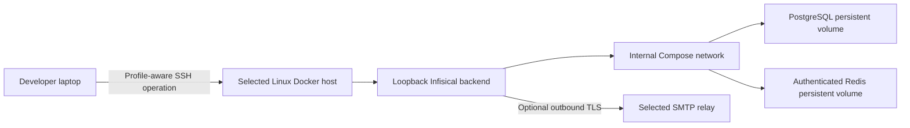
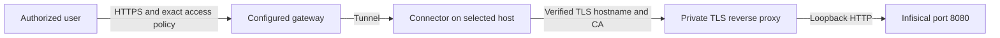

# Infisical

## Purpose

Provision and verify a persistent Infisical, PostgreSQL and Redis stack on an explicitly selected Linux Docker host.
Infisical follows its [upstream Docker Compose deployment model](https://infisical.com/docs/self-hosting/deployment-options/docker-compose).
The command owns installation mechanics; secret-reference resolution and application-secret enrollment belong to a
separate runtime/provider capability.

Execution route: `command-runner`.

Command kind: `executable`.

See [spec.md](spec.md) for the requirements, architecture, operation sequences and acceptance criteria needed to
reconstruct this command. The specification keeps private deployment values in profile-owned configuration.

## Inputs

| Input | Required | Source | Description |
|---|---|---|---|
| Profile, workflow and logical project | Yes | Verified host activation | Selects the permitted command and private configuration. |
| Operation and apply flag | Yes | Authorized request | Exact operation; mutations require `--apply`. |
| Deployment configuration | Yes | Profile-owned JSON | SSH target, root, scope, URL, image pins and limits. |
| Optional SMTP reference | No | Profile-owned JSON | Protected remote file; credential values stay on the host. |

## Outputs

| Output | Destination | Description |
|---|---|---|
| Value-free receipt | Caller | Qualification, health, stop or sanitized failure result. |
| Owned persistent stack | Explicitly selected remote host | Protected configuration and persistent volumes for apply operations. |

## Entry Point

| Entry point | Type | Profile-aware invocation |
|---|---|---|
| `install/infisical/infisical.command.sh` | Shell executable | Activate the selected profile/workflow and invoke the operation through its authorized runner. |

Every invocation is profile-aware: the host verifies selected command permission and provides its private configuration.
Committed configuration template: `install/infisical/infisical.command.example.config`. Copy its JSON body into a private
file, removing the template's comment header, and bind it through `commands[].config` as `AI_COMMAND_CONFIG_PATH`.

`install/infisical/infisical.command.sh` is profile-aware. The host activates the selected profile/workflow, verifies that
the workflow permits `infisical`, resolves `AI_COMMANDS_ROOT`, and supplies its profile-owned `AI_COMMAND_CONFIG_PATH`.
The command uses the common guard before any operation, including validation. An unbound command cannot run.

Copy [infisical.command.example.config](infisical.command.example.config) into the selected profile. It is a fictional
JSON configuration body with a documentation comment header. Replace the digest placeholders with
approved real image digests; the unchanged template intentionally fails validation.

```yaml
commands:
  - id: infisical
    config: commands-config/infisical/config.json
workflows:
  - path: dev.workflow.md
    commands:
      - infisical
```

This fragment illustrates command activation only; retain the profile's other required workflow/project bindings.
If invoking through the category router, its selected workflow must also permit `install`:

```bash
"${AI_COMMANDS_ROOT}/install/install.sh" infisical status
```

## Operations

| Operation | Effect and verified result |
| --- | --- |
| `validate` | Local input/reference validation; no SSH or network access. |
| `qualify` | Read-only SSH/Linux, Docker/Compose and fresh-install capacity/port checks. No deployment created. |
| `status` | Read-only verification of package ownership, protected files, service health, image pins and listener isolation. Stopped or missing services are not reported healthy. |
| `install --apply` | Initial provisioning or idempotent reconciliation of the exact package-owned configuration; pulls pinned images and verifies all three services healthy. |
| `start --apply` | Starts the verified owned stack and requires all services healthy. |
| `stop --apply` | Stops only the verified stack, verifies termination, and preserves configuration, keys and data volumes. |

```bash
"${AI_COMMANDS_ROOT}/install/infisical/infisical.command.sh" validate
"${AI_COMMANDS_ROOT}/install/infisical/infisical.command.sh" qualify
"${AI_COMMANDS_ROOT}/install/infisical/infisical.command.sh" install --apply
"${AI_COMMANDS_ROOT}/install/infisical/infisical.command.sh" status
```

`--apply` is mandatory for each mutation. Update, image upgrade, adoption, backup export, restore, purge and uninstall
are unsupported operations. Installation does not create the first owner account, import application secrets, install
Docker, publish a hostname, change a firewall, install SMTP, or start a tunnel.

## Configuration and qualification

| Field | Required behavior |
| --- | --- |
| `version`, `command` | Exactly `1` and `infisical`. Duplicate or unknown keys fail closed. |
| `ssh_target` | Explicit approved SSH alias or user/host. Batch authentication and existing trusted host keys are required; no credential value or connection guessing. |
| `remote_root` | Explicit absolute child directory. Its parent must exist. Symlink ancestors and unknown existing deployments are rejected. The remote SSH user needs permission to create/manage this directory and use Docker. No implicit sudo. |
| `project_name` | Explicit unique Compose project identity, protected by the ownership receipt. Existing unowned project resources are rejected. |
| `site_url` | Intended HTTPS origin without credentials/query/fragment; HTTP is permitted only on explicit loopback. This value configures Infisical links and does not itself install HTTPS. |
| `images` | Approved immutable `@sha256:` references for `backend`, `db`, `redis`. PostgreSQL requires a 14–17 version tag plus digest for the supported data directory. Review image architecture and application/database compatibility before selecting pins. |
| `backend_port` | Loopback-only host port, default `8080`, range `1024`–`65535`. PostgreSQL and Redis have no published ports. |
| Capacity | Fresh installs require at least 2 CPUs, 4 GiB RAM and 20 GiB free disk; profile minimums may increase these. Supported remote architectures: Linux `x86_64` and `aarch64`. |
| Timeouts | Health verification: 10–600 seconds, default 120. SSH operation: 30–3600 seconds, default 900. A timeout is reported without automatic retransmission or cleanup; inspect state before retrying. |
| `smtp_env_file` | Empty by default; otherwise an exact protected remote credential/config file, described below. |

Only non-secret configuration/reference values cross SSH. Python 3 is required locally and on the remote host;
Docker Engine and Compose v2 must already be available remotely. Container images are pulled by digest from their
configured repositories. Command output and install logs contain only receipts and status codes, never env-file
contents, expanded Compose configuration, raw Docker stderr or credential values.

## Ownership, credentials and persistence



An exclusive deployment-directory creation records `owner.json` with command, profile/workflow/logical-project and exact
non-secret configuration. Every operation verifies that receipt. Unknown existing directories or project resources
are refused. Changing image pins, scope, site URL or SMTP references is not an implicit upgrade: the ownership comparison
blocks it for a separately reviewed migration.

The initial installation generates encryption, authentication, database and Redis credentials directly on the remote
host. The deployment directory is mode `0700`; generated files are `0600` and owned by the executing user. PostgreSQL
and Redis each receive only their own environment file. Credentials are never regenerated on ordinary reruns. Missing
or incomplete existing key material is a failure, not permission to replace it.

PostgreSQL and Redis have persistent volumes and join only an internal network; the backend also has a separate outbound
network for email and other authorized integrations. All services use `unless-stopped` restart policies. The command
serializes mutations with a deployment lock and never removes orphan containers or data volumes.

All three services must be healthy, use the configured image references and retain the intended port boundary before
installation/start/status reports `HEALTHY`. A failed pull, startup or verification retains resources for investigation;
it does not claim success or destroy potentially recoverable data. A first successful install reports that initial
account setup is required. Complete that setup through the protected UI before enrolling real secrets.

## HTTPS integration

Use a separately configured TLS reverse proxy in front of the loopback backend. Its certificate must match the intended
hostname. A selected access gateway/tunnel reaches that proxy with TLS certificate and hostname validation enabled.
For Cloudflare, use the separate [cloudflare command](../../connect/cloudflare/cloudflare.command.md), including
`CLOUDFLARE_ORIGIN_SERVER_NAME` and a trusted CA bundle when using a private CA.



Public hostname, DNS, gateway credentials, certificate issuance, proxy and Access policy are separate explicit operations.
Verify an unauthenticated client is denied, an authorized client succeeds, an unauthorized identity is denied, and origin
certificate validation succeeds. Do not bypass certificate verification or expose database/Redis ports. The installer
does not alter any other controller or route.

## Optional SMTP

Infisical supports optional [SMTP configuration](https://infisical.com/docs/self-hosting/configuration/envars#email-service).
Core login and secret operations work without email; invitations, resets and other email features need a configured relay.

Provide an existing remote file owned by the SSH user with mode `0600`. Supported fields: `SMTP_HOST`, `SMTP_PORT`,
`SMTP_USERNAME`, `SMTP_PASSWORD`, `SMTP_FROM_ADDRESS`, `SMTP_FROM_NAME`, `SMTP_HELO_HOST`, `SMTP_IGNORE_TLS`,
`SMTP_REQUIRE_TLS`, `SMTP_TLS_REJECT_UNAUTHORIZED`. Use simple unquoted `KEY=value` lines and comments; interpolation,
escaped/quoted values, inline comments, surrounding whitespace, duplicate fields and unrelated backend environment keys
are rejected. Do not put its actual
contents in a command config, prompt, report or repository. The installer copies it remotely to protected `smtp.env`.

Require STARTTLS when applicable and certificate validation; `SMTP_IGNORE_TLS=false`, `SMTP_REQUIRE_TLS=true` and
`SMTP_TLS_REJECT_UNAUTHORIZED=true` are enforced. Installing or administering an SMTP relay is outside this command.
Confirm invitation/reset delivery separately; container health does not prove email delivery. Changing SMTP settings on
an existing deployment requires a separately reviewed configuration update, not silent reconciliation.

## Recovery and reinstall

Protect database backups together with the original encryption/authentication material and the exact image/version
manifest. Select backup custody, an encrypted destination and retention explicitly. No destination is inferred and this
initial package does not implement backup/export or restore operations. Secret-bearing dumps and recovery material must
never enter logs, Git, prompts or ordinary artifacts.

After an interrupted operation, inspect `status` and preserve all files/volumes. Missing credentials, modified Compose,
an ownership mismatch or partial initial provisioning requires diagnosis; do not delete the deployment or regenerate
keys as a repair. Ordinary `stop`/`start` preserves data and keys. A failed install can retry only after inspecting
retained state and resolving its actual blocker.

An existing manual installation cannot be adopted automatically. A future adoption/reinstall needs an explicit data
preservation decision, verified backup, original keys, reviewed ownership mapping and isolated restore test. Database
migrations may prevent image downgrades; do not promise rollback by changing an image tag. There is no implicit purge.

## Validation

Run [infisical.command.test.sh](infisical.command.test.sh). Offline fake SSH/Docker tests cover apply gates, initial install,
idempotence, key/data preservation, start/stop, scope/ownership conflicts, symlinks, image/config validation, isolation,
unhealthy services, SMTP restrictions and value-free failures. They do not prove compatibility of a selected real image
or remote host. Before production reuse, explicitly authorize a disposable Linux-host smoke test using reviewed image
pins and verify initial setup, restart/reboot recovery, TLS/access and isolated restore behavior.
