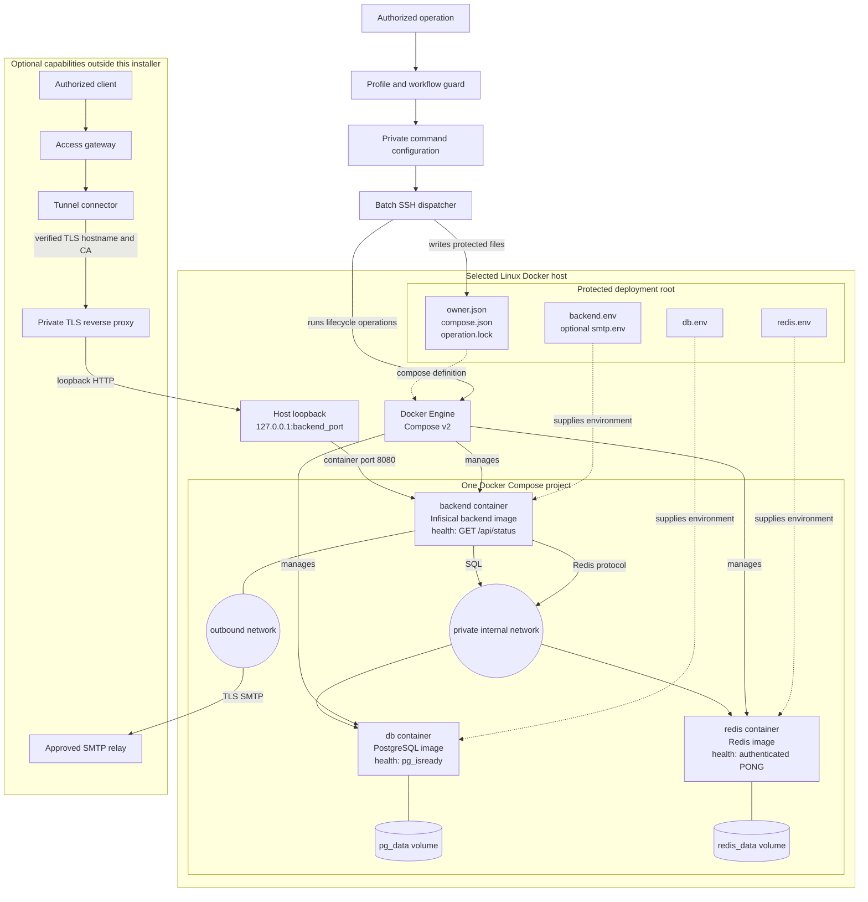
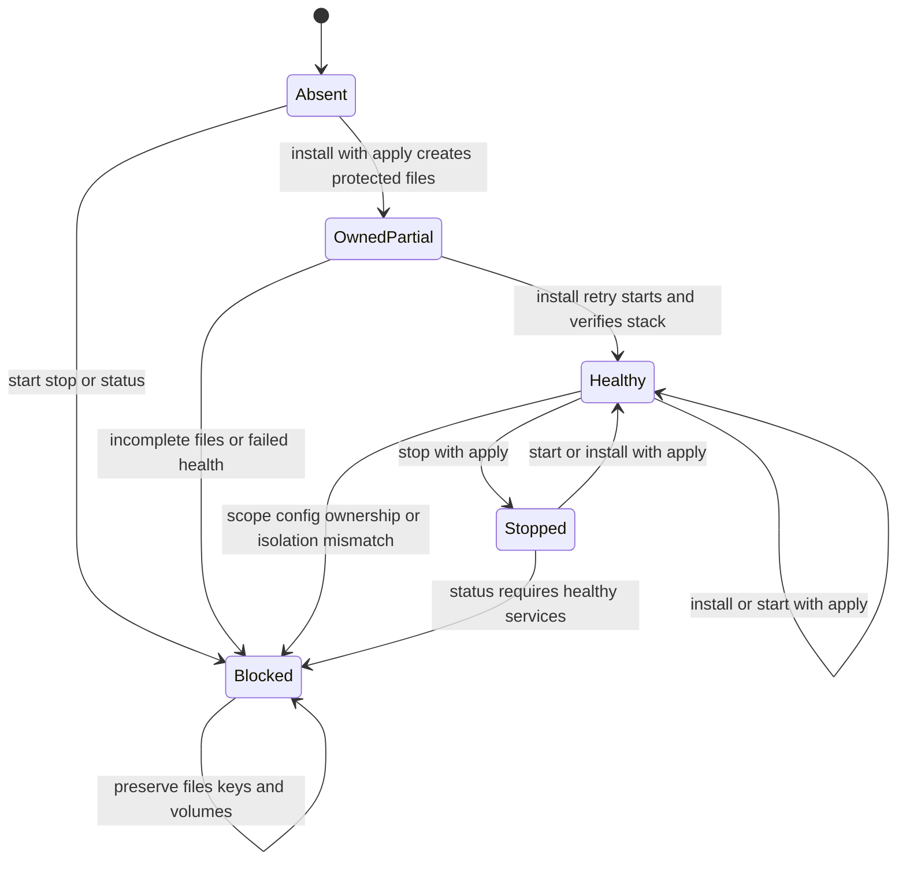
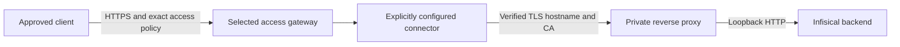

# Infisical command specification

## Purpose

The `infisical` command installs and manages a self-hosted Infisical stack on an explicitly selected Linux Docker host.
Its command ID is `infisical`, its category is `install`, and its contract version is `0.0.1-SNAPSHOT`.

This document is the normative contract for the command. A conforming implementation must satisfy every requirement and
acceptance criterion in this document. The terms **must**, **must not**, and **may** express required, prohibited, and
permitted behavior respectively.

## Scope

The managed stack consists of one persistent Infisical backend, one PostgreSQL database, and one authenticated Redis
service. The command owns installation, qualification, lifecycle control, and deployment-state verification for that
stack. Runtime secret retrieval belongs to the separate `secrets` capability and is outside this command's scope.

Deployment-specific image pins, identities, hostnames, credential references, paths and operational records belong to the
selected private profile. Those values must not appear in the reusable package and must not be inferred from task names,
working directories, adjacent files, previous requests, or deployment history.

## Package contract

| Artifact | Responsibility |
|---|---|
| `infisical.command.yml` | Globally unique ID `infisical`, version `0.0.1-SNAPSHOT`, category `install`, type `executable`, `ai.powered: false`. |
| `infisical.command.sh` | Executable profile-aware entry point; guard before logging, validation or SSH. |
| `infisical.command.example.config` | Fictional configuration template with the standard profile-binding header and literal config.env assignments; digest placeholders deliberately prevent execution. |
| `infisical.command.md` | Usage contract with canonical Purpose, Inputs, Outputs and Entry Point sections; link this specification. |
| `spec.md` | Requirements, architecture, operation sequences, limits and acceptance criteria. |
| `README.md` | Short package overview linking the contract, specification and tests. |
| `infisical.command.test.sh` and offline fixtures | Repeatable conformance tests that require no real server, registry, deployment or credential. |
| Runtime helpers | Deterministic local dispatch and remote mechanics using Python 3 standard-library support, while preserving this contract and its wire and file formats. |

The route table `ai-commands/execution-routes.tsv` must register `install/infisical/infisical.command.md` exactly once,
with route `command-runner` and all four mixed-route fields set to `-`. Discovery must not introduce another command ID or
implicit batch-install entry point. The optional `install` category router may delegate only when the selected workflow
permits both `install` and `infisical`.

## Inputs and configuration lookup

Every invocation must use the common command-profile guard to activate the selected profile and workflow, verify command
permission, and resolve the profile-owned configuration. The activated context must include `AI_PROFILE_FILE`,
`AI_COMMAND_CONFIG_PATH`, `AI_WORK_PROFILE_ID`, `AI_FLOW_WORKFLOW`, and `AI_LOGICAL_PROJECT_ID`. A task title, working
directory, adjacent file, catalog template, or previous request must not substitute for activation or authorization.

The profile must bind `commands[].id: infisical` to a private `commands[].config`, and the selected workflow must permit
the command. The command must use only that resolved file. Its resolved path must be a regular file inside the resolved
profile directory, and its size must not exceed 16,384 bytes.

The primary format is `config.env`. The parser must treat it as literal data and must never source or evaluate it. The
format permits blank lines, full-line comments, optional quoting, and inline comments. The parser must reject interpolation
(`$`), backticks, duplicate or unknown assignment names, unsupported expressions, and multiple unquoted value tokens.
Integer fields must contain decimal digits. The parser must also accept the legacy JSON representation, reject duplicate
keys at every object level, enforce strict types, and reject booleans where integers are required.

The parser must normalize the config.env names into the fields below: `VERSION`/`COMMAND`;
`SSH_TARGET`/`REMOTE_ROOT`/`PROJECT_NAME`/`SITE_URL`; `BACKEND_IMAGE`/`POSTGRES_IMAGE`/`REDIS_IMAGE` into
`images.backend`/`images.db`/`images.redis`; `BACKEND_PORT`;
`MINIMUM_CPUS`/`MINIMUM_MEMORY_GIB`/`MINIMUM_FREE_DISK_GIB`; `HEALTH_TIMEOUT_SECONDS`/`SSH_TIMEOUT_SECONDS`; `SMTP_ENV_FILE`.
It must reject missing, unknown, or incorrectly typed normalized fields. Defaults must apply identically to both input
formats.

| Field | Type and requirement | Default |
|---|---|---|
| `version` | Decimal integer with value `1`. | Required |
| `command` | String exactly `infisical`. | Required |
| `ssh_target` | Explicit SSH alias or user/host; pattern `[A-Za-z0-9][A-Za-z0-9_.@-]{0,127}`. No options, spaces or shell expression. | Required |
| `remote_root` | Absolute child directory; allowed characters letters, digits, `.`, `_`, `/`, `-`; at least two path components; no empty, `.` or `..` components. | Required |
| `project_name` | Compose identity matching `[a-z][a-z0-9_-]{2,40}`. | Required |
| `site_url` | HTTPS URL with a hostname made of letters, digits, dots and hyphens; no credentials, query, fragment or non-root path. HTTP only for `localhost` or `127.0.0.1`. Validate any numeric port; reject line breaks. | Required |
| `images` | Exactly `backend`, `db`, `redis`, each a nonempty repository reference ending in `@sha256:` plus 64 lowercase hex digits. No floating-only tags. | Required |
| `images.db` | PostgreSQL 14–17 version tag plus digest, optionally with minor version/distribution suffix and registry prefix; supports `/var/lib/postgresql/data`. | Required |
| `backend_port` | Integer 1024–65535. Bind only to host loopback. | `8080` |
| `minimum_cpus` | Integer 2–256. | `2` |
| `minimum_memory_gib` | Integer 4–4096, interpreted as GiB of host RAM. | `4` |
| `minimum_free_disk_gib` | Integer 20–65536, interpreted as GiB of available storage. | `20` |
| `health_timeout_seconds` | Integer 10–600, bounds post-start polling. | `120` |
| `ssh_timeout_seconds` | Integer 30–3600, bounds the complete SSH operation. | `900` |
| `smtp_env_file` | Empty string or explicit absolute protected remote file; same safe component rules as deployment paths. A reference only, never inline SMTP values. | Empty |

Example configuration values must be fictional and non-runnable. They must not act as target-selection defaults. The
selected private image pins must be compatible with the host architecture and with each other. A pin change requires an
explicit migration procedure; an ordinary install rerun must reject it as a configuration mismatch.

## System boundary and architecture

The command performs one installation and manages one Docker Compose project. That project contains three separate
containers built from three independently pinned images. PostgreSQL and Redis are runtime dependencies of the Infisical
backend; neither service is embedded in the backend image. Only the backend publishes a host port, and that port is bound
to host loopback.

| Component | Packaging | Command responsibility |
|---|---|---|
| Infisical backend | Separate `backend` container and pinned image | Create, configure, start, stop, and verify. |
| PostgreSQL | Separate `db` container and pinned image | Create, configure, start, stop, verify, and retain `pg_data`. |
| Redis | Separate `redis` container and pinned image | Create, authenticate, start, stop, verify, and retain `redis_data`. |
| Compose networks | Internal `private` network and normal `outbound` network | Create and verify exact container attachments. |
| Protected deployment files | Host files under `remote_root` | Create, permission-check, lock, and verify without exposing secrets. |
| Docker Engine and Compose v2 | Preexisting host prerequisites | Qualify and use; never install automatically. |
| TLS proxy, access gateway, and tunnel connector | Separate capabilities outside this command | Record integration requirements and verify separately. |
| SMTP relay | Optional external service outside this command | Consume protected connection settings; never install the relay. |

Local and remote execution must have Python 3 with standard-library support. SSH must use batch authentication, strict
existing host-key checking, and a 10-second connection timeout. The dispatcher must pass the validated host as an argument,
not as a constructed shell expression. It must send remote mechanics and non-secret configuration over stdin for
`python3 -` and must not place credentials in SSH arguments or transmitted configuration. Remote tools must run as the
SSH user without implicit sudo.

Remote qualification must establish Linux `x86_64` or `aarch64`, access to a running Docker Engine, and Compose major
version 2 or later. For a fresh deployment, it must also verify CPU count, total RAM, available disk on the deployment
filesystem, and availability of the intended loopback port. Qualification must not install prerequisites or create
deployment files. The deployment parent directory must already exist and be writable by the selected user.

### Compose requirements

| Service | Required configuration |
|---|---|
| `backend` | Configured immutable image; `NODE_ENV=production`; `backend.env` plus optional `smtp.env`; only `127.0.0.1:<backend_port>:8080`; joins `private` and `outbound`; waits for healthy database and Redis. |
| `db` | Configured PostgreSQL image; only `db.env`; volume `pg_data:/var/lib/postgresql/data`; joins only `private`; no published ports. |
| `redis` | Configured Redis image; only `redis.env`; authenticated server with append-only persistence; volume `redis_data:/data`; joins only `private`; no published ports. |

All three services must use `restart: unless-stopped`. The Compose definition must declare named `pg_data` and `redis_data`
volumes, `private` as an internal network, and `outbound` as a separate normal network. The effective network names must be
`<project_name>_private` and `<project_name>_outbound`.

Each service must define a Docker health check with a 5-second interval, 5-second timeout, 24 retries, and 30-second start
period:
backend HTTP `GET /api/status` on container loopback port 8080 must return 200; database uses
`pg_isready -U infisical -d infisical`; Redis uses an authenticated `redis-cli ping` and requires exactly `PONG`.
Compose interpolation must preserve remote environment-variable expansion for Redis rather than resolving passwords
locally. Redis and PostgreSQL must not receive application encryption or authentication keys.

## Ownership and persistent file format

The selected root must have no symlink in itself or any ancestor. Fresh creation must be exclusive: the command must never
adopt, overwrite, or empty an existing unowned directory. It must reject preexisting containers, volumes, or networks that
carry the project label, and it must reject named volumes or networks that collide with expected names even when labels
are absent.

The command must create the root with mode `0700` and must create each file exclusively with mode `0600`, owned by the
executing remote user. Existing protected files must be regular files, not symlinks, and retain that exact mode and
ownership.

| Remote file | Required contents |
|---|---|
| `owner.json` | JSON object: `version: 1`, `command: infisical`, `scope` containing profile/workflow/logical project, and `configuration` containing the exact validated configuration including defaults. No secret values. |
| `compose.json` | JSON Compose document defining the services, health checks, networks and volumes above. Its parsed content must equal the expected document on every operation. |
| `backend.env` | Exactly `ENCRYPTION_KEY`, `AUTH_SECRET`, `DB_CONNECTION_URI`, `REDIS_URL`, `SITE_URL`. |
| `db.env` | Exactly `POSTGRES_USER=infisical`, `POSTGRES_DB=infisical`, `POSTGRES_PASSWORD`. |
| `redis.env` | Exactly `REDIS_PASSWORD`. |
| `smtp.env` | Optional remotely copied, validated SMTP settings. |
| `operation.lock` | Protected file for nonblocking exclusive mutation locks and shared read-only status locks. |

The command must generate bootstrap credentials only during fresh creation and directly on the selected host with a
cryptographic random source. The encryption key must be 16 random bytes encoded as 32 lowercase hexadecimal characters.
The authentication secret must be 32 random bytes encoded as URL-safe unpadded base64 (43 characters). The database and
Redis passwords must be separate 32-byte lowercase hexadecimal strings.

Backend connection strings must match the protected datastore files exactly:
`postgresql://infisical:<database-password>@db:5432/infisical` and
`redis://:<redis-password>@redis:6379`; `SITE_URL` must equal the validated configuration. The command must reject duplicate,
missing, unsupported, empty, or inconsistent material. Ordinary reruns must never generate replacement keys or passwords.

Existing `owner.json` must match the activated scope and normalized configuration exactly. The command must reject any
mismatch in profile, workflow, logical project, image pins, URL, paths, limits, or SMTP reference.

## Operation contract and state transitions

The command exposes exactly six operations. Mutating operations require `--apply` as the only trailing argument; read-only
operations accept no trailing argument. Unsupported operations, unsupported options, and incomplete activation must fail
before SSH.

`validate` and `qualify` observe readiness without a deployment-state transition. A blocked state records the operation's
result and grants no permission to alter retained resources. If an initial install creates protected files but fails
verification, a retry must reuse the existing ownership receipt and credentials.

| Operation | Required sequence |
|---|---|
| `validate` | Guard, validate context/configuration, return local validated receipt. No SSH or network. |
| `qualify` | Guard and validate; reject deployment-path symlinks; verify remote prerequisites and fresh-install capacity/port when the root is absent; return qualified receipt. No deployment created. |
| `install --apply` | Guard and validate; reject unowned roots; qualify; reject resource/name collisions on fresh install; validate optional remote SMTP file; exclusively create fresh owned files. Verify ownership, acquire mutation lock, verify protected files and quiet Compose validation. On rerun inspect existing containers before replacement. Pull pinned images, start with detached Compose, then require all services healthy within the deadline. |
| `start --apply` | Require existing owned root; qualify tools, verify files, take mutation lock and quietly validate Compose. Inspect existing containers and permit declared services to be absent. Start detached and verify all three healthy. Never generate credentials. |
| `stop --apply` | Require owned root and tools; take mutation lock, verify files and actual container ownership/images/isolation. Stop only the declared services with a 30-second grace period; verify each is present and no longer running. Preserve volumes and keys. |
| `status` | Require owned root and tools; verify files under shared lock opened read-only; quietly validate Compose; inspect all three services. Require healthy services, correct pins, ownership and isolation; make no remote file or service changes. |

Fresh directory creation must prevent concurrent claims. An active deployment lock must cause an immediate sanitized
blocker rather than waiting indefinitely or performing parallel changes. The command must never delete volumes, purge
data, remove orphans, perform automatic cleanup, or issue an unrequested retry. Each remote tool call must use a timeout of
at most 600 seconds and must also remain bounded by the configured SSH timeout. After a lost or timed-out SSH operation,
the next mutating operation must inspect the retained deployment state before retrying.

### Actual-state verification

Verification must find exactly one container per expected service under the selected Compose project. It must inspect
Docker project and service labels, image references, published bindings, and network attachments instead of relying only
on file contents. The backend binding must be exactly container port `8080/tcp` mapped to
`127.0.0.1:<backend_port>`. PostgreSQL and Redis must have no nonempty published bindings. Datastores must attach only to
the expected private network; the backend must attach only to the private and outbound networks. These checks must run
before mutating existing containers and before returning a success receipt.

A service is healthy only when running and Docker health is `healthy`. Startup may poll transient unhealthy states until
the deadline; ownership, image, missing or duplicate container, and isolation mismatches must fail immediately. Stopped,
absent, or unhealthy services must not produce a healthy status receipt. Files and resources must remain available after
any failure.

## Receipts, logging and secret boundary

Local `validate` must return `{"status":"VALIDATED","networkAccess":false,"secretValues":false}`.
Remote success statuses must be `QUALIFIED`, `HEALTHY`, or `STOPPED`; each must include `dataPreserved: true`. A healthy
result must include `services` with exactly the three service keys and value `healthy`, and `images` equal to the configured
pins. It must also include `initialAccountSetupRequired` as a boolean. The value must be `true` for a successful fresh
install and `false` for subsequent operations; the command does not inspect or assert owner-account state.

Remote failures must return `status: BLOCKED`, a fixed allowlisted code, and `dataPreserved: true`. Successful execution
must exit 0; command execution failure must exit 2. The common guard may return its own failure code. Local validation and
SSH failure diagnostics must go to stderr as a JSON blocked receipt with a fixed non-secret description.

Remote receipts may contain only `status`, `code`, `services`, `images`, `dataPreserved`, and
`initialAccountSetupRequired`. The dispatcher must validate their types and values before relaying them. It must reject
arbitrary text hidden in allowed fields, unexpected keys, malformed JSON, exit/status disagreement, foreign image
references, and invalid service values. It must not relay SSH banners, Docker stdout or stderr, tracebacks, raw environment
dumps, or expanded Compose configuration. It must capture and discard quiet Compose validation output. Install logs must
contain only the operation label, timestamp, and exit status and must default to the selected profile's private
`.local/command-logs/infisical/` directory. The command must never create runtime state inside the reusable package.

Failures must distinguish at least: invalid/missing activation/configuration/apply flag; unsupported remote OS/architecture;
missing tools/Compose v2; insufficient CPU/RAM/disk; occupied loopback port; symlink or protected-file mode/owner mismatch;
unknown existing deployment/resource collision; ownership/configuration mismatch; incomplete credentials; modified Compose;
busy lock; invalid SMTP/TLS; missing/duplicate/foreign container; image/isolation mismatch; unhealthy services; stop
verification failure; remote tool failure; timeout; and invalid remote receipt. Messages must describe the blocker without
including offending input values or secrets.

## HTTPS, SMTP and recovery integration

The installer provisions the three-service stack. TLS proxy, certificates, DNS, gateway/access policy and connector are
separate explicitly configured capabilities. `site_url` does not create them. A reproducible private HTTPS deployment must
record the exact public URL, private origin address, certificate hostname, trusted CA path, certificate/key custody,
connector network/mount settings, token-file reference and exact allowed identities in private configuration. The
integration must preserve unrelated controller routes and verify TLS trust, hostname matching, authorized-client success,
unauthenticated-client denial, and unauthorized-identity denial. Container health alone does not satisfy these criteria.

Cloudflare integration must use the exact selected private override and credential references defined by the separate
[Cloudflare command](../../connect/cloudflare/cloudflare.command.md). Origin certificate validation must remain enabled.
The installer must not hardcode a deployment network subnet, origin certificate, hostname, allowed email, API token, or
connector token. Proxy, CORS, and trusted-subnet settings require an integration-specific configuration. This command does
not provide an arbitrary backend environment override or automatic proxy configuration.

Optional SMTP configuration must use a preexisting remote regular file owned by the SSH user, with mode `0600` and a
maximum size of 8,192 bytes. The parser must accept simple unquoted `KEY=value` lines and full-line `#` comments. It must
reject duplicate or unknown keys, surrounding value whitespace, interpolation, backslashes, quotes, and inline `#`.
Allowed keys are `SMTP_HOST`, `SMTP_PORT`, `SMTP_USERNAME`, `SMTP_PASSWORD`, `SMTP_FROM_ADDRESS`, `SMTP_FROM_NAME`,
`SMTP_HELO_HOST`, `SMTP_IGNORE_TLS`, `SMTP_REQUIRE_TLS`, and `SMTP_TLS_REJECT_UNAUTHORIZED`. The parser must require nonempty
host, port, and from-address values and a numeric port from 1 through 65535. It must enforce or default
`SMTP_IGNORE_TLS=false`, `SMTP_REQUIRE_TLS=true`, and `SMTP_TLS_REJECT_UNAUTHORIZED=true`. The command must copy validated
settings remotely to protected `smtp.env` and must never fetch them through the agent. An empty SMTP reference must produce
no email configuration. SMTP relay installation and invitation or reset delivery testing are separate operations.

Recovery procedures must preserve the original encryption and authentication material, database credentials, data
volumes, and image manifest. They must define encrypted backup custody, destination, and an isolated restore test. The
command must not infer a backup destination, and configuration snapshots must not be treated as database backups. The
command must reject backup, export, restore, adoption, upgrade, and purge operations. It must not adopt a manual deployment
merely because its directory matches `remote_root`. Any separate adoption or reinstallation procedure must require
verified backups, original key material, explicit ownership and layout mapping, preserved TLS and network behavior, and an
independently tested migration procedure.

## Acceptance criteria

| ID | Required acceptance scenario |
|---|---|
| INF-01 | Missing profile or workflow activation, denied workflow permission, and missing private configuration must fail before SSH or installation logging. A valid fictional binding must activate exactly its configured file. |
| INF-02 | Duplicate or unknown keys, wrong types, unsafe targets or paths, unsupported URLs, and unpinned images must fail locally before SSH. `validate` must not use the network. |
| INF-03 | Unsupported operating systems or architectures, missing tools, inadequate fresh-install capacity, and an occupied port must fail before deployment creation. `qualify` must create no files. |
| INF-04 | A fresh install must create protected owned files and only the selected Compose project. Datastore ports must remain unpublished, and datastore credentials must remain separate from backend credentials. |
| INF-05 | An unowned root or a colliding labelled resource, volume, or network must be refused without modifying foreign content. Symlink ancestors must never redirect creation. |
| INF-06 | A repeated install and a stop/start cycle must preserve credential bytes and persistent-volume identity. Missing or inconsistent credentials must block reruns and must never be regenerated. |
| INF-07 | Scope, configuration, Compose, mode, or owner drift must block the operation. A held deployment lock must prevent concurrent mutation and status inspection. |
| INF-08 | `status` must not alter remote file timestamps or services. Stopped, missing, or unhealthy containers must fail truthfully. Image, ownership, port, or network drift must block before mutation. |
| INF-09 | `stop` must affect only the owned declared services and must verify termination. No operation may remove data volumes or orphans, purge data, or perform automatic cleanup. |
| INF-10 | The offline conformance harness must exercise local validation, the apply gate, remote install/status/stop/start behavior, and exit propagation through fake SSH and Docker. Synthetic credentials must never reach caller output or logs. |
| INF-11 | An empty SMTP reference must create no email configuration. Valid protected SMTP input must be accepted. Unsafe input, an invalid port, injected backend keys, or a TLS bypass must fail before copying or deployment. |
| INF-12 | The public package must pass scoped structure, metadata, route, local-link, and private-content checks. The example configuration must remain fictional and non-runnable. |
| INF-13 | Production acceptance must use an explicitly authorized disposable Linux host and approved immutable image pins. It must verify application startup, initial setup, key and data retention across restart and reboot, and truthful failure recovery. |
| INF-14 | HTTPS and access acceptance must verify origin certificate trust, hostname matching, and allowed and denied clients. Email acceptance must verify invitation or reset delivery. Recovery acceptance must verify isolated restoration with the original keys. |

## Reconstruction requirements

A reconstruction must provide the package artifacts above, implement configuration validation and SSH dispatch, create
exclusive remote ownership and credentials, generate the Compose definition, implement every guarded operation, and
filter all receipts. It must satisfy the acceptance criteria from a public checkout.

The [usage contract](infisical.command.md), [configuration template](infisical.command.example.config), and
[offline test launcher](infisical.command.test.sh) are companion artifacts. Missing private input must produce a blocked
receipt or a request to the configured owner. The command must never invent a tracker, machine, provider, credential, or
live deployment target.
