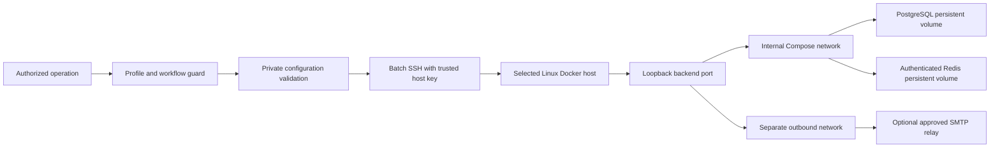

# Infisical installer specification

## Purpose and authority

This is the reconstruction specification for command `infisical`, contract version `0.0.1-SNAPSHOT`, in the `install`
category. It defines observable requirements independently of the current implementation. An agent should be able to
recreate the package from this document and its configuration template, then demonstrate the acceptance criteria below.

The outcome is one persistent Infisical backend, PostgreSQL database and authenticated Redis service on an explicitly
selected Linux Docker host. Installation mechanics belong to this command. Runtime secret retrieval belongs to the
separate `secrets` capability; installing Infisical does not implement that resolver.

The specification defines portable behavior. An actual deployment record, its approved image pins, identities, hostnames,
credential references and paths belong to the selected private profile. A historical handoff is evidence to verify, not
permission to reinstall a host or infer configuration. Never copy private deployment identifiers into this package.

## Required package

| Artifact | Responsibility |
|---|---|
| `infisical.command.yml` | Globally unique ID `infisical`, version above, category `install`, type `executable`, `ai.powered: false`. |
| `infisical.command.sh` | Executable profile-aware entry point; guard before logging, validation or SSH. |
| `infisical.command.example.config` | Fictional configuration template with the standard profile-binding header and literal config.env assignments; digest placeholders deliberately prevent execution. |
| `infisical.command.md` | Usage contract with canonical Purpose, Inputs, Outputs and Entry Point sections; link this specification. |
| `spec.md` | Requirements, architecture, operation sequences, limits and acceptance criteria. |
| `README.md` | Short package overview linking the contract, specification and tests. |
| `infisical.command.test.sh` and offline fixtures | Repeatable tests without a real server, registry, deployment or credential. |
| Implementation helpers | Local dispatch and remote mechanics. Current packaging uses Python standard-library helpers; equivalent implementations must preserve this contract. |

Register `install/infisical/infisical.command.md` exactly once in `ai-commands/execution-routes.tsv`, with route
`command-runner` and all four mixed-route fields `-`. Discovery must not introduce another command ID or implicit
batch-install entry point. The optional `install` category router may delegate only when the selected workflow permits
both `install` and `infisical`.

## Inputs and configuration lookup

Every invocation must use the common command-profile guard to activate the selected profile and workflow, verify command
permission, and resolve the profile-owned configuration. Required activated context is `AI_PROFILE_FILE`,
`AI_COMMAND_CONFIG_PATH`, `AI_WORK_PROFILE_ID`, `AI_FLOW_WORKFLOW`, and `AI_LOGICAL_PROJECT_ID`. No task title, working
directory, adjacent file, catalog template or previous request substitutes for activation or authorization.

The profile binds `commands[].id: infisical` to a private `commands[].config`; the workflow explicitly permits the command.
Use only that resolved file. Its resolved path must be a file inside the resolved profile directory and at most 16,384
bytes. Parse `config.env` as literal data, never by sourcing or evaluating shell code. Allow blank/full-line comments, optional
quoting and inline comments. Reject interpolation (`$`), backticks, duplicate/unknown assignment names, unsupported
expressions or multiple unquoted value tokens. Integer fields require decimal digits. Legacy JSON inputs remain supported
with duplicate-key rejection at every object level and strict types; booleans are not integers.

Normalize the config.env names into the fields below: `VERSION`/`COMMAND`; `SSH_TARGET`/`REMOTE_ROOT`/`PROJECT_NAME`/
`SITE_URL`; `BACKEND_IMAGE`/`POSTGRES_IMAGE`/`REDIS_IMAGE` into `images.backend`/`images.db`/`images.redis`; `BACKEND_PORT`;
`MINIMUM_CPUS`/`MINIMUM_MEMORY_GIB`/`MINIMUM_FREE_DISK_GIB`; `HEALTH_TIMEOUT_SECONDS`/`SSH_TIMEOUT_SECONDS`; `SMTP_ENV_FILE`.
Reject missing, unknown or incorrectly typed normalized fields. Defaults apply identically to both input formats.

| Field | Type and requirement | Default |
|---|---|---|
| `version` | Integer exactly `1`. | Required |
| `command` | String exactly `infisical`. | Required |
| `ssh_target` | Explicit SSH alias or user/host; pattern `[A-Za-z0-9][A-Za-z0-9_.@-]{0,127}`. No options, spaces or shell expression. | Required |
| `remote_root` | Absolute child directory; allowed characters letters, digits, `.`, `_`, `/`, `-`; at least two path components; no empty, `.` or `..` components. | Required |
| `project_name` | Compose identity matching `[a-z][a-z0-9_-]{2,40}`. | Required |
| `site_url` | HTTPS URL with a hostname made of letters, digits, dots and hyphens; no credentials, query, fragment or non-root path. HTTP only for `localhost` or `127.0.0.1`. Validate any numeric port; reject line breaks. | Required |
| `images` | Exactly `backend`, `db`, `redis`, each a nonempty repository reference ending in `@sha256:` plus 64 lowercase hex digits. No floating-only tags. | Required |
| `images.db` | PostgreSQL 14–17 version tag plus digest, optionally with minor version/distribution suffix and registry prefix; supports `/var/lib/postgresql/data`. | Required |
| `backend_port` | Integer 1024–65535. Bind only to host loopback. | `8080` |
| `minimum_cpus` | Integer 2–256; minimum may increase, never decrease below 2. | `2` |
| `minimum_memory_gib` | Integer 4–4096, interpreted as GiB of host RAM. | `4` |
| `minimum_free_disk_gib` | Integer 20–65536, interpreted as GiB of available storage. | `20` |
| `health_timeout_seconds` | Integer 10–600, bounds post-start polling. | `120` |
| `ssh_timeout_seconds` | Integer 30–3600, bounds the complete SSH operation. | `900` |
| `smtp_env_file` | Empty string or explicit absolute protected remote file; same safe component rules as deployment paths. A reference only, never inline SMTP values. | Empty |

Example configuration values are fictional; they are not target-selection defaults. Image architecture and application/database
compatibility must be reviewed when private pins are selected. Pin changes are migrations, not ordinary reruns.

## System boundary and architecture

Local and remote execution require Python 3 with standard-library support. SSH must use batch authentication, strict
existing host-key checking and a 10-second connection timeout. Pass the validated host as an argument, not a constructed
shell expression. Send remote mechanics and non-secret configuration over stdin for `python3 -`; do not place credentials
in SSH arguments or transmitted configuration. Remote tools run as the SSH user without implicit sudo.

Remote qualification must establish Linux `x86_64` or `aarch64`, access to a running Docker Engine, and Compose major
version 2 or later. On a fresh deployment, also verify CPU count, total RAM, available disk on the deployment filesystem,
and availability of the intended loopback port. Qualification must not install prerequisites or create deployment files.
The deployment parent directory must already exist and be writable by the selected user.

### Compose requirements

| Service | Required configuration |
|---|---|
| `backend` | Configured immutable image; `NODE_ENV=production`; `backend.env` plus optional `smtp.env`; only `127.0.0.1:<backend_port>:8080`; joins `private` and `outbound`; waits for healthy database and Redis. |
| `db` | Configured PostgreSQL image; only `db.env`; volume `pg_data:/var/lib/postgresql/data`; joins only `private`; no published ports. |
| `redis` | Configured Redis image; only `redis.env`; authenticated server with append-only persistence; volume `redis_data:/data`; joins only `private`; no published ports. |

All three services use `restart: unless-stopped`. Declare named `pg_data` and `redis_data` volumes. Declare `private` as an
internal network and `outbound` as a separate normal network. Expected effective network names are
`<project_name>_private` and `<project_name>_outbound`.

Each service needs a Docker health check, interval 5 seconds, timeout 5 seconds, 24 retries and 30-second start period:
backend HTTP `GET /api/status` on container loopback port 8080 must return 200; database uses
`pg_isready -U infisical -d infisical`; Redis uses an authenticated `redis-cli ping` and requires exactly `PONG`.
Compose interpolation must preserve remote environment-variable expansion for Redis rather than resolving passwords
locally. No Redis or PostgreSQL service receives application encryption/authentication keys.

## Ownership and persistent file format

The selected root must have no symlink in itself or any ancestor. Fresh creation must be exclusive: an existing unowned
directory is never adopted, overwritten or emptied. Reject preexisting containers/volumes/networks carrying the project
label, and named volumes/networks colliding with the expected names even if their labels are absent.

Create the root with mode `0700`; create each file exclusively with mode `0600`, owned by the executing remote user.
Existing protected files must be regular files, not symlinks, and retain that exact mode and ownership.

| Remote file | Required contents |
|---|---|
| `owner.json` | JSON object: `version: 1`, `command: infisical`, `scope` containing profile/workflow/logical project, and `configuration` containing the exact validated configuration including defaults. No secret values. |
| `compose.json` | JSON Compose document defining the services, health checks, networks and volumes above. Compare its parsed content with the expected document on every operation. |
| `backend.env` | Exactly `ENCRYPTION_KEY`, `AUTH_SECRET`, `DB_CONNECTION_URI`, `REDIS_URL`, `SITE_URL`. |
| `db.env` | Exactly `POSTGRES_USER=infisical`, `POSTGRES_DB=infisical`, `POSTGRES_PASSWORD`. |
| `redis.env` | Exactly `REDIS_PASSWORD`. |
| `smtp.env` | Optional remotely copied, validated SMTP settings. |
| `operation.lock` | Protected file for nonblocking exclusive mutation locks and shared read-only status locks. |

Generate bootstrap credentials only during fresh creation, directly on the selected host with a cryptographic random
source: encryption key is 16 random bytes as 32 lowercase hex characters; authentication secret is 32 random bytes in
URL-safe unpadded base64 (43 characters); database and Redis passwords are separate 32-byte lowercase hex strings.

Backend connection strings must match the protected datastore files exactly:
`postgresql://infisical:<database-password>@db:5432/infisical` and
`redis://:<redis-password>@redis:6379`; `SITE_URL` equals the validated configuration. Reject duplicate, missing, unsupported,
empty or inconsistent material. Ordinary reruns must never generate replacement keys or passwords.

Existing `owner.json` must match the current scope and normalized configuration exactly. Changing profile, workflow,
logical project, pins, URL, paths, limits or SMTP reference is not implicit authority to reconcile another deployment.

## Operation contract and state transitions

Only six operations exist. Mutations require the exact sole trailing argument `--apply`; read-only operations accept no
trailing argument. Unsupported operations, options or incomplete activation fail before SSH.

`validate` and `qualify` observe readiness without a deployment-state transition. A blocked state describes the last
operation's result, not permission to alter retained resources. A partial initial install may fail subsequent verification;
do not manufacture a new ownership receipt or credentials to make a retry succeed.

| Operation | Required sequence |
|---|---|
| `validate` | Guard, validate context/configuration, return local validated receipt. No SSH or network. |
| `qualify` | Guard and validate; reject deployment-path symlinks; verify remote prerequisites and fresh-install capacity/port when the root is absent; return qualified receipt. No deployment created. |
| `install --apply` | Guard and validate; reject unowned roots; qualify; reject resource/name collisions on fresh install; validate optional remote SMTP file; exclusively create fresh owned files. Verify ownership, acquire mutation lock, verify protected files and quiet Compose validation. On rerun inspect existing containers before replacement. Pull pinned images, start with detached Compose, then require all services healthy within the deadline. |
| `start --apply` | Require existing owned root; qualify tools, verify files, take mutation lock and quietly validate Compose. Inspect existing containers, permitting missing services for a reviewed restart. Start detached and verify all three healthy. Never generate credentials. |
| `stop --apply` | Require owned root and tools; take mutation lock, verify files and actual container ownership/images/isolation. Stop only the declared services with a 30-second grace period; verify each is present and no longer running. Preserve volumes and keys. |
| `status` | Require owned root and tools; verify files under shared lock opened read-only; quietly validate Compose; inspect all three services. Require healthy services, correct pins, ownership and isolation; make no remote file or service changes. |

Fresh directory creation must prevent concurrent claims. An active deployment lock must cause an immediate sanitized
blocker rather than waiting indefinitely or performing parallel changes. Never use volume deletion, purge, automatic
cleanup, orphan removal or an unrequested retry. Remote tool calls have finite timeouts; the current bound is 600 seconds
per tool, additionally bounded by the configured SSH timeout. A lost/timed-out SSH operation leaves remote state uncertain;
inspect it before deciding whether retry is appropriate.

### Actual-state verification

Find exactly one container per expected service under the selected Compose project. Check actual Docker project/service
labels and image reference, not just the file contents. Backend published bindings must be exactly container port
`8080/tcp` mapped to `127.0.0.1:<backend_port>`; database and Redis must have no nonempty published bindings. Inspect actual
network attachments: datastores only on the expected private network, backend on private and outbound only. Perform these
checks before mutations of existing containers as well as before reporting success.

A service is healthy only when running and Docker health is `healthy`. Startup may poll transient unhealthy states until
the deadline; ownership, image, missing/duplicate-container and isolation mismatches fail immediately. Stopped, absent or
unhealthy services cannot produce a healthy status receipt. Files and resources remain available after any failure.

## Receipts, logging and secret boundary

Local `validate` returns `{"status":"VALIDATED","networkAccess":false,"secretValues":false}`.
Remote success statuses are `QUALIFIED`, `HEALTHY`, `STOPPED`; each includes `dataPreserved: true`. A healthy result includes
`services` with exactly the three service keys and value `healthy`, and `images` equal to the configured pins. It also
reports `initialAccountSetupRequired` as a boolean, true for a successful fresh install. This is not proof that an owner
account has or has not been created on a subsequent run.

Remote failures return `status: BLOCKED`, a fixed allowlisted code and `dataPreserved: true`. Exit success is 0; execution
failure is nonzero (current dispatcher uses 2). The common guard may return its own failure code. Local validation/SSH
failure diagnostics go to stderr as a JSON blocked receipt with a fixed non-secret description.

Only remote receipt keys `status`, `code`, `services`, `images`, `dataPreserved`, `initialAccountSetupRequired` are allowed.
Validate their types and values before relaying; reject arbitrary text hidden in allowed fields, unexpected keys,
malformed JSON, exit/status disagreement, foreign image references or service values. Do not relay SSH banners, Docker
stdout/stderr, tracebacks, raw environment dumps or expanded Compose configuration. A quiet Compose validation is captured
and discarded. Install logs contain only operation label, timestamp and exit status, and default to the selected profile's
private `.local/command-logs/infisical/`; never create runtime state inside the reusable package.

Failures must distinguish at least: invalid/missing activation/configuration/apply flag; unsupported remote OS/architecture;
missing tools/Compose v2; insufficient CPU/RAM/disk; occupied loopback port; symlink or protected-file mode/owner mismatch;
unknown existing deployment/resource collision; ownership/configuration mismatch; incomplete credentials; modified Compose;
busy lock; invalid SMTP/TLS; missing/duplicate/foreign container; image/isolation mismatch; unhealthy services; stop
verification failure; remote tool failure; timeout; and invalid remote receipt. Messages must describe the blocker without
including offending input values or secrets.

## HTTPS, SMTP and recovery integration

The installer provisions the three-service stack. TLS proxy, certificates, DNS, gateway/access policy and connector are
separate explicitly configured capabilities. `site_url` does not create them. A reproducible private HTTPS deployment must
record the exact public URL, private origin address, certificate hostname, trusted CA path, certificate/key custody,
connector network/mount settings, token-file reference and exact allowed identities in private configuration. Preserve
existing unrelated controller routes. Verify TLS trust and hostname, authorized-client success, unauthenticated-client
denial and unauthorized-identity denial. Container health alone does not establish this acceptance.

For [Cloudflare integration](../../connect/cloudflare/cloudflare.command.md), select its exact private override and
credential references; origin certificate validation stays enabled. Do not hardcode a deployment network subnet, origin
certificate, hostname, allowed email, API token or connector token in the installer. Proxy/CORS/trusted-subnet settings
needed by an integration must be separately reviewed against its actual topology; this schema has no arbitrary backend
environment override or automatic proxy configuration.

Optional SMTP uses a preexisting remote regular file, mode `0600`, owned by the SSH user and at most 8,192 bytes. Accept
simple unquoted `KEY=value` lines and full-line `#` comments; reject duplicate/unknown keys, surrounding value whitespace,
interpolation, backslashes, quotes and inline `#`. Allowed keys are `SMTP_HOST`, `SMTP_PORT`, `SMTP_USERNAME`,
`SMTP_PASSWORD`, `SMTP_FROM_ADDRESS`, `SMTP_FROM_NAME`, `SMTP_HELO_HOST`, `SMTP_IGNORE_TLS`, `SMTP_REQUIRE_TLS`,
`SMTP_TLS_REJECT_UNAUTHORIZED`. Require nonempty host/port/from address and numeric port 1–65535. Enforce/default
`SMTP_IGNORE_TLS=false`, `SMTP_REQUIRE_TLS=true`, `SMTP_TLS_REJECT_UNAUTHORIZED=true`. Copy validated settings remotely
to protected `smtp.env`; never fetch them through the agent. No SMTP reference means no email configuration. SMTP relay
installation and invitation/reset delivery testing are separate operations.

Preserve original encryption/authentication material, database credentials, data volumes and image manifest through
recovery. Document explicit encrypted backup custody/destination and an isolated restore test; do not infer a backup
destination. Configuration snapshots are not database backups. This version has no backup/export/restore/adoption/
upgrade/purge implementation and must reject those operations. A manual deployment with another layout cannot be adopted
merely by naming its directory. Any future adoption/reinstall needs verified backups, original key material, explicit
ownership/layout mapping, reviewed TLS/network preservation and separately tested migration behavior.

## Acceptance criteria and evidence

| ID | Required acceptance scenario |
|---|---|
| INF-01 | Missing profile/workflow, denied workflow command and missing private config fail before SSH or installation logging. A valid fictional binding activates the exact config. |
| INF-02 | Duplicate/unknown keys, wrong types, unsafe targets/paths, unsupported URLs and unpinned images fail locally before SSH. `validate` has no network access. |
| INF-03 | Unsupported OS/architecture, missing tools, inadequate fresh capacity and occupied port fail before deployment creation. `qualify` creates no files. |
| INF-04 | Fresh install creates protected owned files and only the selected project; datastore ports remain unpublished; datastore keys stay separate from backend keys. |
| INF-05 | Unknown existing root, labelled resource or named volume/network collision is refused without modifying foreign content. Symlink ancestors never redirect creation. |
| INF-06 | A second install and stop/start cycle preserve credential bytes and persistent volume identity. Missing/inconsistent keys block reruns and are never regenerated. |
| INF-07 | Scope/config/Compose/mode/owner changes block operation. Concurrent mutation or observation of a locked deployment fails safely. |
| INF-08 | Status does not alter remote file timestamps or services. Stopped/missing/unhealthy containers fail truthfully. Image, ownership, port or network drift blocks before mutation. |
| INF-09 | Stop affects only the owned declared services and verifies termination. No path invokes data-volume removal, orphan removal, purge or automatic cleanup. |
| INF-10 | Fake SSH exercises local validation, apply gate, remote install/status/stop/start and exit propagation. Synthetic credentials in tool output, receipt fields or errors never reach caller/logs. |
| INF-11 | No SMTP reference installs no email configuration. Protected valid SMTP input works; unsafe input, invalid port, injected backend keys or TLS bypass fails before copying/deployment. |
| INF-12 | Public package passes scoped structure/metadata/route checks, local link checks and scans for private deployment content; template remains fictional and cannot run unchanged. |
| INF-13 | Before production use, an explicitly authorized disposable Linux host with approved real pins proves application startup, initial setup, key/data retention through restart/reboot and truthful failure recovery. |
| INF-14 | Separately deployed HTTPS/access integration proves origin certificate trust/hostname and approved/denied clients. Optional email proves actual invitation/reset delivery. Recovery proves isolated restoration with original keys. |

Current evidence: 13 offline mechanics tests and existing Cloudflare synthetic TLS tests passed when this specification
was added. Those tests cover a subset of the criteria and are not a real-image, reboot, backup/restore or authorized-user
acceptance test. The remaining criteria are reconstruction/production acceptance requirements, not claims of existing
test coverage. Repository-wide validators have existing failures outside this package; report scoped results precisely.

To reconstruct: create the registered package and binding template, implement validation and SSH dispatch, implement
exclusive remote ownership/credential creation and Compose generation, implement guarded operations and receipt filtering,
then exercise these scenarios from the public checkout. Use [the usage contract](infisical.command.md),
[configuration template](infisical.command.example.config) and [offline test launcher](infisical.command.test.sh) as
companion artifacts. A missing private input is a clear blocker or a precise question to its configured owner, never a
reason to invent another tracker, machine, provider, credential or live deployment target.
