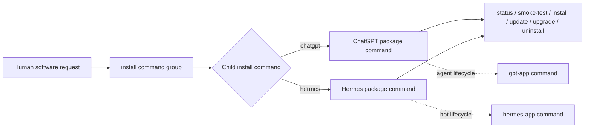

# install.command

## Purpose

Use `install` to manage the local physical lifecycle of explicitly selected software: inspect, install, smoke-test, check for updates,
upgrade, or uninstall it through a target-specific adapter and verify the result. Application-specific agent, profile,
workflow, project, bot, task, and group lifecycle remains in the application's own command.

Local installation currently supports **macOS on Apple Silicon only** (`Darwin/arm64`). Reject every other local host
before mutation. Remote installation is a separate explicitly selected target context and is not implied by this command.

## Inputs

| Input | Required | Source | Description |
|---|---|---|---|
| Active AI Profile and workflow | Yes | Host activation | Authorizes execution and resolves profile-owned configuration. |
| Detailed command inputs | As documented below | User, workflow, profile, or artifact | Command-specific values and preconditions. |
| Installation command | Yes for targeted lifecycle | User or profile | Canonical child command such as `chatgpt` or `hermes`; human aliases resolve to those exact IDs. |
| Lifecycle action | Yes for targeted lifecycle | User | One of `status`, `smoke-test`, `install`, `check-update`, `update`, `upgrade`, or `uninstall`. |
| Component | No | User, profile, or child command default | Selects an installation form such as application, backend, CLI, or bundle without changing the child command identity. |

- `ai-commands/install/*`

## Outputs

| Output | Destination | Description |
|---|---|---|
| Detailed command outputs | Caller, configured artifact path, or authorized external system | Observable results, evidence, and effects documented below. |

- Local machine tooling configured by the selected `install.sh` (some tools install under the home directory, others system-wide).

## Entry Point

| Entry point | Type | Profile-aware invocation |
|---|---|---|
| `install/install.sh` | Shell executable | Activate the selected profile and workflow, then invoke through the host's profile-aware command runner. |

Every invocation is profile-aware: the host must verify that the active workflow allows this command, resolve `AI_COMMANDS_ROOT`, and provide any profile-owned configuration before this entry point is used.

Committed configuration template: `install/install.command.example.config`. Copy it into the selected profile, set only supported command value overrides, reference the copied file through `commands[].config`, and let the host expose it as `AI_COMMAND_CONFIG_PATH`. The committed example is documentation and must never be used as operational configuration.

## Supported Prompts

| Human prompt | Expected result |
|---|---|
| `Install GPT` or `Install ChatGPT` | Route to the `chatgpt` command's `install` action and install or return an exact unavailable result. |
| `Check for a Hermes update` | Route to the `hermes` command's read-only update check. |
| `Upgrade Hermes` | Route to the `hermes` command's explicitly authorized upgrade and smoke test. |
| `Show installation status` | Inspect the selected installation commands without changing software. |

## Tags

#command #ai-command #install

Install and configure dev tooling using the local `ai-commands/install/` tree.

## Usage

- `${AI_COMMANDS_ROOT}/install/install.sh` (run all installs)
- `${AI_COMMANDS_ROOT}/install/<tool>/install.sh` (run a single tool)
- `${AI_COMMANDS_ROOT}/install/check.sh` (optional, if present)
- `Install GPT` → resolve child command `chatgpt`, then invoke its `install` action.
- `Update Hermes` → resolve child command `hermes`, then invoke read-only `check-update`; use `upgrade` only after explicit authorization.
- `Uninstall <target>` → require the exact canonical target, adapter support, and explicit confirmation.

## Application targets

| Human wording | Canonical target | Physical lifecycle owner | Not owned here |
|---|---|---|---|
| `GPT`, `GPT App`, `Codex App`, `ChatGPT`, or `ChatGPT App` | [`chatgpt`](chatgpt/chatgpt.command.md) | The ChatGPT desktop application's trusted host installer and update channel. | Codex task, sidebar-section, logical-project, and managed-agent lifecycle. |
| `Hermes` or `Hermes App` | [`hermes`](hermes/hermes.command.md) | The reviewed Hermes package installer already exposed by the public Hermes integration. | Hermes role profiles, bots, conversations, and workflow groups. |

The existing `install/codex` command remains **Codex CLI**, not `chatgpt`. Detecting a Codex binary bundled inside a desktop
application does not make the CLI installer a desktop-application installer.

## Lifecycle semantics

| Action | Mutation | Required behavior |
|---|---|---|
| `status` | No | Report installed/not-installed and exact version evidence when available. |
| `smoke-test` | No | Verify the installed application's identity and minimum offline startup surface without using credentials or a live provider. |
| `check-update` / `update` | No | Consult only the target's trusted stable channel and recommend `upgrade` when newer. `update` is a human-friendly alias for this read-only action. |
| `install` | Yes | Install an absent target through its reviewed target adapter, then verify identity and version. |
| `upgrade` | Yes | Require explicit authorization, preserve supported application data, apply the reviewed stable update, then run the target smoke test. |
| `uninstall` | Yes | Require the exact target and explicit confirmation; remove only adapter-owned application artifacts and report separately preserved user data. |

If a host does not expose a trustworthy operation, return `<TARGET>_<ACTION>_UNAVAILABLE` without substituting a CLI,
opening an unrelated package manager, scraping a download, or claiming success.

## Rules

- Prefer running `${AI_COMMANDS_ROOT}/install/check.sh` first to see what is already installed.
- Resolve application aliases to a canonical target before execution; never infer a target from a running agent or nearby repository.
- Keep product identity separate from installation form: add reviewed `--component` adapters rather than creating a new
  command name for every application/backend/CLI combination.
- Before any local application operation, require `Darwin/arm64`; do not silently choose an Intel, Linux, or Windows artifact.
- Every application target must provide a focused, deterministic adapter test and a read-only `smoke-test`. Successful
  `install` and `upgrade` require the smoke test to pass; installation alone is not completion.
- Keep package lifecycle in `install`; application commands may retain compatibility delegates but must route physical
  installation or upgrade through this contract.
- `update` is read-only. Never turn an update check into an automatic upgrade.
- Never interpret uninstalling an application as authorization to delete its agents, profiles, projects, groups,
  conversations, credentials, repositories, or other user data.
- Each folder owns its own `install.sh` and README.
- If a tool supports update checks, add a `check-update.sh` and have `install.sh` call it to decide whether to prompt
for updates or reinstall.
- For language runtimes, use `v_matrix.json` to pick recommended versions.
- All install scripts must initialize logging via `report_log_init`; logs go to `ai-commands/install/logs/install.log`.
- Install logs are local artifacts and must not be committed.
- Reinstalling is OK; scripts should be idempotent where possible.
- After running installs, open a new shell (or run `exec zsh`) to activate changes.

## Roles selection

- dev
